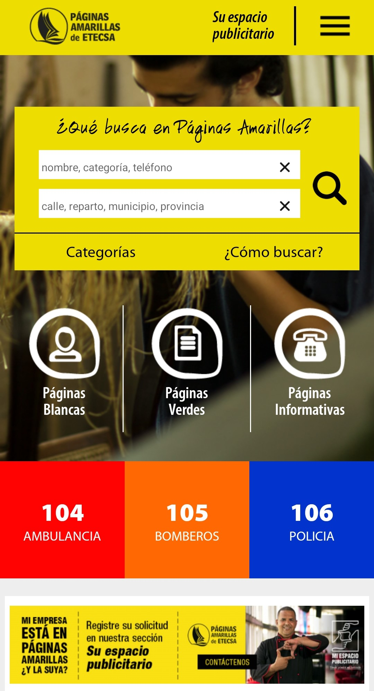
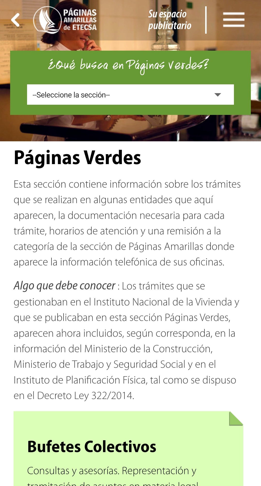
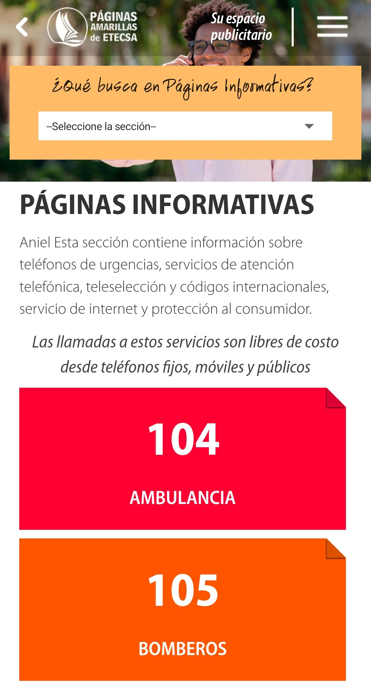
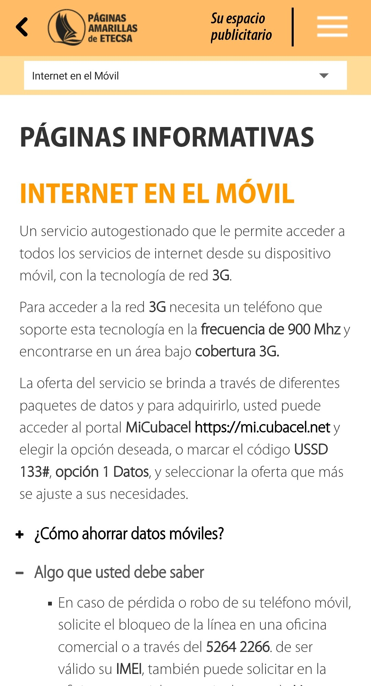

  ☰
  

    <!-- Navigation Links will be dynamically populated -->
  

# ENG LIM PENJAN ANTONIO (임대한)

  
  
  
  
  
  
  
  
  
  
  

## 👋 About Me
Software developer with 2.5 years of experience spearheading mobile application development across telecom and enterprise sectors, using modern development practices and Kotlin/Java. Proven track record of successfully leading development teams and driving adoption of modern architectural patterns and Android best practices across multiple successful applications. Advanced expertise in data processing and algorithm optimization from AI/ML research background, enabling development of highly efficient and scalable mobile applications.

## 🛠️ Technical Skills

### Core Android Development

### Data Management & Storage

### Additional Languages & Tools

## 📂 Projects Overview

### 📱 Mobile Applications
- 📰 [Cubadebate News Reader](#cubadebate-news-reader) - News platform with personalized content delivery (2021) [🔗](https://github.com/daehan-lim/cubadebate)
- ⛽ [Gas Consumption Manager](#gas-consumption-manager) - National utility tracking system (2021) [🔗](https://github.com/daehan-lim/gas-manager)
- 👨‍💼 [ACME Field Service](#acme-field-service) - Service management solution (2021) [🔗](https://github.com/daehan-lim/acme-field)
- 📱 [Yellow Pages](#yellow-pages) - Enterprise directory with offline mapping (2020) [🔗](https://github.com/daehan-lim/yellow-pages)
- 🏛️ [Government Portal](#government-portal) - Official government platform application (2021) [🔗](https://github.com/daehan-lim/gov-portal)
- 🗺️ [GISMAP](#gismap) - Advanced GIS system with offline capabilities (2019) [🔗](https://github.com/daehan-lim/gismap)

### 🔬 Research & ML
- 🤝 [Federated Learning for Random Forest](#federated-learning-for-random-forest) - Privacy-preserving distributed learning system (2024) [🔗](https://github.com/daehan-lim/federated-rf)
- 📊 [RoBERTa News Classification](#roberta-news-classification) - Enhanced topic classification with synthetic data (2024) [🔗](https://github.com/daehan-lim/roberta-news)
- 🏥 [Medical Data Classifier](#medical-data-classifier) - Patient mortality prediction system (2023) [🔗](https://github.com/daehan-lim/associative-classifier)
- 🔍 [Information Retrieval System](#information-retrieval-system) - Document indexing and search system (2022) [🔗](https://github.com/daehan-lim/ir-system)

## 📝 Project Details

## 📱 Mobile Applications

### Cubadebate News Reader
*Feature-rich news platform enabling personalized content delivery and comprehensive offline access (2021)*

[Image Placeholder: News feed and article view screenshots]

**Overview:**
- Built customizable news feed system with dynamic category and topic selection
- Implemented sophisticated offline caching for full articles including images
- Created real-time topic management system with analytics and auto-reordering
- Integrated keyword search, text-to-speech, and voice recognition capabilities
- Developed multi-level commenting interface with real-time updates
- Built infinite scroll with efficient data loading and SMS subscription system
- Tech: Kotlin, MVVM, Room, Coroutines, Material Design

[🔗 View Details](https://github.com/daehan-lim/cubadebate)

### Gas Consumption Manager
*National utility tracking system for automated consumption management (2021)*

[Image Placeholder: Dashboard view]

**Overview:**
- Engineered comprehensive utility management app for the National Manufactured Gas Company
- Implemented offline data persistence with automated consumption calculations
- Created interactive visualization tools and reporting system
- Built streamlined communication channels with company offices
- Tech: Kotlin, Room, MVVM, Custom Charts, Material Design

[🔗 View Details](https://github.com/daehan-lim/gas-manager)

### Yellow Pages
*Enterprise-scale mobile directory revolutionizing business search with sophisticated offline capabilities (2020)*

  

    <!-- Home -->
    

      
Search businesses, access emergency numbers and business directories

      
    

    <!-- Green Pages -->
    

      
Find government procedures, requirements and service schedules

      
    

    <!-- Info Home -->
    

      
Browse phone services, customer support and international calls

      
    

    <!-- Mobile Internet -->
    

      
Explore mobile internet plans, connection settings and service options

      
    

    <!-- Ad Space -->
    

      
Request advertising space, promote business and increase visibility

      
    

  

 

**Overview:**
- Developed Cuba's first comprehensive Yellow Pages Android app for ETECSA
- Engineered custom offline vector mapping system reducing data usage by 85%
- Implemented hybrid online/offline search system with automated background synchronization
- Built proximity-based entity search with real-time GPS navigation
- Created custom UI components for efficient data presentation
- Tech: Android SDK, Java, SQLite, VTM Maps, GraphHopper, Material Design

[🔗 View Details](https://github.com/daehan-lim/yellow-pages)

### ACME Field Service
*Comprehensive service management solution for field technicians (2021)*

[Image Placeholder: Service dashboard]

**Overview:**
- Developed interactive dashboard for real-time ticket management
- Implemented comprehensive calendar system with Google Calendar sync
- Created dynamic work ticket system with customer information management
- Built integrated navigation system with location services
- Tech: Kotlin, Clean Architecture, Google Calendar API, Material Design

[🔗 View Details](https://github.com/daehan-lim/acme-field)

### Government Portal
*Official government platform application modernizing government services (2021)*

[Image Placeholder: Portal interface]

**Overview:**
- Modernized legacy codebase implementing MVVM architecture with Jetpack components
- Engineered responsive REST API integration using Retrofit2 and Moshi
- Implemented comprehensive data validation and error handling
- Tech: Kotlin, MVVM, Jetpack, Retrofit2, Material Design

[🔗 View Details](https://github.com/daehan-lim/gov-portal)

### GISMAP
*Advanced geospatial information system for offline navigation (2019)*

[Image Placeholder: GIS interface]

**Overview:**
- Implemented real-time GPS navigation with multiple orientation modes
- Created custom geocoding system and optimal route calculation
- Built proximity-based POI search with multi-layer thematic mapping
- Developed efficient memory management for large spatial datasets
- Created custom tile caching system for improved performance
- Tech: Java, SpatiaLite, SQLite, Osmdroid, Custom UI Components

[🔗 View Details](https://github.com/daehan-lim/gismap)

## 🔬 Research & ML Projects

### Federated Learning for Random Forest
*Novel privacy-preserving approach for distributed random forest construction (2023)*

[Image Placeholder: System architecture]

**Overview:**
- Developed novel ensemble construction method improving accuracy by 10% on non-IID data
- Created privacy-preserving node computation strategy maintaining data confidentiality
- Implemented efficient client-server communication protocol
- Patent Application: 10-2024-0001659
- Published in Expert Systems with Applications (SCIE Journal)
- Tech: Python, PyTorch, Distributed Systems

[🔗 View Details](https://github.com/daehan-lim/federated-rf)

### RoBERTa News Classification
*Enhanced topic classification system with synthetic data augmentation (2024)*

[Image Placeholder: Model architecture]

**Overview:**
- Improved classification accuracy from 93.5% to 99.5% using synthetic data
- Implemented sophisticated prompt engineering for GPT-4 data generation
- Created web-based demonstration platform using Streamlit
- Tech: Python, PyTorch, Transformers, GPT-4, Streamlit

[🔗 View Details](https://github.com/daehan-lim/roberta-news)

### Medical Data Classifier
*Novel associative classifier for patient mortality prediction (2023)*

[Image Placeholder: System diagram]

**Overview:**
- Developed custom associative classifier outperforming CBA and CMAR baselines
- Implemented novel rule pruning strategy for improved interpretability
- Created comprehensive evaluation framework for healthcare data
- Published in Korea Computer Congress
- Tech: Python, scikit-learn, Healthcare ML

[🔗 View Details](https://github.com/daehan-lim/associative-classifier)

### Information Retrieval System
*Sophisticated document indexing and search system (2023)*

[Image Placeholder: System interface]

**Overview:**
- Implemented SPIMI-based inverted indexing for efficient document processing
- Created complex Boolean query system with TF-IDF ranking
- Developed custom preprocessing pipeline using NLTK and SpaCy
- Tech: Python, NLTK, SpaCy, Information Retrieval

[🔗 View Details](https://github.com/daehan-lim/ir-system)

## 📫 Let's Connect!

I'm always interested in discussing Android development, machine learning applications, or potential collaborations. Feel free to reach out!

  
  

 