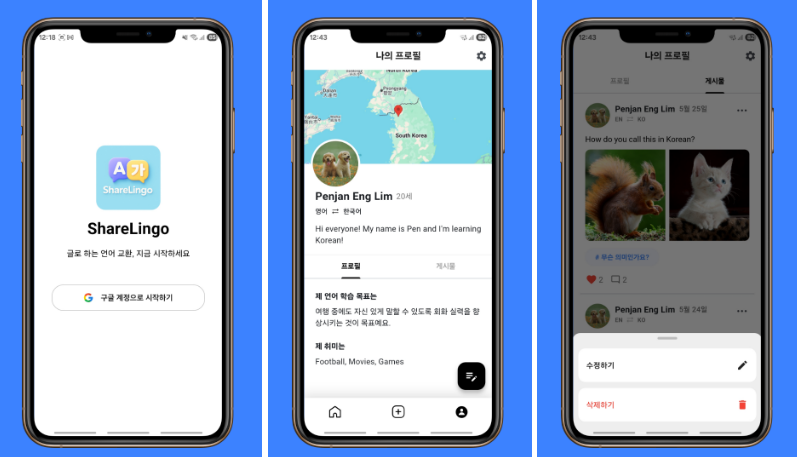
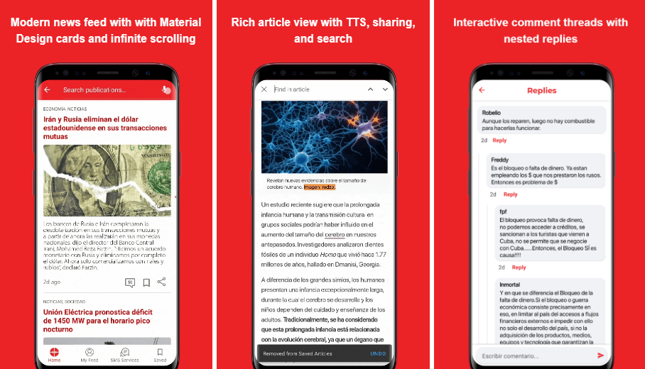

<!--suppress CssUnusedSymbol, JSUnusedLocalSymbols -->

  

    <a href="/">EN</a>
    <a href="/kr">KR</a>
  

☰
  

    <!-- Navigation Links will be dynamically populated -->
  

# Daehan Lim

 
  
  
  

## 👋 About Me
Mobile app developer who led a 4-person team and implemented CI/CD pipelines and a code review process that reduced manual testing time by 50%. Strong native Android development background with expertise in platform-specific optimizations. 

With an AI master's degree and LLM integration experience, I can effectively integrate generative AI features into mobile applications. Reduced inappropriate recipe generation rates from 85% to 12% by implementing prompt engineering and a custom validation model.

Successfully deployed Flutter-based apps to Play Store and App Store with features like Firebase backend integration, Clean Architecture implementation, and real-time data synchronization. Achieved a 40% reduction in AI generation time and 35% reduction in API costs through performance optimization.

## 📱 Mobile Applications

<!--ShareLingo-->
<a href="projects/sharelingo/" style="text-decoration: none; color: inherit;">

  
  
<strong>ShareLingo&thinsp;&thinsp;🔗</strong> 
    Language Exchange Social Media App  
    <code>Flutter</code> <code>Clean Architecture</code> <code>Google OAuth</code> <code>CI/CD</code> <code>Firebase</code> <code>Riverpod</code> 
    <small>May 16, 2025 ~ May 27, 2025 (2 weeks)</small>
  

</a>

<!--Cooki-->
<a href="projects/cooki/" style="text-decoration: none; color: inherit;">

  
  
<strong>Cooki&thinsp;&thinsp;🔗</strong> 
    AI Recipe Community App  
    <code>Flutter</code> <code>Gemini API</code> <code>Dio</code> <code>Cloud Functions</code> <code>Riverpod</code> <code>MVVM</code> <code>Firestore</code> 
    <small>June 1, 2025 ~ July 4, 2025 (1 month)</small>
  

</a>

<!--Cubadebate-->
<a href="projects/cubadebate/" style="text-decoration: none; color: inherit;">

  
  
<strong>Cubadebate&thinsp;&thinsp;🔗</strong> 
    Personalized News Platform 
    <code>Android</code> <code>Kotlin</code> <code>Coroutines</code> <code>MVVM</code> <code>Room</code> <code>Retrofit</code> <code>Glide</code> <code>Lottie</code> <code>ViewBinding</code> 
    <small>March 15, 2021 ~ June 30, 2021 (3.5 months)</small>
  

</a>

<!--FilmMind-->
<a href="projects/filmmind/" style="text-decoration: none; color: inherit;">

  
  
<strong>FilmMind&thinsp;&thinsp;🔗</strong> 
    Movie Information App  
    <code>Flutter</code> <code>Riverpod</code> <code>Dio</code> <code>Clean Architecture</code> <code>GitHub Actions</code> <code>TMDB API</code> 
    <small>May 13, 2025 ~ May 15, 2025 (3 days)</small>
  

</a>

<!--어디든GO-->
<a href="projects/placefinder/" style="text-decoration: none; color: inherit;">

  
  
<strong>PlaceFinder&thinsp;&thinsp;🔗</strong> 
    Location Search App  
    <code>Flutter</code> <code>Geolocator</code> <code>InAppWebView</code> <code>Naver API</code> <code>VWorld API</code> <code>Riverpod</code> 
    <small>April 20, 2025 ~ April 22, 2025 (3 days)</small>
  

</a>

<!--Gas Consumption Management-->
<a href="projects/gas/" style="text-decoration: none; color: inherit;">

  
  
<strong>Gas Consumption Manager&thinsp;&thinsp;🔗</strong> 
    Public utility tracking system 
    <code>Android</code> <code>Kotlin</code> <code>Jetpack</code> <code>Room</code> <code>MVVM</code> <code>Coroutines</code> <code>VideoView</code> 
    <small>February 20, 2021 ~ March 18, 2021 (1 month)</small>
  

</a>

<!--ACME-->
<a href="projects/acme/" style="text-decoration: none; color: inherit;">

 
 
<strong>ACME&thinsp;&thinsp;🔗</strong> 
   Field service management app  
   <code>Android</code> <code>Kotlin</code> <code>Room</code> <code>Google Maps API</code> <code>Calendar Provider API</code> <code>MVVM</code> <code>Coroutines</code> 
   <small>May 2021 ~ June 2021</small>
 

</a>

<!--Yellow Pages-->
<a href="projects/yellow_pages/" style="text-decoration: none; color: inherit;">

 
 
<strong>Yellow Pages&thinsp;&thinsp;🔗</strong> 
   Cuban Phone Directory App  
   <code>Android</code> <code>Java</code> <code>VTM Maps</code> <code>SQLite</code> <code>WebView</code> <code>JUnit</code> <code>Apache HTTP</code> 
   <small>April 2019 ~ May 2020</small>
 

</a>

<!--Government Portal App-->
<a href="projects/portal/" style="text-decoration: none; color: inherit;">

 
 
<strong>Government Portal App&thinsp;&thinsp;🔗</strong> 
   Official government platform app  
   <code>Android</code> <code>Kotlin</code> <code>Retrofit</code> <code>Coroutines</code> <code>Room</code> <code>MVVM</code> <code>WebView</code> <code>ViewPager2</code> 
   <small>February 2021 ~ April 2021</small>
 

</a>

## 🔬 Machine Learning Projects

  

    <h3 style="margin: 0; font-size: 1.3em; font-weight: 700;">🎓 AI/ML Projects</h3>
    
Machine Learning Projects Completed During AI Master’s

  

  

    Federated Learning
    NLP Classification Model
    Medical Data Classifier
    IR System
  

  

    <a href="projects/ml_projects/" style="display: inline-block; background: white; color: #667eea; padding: 12px 30px; border-radius: 25px; text-decoration: none; font-weight: 700; font-size: 1.1em; transition: all 0.3s ease; box-shadow: 0 4px 15px rgba(0, 0, 0, 0.1);">
      View Machine Learning Projects →
    </a>
  

## 📫 Contact Information

Feel free to reach out through LinkedIn or email for professional opportunities.

 
  
  
  

 
