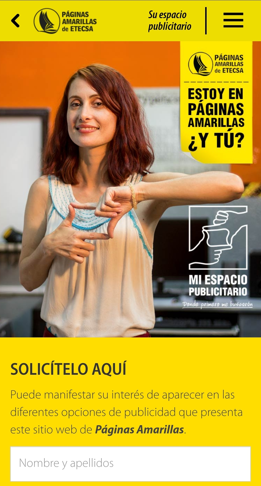

# ENG LIM PENJAN ANTONIO (임대한)

-2ea44f?style=flat-square)
-2ea44f?style=flat-square)

## 👋 About Me
Software developer with 2.5 years of experience spearheading mobile application development across telecom and enterprise sectors, using modern development practices and Kotlin/Java. Proven track record of successfully leading development teams and driving adoption of modern architectural patterns and Android best practices across multiple successful applications. Advanced expertise in data processing and algorithm optimization from AI/ML research background, enabling development of highly efficient and scalable mobile applications.

## 🛠️ Technical Skills

### Core Android Development

### Data Management & Storage

### Additional Languages & Tools

## 📑 Project Directory
### Android Applications
- [📰 Cubadebate Reader](#cubadebate-reader) - Feature-rich news application (i dont know whether to write something here or not)
- [⛽ Gas Consumption Manager](#gas-consumption-manager) - Utility tracking system
- [👨‍💼 ACME Field Service](#acme-field-service) - Service management solution
- [📱 Yellow Pages Mobile](#yellow-pages-mobile) - Business directory with offline mapping
- [🏛️ Government Portal](#government-portal) - Official platform application
- [🗺️ GISMAP](#gismap) - Advanced GIS system with offline capabilities

### Research & ML Projects
- [🤖 the Federated Learning RF project thing or however you decide to name it here](#federated-learning) - whatever we write here
- [🔍 the RoBERTa enhancement project you will name here](#roberta-enhancement) - what you wanna write here if anything

## 📱 Android Projects

### Yellow Pages Mobile
*whatever we write here*

 

  

    <!-- Home -->
    

      
Search businesses, access emergency numbers and business directories

      
    

    <!-- Green Pages -->
    

      
Find government procedures, requirements and service schedules

      
    

    <!-- Info Home -->
    

      
Browse phone services, customer support and international calls

      
    

    <!-- Mobile Internet -->
    

      
Explore mobile internet plans, connection settings and service options

      
    

    <!-- Ad Space -->
    

      
Request advertising space, promote business and increase visibility

      
    

  

 

**Key Features:**
- Custom offline vector mapping system reducing data usage by 85%
- Hybrid online/offline search system
- Real-time business data synchronization
- Proximity-based entity search

[🔗 View Project Details](#)

[Continue with other projects following similar format...]

## 🤖 Research Projects or actually i dont know what to write here

### the name
fill

[🔗 View Research Details](#)

[Continue with RoBERTa project...]

## 📫 Let's Connect!

I'm always interested in discussing Android development, machine learning applications, or potential collaborations. Feel free to reach out!

---

*Portfolio last updated: November 2024*