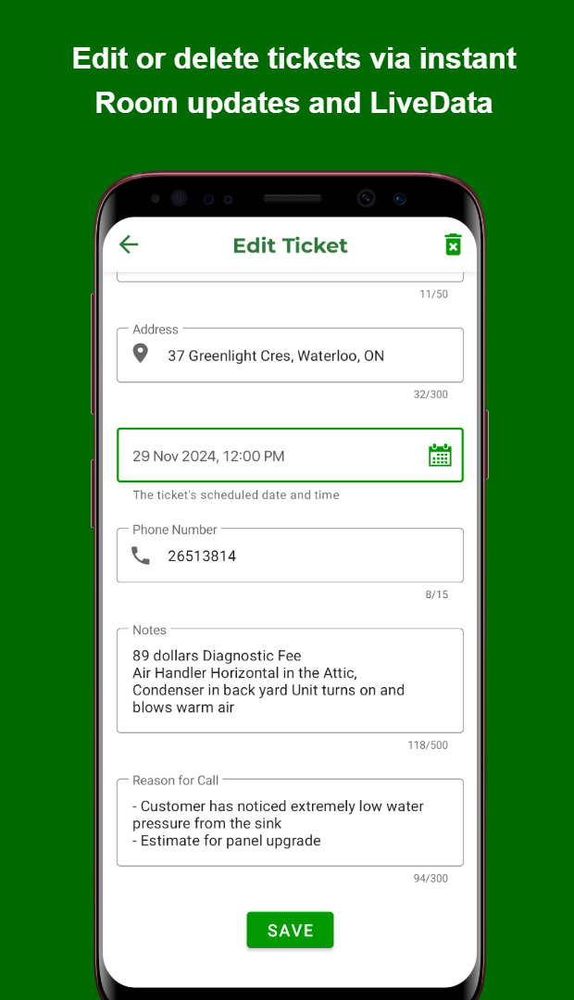
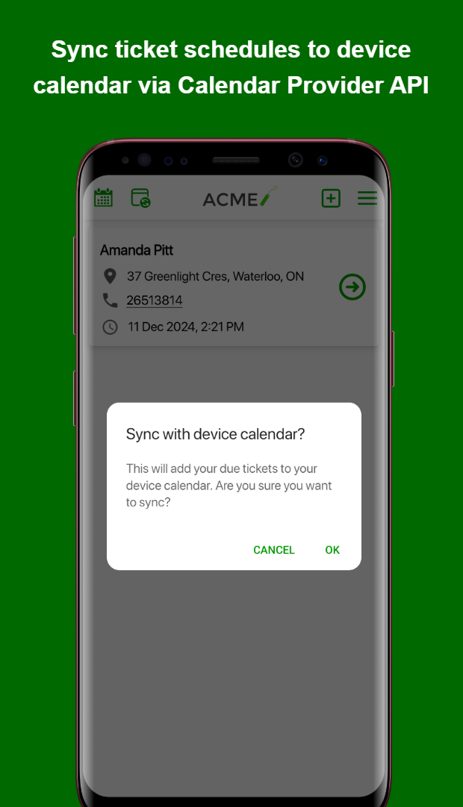
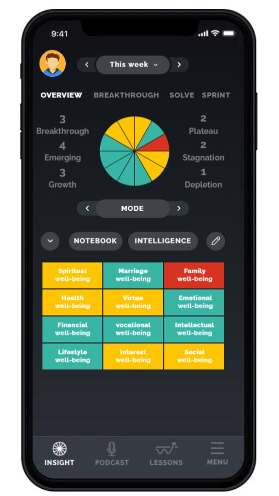

  

    <a href="/android" class="active">EN</a>
    <a href="/android/kr">KR</a>
  

☰
  

    <!-- Navigation Links will be dynamically populated -->
  

# Daehan Lim
**Previous name:** Penjan Antonio Eng Lim

 
  
  
  
  
  
  
  
  
  
  

## 👋 About Me
Software engineer with a strong foundation in mobile app development and data-driven applications. Experienced in developing robust, maintainable, user-centric Android applications using Kotlin, MVVM, Coroutines, Jetpack, and REST APIs. Also familiar with Flutter for cross-platform development and with JavaScript. Advanced expertise in data processing and algorithm optimization from AI/ML research background, enabling development of highly efficient and scalable mobile applications.

## 🛠️ Technical Skills

### Core Android Development

### Data Management & Storage

### Additional Languages & Tools

## 📂 Projects Overview

**Mobile Applications**
- [Cubadebate News Reader](#cubadebate-news-reader) - News app with personalized content delivery (2021)<a href="https://github.com/daehan-lim/cubadebate-app" style="color: #21427D; font-size: 20px; text-decoration: none;">&thinsp;&thinsp;⎆</a>
- [Gas Consumption Manager](#gas-consumption-manager) - National utility tracking system (2021)<a href="https://github.com/daehan-lim/gas-consumption-manager" style="color: #21427D; font-size: 20px; text-decoration: none;">&thinsp;&thinsp;⎆</a>
- [ACME App](#acme-app) - Service ticket management solution (2021)<a href="https://github.com/daehan-lim/acme" style="color: #21427D; font-size: 20px; text-decoration: none;">&thinsp;&thinsp;⎆</a>
- [Yellow Pages](#yellow-pages) - Enterprise directory with offline mapping (2020)<a href="https://github.com/daehan-lim/cuban-yellow-pages" style="color: #21427D; font-size: 20px; text-decoration: none;">&thinsp;&thinsp;⎆</a>
- [Government Portal](#government-portal) - Official government platform application (2021)<a href="https://github.com/daehan-lim/government-portal-app" style="color: #21427D; font-size: 20px; text-decoration: none;">&thinsp;&thinsp;⎆</a>
- [Wellness Tracking App](#wellness-tracking-app) - Cross-platform personal development tracker (2021)<a href="https://github.com/daehan-lim/wellness-tracker-flutter" style="color: #21427D; font-size: 20px; text-decoration: none;">&thinsp;&thinsp;⎆</a>

**Machine Learning Systems**
- [Privacy-Preserving Federated Random Forest](#privacy-preserving-federated-random-forest) - Privacy-preserving distributed learning system (2023)<a href="https://arxiv.org/abs/2407.19193" style="color: #21427D; font-size: 20px; text-decoration: none;">&thinsp;&thinsp;⎆</a>
- [RoBERTa News Classification](#roberta-news-classification) - Enhanced topic classification with synthetic data (2024)<a href="https://github.com/daehan-lim/roberta-sport-news-classifier" style="color: #21427D; font-size: 20px; text-decoration: none;">&thinsp;&thinsp;⎆</a>
- [Medical Data Classifier](#medical-data-classifier) - Patient mortality prediction system (2023)<a href="https://github.com/daehan-lim/associative-classifier-mortality-prediction" style="color: #21427D; font-size: 20px; text-decoration: none;">&thinsp;&thinsp;⎆</a>
- [Information Retrieval System](#information-retrieval-system) - Document indexing and search system (2024)<a href="../assets/information_retrieval_report.pdf" style="color: #21427D; font-size: 20px; text-decoration: none;">&thinsp;&thinsp;⎆</a>

## 📱 Mobile Applications

### [Cubadebate News Reader](https://github.com/daehan-lim/cubadebate-app)
*Feature-rich news reader app enabling personalized content delivery and comprehensive offline access (2021)*

  
  
  
  
  
  
  
  

 

<!--
**Video Walkthrough**

  <iframe width="236" height="486" src="https://www.youtube.com/embed/4SEpMDPFkHw" frameborder="0" allowfullscreen></iframe>

  
-->

**Overview:**
- Built customizable news feed system with dynamic category and topic selection interfaces, enabling personalized content delivery
- Implemented offline caching for bookmarking full articles including images, reducing data usage by up to 30%
- Designed real-time topic management system with dynamic search, post count display, and automatic list reordering, reducing average content discovery time from 2 minutes to 30 seconds
- Integrated in-article text search, text-to-speech capability and voice recognition capabilities, increasing content accessibility by 40%
- Built multi-level commenting interface, infinite scroll with efficient data loading, and SMS subscriptions, improving user engagement
- **Tech Stack:** Android, Kotlin, MVVM, Room, Retrofit, Moshi, Navigation, Material Design, Glide, JSoup, Coroutines, ViewBinding

[🔗 View on GitHub](https://github.com/daehan-lim/cubadebate-app)

---

### [Gas Consumption Manager](https://github.com/daehan-lim/gas-consumption-manager)
*National utility tracking system for automated consumption management (2021)*

  
  
  
  
  
  

 

**Overview:**
- Engineered comprehensive utility management app for the National Manufactured Gas Company
- Implemented offline data persistence with automated consumption calculations
- Created interactive visualization tools and reporting system, reducing operational times by 70%
- Built streamlined communication channels with company offices, simplifying the customer support process
- **Tech Stack**: Android, Kotlin, MVVM, Room, Jetpack, MPAndroidChart, Material Design, Coroutines

[🔗 View on GitHub](https://github.com/daehan-lim/gas-consumption-manager)

---

### [ACME App](https://github.com/daehan-lim/acme)
*Android ticket management app with custom calendar, offline functionality, and location services (2021)*

  
  
  
  
  
  
   
  

 

**Overview:**
- Fully offline-capable service ticket management app with responsive design implementation
- Implemented interactive calendar with custom event visualization and Android Calendar Provider API integration, improving task scheduling efficiency
- Embedded Google Maps functionality for address search and directions, reducing address lookup and navigation time by approximately 20%
- Created user registration and authentication flows with input validation and error feedback
- **Tech Stack**: Android, Kotlin, MVVM, Jetpack, Google Maps, Room, Material Design.

[🔗 View on GitHub](https://github.com/daehan-lim/acme)

---

### [Yellow Pages](https://github.com/daehan-lim/cuban-yellow-pages)
*Mobile business directory app for Cuba's telecommunications company combining business search with essential telecom services (2020)*

  

    <!-- Home -->
    

      
Search businesses, access emergency numbers and business directories

      
    

    <!-- Green Pages -->
    

      
Find government procedures, requirements and service schedules

      
    

    <!-- Info Home -->
    

      
Browse phone services, customer support and international calls

      
    

    <!-- Mobile Internet -->
    

      
Explore mobile internet plans, connection settings and service options

      
    

    <!-- Ad Space -->
    

      
Request advertising space, promote business and increase visibility

      
    

  

 

**Overview:**
- Developed Cuba's first Yellow Pages mobile app, implementing enterprise-grade API integration for real-time business search
- Engineered offline vector mapping system reducing data usage by 85% through embedded map files for business geolocalization
- Implemented automated background synchronization for offline access to government services and telephone information sections
- Built responsive search interface with dynamic filters and efficient pagination handling
- Executed comprehensive software testing, including unit, UI and compatibility tests, optimizing reliability and user experience
- **Tech Stack**: Android, Java, SQLite, VTM Maps, WebView, HTML, JavaScript, SharedPreferences, JUnit

[🔗 View on GitHub](https://github.com/daehan-lim/cuban-yellow-pages)

---

### [Government Portal](https://github.com/daehan-lim/government-portal-app)
*Android app for the official [government portal](https://www.redpinar.gob.cu/) of the city of Pinar del Rio, Cuba (2021)*

  
  
  
  
   

 

**Overview:**
- Modernized legacy codebase by integrating MVVM architecture, Coroutines and JetPack components, improving code maintainability and development workflow
- Built classified ad feed featuring API integration, offline data caching, real-time synchronization, image carousels, and network status monitoring, improving user accessibility
- Designed and implemented district representative portal with features like request submission, meeting schedule management and status tracking using Retrofit/Moshi, automating administrative processes
- Integrated provincial council web portal, optimizing desktop UI for mobile through JavaScript injection and WebView customization
- **Tech Stack**: Android, Kotlin, MVVM, Retrofit2, Room, Jetpack, ViewPager2, WebView, JavaScript, Coroutines

[🔗 View on GitHub](https://github.com/daehan-lim/government-portal-app)

---

### [Wellness Tracking App](https://github.com/daehan-lim/wellness-tracker-flutter)
*Cross-platform personal development tracker with real-time analytics and insights (2021)*

  
  
  
   

 

**Overview:**

- Created modular MVVM architecture using Provider for state management and GetIt for dependency injection
- Implemented secure authentication flow with token management and REST API communication using Dio
- Developed efficient data persistence layer using SQLite and SharedPreferences
- Created modular UI components with Material Design and custom form validation with error handling
- Built dynamic category management system with drag-and-drop reordering using ReorderableSliverList
- **Tech Stack**: Flutter, Dart, Provider (MVVM), GetIt, Dio, SQLite, SharedPreferences

[🔗 View on GitHub](https://github.com/daehan-lim/wellness-tracker-flutter)

---

## 🔬 Machine Learning Systems

### [Privacy-Preserving Federated Random Forest](https://arxiv.org/abs/2407.19193)
*Privacy-preserving distributed learning system for collaborative model training (2023)*

**Overview:**

- Designed and implemented a federated learning system for random forests enabling privacy-preserving distributed model training across multiple clients
- Implemented parallel processing pipeline using Python's ProcessPoolExecutor for efficient multi-client simulation and simultaneous model training, reducing training time by 60%
- Introduced incremental learning mechanism that enables efficient integration of new clients without full model retraining, improving system scalability
- Demonstrated system effectiveness through extensive testing across 7 benchmark datasets with sizes ranging up to 88,000 samples and 54 features, achieving a 10% performance improvement compared to the baseline approach
- Published research in [Expert Systems with Applications](https://www.sciencedirect.com/science/article/pii/S0957417424016099) (SCIE Journal) and resulted in patent filing (Appl. No. 10-2024-0001659)
- **Tech Stack**: Python, NumPy, Pandas, scikit-learn, Matplotlib, multiprocessing, Graphviz

[🔗 View Details](https://arxiv.org/abs/2407.19193)

---

### [RoBERTa News Classification](https://github.com/daehan-lim/roberta-sport-news-classifier)
*Enhanced topic classification model with synthetic data augmentation (2024)*

**Overview:**
- Developed machine learning model for classifying sports news articles into 5 distinct categories using [RoBERTa](https://huggingface.co/docs/transformers/en/model_doc/roberta) and [BBC Sport dataset](http://mlg.ucd.ie/datasets/bbc.html)
- Augmented limited training data using GPT-4 generated articles and prompt engineering techniques, improving classification accuracy to 99.5%
- Employed zero-shot learning strategy to enhance diversity and versatility of the LLM generated articles
- Executed comprehensive experiments evaluating model performance under various data configurations and training conditions
- Developed and deployed web application using Streamlit, enabling real-time article classification with detailed performance visualizations
- **Tech Stack**: Python, PyTorch, Hugging Face Transformers, GPT-4, Streamlit

[🔗 View on GitHub](https://github.com/daehan-lim/roberta-sport-news-classifier)

---

### [Medical Data Classifier](https://github.com/daehan-lim/associative-classifier-mortality-prediction)
*Novel classification system for patient mortality prediction using electronic health records (2023)*

**Overview:**
- Developed custom associative classifier tailored for unbalanced healthcare datasets
- Generated interpretable rules for medical decision-making, enabling healthcare experts to validate model predictions
- Implemented efficient rule-pruning strategy, reducing rule set by 80% for enhanced model interpretability
- Achieved superior performance metrics compared to traditional classifiers on real-world hospital data
- **Tech Stack**: Python, NumPy, Pandas, scikit-learn, Jupyter

[🔗 View on GitHub](https://github.com/daehan-lim/associative-classifier-mortality-prediction)

---

### [Information Retrieval System](../assets/information_retrieval_report.pdf)
*Efficient implementation of Boolean and ranked document retrieval (2024)*

**Overview:**
- Reduced document processing time by 65% compared to sequential search by implementing SPIMI-based inverted indexing
- Enhanced search precision through Boolean operator (AND, OR, NOT) based filtering
- Implemented ranked retrieval using TF-IDF weighting and cosine similarity, improving search result relevance
- Achieved 0.3 second average search response time for 466 English documents
- Implemented system with optimized memory usage of 2.5MB
- **Tech Stack**: Python, NLTK, SpaCy, NumPy, contractions

[🔗 View Details](../assets/information_retrieval_report.pdf)

 

## 📫 Contact Information

Feel free to reach out through LinkedIn or email for professional opportunities.

 
  
  

 
