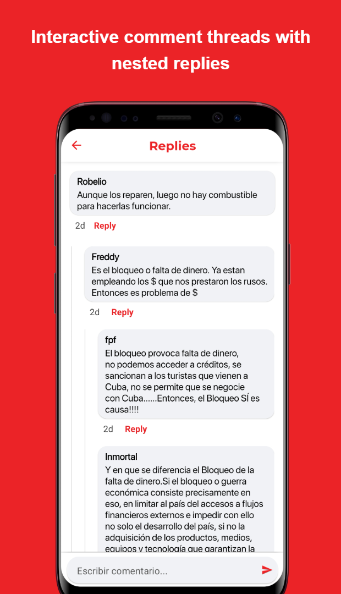

  

     
  

☰
  

    <!-- Navigation Links will be dynamically populated -->
  

# Cubadebate 뉴스 앱

**📌 앱 소개:** 맞춤형 콘텐츠 제공 및 오프라인 저장 기능을 갖춘 뉴스 앱  
**🕒 개발 기간:** 23.10.10 ~ 23.11.17 (6주)  
**👥 개발 인원:** 1명  
**🛠️ Skills:** <code>Alamofire</code> <code>CoreML</code> <code>Combine</code> <code>Firebase</code> <code>SnapKit</code> <code>MessageKit</code> <code>LicensePlist</code> <code>SDWebImage</code> 
🔗 [GitHub에서 보기](https://github.com/daehan-lim/cubadebate-app)

기존 웹사이트 전용 뉴스 플랫폼을 오프라인 저장, 음성 지원, 개인화 기능 등 안드로이드 네이티브 기능을 활용한 직관적인 모바일 앱으로 전환하여 뉴스 콘텐츠의 모바일 접근성 향상을 위한 프로젝트

  <!--
  
  -->
  
  
  
  
  
  
  
  

**회사명:** Desoft (쿠바 국영 소프트웨어 개발사)

**역할:** UI/UX 설계 및 전체 안드로이드 앱 개발 담당

## **수행 내용:**
- 동적 카테고리 및 주제 선택 인터페이스 기반의 맞춤형 뉴스 피드 시스템 구축
- Room DB를 활용해 이미지를 포함한 전체 기사의 오프라인 저장으로 데이터 사용량 최대 30% 절감
- 실시간 주제 관리 시스템에 동적 검색과 게시물 수 표시, 자동 목록 재정렬 기능 구현으로 평균 콘텐츠 검색 시간을 2분에서 30초로 단축
- 기사 내 텍스트 검색, 음성합성(TTS) 및 음성 인식 기능 통합으로 접근성을 40% 향상
- 다중 레벨 댓글 인터페이스와 효율적으로 데이터를 로딩하는 무한 스크롤, SMS 구독 등의 기능 구현으로 사용자 참여도 개선
- **사용 기술:** Android, Kotlin, Coroutines, MVVM, Room, Retrofit, Moshi, Navigation, Material Design, Glide, JSoup, ViewBinding

[🔗 GitHub에서 보기](https://github.com/daehan-lim/cubadebate-app)

