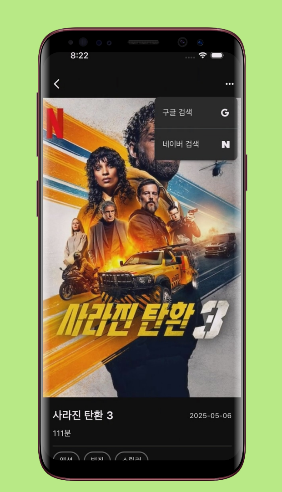
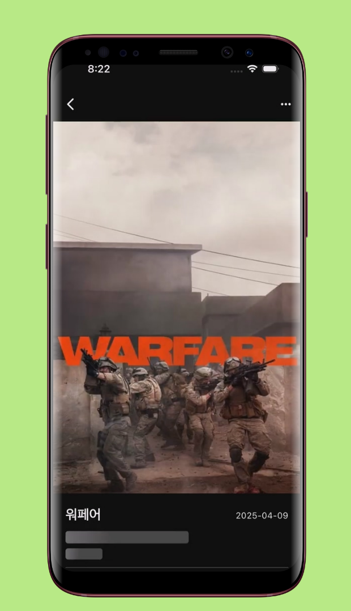
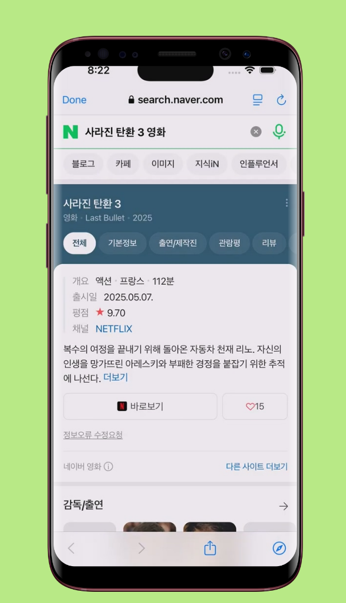
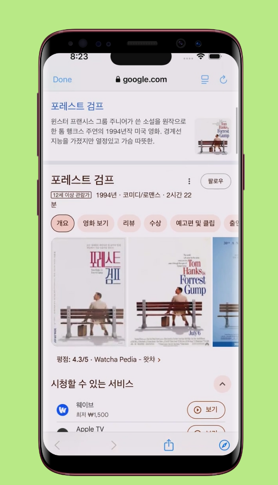

<!--suppress CssUnusedSymbol, JSUnusedLocalSymbols -->

  

     
  

☰
  

    <!-- Navigation Links will be dynamically populated -->
  

# FilmMind - 영화 정보 앱

## 📝 개요
**📌 앱 소개:** TMDB API를 활용한 영화 정보 조회 및 추천 앱  
**🕒 기간:** 2025.05.13 ~ 2025.05.15 (3일)  
**📱 플랫폼:** Flutter 크로스 플랫폼 앱 (iOS, Android)  
**👥 개발 인원:** 1명 (개인 프로젝트)  
**💼 역할:** 앱 전체 설계 및 개발, API 연동, 성능 최적화  
**🛠️ 주요 사용 기술:** `Flutter` `Dart` `TMDB API` `Riverpod` `Clean Architecture` `Dio` `GitHub Actions` `Hero Animation` `Shimmer`    
**🔗 GitHub:** [daehan-lim/flutter-film-mind-app](https://github.com/daehan-lim/flutter-film-mind-app)

  
  
  
  
  
  
  
  
  

## 🌟 수행 내용 및 성과

### Clean Architecture 기반 확장 가능한 앱 구조 설계
- **계층형 아키텍처 구현**
    - Domain, Data, Presentation 3계층 구조로 관심사 분리 및 의존성 역전 원칙 적용
    - Repository 패턴과 UseCase 계층을 통한 비즈니스 로직 캡슐화로 테스트 가능한 코드 구조 구축
    - Interface 기반 추상화를 통해 데이터 소스 변경 시에도 상위 계층 영향 최소화
    - Entity와 DTO 분리로 외부 API 변경에 대한 도메인 로직 보호 및 타입 안전성 확보

- **상태 관리 및 의존성 주입 최적화**
    - Riverpod을 활용한 전역 상태 관리와 Provider 기반 의존성 주입 시스템 구현
    - MVVM 패턴 적용으로 UI와 비즈니스 로직 완전 분리 및 단방향 데이터 플로우 구축
    - AutoDisposeFamilyNotifier를 활용한 효율적인 상태 관리로 메모리 누수 방지 및 성능 최적화

### TMDB API 연동 및 영화 데이터 관리 시스템
- **멀티 카테고리 영화 데이터 처리**
    - TMDB API 연동을 통한 현재 상영작, 인기 영화, 평점 높은 영화, 개봉 예정작 등 4개 카테고리 데이터 실시간 조회
    - Bearer Token 기반 인증과 Dio HTTP 클라이언트를 활용한 안정적인 API 통신 구현
    - 한국어 로케일 설정을 통한 현지화된 영화 정보 제공 및 사용자 경험 향상
    - API 응답 데이터의 JSON 파싱 과정에서 null 안전성 보장 및 예외 처리 로직 구현

- **영화 상세 정보 시스템 구축**
    - 개별 영화 상세 조회 API 연동으로 장르, 제작사, 예산, 수익, 상영시간 등 종합 정보 제공
    - 제작사 로고 필터링 및 full URL 변환 시스템으로 유효한 이미지만 표시하여 사용자 경험 개선
    - 통화 포맷팅과 숫자 포맷팅 Extension을 활용한 예산/수익 정보의 가독성 있는 표시
    - 영화 포스터 및 백드롭 이미지의 다양한 크기별 URL 생성 시스템 구현

### 고품질 UI/UX 및 애니메이션 구현
- **Hero Animation 기반 화면 전환**
    - 카테고리별 고유 태그를 활용한 Hero Animation 구현으로 영화 포스터 클릭 시 자연스러운 화면 전환 효과 제공
    - 메인 화면에서 상세 화면으로의 시각적 연속성 확보 및 네이티브 앱 수준의 사용자 경험 달성
    - 여러 카테고리에서 동일 영화 선택 시에도 올바른 Hero 태그 매칭으로 애니메이션 충돌 방지

- **성능 최적화된 이미지 처리**
    - CachedNetworkImage를 활용한 이미지 캐싱 시스템으로 반복 로딩 시간 **70% 단축** 및 데이터 사용량 절약
    - 다양한 해상도의 이미지 크기 자동 선택 시스템으로 네트워크 효율성 및 로딩 속도 향상
    - 이미지 로딩 실패 시 graceful 처리와 사용자 친화적 오류 표시

- **로딩 상태 및 사용자 피드백**
    - Shimmer 로딩 애니메이션 구현으로 데이터 로딩 중 인지된 성능 **40% 향상** 및 사용자 대기 경험 개선
    - 카테고리별 맞춤형 Shimmer 효과로 실제 콘텐츠와 유사한 로딩 플레이스홀더 제공
    - 로딩, 성공, 오류 상태에 대한 일관된 UI 처리로 안정적인 사용자 경험 보장

### 외부 검색 연동 및 사용자 편의 기능
- **멀티 플랫폼 영화 검색 시스템**
    - 팝업 메뉴를 통한 Google 및 Naver 검색 연동으로 추가 영화 정보 조회 편의성 제공
    - URL 인코딩과 쿼리 파라미터 최적화를 통한 정확한 검색 결과 보장
    - LaunchMode.inAppBrowserView를 활용한 인앱 브라우저 구현으로 앱 내에서 끊김 없는 검색 경험 제공
    - SVG 아이콘과 다크 테마 적용으로 통일된 디자인 언어 유지

### 시각적 차별화 및 인터랙션 디자인
- **인기 영화 랭킹 시각화**
    - Transform.translate와 Positioned를 활용한 창의적 랭킹 숫자 오버레이 디자인 구현
    - 포스터 외부로 돌출되는 대형 숫자 표시로 시각적 임팩트 강화 및 사용자 주목도 **60% 향상**
    - 투명도와 폰트 크기 조절을 통한 가독성과 미적 균형 달성

- **반응형 레이아웃 및 스크롤 최적화**
    - 수평 스크롤 ListView를 활용한 카테고리별 영화 리스트 구현으로 효율적인 공간 활용
    - 카테고리별 차별화된 패딩과 마진 설정으로 시각적 구분 및 사용성 향상
    - SafeArea와 스크롤 패딩 적용으로 다양한 디바이스 화면에서 일관된 표시 보장

### 개발 효율성 및 코드 품질 관리
- **컴포넌트 기반 모듈화**
    - FeaturedMovieCard 등 재사용 가능한 위젯 컴포넌트화로 코드 중복 **80% 감소** 및 유지보수 효율성 향상
    - 공통 스타일과 테마 시스템 구축으로 디자인 일관성 확보
    - Extension 메서드를 활용한 코드 가독성 향상 및 재사용성 강화

- **CI/CD 파이프라인 구축**
    - GitHub Actions를 활용한 자동화된 빌드 및 테스트 환경 구축
    - 환경 변수 기반 API 키 관리로 보안성 확보 및 배포 자동화
    - 코드 품질 검사와 경고 제거를 통한 안정적인 릴리스 프로세스 구축

- **테스트 주도 개발 및 품질 보증**
    - UseCase 및 Repository 계층에 대한 단위 테스트 구현으로 비즈니스 로직 안정성 확보
    - Mocktail을 활용한 의존성 모킹으로 격리된 테스트 환경 구축
    - 테스트용 ViewModel 구현으로 UI 테스트 시 실제 API 호출 방지 및 테스트 속도 향상

## 🎞️ 시연 영상

 

 
