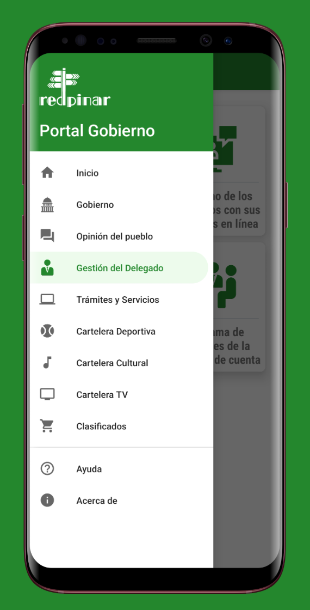
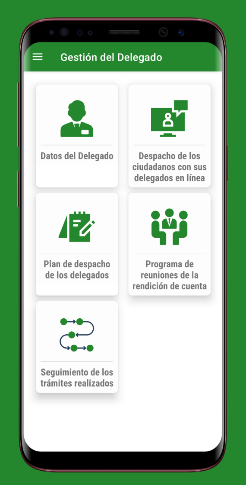
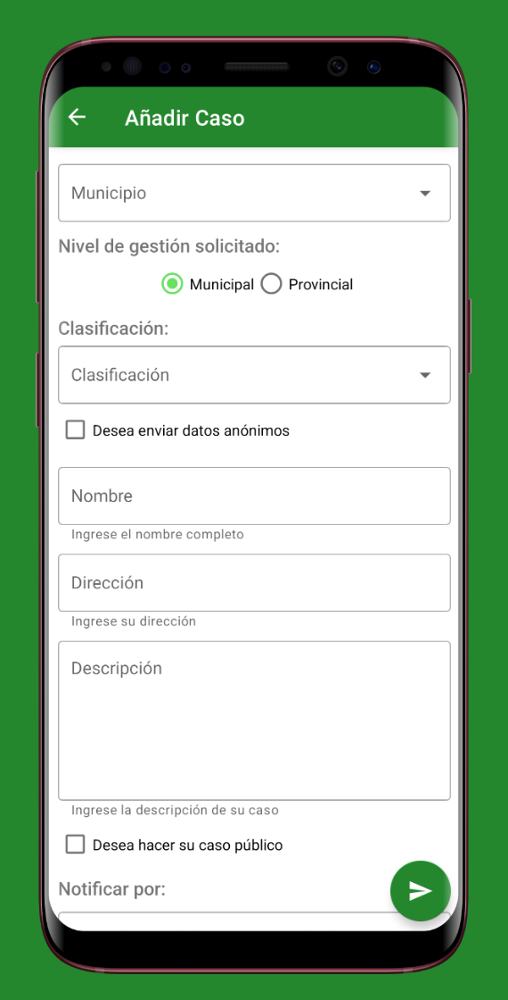
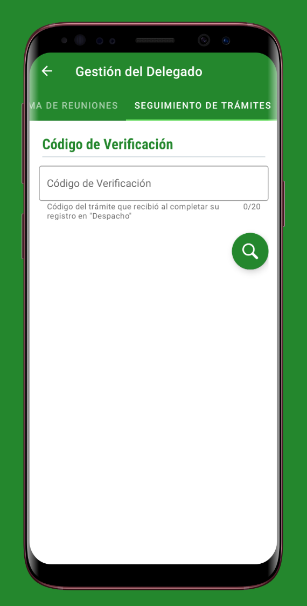

  

    <a href="/">EN</a>
    <a href="/kr" class="active">KR</a>
  

☰
  

    <!-- Navigation Links will be dynamically populated -->
  

# 엥림펜잔안토니오 (임대한)
**영문 이름:** ENG LIM PENJAN ANTONIO

안내: 본 문서는 포트폴리오 웹사이트 (<a href="https://englim.me/kr">englim.me/kr</a>) 의 정적 PDF 변환본입니다. <a href="https://englim.me/kr">웹사이트에서는</a> 모든 이미지와 인터랙티브 요소, 최신 업데이트, 전체 내용을 확인하시기 바랍니다.

 
  
  
  
  
  
  
  
  
  

## 👋 소개
최신 안드로이드 기술과 성능 최적화, 사용자 경험 개선, 데이터 기반 접근으로 모바일 앱을 혁신하는 소프트웨어 엔지니어입니다. MVVM 아키텍처와 Jetpack 컴포넌트를 도입해 안정적이고 유지 보수성이 높은 애플리케이션을 구현했습니다. 머신러닝 연구를 통해 고도화된 데이터 처리, 알고리즘 최적화, 분산 시스템 구축 경험을 쌓았으며, 이는 모바일 앱의 성능 개선과 확장성 있는 아키텍처 역량을 키우는 데 크게 기여했습니다.

**배경**: 대한민국 국적의 쿠바 출신 교포로서 쿠바에서 학업과 초기 커리어를 쌓았으며, 이후 한국에서 정착해 컴퓨터공학 석사 과정을 이수했습니다.

## 🛠️ 보유 스킬

### 안드로이드 개발 핵심 역량

### 데이터베이스 및 네트워킹

### 기타 프로그래밍 언어 및 도구

 

## 📂 프로젝트 목차

**머신러닝 모델**
- [연합학습 기반 랜덤 포레스트](#연합학습-기반-랜덤-포레스트) - 개인정보를 보호하는 분산 학습 시스템 (2023)<a href="https://arxiv.org/abs/2407.19193" style="color: #21427D; font-size: 20px; text-decoration: none;">&thinsp;&thinsp;⎆</a>
- [RoBERTa 뉴스 분류기](#roberta-뉴스-분류기) - 합성 데이터를 활용해 성능을 개선한 주제 분류 모델 (2024)<a href="https://github.com/daehan-lim/roberta-sport-news-classifier" style="color: #21427D; font-size: 20px; text-decoration: none;">&thinsp;&thinsp;⎆</a>
- [의료 데이터 분류 시스템](#의료-데이터-분류-시스템) - 환자 사망률 예측 시스템 (2023)<a href="https://github.com/daehan-lim/associative-classifier-mortality-prediction" style="color: #21427D; font-size: 20px; text-decoration: none;">&thinsp;&thinsp;⎆</a>
- [정보 검색 시스템](#정보-검색-시스템) - 문서 색인화 및 검색 시스템 (2024)<a href="../assets/information_retrieval_report.pdf" style="color: #21427D; font-size: 20px; text-decoration: none;">&thinsp;&thinsp;⎆</a>

**모바일 애플리케이션**
- [Cubadebate 뉴스 앱](#cubadebate-뉴스-앱) - 맞춤형 콘텐츠 제공 및 오프라인 저장 기능을 갖춘 뉴스 앱 (2021)<a href="https://github.com/daehan-lim/cubadebate-app" style="color: #21427D; font-size: 20px; text-decoration: none;">&thinsp;&thinsp;⎆</a>
- [가스 소비 관리 앱](#가스-소비-관리-앱) - 공공 유틸리티 추적 시스템 (2021)<a href="https://github.com/daehan-lim/gas-consumption-manager" style="color: #21427D; font-size: 20px; text-decoration: none;">&thinsp;&thinsp;⎆</a>
- [ACME 앱](#acme-앱) - 서비스 티켓 관리 솔루션 (2021)<a href="https://github.com/daehan-lim/acme" style="color: #21427D; font-size: 20px; text-decoration: none;">&thinsp;&thinsp;⎆</a>
- [Yellow Pages](#yellow-pages) - 오프라인 지도 기능이 포함된 전화번호부 모바일 앱 (2020)<a href="https://github.com/daehan-lim/cuban-yellow-pages" style="color: #21427D; font-size: 20px; text-decoration: none;">&thinsp;&thinsp;⎆</a>
- [정부 포털 앱](#정부-포털-앱) - 공식 정부 대표 플랫폼 애플리케이션 (2021)<a href="https://github.com/daehan-lim/government-portal-app" style="color: #21427D; font-size: 20px; text-decoration: none;">&thinsp;&thinsp;⎆</a>

## 🔬 머신러닝 시스템

### [연합학습 기반 랜덤 포레스트](https://arxiv.org/abs/2407.19193)
*분산 환경에서 데이터 보안을 보장하는 협업 학습 시스템 (2023)*

**소속:** 충남대학교 데이터마이닝 연구실

**역할:** 전체 시스템 설계 및 구현, 논문 작성, 특허 출원

**수행 내용:**
- 다중 클라이언트 간 프라이버시를 보장하는 연합학습 기반 랜덤 포레스트 시스템 설계 및 구현
- ProcessPoolExecutor를 활용한 트리 학습 병렬화로 모델 훈련 시간 60% 단축
- 전체 모델 재학습 없이 새 클라이언트 추가 및 업데이트 가능한 점진적 학습 메커니즘 도입으로 시스템 확장성 향상
- 7개의 데이터셋(최대 88,000개의 샘플, 54개의 특성)에서 기존 접근법 대비 10% 성능 향상 달성
- [Expert Systems with Applications](https://www.sciencedirect.com/science/article/pii/S0957417424016099) (SCIE 저널) 논문 게재 및 특허 출원 (출원 번호 10-2024-0001659)
- **사용 기술**: Python, NumPy, scikit-learn, Matplotlib, multiprocessing, Graphviz

[🔗 상세보기](https://arxiv.org/abs/2407.19193)

---

### [RoBERTa 뉴스 분류기](https://github.com/daehan-lim/roberta-sport-news-classifier)
*합성 데이터 증강을 활용한 고도화된 주제 분류 모델 (2024)*

**소속:** 충남대학교 데이터마이닝 연구실

**역할:** 분류 모델 구현, 합성 데이터 생성, 웹 애플리케이션 개발

**수행 내용:**
- [RoBERTa](https://huggingface.co/docs/transformers/en/model_doc/roberta)와 [BBC Sport](http://mlg.ucd.ie/datasets/bbc.html) 데이터셋을 활용해 스포츠 뉴스를 5개의 카테고리로 분류하는 머신러닝 모델 구현
- GPT-4로 생성된 합성 데이터 및 프롬프트 엔지니어링 기법 도입으로 분류 정확도 99.5%로 향상
- Zero-shot 학습 전략 도입으로 합성 데이터의 다양성 및 범용성 확보
- 다양한 데이터 구성과 훈련 조건에서의 모델 성능 평가를 위한 포괄적 실험 수행
- 실시간 기사 분류와 성능 시각화를 제공하는 웹 애플리케이션 개발 및 배포로 사용자 접근성 향상
- **사용 기술**: Python, PyTorch, Hugging Face Transformers, GPT-4, Streamlit

[🔗 상세보기](https://github.com/daehan-lim/roberta-sport-news-classifier)

---

### [의료 데이터 분류 시스템](https://github.com/daehan-lim/associative-classifier-mortality-prediction)
*전자의무기록 기반 환자 사망률 예측을 위한 연관 규칙 분류 시스템 (2023)*

**소속:** 충남대학교 데이터마이닝 연구실

**역할:** 전체 시스템 설계 및 구현, 논문 작성

**수행 내용:**
- 의료 데이터의 클래스 불균형 문제를 해결하는 맞춤형 연관 규칙 분류기 설계 및 개발
- 의료진의 결과 검증을 위한 해석 가능한 규칙 생성 시스템 구축으로 예측 투명성 확보
- 효율적인 규칙 가지치기 전략 도입으로 분류 규칙 수를 80% 감소시켜 모델 해석성 개선
- 실제 병원 데이터 기반 실험에서 기존 분류 모델 대비 우수한 성능 달성
- **사용 기술**: Python, NumPy, Pandas, scikit-learn, Jupyter Notebook

[🔗 상세보기](https://github.com/daehan-lim/associative-classifier-mortality-prediction)

---

### [정보 검색 시스템](../assets/information_retrieval_report.pdf)
*효율적인 불리언 및 랭킹 기반 문서 검색 시스템 구현 (2024)*

**소속:** 충남대학교

**역할:** 전체 시스템 설계 및 구현, 논문 작성

**수행 내용:**
- SPIMI 기반 역색인 구축으로 순차적 검색 대비 문서 처리 시간 65% 단축
- 불리언 연산자(AND, OR, NOT) 기반 정밀 검색으로 검색 결과 필터링 정확도 향상
- TF-IDF 가중치와 코사인 유사도를 활용한 문서 랭킹으로 검색 결과 적합도 개선
- 466개의 영문 문서 처리 시 평균 검색 응답 시간 0.3초 달성
- 메모리 사용량을 2.5MB로 최적화된 시스템 구현으로 리소스 사용 효율성 확보
- **사용 기술**: Python, NLTK, SpaCy, NumPy, contractions

[🔗 상세보기](../assets/information_retrieval_report.pdf)

---

## 📱 모바일 애플리케이션

### [Cubadebate 뉴스 앱](https://github.com/daehan-lim/cubadebate-app)
*사용자 맞춤형 뉴스 제공, 오프라인 저장, TTS 및 고급 검색 기능 등을 탑재한 뉴스 앱 (2021)*

  
  
  
  
  
  
  
  

**회사명:** Desoft (쿠바 국영 소프트웨어 개발사)

**역할:** UI/UX 설계 및 전체 안드로이드 앱 개발 담당

**수행 내용:**
- 동적 카테고리 및 주제 선택 인터페이스 기반의 맞춤형 뉴스 피드 시스템 구축
- Room DB를 활용해 이미지를 포함한 전체 기사의 오프라인 저장으로 데이터 사용량 최대 30% 절감
- 실시간 주제 관리 시스템에 동적 검색과 게시물 수 표시, 자동 목록 재정렬 기능 구현으로 평균 콘텐츠 검색 시간을 2분에서 30초로 단축
- 기사 내 텍스트 검색, 음성합성(TTS) 및 음성 인식 기능 통합으로 접근성을 40% 향상
- 다중 레벨 댓글 인터페이스와 효율적으로 데이터를 로딩하는 무한 스크롤, SMS 구독 등의 기능 구현으로 사용자 참여도 개선
- **사용 기술:** Android, Kotlin, Coroutines, MVVM, Room, Retrofit, Moshi, Navigation, Material Design, Glide, JSoup, ViewBinding

[🔗 GitHub에서 보기](https://github.com/daehan-lim/cubadebate-app)

---

### [가스 소비 관리 앱](https://github.com/daehan-lim/gas-consumption-manager)
*국영 가스 공가의 자동화된 가스 소비 관리 시스템 (2021)*

  
  
  
  
  
  

**회사명:** Desoft (쿠바 국영 소프트웨어 개발사)

**역할:** 전체 안드로이드 앱 개발 담당

**수행 내용:**
- 국영 가스 공사를 위한 종합 유틸리티 관리 앱 설계 및 개발로 업무 처리 시간 70% 단축
- Room을 활용한 오프라인 데이터 저장 및 자동 사용량 계산 구현
- 인터랙티브 데이터 시각화 도구, 리포팅 시스템 및 비디오 재생 기능 통합
- 고객 지원을 위한 영업소 연락처 디렉터리 통합으로 고객 문의 처리 과정 단순화
- **사용 기술**: Android, Kotlin, MVVM, Room, Jetpack, MPAndroidChart, Material Design, Coroutines

[🔗 GitHub에서 보기](https://github.com/daehan-lim/gas-consumption-manager)

---

### [ACME 앱](https://github.com/daehan-lim/acme)
*티켓 관리 시스템에 맞춤형 캘린더와 오프라인 기능, 지도 기능을 통합한 AS 관리 앱 (2021)*

  
  
  
  
  
  
   
  

**회사명:** Desoft (쿠바 국영 소프트웨어 개발사)

**역할:** 전체 안드로이드 앱 개발 담당

**수행 내용:**
- 반응형 디자인이 적용된 오프라인 AS 티켓 관리 앱 구현
- 맞춤형 이벤트 시각화 및 Android Calendar Provider API를 연동한 인터랙티브 캘린더 개발로 업무 효율성 향상
- 앱 내 구글 맵 탑재로 티켓 위치 주소 검색과 길안내 소요 시간 약 20% 단축
- 안정적인 사용자 인증 시스템 및 오류 처리, 입력값 검증 구현
- **사용 기술**: Android, Kotlin, MVVM, Jetpack, Google Maps, Room, Material Design, Calendar Provider API

[🔗 GitHub에서 보기](https://github.com/daehan-lim/acme)

---

### [Yellow Pages](https://github.com/daehan-lim/cuban-yellow-pages)
*전화번호부 검색과 통신 서비스를 제공하는 쿠바 국영 통신사의 최초의 모바일 디렉터리 앱 (2020)*

  

    <!-- Home -->
    

      
Search businesses, access emergency numbers and business directories

      
    

    <!-- Green Pages -->
    

      
Find government procedures, requirements and service schedules

      
    

    <!-- Info Home -->
    

      
Browse phone services, customer support and international calls

      
    

    <!-- Mobile Internet -->
    

      
Explore mobile internet plans, connection settings and service options

      
    

    <!-- Ad Space -->
    

      
Request advertising space, promote business and increase visibility

      
    

  

**회사명:** ETECSA (쿠바 국영 통신사)

**역할:** 안드로이드 앱 주개발자 (AR 모듈 제외)

**수행 내용:**
- 엔터프라이즈급 API를 활용한 실시간 전화번호부 검색 시스템 구현
- 내장 지도 파일을 활용한 벡터 매핑 시스템으로 데이터 사용량 85% 절감
- 정부 업무 안내와 전화 서비스 정보의 오프라인 접근 및 자동 백그라운드 동기화 구현
- 동적 필터와 효율적인 페이징 처리가 적용된 반응형 검색 인터페이스 구축
- Unit, UI, 호환성 테스트를 통해 안정성과 사용자 경험 최적화
- **사용 기술**: Android, Java, SQLite, VTM Maps, WebView, JavaScript, SharedPreferences, JUnit, VTM Maps

[🔗 GitHub에서 보기](https://github.com/daehan-lim/cuban-yellow-pages)

---

### [정부 포털 앱](https://github.com/daehan-lim/government-portal-app)
*쿠바 피나르 델 리오 시의 공식 [정부 대표 포털](https://www.redpinar.gob.cu/) 안드로이드 앱 (2021)*

  
  
  
  
   

**회사명:** Desoft (쿠바 국영 소프트웨어 개발사)

**역할:** 개발 리드, 레거시 코드 현대화 및 시민 서비스 모듈 UI/UX 설계·개발 담당

**수행 내용:**
- MVVM 아키텍처, Coroutines, JetPack 컴포넌트를 도입해 레거시 코드 현대화 및 유지보수성 향상
- 지역 매물 피드 시스템 구현: API 연동과 오프라인 데이터 캐싱, 실시간 동기화, 이미지 캐러셀, 네트워크 상태 모니터링으로 사용자 접근성 개선
- 지역구 대표자 관리 시스템: Retrofit/Moshi 활용 민원 신청, 회의 일정 관리, 처리 현황 추적 등 주요 기능 구현으로 행정 업무 자동화
- 시도의회 포털 통합: JavaScript 인젝션 및 WebView 커스터마이징으로 데스크톱 중심 UI를 모바일용으로 최적화
- **사용 기술**: Android, Kotlin, Coroutines, MVVM, Retrofit2, Room, Jetpack, ViewPager2, WebView, JavaScript

[🔗 GitHub에서 보기](https://github.com/daehan-lim/government-portal-app)

 

## 📫 연락처

채용 및 협업 문의는 언제든 환영합니다. 아래 링크를 통해 링크드인이나 이메일로 연락해 주실 수 있습니다.

 
  
  

 
