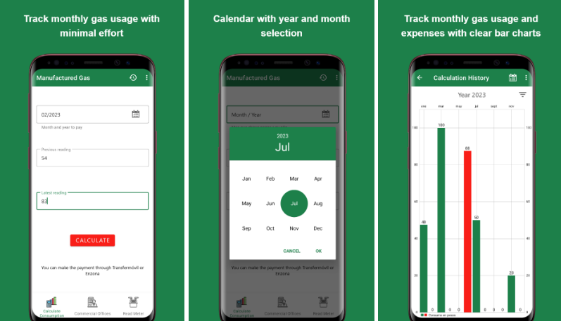

  

    <a href="/">EN</a>
    <a href="/kr" class="active">KR</a>
  

☰
  

    <!-- Navigation Links will be dynamically populated -->
  

# 임대한

 
  
  
  

## 👋 소개
Flutter 크로스플랫폼 앱 개발자로서 4인 팀을 리드하며 CI/CD 파이프라인을 구축해 개발 효율성 70% 향상을 이끌었습니다. Gemini AI 기반 멀티모달 레시피 생성 시스템에서는 프롬프트 엔지니어링과 검증 모델 도입을 통해 부적절한 레시피 생성률을 85%에서 12%로 낮춘 경험이 있습니다. 머신러닝 연구를 통해 고도화된 데이터 처리, 알고리즘 최적화, 분산 시스템 구축 경험을 쌓았으며, 이는 모바일 앱의 성능 개선과 확장성 있는 아키텍처 역량을 키우는 데 크게 기여했습니다.

## 📂 프로젝트 목차

<!--ShareLingo-->
<a href="sharelingo/" style="text-decoration: none; color: inherit;">

  
  
<strong>ShareLingo&thinsp;&thinsp;⎆</strong> 
    언어교류 SNS 앱  
    <code>Flutter</code> <code>Firebase</code> <code>Riverpod</code> <code>Clean Architecture</code> <code>Google OAuth</code> <code>CI/CD</code> 
    <small>2025.05.16 ~ 2025.05.27 (2주)</small>
  

</a>

<!--Cooki-->
<a href="cooki/" style="text-decoration: none; color: inherit;">

  
  
<strong>Cooki&thinsp;&thinsp;⎆</strong> 
    AI 레시피 커뮤니티 앱  
    <code>Flutter</code> <code>Riverpod</code> <code>MVVM</code> <code>Firestore</code> <code>Gemini API</code> <code>Dio</code> <code>Cloud Functions</code> 
    <small>2025.06.01 ~ 2025.07.04 (1개월)</small>
  

</a>

<!--Cubadebate-->
<a href="cubadebate/" style="text-decoration: none; color: inherit;">

  
  
<strong>Cubadebate&thinsp;&thinsp;⎆</strong> 
    맞춤형 뉴스 플랫폼 
    <code>Android</code> <code>Kotlin</code> <code>Coroutines</code> <code>MVVM</code> <code>Room</code> <code>Retrofit</code> <code>Glide</code> <code>Lottie</code> <code>ViewBinding</code> 
    <small>2021.03 ~ 2021.07</small>
  

</a>

<!--가스 소비 관리 앱-->
<a href="https://github.com/daehan-lim/gas-usage-tracker" style="text-decoration: none; color: inherit;">

  
  

    <strong>
      가스 소비 관리 앱
      &thinsp;&thinsp;⎆
    </strong> 
    공공 유틸리티 추적 시스템 
    <code>Alamofire</code> <code>CoreML</code> <code>Combine</code> <code>Firebase</code> <code>SnapKit</code> 
    <small>23.10.10 - 23.11.17 (6주)</small>
  

</a>

<!-- TipCalculator Project -->
<a href="https://github.com/daehan-lim/tip-calculator" style="text-decoration: none; color: inherit;">

  
  

    <strong>
      🧮 TipCalculator
      &thinsp;&thinsp;⎆
    </strong> 
    Combine과 MVVM 패턴을 사용한 팁 계산기 
    <code>MVVM</code> <code>Combine</code> <code>CombineCocoa</code> <code>SnapKit</code> 
    <small>23.09.12 - 23.09.18 (1주)</small>
  

</a>

<!-- MobydickNews Project -->
<a href="https://github.com/daehan-lim/mobydick-news" style="text-decoration: none; color: inherit;">
  

    
    

      <strong>
        📰 MobydickNews
        &thinsp;&thinsp;⎆
      </strong> 
      News API를 사용하는 뉴스 앱 
      <code>RxAlamofire</code> <code>RxSwift</code> <code>REST API</code> <code>SnapKit</code> 
      <small>23.08.25 - 23.09.10 (2주)</small>
    

  

</a>

<!-- PlanBee Project -->
<a href="https://github.com/daehan-lim/planbee" style="text-decoration: none; color: inherit;">
  

    
    

      <strong>
        📅 플랜비 (PlanBee)
        &thinsp;&thinsp;⎆
      </strong> 
      할일관리 Todo 앱 
      <code>CoreData</code> <code>Combine</code> <code>FSCalendar</code> <code>SwiftLint</code> <code>Firebase</code> 
      <small>23.07.10 - 23.08.02 (4주)</small>
    

  

</a>

## 📫 연락처

채용 및 협업 문의는 언제든 환영합니다. 아래 링크를 통해 링크드인이나 이메일로 연락해 주실 수 있습니다.

 
  
  
  

 
