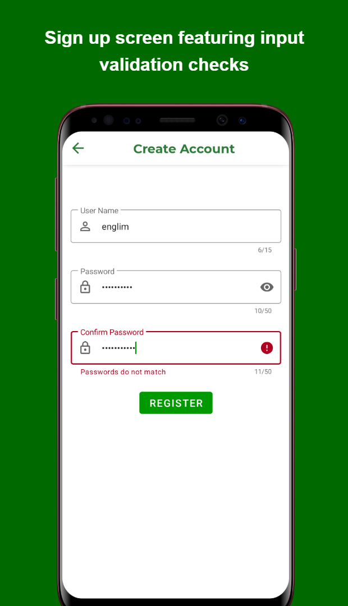
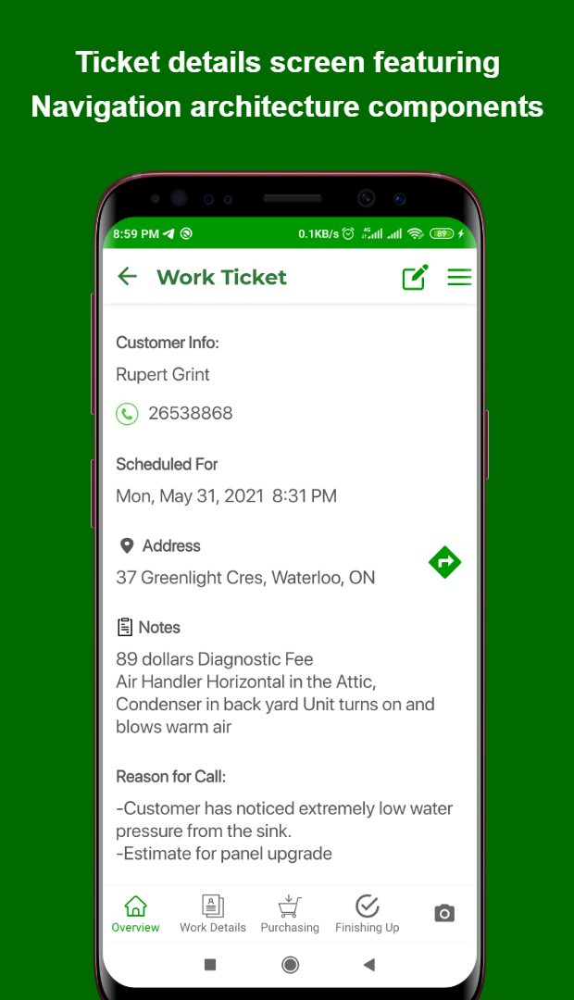
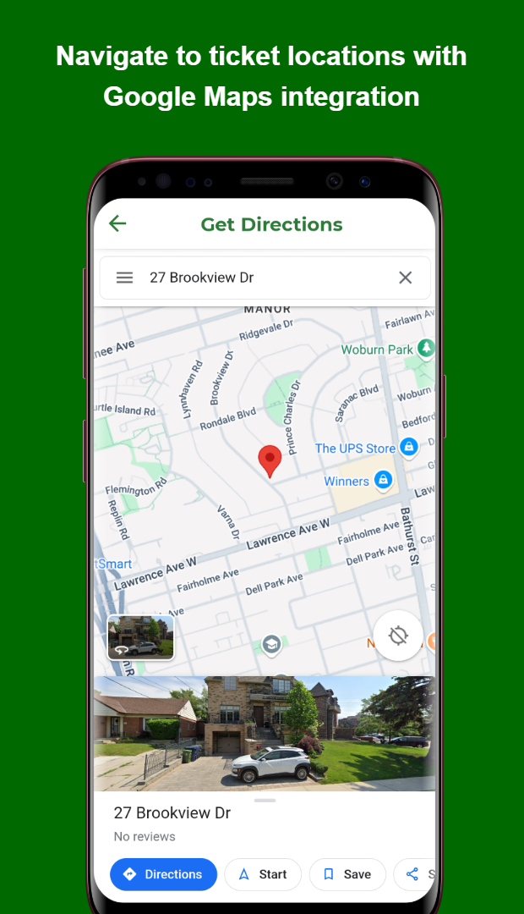
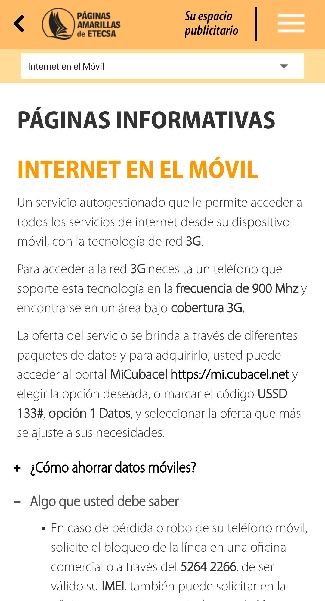
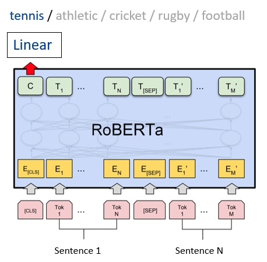

  

    <a href="/">EN</a>
    <a href="/kr" class="active">KR</a>
  

☰
  

    <!-- Navigation Links will be dynamically populated -->
  

# 엥림펜잔안토니오 (임대한)

  
  
  
  
  
  
  
  
  
  
  

## 👋 소개

약 3년간 모바일 애플리케이션 개발과 2년간의 머신러닝 연구 경험을 통해 확장 가능하고 사용자 중심의 애플리케이션을 설계하고 개발한 경력을 보유하고 있습니다. Kotlin과 Java를 활용한 통신 및 엔터프라이즈 애플리케이션 개발에 전문성을 갖추었으며, 최신 아키텍처(MVVM, Jetpack 등)를 도입해 안정적이고 유지 보수성이 높은 애플리케이션을 구현했습니다. 머신러닝 연구 경험을 통해 고도화된 데이터 처리, 알고리즘 최적화, 분산 시스템 설계 경험을 쌓았으며, 이를 활영하여 효율적이고 확장 가능한 모바일 솔루션을 제공할 수 있습니다.

<!--
약 3년간 확장 가능하고 사용자 중심의 모바일 애플리케이션을 개발한 경험과 2년간 AI/ML 배경을 활용한 데이터 처리, 알고리즘 최적화, 분산 시스템 설계의 실무 경험을 보유하고 있습니다. 통신 및 엔터프라이즈 분야에서 모바일 애플리케이션 개발을 주도하며, 코드 유지 보수성과 개발 효율성을 높이기 위해 현대적인 아키텍처와 개발 모범 사례를 도입했습니다. Java, Kotlin, Python, JavaScript에 능숙하며, 깊은 기술적 전문성과 혁신적인 문제 해결 능력을 결합하여 신뢰할 수 있고 고성능의 모바일 솔루션을 제공합니다.

Cuban-Korean Software developer with nearly 3 years of experience building scalable, user-centric mobile applications and 2 years of hands-on expertise in advanced data processing, algorithm optimization, and distributed systems, leveraging an AI/ML background. Spearheaded mobile application development across telecom and enterprise sectors,  driving adoption of modern architectural patterns and development best practices to enhance code maintainability and development efficiency. Proficient in Java, Kotlin, Python, and JavaScript, combines technical expertise with innovative problem-solving to deliver reliable, high-performing mobile solutions.
-->

## 🛠️ 보유 기술

### 안드로이드 개발 핵심 역량

### 데이터베이스 및 네트워킹

### 기타 프로그래밍 언어 및 도구

 

## 📂 프로젝트 개요

**모바일 애플리케이션**
- [Cubadebate News Reader](#cubadebate-news-reader) - News platform with personalized content delivery (2021) [🔗](https://github.com/daehan-lim/cubadebate-app)
- [Gas Consumption Manager](#gas-consumption-manager) - National utility tracking system (2021) [🔗](https://github.com/daehan-lim/gas-consumption-manager)
- [ACME App](#acme-app) - Service ticket management solution (2021) [🔗](https://github.com/daehan-lim/acme)
- [Yellow Pages](#yellow-pages) - Enterprise directory with offline mapping (2020) [🔗](https://github.com/daehan-lim/cuban-yellow-pages)
- [Government Portal](#government-portal) - Official government platform application (2021) [🔗](https://github.com/daehan-lim/government-portal-app)
<!-- [Etecsa Browser (update needed)](#etecsa-browser) - To be added (2020) 🔗-->

**연구 및 머신러닝 프로젝트**
- [Federated Learning for Random Forest](#federated-learning-for-random-forest) - Privacy-preserving distributed learning system (2023) [🔗](https://arxiv.org/abs/2407.19193)
- [RoBERTa News Classification](#roberta-news-classification) - Enhanced topic classification with synthetic data (2024) [🔗](https://github.com/daehan-lim/roberta-sport-news-classifier)
- [Medical Data Classifier](#medical-data-classifier) - Patient mortality prediction system (2023) [🔗](https://github.com/daehan-lim/associative-classifier-mortality-prediction)
- [Information Retrieval System](#information-retrieval-system) - Document indexing and search system (2024) [🔗](assets/information_retrieval_report.pdf)

## 📝 프로젝트 상세

## 📱 모바일 애플리케이션

### [Cubadebate News Reader](https://github.com/daehan-lim/cubadebate-app)
*Feature-rich news reader app enabling personalized content delivery and comprehensive offline access (2021)*

  
  
  
  
  
  
  
  

 

<!--
**Video Walkthrough**

  <iframe width="236" height="486" src="https://www.youtube.com/embed/4SEpMDPFkHw" frameborder="0" allowfullscreen></iframe>

  
-->

**Overview:**
- Built customizable news feed system with dynamic category and topic selection interfaces, enabling personalized content delivery
- Implemented offline caching for bookmarking full articles, including images
- Designed real-time topic management system with dynamic search, post count analytics, and automatic list reordering
- Integrated in-article keyword search, text-to-speech capability and voice recognition, 
- Built multi-level commenting interface, infinite scroll with efficient data loading, and SMS subscriptions
- **Tech Stack:** Android, Kotlin, MVVM, Room, Retrofit, Moshi, Navigation, Material Design, Glide, JSoup, Coroutines, ViewBinding

[🔗 View Details](https://github.com/daehan-lim/cubadebate-app)

---

### [Gas Consumption Manager](https://github.com/daehan-lim/gas-consumption-manager)
*National utility tracking system for automated consumption management (2021)*

  
  
  
  
  
  

 

**Overview:**
- Engineered comprehensive utility management app for the National Manufactured Gas Company
- Implemented offline data persistence with automated consumption calculations
- Created interactive visualization tools and reporting system
- Built streamlined communication channels with company offices
- **Tech Stack**: Android, Kotlin, MVVM, Room, Jetpack, MPAndroidChart, Material Design, Coroutines

[🔗 View Details](https://github.com/daehan-lim/gas-consumption-manager)

---

### [ACME App](https://github.com/daehan-lim/acme)
*Android ticket management app with custom calendar, offline functionality, and location services (2021)*

  
  
  
  
  
  
   
  

 

**Overview:**
- Fully offline-capable service ticket management app with responsive design implementation
- Implemented interactive calendar with custom event visualization and Android Calendar Provider API integration
- Google Maps integration for directions to ticket locations and address search.
- Created user registration and authentication flows with input validation and error feedback
- **Tech Stack**: Android, Kotlin, MVVM, Jetpack, Google Maps, Room, Material Design.

[🔗 View Details](https://github.com/daehan-lim/acme)

---

### [Yellow Pages](https://github.com/daehan-lim/cuban-yellow-pages)
*Enterprise-scale mobile directory revolutionizing business search with sophisticated offline capabilities (2020)*

  

    <!-- Home -->
    

      
Search businesses, access emergency numbers and business directories

      
    

    <!-- Green Pages -->
    

      
Find government procedures, requirements and service schedules

      
    

    <!-- Info Home -->
    

      
Browse phone services, customer support and international calls

      
    

    <!-- Mobile Internet -->
    

      
Explore mobile internet plans, connection settings and service options

      
    

    <!-- Ad Space -->
    

      
Request advertising space, promote business and increase visibility

      
    

  

 

**Overview:**
- Developed Cuba's first Yellow Pages mobile app, implementing enterprise-grade API integration for real-time business search
- Engineered offline vector mapping system reducing data usage by 85% through embedded map files for business geolocalization
- Implemented automated background synchronization for offline access to government services and telephone information sections
- Built responsive search interface with dynamic filters and efficient pagination handling
- Executed comprehensive software testing, including unit, UI and compatibility tests, optimizing reliability and user experience
- **Tech Stack**: Android, Java, SQLite, VTM Maps, WebView, HTML, JavaScript, SharedPreferences, JUnit

[🔗 View Details](https://github.com/daehan-lim/cuban-yellow-pages)

---

### [Government Portal](https://github.com/daehan-lim/government-portal-app)
*Android app for the official [government portal](https://www.redpinar.gob.cu/) of the city of Pinar del Rio, Cuba (2021)*

  
  
  
  
   

 

**Overview:**
- Modernized legacy codebase by integrating MVVM architecture, Coroutines and JetPack components, improving code maintainability and development workflow
- Designed and implemented delegate management system with form validation, data caching, and error handling using Retrofit2, Moshi, and Room
- Built classified ads integration featuring image carousels, offline caching, and responsive UI using custom RecyclerView adapters and data binding
- Engineered reusable WebView components with JavaScript injection for seamless integration of government web services
- **Tech Stack**: Android, Kotlin, MVVM, Retrofit2, Room, Jetpack, ViewPager2, WebView, JavaScript, Coroutines

[🔗 View Details](https://github.com/daehan-lim/government-portal-app)

---

## 🔬 연구 및 머신러닝 프로젝트

### [Federated Learning for Random Forest](https://arxiv.org/abs/2407.19193)
*Privacy-preserving distributed learning system for collaborative model training (2023)*

*Patent Pending (Appl. No. 10-2024-0001659)*

**Overview:**

- Designed and implemented a federated learning system for random forests enabling privacy-preserving distributed model training across multiple clients
- Developed collaborative tree construction mechanism where clients iteratively contribute to growing and refining the model ensemble
- Developed parallel processing system for efficient ensemble model training across multiple clients simultaneously
- Demonstrated system effectiveness through extensive testing across 7 benchmark datasets, achieving superior performance compared to baseline approaches
- **Tech Stack**: Python, NumPy, scikit-learn, Matplotlib, multiprocessing, Graphviz

[🔗 View Details](https://arxiv.org/abs/2407.19193)

---

### [RoBERTa News Classification](https://github.com/daehan-lim/roberta-sport-news-classifier)
*Enhanced topic classification model with synthetic data augmentation (2024)*

**Overview:**
- Developed machine learning model for classifying sports news articles into 5 distinct categories using [RoBERTa](https://huggingface.co/docs/transformers/en/model_doc/roberta) and [BBC Sport dataset](http://mlg.ucd.ie/datasets/bbc.html)
- Augmented limited training data using GPT-4 generated articles and prompt engineering techniques, improving classification accuracy to 99.5%
- Executed comprehensive experiments evaluating model performance under various data configurations and training conditions
- Developed and deployed web application using Streamlit enabling real-time article classification with detailed performance visualizations
- **Tech Stack**: Python, PyTorch, Hugging Face Transformers, GPT-4, Streamlit

[🔗 View Details](https://github.com/daehan-lim/roberta-sport-news-classifier)

---

### [Medical Data Classifier](https://github.com/daehan-lim/associative-classifier-mortality-prediction)
*Novel classification system for patient mortality prediction using electronic health records (2023)*

**Overview:**

- Developed custom associative classifier tailored for unbalanced healthcare datasets
- Generated interpretable rules for medical experts to validate predictions
- Implemented efficient rule-pruning strategy for improved interpretability
- Achieved superior performance metrics compared to traditional classifiers
- **Tech Stack**: Python, NumPy, Pandas, scikit-learn, Jupyter

[🔗 View Details](https://github.com/daehan-lim/associative-classifier-mortality-prediction)

---

### [Information Retrieval System](assets/information_retrieval_report.pdf)
*Efficient implementation of Boolean and ranked document retrieval (2024)*

**Overview:**
- Implemented SPIMI-based inverted indexing for efficient document processing
- Enabled Boolean query processing (AND, OR, NOT) for precise document filtering
- Implemented ranked retrieval using TF-IDF weighting and cosine similarity for relevance-based ranking
- Evaluated system performance on a small document corpus, showcasing efficient retrieval capabilities
- **Tech Stack**: Python, NLTK, SpaCy, NumPy, contractions

[🔗 View Details](../assets/information_retrieval_report.pdf)

 

## 📫 연락처

채용 및 협업 문의는 언제든 환영합니다. 아래 링크를 통해 이력서를 확인하거나 링크드인이나 이메일로 연락해 주실 수 있습니다.

  
  
  

 
