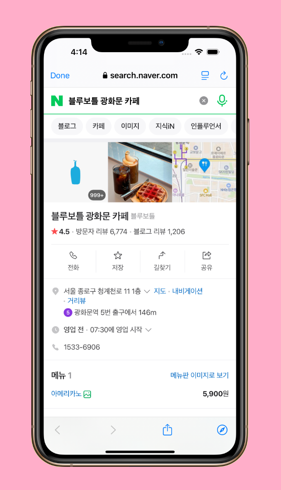
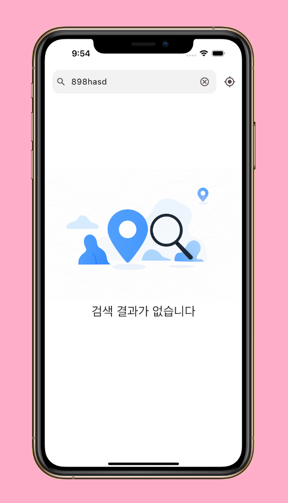
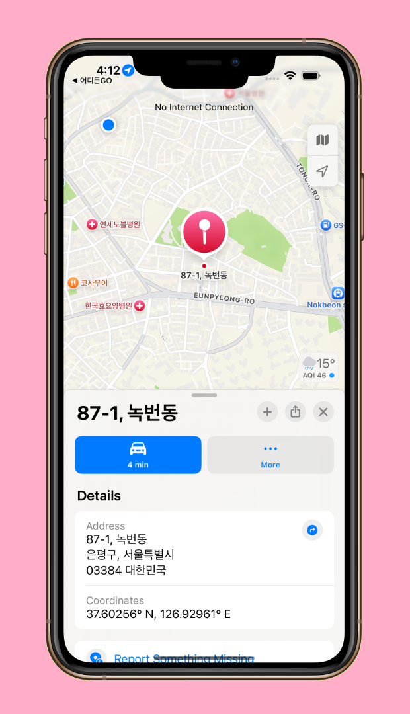
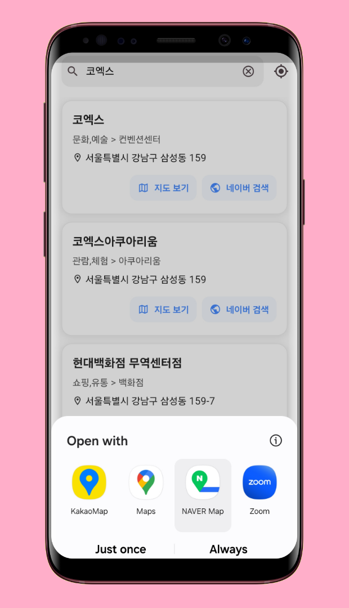
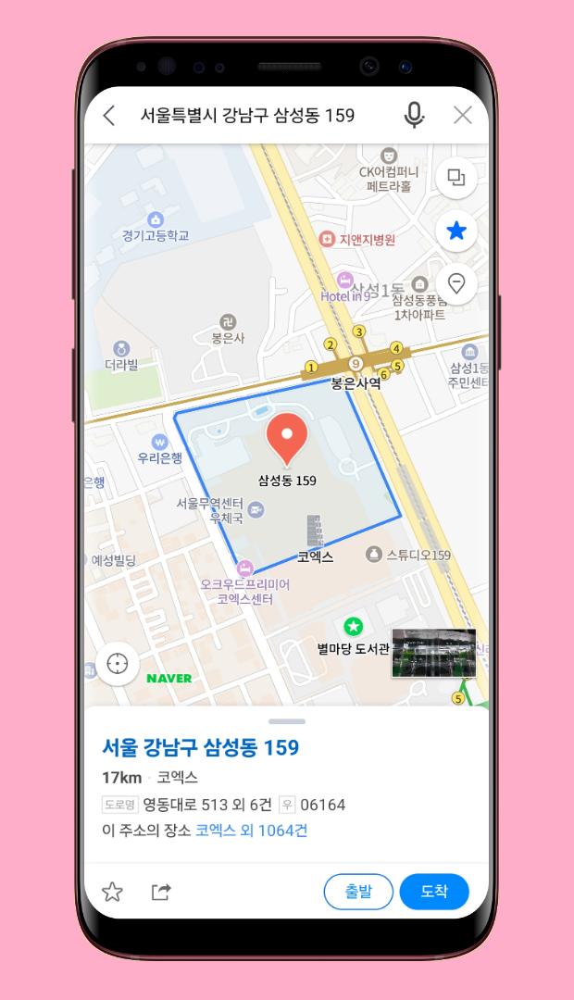
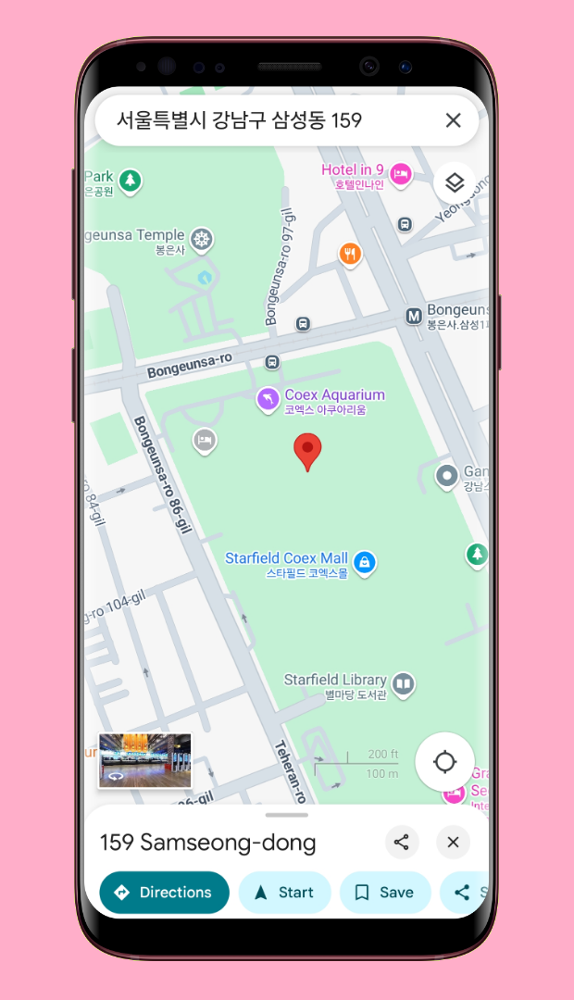

<!--suppress CssUnusedSymbol, JSUnusedLocalSymbols -->
<style>
/* Navigation Menu Styles */
#nav-menu {
  position: fixed;
  top: 0;
  left: 0;
  width: 100%;
  background-color: #3464e1; /* Navbar color */
  color: white;
  padding: 15px 0; /* Navbar height */
  z-index: 1000;
  display: flex;
  justify-content: space-between; /* Space between items */
  align-items: center; /* Vertically align items */
  box-shadow: 0 4px 8px rgba(0, 0, 0, 0.2);
}

code .nx,
code .n,
code .py,
code .p {
  color: #24292e !important;
}

.language-plaintext.highlighter-rouge > .highlight > pre.highlight > code {
  color: #24292e !important;
}

code.language-plaintext.highlighter-rouge {
  color: #EB5757 !important;                 /* strong red text */
  border-radius: 4px;                        /* rounded corners */
  padding: 0.2em 0.4em;                      /* small breathing space */
}

.image-row {
  display: flex;
  overflow-x: auto;
  border: 2px solid #ccc;
  padding: 6px;
  border-radius: 8px;
  gap: 5px;
  align-items: flex-start;
}

.image-item {
  width: 240px !important;
  height: auto !important;
  display: block !important;
  flex-shrink: 0 !important;
}

.linked-image {
  display: block !important;
  flex-shrink: 0 !important;
}

.markdown-body {
    font-family: 'Noto Sans KR', -apple-system, BlinkMacSystemFont, 'Segoe UI', sans-serif !important;
    font-weight: 400 !important;
    word-break: keep-all !important;
    letter-spacing: -0.3px !important;
    line-height: 1.8 !important;
    font-size: 17px !important;
}

#nav-menu a {
  color: white;
  text-decoration: none;
  margin: 0 15px;
  font-weight: bold;
  font-size: 14px;
  transition: color 0.3s ease;
}

#nav-menu > div:first-child a { 
    margin: 0 10px;
}

#nav-menu a:hover {
  color: #f1c40f;
}

/* Adjust content padding for the fixed navbar */
body {
  padding-top: 75px; /* Adjusted for taller navbar */
}

/* Hamburger Menu (Toggle Button) */
#nav-menu-toggle {
  display: none;
  cursor: pointer;
  font-size: 18px;
  margin-right: 20px; /* Move to the right */
  z-index: 1100; /* Ensure toggle is above menu items */
}

/* Navigation Links */
#nav-links {
  display: flex;
  flex-wrap: wrap;
  padding-right: 20px;
}

@media (max-width: 768px) {
  #nav-links {
    display: none; /* Hide links initially on mobile */
    flex-direction: column;
    align-items: center;
    background-color: #3464e1; /* Match navbar background */
    width: 100%;
    position: absolute;
    top: 60px; /* Space below navbar */
    left: 0;
    padding: 15px 0; /* Add spacing around links */
    z-index: 1000; /* Ensure it doesn't overlap the toggle button */
  }

  #nav-links.active {
    display: flex; /* Show links when active */
  }

  #nav-links a {
    margin: 15px 0; /* Added vertical spacing */
  }

  #nav-menu-toggle {
    display: block; /* Show hamburger menu */
  }
}
</style>

<div id="nav-menu">
  <div style="margin-left: 20px;">
    <a href="/" class="active"></a> 
  </div>

<span id="nav-menu-toggle">☰</span>
  <div id="nav-links">
    <!-- Navigation Links will be dynamically populated -->
  </div>
</div>

<script>
  document.addEventListener("DOMContentLoaded", function () {
    const navLinksContainer = document.getElementById("nav-links");
    const toggle = document.getElementById("nav-menu-toggle");
    const headings = document.querySelectorAll("h2");

    // Remove auto-generated H1 heading completely to avoid spacing issues
    const autoGeneratedH1 = document.querySelector("h1:first-of-type");
    if (autoGeneratedH1) {
      autoGeneratedH1.remove();
    }

    // Create navigation links dynamically, excluding subheadings (###)
    headings.forEach((heading, index) => {
      if (heading.tagName === "H3") return; // Skip ### subheadings

      // Create a clean title without emojis for the nav bar
      const cleanText = heading.textContent.replace(/[\u{1F300}-\u{1FAF6}]/gu, '').trim();

      // Create an ID for each heading if not already present
      if (!heading.id) {
        heading.id = "section-" + index;
      }

      // Create navigation link
      const navLink = document.createElement("a");
      navLink.href = "#" + heading.id;
      navLink.textContent = cleanText;
      navLinksContainer.appendChild(navLink);
    });

    // Add click event for hamburger toggle
    toggle.addEventListener("click", () => {
      navLinksContainer.classList.toggle("active");
    });

    // Adjust scroll behavior to account for fixed navbar height
    const adjustScroll = (e, href) => {
      e.preventDefault();
      const target = document.querySelector(href);
      if (target) {
        window.scrollTo({
          top: target.offsetTop - 75, // Offset for navbar height
          behavior: 'smooth'
        });
      }
    };

    // Handle nav bar links
    document.querySelectorAll('#nav-links a').forEach(anchor => {
      anchor.addEventListener('click', function (e) {
        adjustScroll(e, this.getAttribute('href'));
        navLinksContainer.classList.remove('active'); // Collapse the dropdown
      });
    });

    // Handle all Markdown links with hash anchors
    document.querySelectorAll('a[href^="#"]').forEach(anchor => {
      anchor.addEventListener('click', function (e) {
        adjustScroll(e, this.getAttribute('href'));
      });
    });
  });
</script>

<div style="position: relative; margin-bottom: 40px;">


</div>

# 어디든GO - 지역 검색 앱

## 📝 개요
**📌 앱 소개:** 네이버 지역 검색 API와 현재 위치 기반 장소 검색 기능을 제공하는 앱  
**🕒 기간:** 2025.04.20 ~ 2025.04.22 (3일)    
**📱 플랫폼:** Flutter 크로스 플랫폼 앱 (iOS, Android)    
**👥 개발 인원:** 1명 (개인 프로젝트)    
**💼 역할:** 앱 전체 개발 및 UI/UX 설계, API 연동  
**🛠️ 주요 사용 기술:** `Flutter` `Dart` `Naver Local API` `VWorld API` `Riverpod` `Geolocator` `InAppWebView` `URL Launcher` `Dio`    
**🔗 GitHub:** [daehan-lim/flutter-place-finder](https://github.com/daehan-lim/flutter-place-finder)

<div class="image-row">
  
  
  
  
  
  
  
  
  
  
</div>
<span style="display: block; height: 11px;"></span>

## 📖 프로젝트 설명

어디든GO는 네이버 지역 검색 API와 VWorld API를 활용하여 사용자가 장소명이나 주소로 검색할 수 있는 위치 기반 검색 애플리케이션입니다. GPS를 통한 현재 위치 기반 검색과 다양한 지도 앱 연동을 지원하며, 사용자가 직관적으로 주변 장소를 탐색하고 상세 정보에 접근할 수 있는 모바일 환경을 제공합니다.

## 🛠️ Tech Stack

[](https://flutter.dev)
[](https://dart.dev/)
[](https://riverpod.dev/)
[](https://pub.dev/packages/dio)
[](https://developers.naver.com/)
[](https://www.vworld.kr/)
[](https://pub.dev/packages/geolocator)
[](https://pub.dev/packages/flutter_inappwebview)
[](https://pub.dev/packages/url_launcher)
[](https://pub.dev/packages/flutter_dotenv)

## 📋 프로젝트 구조

```
├── app/                              # 애플리케이션 설정 및 구성 관련 파일
│   ├── constants/                    # 앱 전체에서 사용되는 상수 정의
│   │   ├── app_colors.dart           # 앱의 색상 테마 및 색상 상수
│   │   ├── app_constants.dart        # 앱에서 사용되는 일반 상수값 (문자열, 숫자 등)
│   │   └── app_styles.dart           # 앱의 텍스트 스타일, 여백 등 스타일 상수
│   ├── app_providers.dart            # Riverpod 프로바이더 설정 및 전역 상태 정의
│   └── theme.dart                    # 앱의 MaterialApp 테마 설정
│
├── core/                             # 핵심 기능 및 공통 유틸리티 클래스
│   ├── exceptions/                   # 앱 전체에서 사용되는 예외 클래스
│   │   └── data_exceptions.dart      # API 및 데이터 관련 예외 정의
│   ├── services/                     # 비즈니스 로직 및 외부 서비스 연동
│   │   └── map_launcher_service.dart
│   └── utils/                        # 헬퍼 함수 및 유틸리티 클래스
│       ├── geolocator_util.dart
│       ├── snackbar_util.dart
│       └── string_format_utils.dart
│
├── data/                             # 데이터 관련 클래스 및 데이터 액세스 계층
│   ├── dto/                          # 데이터 전송 객체 (API 응답 직접 매핑용)
│   │   ├── naver_place_dto.dart
│   │   └── vworld_district_dto.dart
│   ├── model/                        # 앱 내에서 사용되는 데이터 모델
│   │   └── place.dart                # 장소 정보를 나타내는 모델 클래스
│   ├── network/                      # 네트워크 통신 관련 클래스
│   │   └── dio_clients.dart
│   └── repository/                   # 데이터 접근 및 비즈니스 로직 구현
│       └── location_repository.dart
│
├── ui/                               # 사용자 인터페이스 관련 코드
│   ├── pages/                        # 앱의 주요 화면들
│   │   ├── home/                     # 홈 화면 관련 파일
│   │   │   ├── home_page.dart
│   │   │   ├── home_view_model.dart
│   │   │   └── widgets/              # 홈 화면 전용 위젯
│   │   │       └── home_list_item.dart
│   │   └── web/                      # 웹뷰 화면 관련 파일
│   │       ├── place_web_page.dart
│   │       └── place_web_page_view_model.dart
│   └── widgets/                      # 앱 전체에서 재사용 가능한 공통 위젯
│       └── error_layout.dart
│
└── main.dart                         # 앱의 진입점
```

## 🎯 주요 기능

- **장소명/주소 검색**: 검색창에 키워드를 입력하여 네이버 지역 검색 API를 통해 장소 검색
- **현재 위치 기반 검색**: GPS 아이콘을 클릭하여 현재 위치 주변의 장소를 검색
- **장소 상세 정보**: 검색된 장소를 클릭하면 네이버 웹페이지를 통해 상세 정보 확인 가능
- **지도 앱 연동**: 장소를 선택하여 사용자 기기에 설치된 지도 앱에서 해당 위치를 열어볼 수 있음
- **네이버 검색 기능**: 각 장소 카드의 "네이버 검색" 버튼으로 Android에서는 Custom Tabs, iOS에서는 SFSafariViewController를 사용하여 앱 내에서 네이버 검색 결과를 확인 가능

## 🌟 수행 내용 및 성과

### 위치 기반 실시간 검색 시스템 구현
  - `Geolocator`를 활용한 GPS 좌표 획득 및 `VWorld API` 연동으로 사용자 현재 위치의 행정구역 자동 인식
  - 앱 시작 시 자동으로 주변 장소 로드 기능 구현으로 사용자 편의성 향상
  - 위치 권한 처리 및 예외 상황 대응으로 안정적인 위치 인식 환경 구현
  - 검색창에 "[내 위치] 동네명" 형태로 자동 텍스트 설정하여 직관적인 사용자 경험 제공

### 네이버 지역 검색 API 및 VWorld API 통합 활용
  - `Bearer Token` 기반 인증과 `Dio` HTTP 클라이언트를 통한 안정적인 API 통신 구현
  - 장소명, 카테고리, 주소, 링크 정보를 포함한 종합적인 장소 데이터 처리
  - HTML 태그 제거 및 문자열 포맷팅 유틸리티로 깔끔한 데이터 표시 구현
  - `VWorld API`의 좌표 기반 행정구역 정보 조회로 정확한 위치 기반 검색 지원
  - `BaseOptions`를 통한 일관된 HTTP 설정 관리
  - `Dio` 클라이언트 10초 연결/수신 타임아웃 설정으로 응답성 보장
  - 디버그 모드에서 `LogInterceptor` 활용한 개발 효율성 향상

### 네이티브 앱 연동 및 사용자 경험 향상
- **플랫폼별 지도 앱 연동**
  - **Android**: `Geo URI`를 통해 사용자가 기기에 설치된 지도 앱(구글 맵, 네이버 지도, 카카오맵 등) 중 선택하여 장소를 열 수 있는 시스템 구현
  - **iOS**: 네이버 지도 앱 설치 여부에 따른 자동 분기로 네이버 지도 우선 실행 후 `Apple Maps` 대체 실행
  - `URL Launcher`를 활용한 외부 앱 연동으로 끊김 없는 사용자 워크플로우 제공
  - 장소 카드 내 "네이버 검색" 버튼을 통해 앱 내에서 추가 정보 확인 가능

- **InAppWebView 기반 상세 정보 조회**
  - `Custom User Agent` 설정으로 모바일 최적화된 웹 페이지 로딩 구현
  - 로딩 인디케이터와 에러 처리로 사용자 대기 시간 인지 개선
  - 네이버 검색 연동 시 `InAppBrowserView` 모드 활용으로 앱 내 통합 경험 제공

### 견고한 예외 처리 및 사용자 피드백
- **계층별 예외 처리 시스템**
  - `ApiException`, `NetworkException`, `EnvFileException` 등 상황별 맞춤형 예외 클래스 구현
  - 네트워크 연결 오류, 검색 결과 없음, 환경 변수 누락 등에 대한 직관적인 에러 메시지 제공
  - 연속 스낵바 중복 방지 로직으로 사용자 알림 경험 최적화
  - 빈 검색어 입력 시 즉시 차단하여 불필요한 API 요청 방지
  - URL 유효성 검증으로 잘못된 링크 접근 차단
  - 유효하지 않은 링크나 빈 링크에 대한 스낵바 알림으로 사용자 피드백 강화

- **사용자 친화적 UI/UX 구현**
  - 검색창 클리어 버튼과 검색 아이콘 프리픽스로 직관적인 검색 인터페이스 구성
  - 긴 주소에 대한 `Tooltip` 제공으로 가독성 향상
  - 검색 진행 중 중복 요청 방지 로직으로 시스템 안정성 확보
  - `InkWell` 효과와 그림자를 활용한 카드 형태 리스트 아이템 구현
  - `GestureDetector`를 통한 화면 터치 시 키보드 자동 숨김 기능으로 사용자 편의성 향상

### 개발 효율성 및 코드 품질
- **Riverpod 기반 상태 관리**
  - `Provider` 패턴과 의존성 주입을 통한 테스트 가능한 아키텍처 구현
  - `AsyncValue`를 활용한 로딩, 에러, 데이터 상태의 일관된 관리
  - `DTO`와 `Model` 분리를 통한 외부 API 의존성 최소화 및 데이터 무결성 보장

- **환경 변수 보안 관리**
  - `flutter_dotenv`를 활용한 API 키 보안 처리 및 환경별 설정 분리
  - `.env.example` 파일 제공으로 개발 환경 설정 가이드 제공

- **재사용 가능한 컴포넌트 설계**
  - `HomeListItem`, `MessageLayout` 등 독립적인 위젯 컴포넌트 구현
  - `StringFormatUtils`, `SnackbarUtil` 등 공통 유틸리티 클래스로 코드 중복 제거
  - 일관된 앱 테마와 색상 시스템으로 디자인 통일성 확보

## 🌱 트러블슈팅

**iOS 지도 앱 연동 Silent Failure 문제**

- **문제 상황**  
  - iOS에서 네이버 지도가 설치되지 않은 상태에서 `launchUrl()`을 통해 커스텀 스킴(`nmap://`)을 실행하면 아무런 반응 없이 조용히 실패 
  - `try/catch`로 설정한 `Apple Maps` fallback도 실행되지 않는 silent failure 발생 
  - 콘솔에도 아무런 예외 로그가 찍히지 않아 사용자가 아무 피드백도 받지 못하는 상황

- **초기 접근 방식을 선택한 배경**  
  - 이전 Android 개발에서 `canLaunchUrl()`의 신뢰성 문제를 경험함. 실행 가능한 `geo:` URI에 대해서도 `false`를 반환하는 현상을 겪었던 것이 주요 원인

  ```dart
  if (await canLaunchUrl(Uri.parse('geo:0,0?q=$encoded'))) {
    // 분명히 실행 가능한 URI임에도 불구하고 false를 반환
  }
  ```

  - 이러한 Android에서의 경험을 바탕으로 iOS에서도 `canLaunchUrl()`이 신뢰하기 어려울 것이라 판단하여 양쪽 플랫폼 모두 `try/catch` 방식으로 실패 처리를 선택

- **초기 구현 및 실패 원인**
  ```dart
  static Future<void> openInMap(String queryAddress) async {
    ...
    if (Platform.isIOS) { 
      final naverUri = Uri.parse('nmap://search?query=$encoded&appname=$appName');
      try {
        await launchUrl(naverUri, mode: LaunchMode.externalApplication);
      } catch (e) {
        log('Failed to open Naver Maps. Falling back to Apple Maps: $e');
        final appleUri = Uri.parse('http://maps.apple.com/?q=$encoded');
        try {
          await launchUrl(appleUri, mode: LaunchMode.externalApplication);
        } catch (e2) {
          log('Failed to open Apple Maps: $e2');
        }
      }
    }
  }
  ```

  - 예상과 달리 iOS에서는 이 방식이 전혀 통하지 않음을 확인:
  - `launchUrl()`은 Naver Map이 설치되어 있지 않더라도 예외를 던지지 않음
  - 따라서 `catch` 블록이 실행되지 않음
  - fallback으로 준비한 `Apple Maps` 실행도 무시됨

- **플랫폼별 동작 차이 분석**  
  공식 문서와 GitHub 이슈 검토 결과 핵심 차이점을 파악:
  - **iOS**: 처리할 앱이 없는 경우에도 예외를 던지지 않고 조용히 실패하며, 별다른 반응 없이 호출이 끝나는 경우 존재
  - **Android**: `geo:` 스킴 등에 대해 예외 기반 처리가 상대적으로 안정적으로 작동
  - iOS에서는 실제로 `launchUrl()` 호출 전에 `canLaunchUrl()`로 실행 가능 여부를 반드시 사전 체크해야 fallback이 정상 작동

- **최종 해결 방법**  
  플랫폼별 특성에 맞는 분기 처리로 해결:

  ```dart
  static Future<void> openInMap(String queryAddress) async {
    ...
    if (Platform.isIOS) { 
      final naverUri = Uri.parse('nmap://search?query=$encoded&appname=$appName');
      if (await canLaunchUrl(naverUri)) {
        await launchUrl(naverUri, mode: LaunchMode.externalApplication);
        log('opened in Naver Map');
      } else {
        log('Naver Map not available. Falling back to Apple Maps');
        final appleUri = Uri.parse('http://maps.apple.com/?q=$encoded');
        if (await canLaunchUrl(appleUri)) {
          await launchUrl(appleUri, mode: LaunchMode.externalApplication);
        } else {
          log('Failed to open Apple Maps');
        }
      }
    } else {
      // Android: 기존 try/catch 방식 유지 (geo 스킴에서 안정적으로 작동)
      final geoUri = Uri.parse('geo:0,0?q=$encoded');
      try {
        await launchUrl(geoUri, mode: LaunchMode.externalApplication);
      } catch (e) {
        log('Could not launch map: $e');
      }
    }
  }
  ```

- **배운 점**
  - **플랫폼별 URL 스킴 처리 차이**: Android와 iOS는 외부 앱 연동 실패 시 완전히 다른 방식으로 동작
  - **iOS에서 canLaunchUrl()의 중요성**: Android에서의 신뢰성 문제와 달리 iOS에서는 필수적인 사전 체크 도구로 활용해야 함
  - **크로스 플랫폼 개발 시 주의점**: 한 플랫폼에서의 경험을 다른 플랫폼에 그대로 적용하면 안 되며, 각 플랫폼의 고유한 특성을 이해하고 대응해야 함
  - **Silent Failure 디버깅**: 예외가 발생하지 않는 상황에서의 문제 해결 접근법

- **최종 결과**  
  iOS에서 네이버 지도 미설치 시 Apple Maps로 정상 fallback되며, 플랫폼별 최적화된 지도 앱 연동으로 안정적인 지도 실행 환경 구축

<br><br><br>