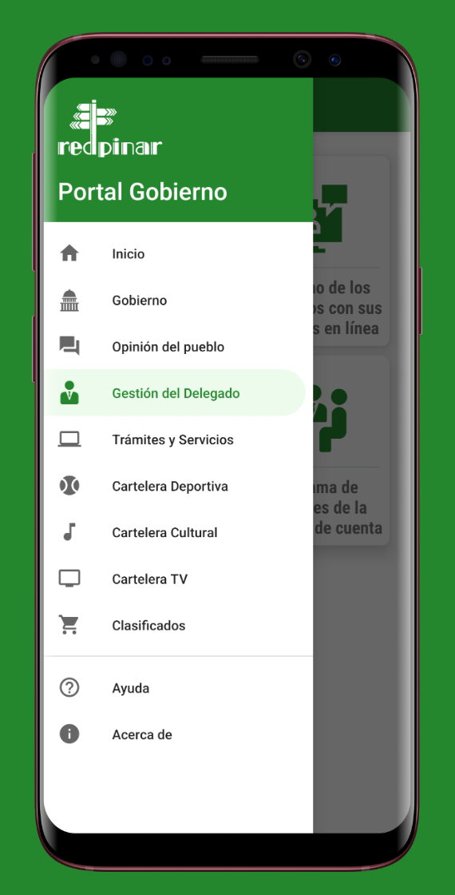
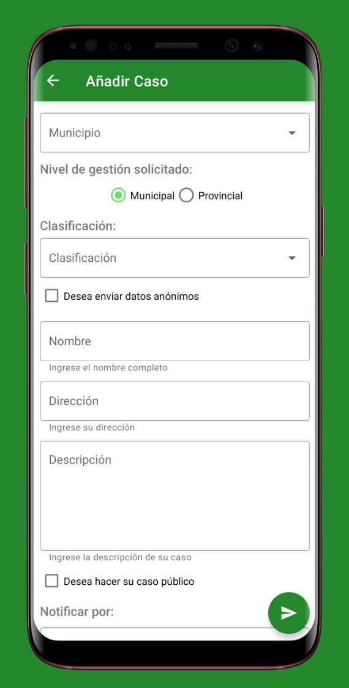

<!--suppress CssUnusedSymbol, JSUnusedLocalSymbols -->
<style>
/* Navigation Menu Styles */
#nav-menu {
  position: fixed;
  top: 0;
  left: 0;
  width: 100%;
  background-color: #3464e1; /* Navbar color */
  color: white;
  padding: 15px 0; /* Navbar height */
  z-index: 1000;
  display: flex;
  justify-content: space-between; /* Space between items */
  align-items: center; /* Vertically align items */
  box-shadow: 0 4px 8px rgba(0, 0, 0, 0.2);
}

code .nx,
code .n,
code .py,
code .p {
  color: #24292e !important;
}

.language-plaintext.highlighter-rouge > .highlight > pre.highlight > code {
  color: #24292e !important;
}

code.language-plaintext.highlighter-rouge {
  color: #EB5757 !important;                 /* strong red text */
  border-radius: 4px;                        /* rounded corners */
  padding: 0.2em 0.4em;                      /* small breathing space */
}

.image-row {
  display: flex;
  overflow-x: auto;
  border: 2px solid #ccc;
  padding: 6px;
  border-radius: 8px;
  gap: 5px;
  align-items: flex-start;
}

.image-item {
  width: 240px !important;
  height: auto !important;
  display: block !important;
  flex-shrink: 0 !important;
}

.linked-image {
  display: block !important;
  flex-shrink: 0 !important;
}

.markdown-body {
    font-family: 'Noto Sans KR', -apple-system, BlinkMacSystemFont, 'Segoe UI', sans-serif !important;
    font-weight: 400 !important;
    word-break: keep-all !important;
    letter-spacing: -0.3px !important;
    line-height: 1.8 !important;
    font-size: 17px !important;
}

#nav-menu a {
  color: white;
  text-decoration: none;
  margin: 0 15px;
  font-weight: bold;
  font-size: 14px;
  transition: color 0.3s ease;
}

#nav-menu > div:first-child a { 
    margin: 0 10px;
}

#nav-menu a:hover {
  color: #f1c40f;
}

/* Adjust content padding for the fixed navbar */
body {
  padding-top: 75px; /* Adjusted for taller navbar */
}

/* Hamburger Menu (Toggle Button) */
#nav-menu-toggle {
  display: none;
  cursor: pointer;
  font-size: 18px;
  margin-right: 20px; /* Move to the right */
  z-index: 1100; /* Ensure toggle is above menu items */
}

/* Navigation Links */
#nav-links {
  display: flex;
  flex-wrap: wrap;
  padding-right: 20px;
}

@media (max-width: 768px) {
  #nav-links {
    display: none; /* Hide links initially on mobile */
    flex-direction: column;
    align-items: center;
    background-color: #3464e1; /* Match navbar background */
    width: 100%;
    position: absolute;
    top: 60px; /* Space below navbar */
    left: 0;
    padding: 15px 0; /* Add spacing around links */
    z-index: 1000; /* Ensure it doesn't overlap the toggle button */
  }

  #nav-links.active {
    display: flex; /* Show links when active */
  }

  #nav-links a {
    margin: 15px 0; /* Added vertical spacing */
  }

  #nav-menu-toggle {
    display: block; /* Show hamburger menu */
  }
}
</style>

<div id="nav-menu">
  <div style="margin-left: 20px;">
    <a href="/" class="active"></a> 
  </div>

<span id="nav-menu-toggle">☰</span>
  <div id="nav-links">
    <!-- Navigation Links will be dynamically populated -->
  </div>
</div>

<script>
  document.addEventListener("DOMContentLoaded", function () {
    const navLinksContainer = document.getElementById("nav-links");
    const toggle = document.getElementById("nav-menu-toggle");
    const headings = document.querySelectorAll("h2");

    // Remove auto-generated H1 heading completely to avoid spacing issues
    const autoGeneratedH1 = document.querySelector("h1:first-of-type");
    if (autoGeneratedH1) {
      autoGeneratedH1.remove();
    }

    // Create navigation links dynamically, excluding subheadings (###)
    headings.forEach((heading, index) => {
      if (heading.tagName === "H3") return; // Skip ### subheadings

      // Create a clean title without emojis for the nav bar
      const cleanText = heading.textContent.replace(/[\u{1F300}-\u{1FAF6}]/gu, '').trim();

      // Create an ID for each heading if not already present
      if (!heading.id) {
        heading.id = "section-" + index;
      }

      // Create navigation link
      const navLink = document.createElement("a");
      navLink.href = "#" + heading.id;
      navLink.textContent = cleanText;
      navLinksContainer.appendChild(navLink);
    });

    // Add click event for hamburger toggle
    toggle.addEventListener("click", () => {
      navLinksContainer.classList.toggle("active");
    });

    // Adjust scroll behavior to account for fixed navbar height
    const adjustScroll = (e, href) => {
      e.preventDefault();
      const target = document.querySelector(href);
      if (target) {
        window.scrollTo({
          top: target.offsetTop - 75, // Offset for navbar height
          behavior: 'smooth'
        });
      }
    };

    // Handle nav bar links
    document.querySelectorAll('#nav-links a').forEach(anchor => {
      anchor.addEventListener('click', function (e) {
        adjustScroll(e, this.getAttribute('href'));
        navLinksContainer.classList.remove('active'); // Collapse the dropdown
      });
    });

    // Handle all Markdown links with hash anchors
    document.querySelectorAll('a[href^="#"]').forEach(anchor => {
      anchor.addEventListener('click', function (e) {
        adjustScroll(e, this.getAttribute('href'));
      });
    });
  });
</script>

<div style="position: relative; margin-bottom: 40px;">


<div style="position:absolute;left:40px;bottom:-10px;width:80px;height:80px;background:#fafafa;border-radius:20px;display:flex;align-items:center;justify-content:center;box-shadow:0 2px 6px rgba(0,0,0,0.15);">

</div>

</div>

# 정부 포털 앱

## 📝 개요
**📌 앱 소개:** 쿠바 피나르 델 리오 시의 공식 정부 대표 포털 안드로이드 앱  
**🕒 기간:** 2021.02 ~ 2021.04  
**📱 플랫폼:** Android 네이티브 앱  
**🏢 회사명:** Desoft (쿠바 국영 소프트웨어 개발사)  
**👥 개발 인원:** 2명  
**💼 역할:** 레거시 코드 현대화 및 시민 서비스 모듈 UI/UX 설계·개발 담당  
**🛠️ 사용 기술:** `Kotlin` `MVVM` `Retrofit` `Room` `Jetpack` `ViewPager2` `WebView` `JavaScript` `Coroutines` `Moshi`    
**🔗 GitHub:** [daehan-lim/government-portal-app](https://github.com/daehan-lim/government-portal-app)

<div style="display: flex; overflow-x: auto; border: 2px solid #ccc; padding: 6px; border-radius: 8px;">
  
  
  
  
   
</div>
<span style="display: block; height: 11px;"></span>

## 📖 프로젝트 배경

쿠바 피나르 델 리오 시의 기존 웹사이트 전용 정부 포털을 시민들이 모바일에서도 원활하게 이용할 수 있도록 하기 위한 안드로이드 앱 개발 필요성이 대두되었습니다. 기존 시스템은 데스크톱 환경에 최적화되어 있어 모바일 사용자들이 민원 신청, 지역 정보 조회, 행정 서비스 이용 시 불편함을 겪고 있었습니다. 특히 지역구 대표자 정보 접근, 민원 처리 현황 추적, 지역 매물 정보 확인 등 핵심 행정 서비스의 모바일 접근성 개선이 시급한 상황이었습니다. 이에 따라 레거시 코드를 현대적 아키텍처로 개선하고 시민 중심의 직관적인 모바일 서비스를 제공하는 정부 포털 앱 개발 프로젝트를 진행하게 되었습니다.

## 🛠️ Tech Stack

[](https://kotlinlang.org)
[](https://developer.android.com/topic/architecture)
[](https://developer.android.com/training/data-storage/room)
[](https://square.github.io/retrofit)
[](https://developer.android.com/jetpack)
[](https://kotlinlang.org/docs/coroutines-overview.html)
[](https://material.io/design)
[](https://developer.android.com/jetpack/androidx/releases/viewpager2)
[](https://developer.android.com/topic/libraries/architecture/livedata)
[](https://developer.android.com/topic/libraries/data-binding)
[](https://developer.android.com/topic/libraries/view-binding)
[](https://github.com/square/moshi)
[](https://developer.android.com/reference/android/webkit/WebView)
[](https://www.w3.org/html/)
[](https://developer.mozilla.org/en-US/docs/Web/JavaScript)

## 📋 프로젝트 구조

```
├── data/                              # 데이터 레이어
│   ├── database/                      # Room 로컬 데이터베이스
│   │   └── classifieddatabase/        # 지역 매물 데이터베이스
│   │       ├── Classified.kt          # 매물 정보 엔티티
│   │       ├── ClassifiedDao.kt       # 데이터 액세스 객체
│   │       └── ClassifiedDatabase.kt  # 데이터베이스 설정
│   ├── model/                         # 데이터 모델 클래스
│   │   ├── DelegateData.kt           # 지역구 대표자 정보
│   │   ├── ClassifiedApi.kt          # 매물 API 응답 모델
│   │   ├── Municipality.kt           # 행정구역 모델
│   │   └── gestiondelegado/          # 대표자 관리 모델
│   └── network/                       # 네트워크 통신 레이어
│       └── PortalGobiernoApiService.kt # REST API 서비스
├── ui/                               # 프레젠테이션 레이어
│   ├── classified/                   # 지역 매물 기능
│   │   ├── ClassifiedFragment.kt     # 매물 목록 화면
│   │   ├── ClassifiedViewModel.kt    # 매물 비즈니스 로직
│   │   ├── ClassifiedAdapter.kt      # RecyclerView 어댑터
│   │   └── classifieddetail/         # 매물 상세 정보
│   ├── gestiondelegado/              # 지역구 대표자 관리
│   │   ├── GestionDelegadoFragment.kt # 대표자 메뉴 화면
│   │   └── gestiondelegadosection/   # 대표자 서비스 탭
│   │       ├── GestionSectionActivity.kt # ViewPager2 기반 탭 화면
│   │       ├── GestionSectionViewModel.kt # 공통 비즈니스 로직
│   │       ├── DelegadoDataFragment.kt    # 대표자 정보 조회
│   │       ├── DispatchFragment.kt        # 온라인 민원 신청
│   │       └── ProcedureFollowUpFragment.kt # 민원 처리 추적
│   └── goverment/                    # 정부 서비스 WebView
│       └── GovernmentFragment.kt     # JavaScript 인젝션 WebView
├── misc/                            # 유틸리티 및 공통 기능
│   ├── Util.kt                      # 날짜 형식화 등 유틸리티
│   └── Converters.kt                # Room 타입 컨버터
└── BindingUtils.kt                  # 데이터 바인딩 어댑터
```

## 🌟 주요업무
- MVVM 아키텍처, 코루틴, JetPack 컴포넌트를 도입해 레거시 코드 현대화
- 지역구 대표자 관리 시스템: Retrofit/Moshi 활용 민원 신청, 회의 일정 관리, 처리 현황 추적 등 주요 기능 구현으로 행정 업무 자동화
- 지역 매물 피드 시스템 구현: API 연동과 오프라인 데이터 캐싱, 실시간 동기화, 이미지 캐러셀, 네트워크 상태 모니터링 기능 통합
- 시도의회 포털 통합: JavaScript 인젝션 및 WebView 커스터마이징으로 데스크톱 중심 UI를 모바일용으로 최적화

## 🚀 주요성과
- 레거시 코드 현대화로 앱 안정성 및 유지보수성 향상
- 행정 업무 자동화로 민원 처리 프로세스 간소화
- 오프라인 우선 설계로 모바일 사용자 접근성 개선

<br><br><br>