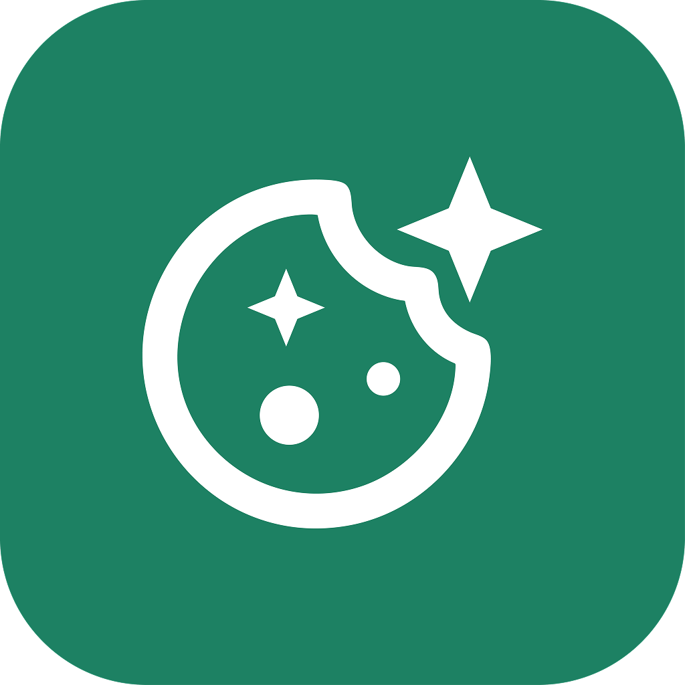
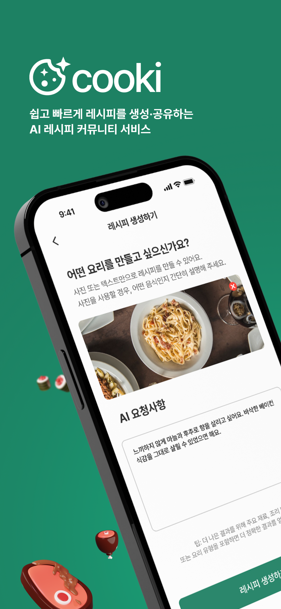
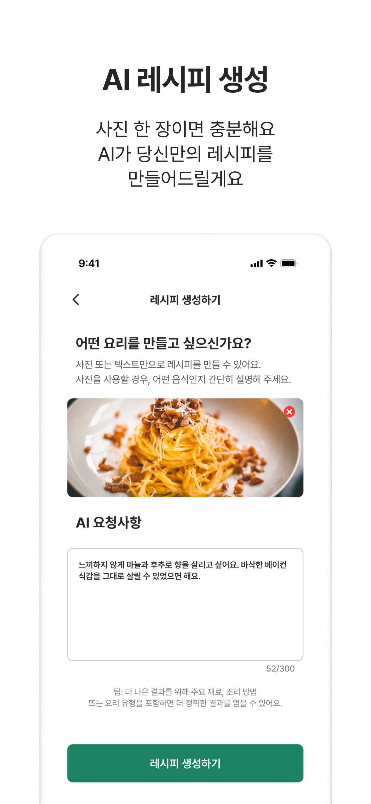
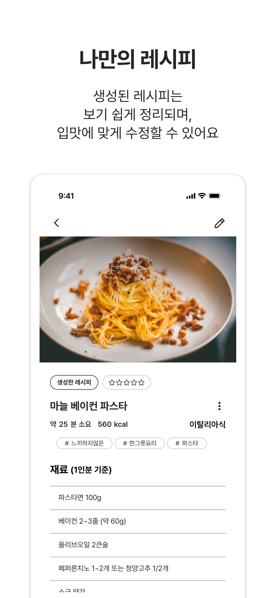
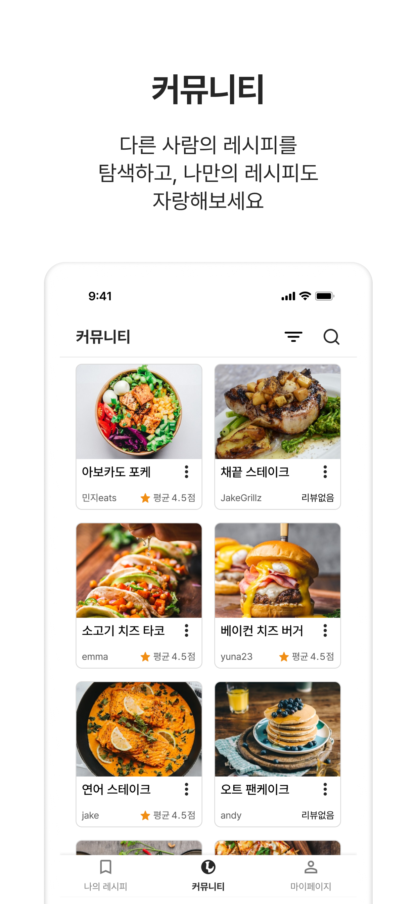
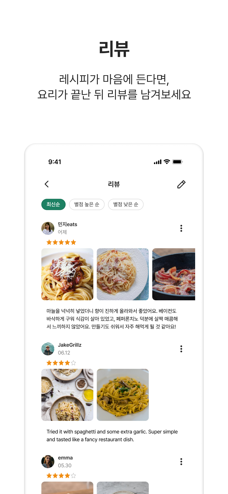
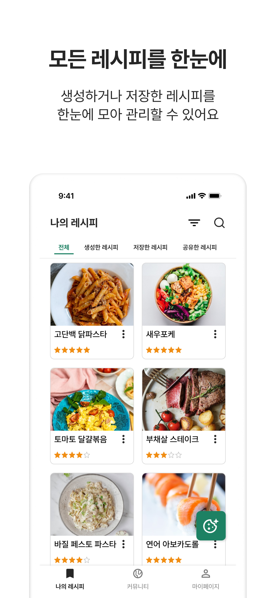

<!--suppress CssUnusedSymbol, JSUnusedLocalSymbols -->
<style>
/* Navigation Menu Styles */
#nav-menu {
  position: fixed;
  top: 0;
  left: 0;
  width: 100%;
  background: linear-gradient(135deg, #3464e1 0%, #764ba2 100%); /* Navbar color */
  color: white;
  padding: 15px 0; /* Navbar height */
  z-index: 1000;
  display: flex;
  justify-content: space-between; /* Space between items */
  align-items: center; /* Vertically align items */
  box-shadow: 0 4px 8px rgba(0, 0, 0, 0.2);
}

h1, h2 {
  color: #6951af !important;
}

code .nx,
code .n,
code .py,
code .p {
  color: #24292e !important;
}

.language-plaintext.highlighter-rouge > .highlight > pre.highlight > code {
  color: #24292e !important;
}

code.language-plaintext.highlighter-rouge {
  color: #EB5757 !important;                 /* strong red text */
  border-radius: 4px;                        /* rounded corners */
  padding: 0.2em 0.4em;                      /* small breathing space */
}

.image-row {
  display: flex;
  overflow-x: auto;
  padding: 10px !important;
  gap: 20px !important;
  align-items: flex-start !important;
  border: none !important;
  border-radius: 0 !important;
}

.image-item {
  width: 240px !important;
  height: auto !important;
  display: block !important;
  flex-shrink: 0 !important;
  border-radius: 20px !important; /* force rounded corners */
  border: 1px solid #e0e0e0 !important; /* force light border */
  box-shadow: 0 2px 6px rgba(0,0,0,0.05) !important; /* force shadow */
}

.linked-image {
  display: block !important;
  flex-shrink: 0 !important;
}

.markdown-body {
    font-family: 'Noto Sans KR', -apple-system, BlinkMacSystemFont, 'Segoe UI', sans-serif !important;
    font-weight: 400 !important;
    word-break: keep-all !important;
    letter-spacing: -0.3px !important;
    line-height: 1.8 !important;
    font-size: 17px !important;
}

#nav-menu a {
  color: white;
  text-decoration: none;
  margin: 0 15px;
  font-weight: bold;
  font-size: 14px;
  transition: color 0.3s ease;
}

#nav-menu > div:first-child a {
  font-size: 13px;
  margin: 0 7px;
  padding: 5px 11px;
  border-radius: 20px;
  background: rgba(255, 255, 255, 0.1);
  transition: all 0.3s ease;
  font-weight: 700; /* Increase from bold to 700 */
  -webkit-font-smoothing: antialiased; /* Better text rendering */
  -moz-osx-font-smoothing: grayscale;
}

#nav-menu > div:first-child a.active {
  background: linear-gradient(135deg, #f093fb 0%, #f5576c 100%);
  color: white;
  transform: translateY(-1px);
}

#nav-menu > div:first-child a:hover {
  background: linear-gradient(135deg, #f093fb 0%, #f5576c 100%);
  color: white;
}

/* Adjust content padding for the fixed navbar */
body {
  padding-top: 50px; /* Adjusted for taller navbar */
}

/* Hamburger Menu (Toggle Button) */
#nav-menu-toggle {
  display: none;
  cursor: pointer;
  font-size: 18px;
  margin-right: 20px; /* Move to the right */
  z-index: 1100; /* Ensure toggle is above menu items */
}

/* Navigation Links */
#nav-links {
  display: flex;
  flex-wrap: wrap;
  padding-right: 20px;
}

@media (max-width: 768px) {
  #nav-links {
    display: none; /* Hide links initially on mobile */
    flex-direction: column;
    align-items: center;
    background: linear-gradient(135deg, #3464e1 0%, #764ba2 100%); /* Match navbar background */
    width: 100%;
    position: absolute;
    top: 60px; /* Space below navbar */
    left: 0;
    padding: 15px 0; /* Add spacing around links */
    z-index: 1000; /* Ensure it doesn't overlap the toggle button */
  }

  #nav-links.active {
    display: flex; /* Show links when active */
  }

  #nav-links a {
    margin: 15px 0; /* Added vertical spacing */
  }

  #nav-menu-toggle {
    display: block; /* Show hamburger menu */
  }
}
</style>

<div id="nav-menu">
  <div style="margin-left: 20px;">
    <a href="/projects/cooki">EN</a>
    <a href="/kr/projects/cooki">KR</a>
  </div>

<span id="nav-menu-toggle">☰</span>
  <div id="nav-links">
    <!-- Navigation Links will be dynamically populated -->
  </div>
</div>

<script>
  document.addEventListener("DOMContentLoaded", function () {
    const navLinksContainer = document.getElementById("nav-links");
    const toggle = document.getElementById("nav-menu-toggle");
    const headings = document.querySelectorAll("h2");

    // Remove auto-generated H1 heading completely to avoid spacing issues
    const autoGeneratedH1 = document.querySelector("h1:first-of-type");
    if (autoGeneratedH1) {
      autoGeneratedH1.remove();
    }

    // Create navigation links dynamically, excluding subheadings (###)
    headings.forEach((heading, index) => {
      if (heading.tagName === "H3") return; // Skip ### subheadings

      // Create a clean title without emojis for the nav bar
      const cleanText = heading.textContent.replace(/[\u{1F300}-\u{1FAF6}]/gu, '').trim();

      // Create an ID for each heading if not already present
      if (!heading.id) {
        heading.id = "section-" + index;
      }

      // Create navigation link
      const navLink = document.createElement("a");
      navLink.href = "#" + heading.id;
      navLink.textContent = cleanText;
      navLinksContainer.appendChild(navLink);
    });

    // Add click event for hamburger toggle
    toggle.addEventListener("click", () => {
      navLinksContainer.classList.toggle("active");
    });

    // Adjust scroll behavior to account for fixed navbar height
    const adjustScroll = (e, href) => {
      e.preventDefault();
      const target = document.querySelector(href);
      if (target) {
        window.scrollTo({
          top: target.offsetTop - 75, // Offset for navbar height
          behavior: 'smooth'
        });
      }
    };

    // Handle nav bar links
    document.querySelectorAll('#nav-links a').forEach(anchor => {
      anchor.addEventListener('click', function (e) {
        adjustScroll(e, this.getAttribute('href'));
        navLinksContainer.classList.remove('active'); // Collapse the dropdown
      });
    });

    // Handle all Markdown links with hash anchors
    document.querySelectorAll('a[href^="#"]').forEach(anchor => {
      anchor.addEventListener('click', function (e) {
        adjustScroll(e, this.getAttribute('href'));
      });
    });

    // Fix EN/KR active states based on current page
    function updateLanguageButtons() {
      const currentPath = window.location.pathname;
      const enButton = document.querySelector('a[href="/projects/cooki"]');
      const krButton = document.querySelector('a[href="/kr/projects/cooki"]');
      
      // Remove active class from both buttons first
      if (enButton) enButton.classList.remove('active');
      if (krButton) krButton.classList.remove('active');
      
      // Check for KR pages first (more specific)
      if (currentPath.includes('/kr')) {
        if (krButton) krButton.classList.add('active');
      } 
      // Then check for EN pages (root, index, etc.)
      else {
        if (enButton) enButton.classList.add('active');
      }
    }

    // Update buttons on page load
    updateLanguageButtons();

    // Update buttons when navigation occurs (for SPAs)
    window.addEventListener('popstate', updateLanguageButtons);
  });
</script>

<div style="position: relative; margin-bottom: 40px;">




</div>

# Cooki - AI 레시피 커뮤니티 앱

## 📝 개요
**📌 앱 소개:** 생성형 AI를 활용한 개인 맞춤형 레시피 생성 및 공유 플랫폼  
**🕒 기간:** 2025.06.01 ~ 2025.07.04 (1개월)  
**📱 플랫폼:** Flutter 크로스 플랫폼 앱 (iOS, Android)  
**👥 개발 인원:** 3명  
**💼 역할:** AI 레시피 생성, 레시피 수정, 리뷰 관련 기능, 신고 기능, 다국어 지원 개발, 등  
**🛠️ 주요 사용 기술:** `Flutter` `Dart` `Firebase` `Riverpod` `MVVM` `Gemini API` `Firestore` `Dio` `Cloud Functions` `Google Cloud Translation API`  
**🔗 GitHub:** [flutter-fantastic-four/cooki-app](https://github.com/flutter-fantastic-four/cooki-app)  
**🔗 App Store:** [apps.apple.com/kr/app/cooki/id6747327839](https://apps.apple.com/kr/app/cooki/id6747327839)

<div class="image-row">
  
  
  
  
  
  
  
</div>
<span style="display: block; height: 11px;"></span>

## 📖 프로젝트 배경

- 요리 초보자 중 [27%](https://shop.linzheritageangus.com/clueless-cooks-report)가 처음부터 요리하는 것을 두려워하고, [38%](https://yougov.co.uk/society/articles/43386-how-confident-are-britons-kitchen)가 레시피 없이 요리하는 것에 자신감이 없다는 조사들의 결과에서 보듯이, 접근하기 쉬운 개인화된 요리 가이드에 대한 니즈가 명확히 존재
- 특히 냉장고 속 남은 재료로 즉석 요리를 만들고 싶어하는 사용자들이 적절한 레시피를 찾는 데 어려움을 겪고 있으며, 기존 레시피 앱들은 단순 검색 기반으로만 제공되어 이러한 개별적 상황을 반영하지 못하는 한계 보유
- 이에 따라 생성형 AI를 활용하여 사용자의 보유 재료나 음식 사진을 바탕으로 실시간 맞춤형 레시피를 생성하고, 커뮤니티 기반 경험 공유가 가능한 통합 플랫폼 개발 필요성 확인
- 요리 진입 장벽을 낮추고 개인 상황에 최적화된 요리 솔루션을 제공함으로써, 누구나 쉽게 요리를 시작하고 즐길 수 있는 환경 조성을 목표로 프로젝트 기획

## 🛠️ Tech Stack

[](https://flutter.dev)
[](https://dart.dev/)
[](https://riverpod.dev/)
[](https://developer.android.com/topic/architecture)
[](https://firebase.google.com/)
[](https://firebase.google.com/products/firestore)
[](https://pub.dev/packages/dio)
[](https://firebase.google.com/products/functions)
[](https://ai.google.dev/)
[](https://firebase.google.com/products/crashlytics)
[](https://firebase.google.com/products/storage)
[](https://cloud.google.com/translate)
[](https://pub.dev/packages/cached_network_image)
[](https://pub.dev/packages/image_picker)
[](https://pub.dev/packages/flutter_image_compress)
[](https://pub.dev/packages/share_plus)
[](https://pub.dev/packages/shared_preferences)
[](https://flutter.dev/docs/development/accessibility-and-localization/internationalization)
[](https://pub.dev/packages/speech_to_text)
[](https://pub.dev/packages/easy_image_viewer)

## 🌟 수행 내용 및 성과

### AI 레시피 생성 및 관리 시스템 구축
- **`Gemini AI` 기반 멀티모달 레시피 생성 시스템 구축**
  - `Gemini 2.0-flash` 모델 연동으로 텍스트 입력 및 이미지 인식 기반의 멀티모달 레시피 생성 기능 개발
  - `Few-shot` 프롬프트 기법과 사용자 선호도(맵기, 아이 친화적 등) 반영 맞춤형 프롬프트 엔지니어링 구현
  - 다국어 대응 프롬프트 구성 및 비음식 이미지 대응 fallback JSON 시스템 구현으로 안정성 확보
  - 카테고리/재료/조리시간 등 명세 기준 엄격 적용을 통한 일관된 레시피 품질 보장
  - 토큰 카운팅 및 비용 모니터링 시스템 구축으로 입력/출력 토큰 수와 실시간 API 사용 비용 추적

- **AI 입력 검증 시스템 구현 및 품질 개선**
  - `Gemini 1.5-flash` 모델을 활용한 별도 입력 검증 시스템 구축
  - 비레시피성 입력, 명령어 조작, 프롬프트 악용 시도 사전 필터링 로직 구현
  - 입력 유효성 검증과 레시피 생성을 분리한 2단계 검증 시스템 도입으로 적합하지 않은 레시피 생성률을 **85%에서 12%로 감소**
  - `JSON Schema` 기반 구조화된 응답 형식 정의로 파싱 오류 감소

- **레시피 저장 및 관리 시스템**
  - `Firestore`와 `Firebase Storage` 연동을 통한 레시피 및 이미지 저장 기능 구현
  - 기존 순차 처리 방식을 병렬 처리로 변경하여 AI 레시피 생성과 이미지 업로드 동시 실행으로 생성 시간 **40% 단축**
  - 생성된 레시피의 편집, 삭제, 공개/비공개 설정 및 커뮤니티 공유 기능 개발
  - `Flutter Image Compress`를 활용한 이미지 압축과 리사이징을 통해 업로드 시간을 단축하고 스토리지 비용을 최적화했으며, API 토큰 사용량 **35% 절감**과 생성 속도 향상 달성

### 리뷰 시스템 및 번역 기능
- **리뷰 관리 및 상호작용 기능**
  - 별점, 텍스트, 이미지(최대 5장)를 포함한 종합 리뷰 시스템 개발
  - 리뷰 작성/수정/삭제 기능과 적합하지 않은 콘텐츠 신고 시스템 구현
  - 최신순/별점순 정렬로 사용성 향상
  - `Firestore` 서브컬렉션 구조 활용으로 리뷰 조회 성능 개선
  - 다중 이미지 업로드 시 개별 압축 처리 및 병렬 업로드로 **처리 시간 40% 단축**
  - 리뷰 수정 시 기존 원격 이미지와 새로 추가된 로컬 이미지를 통합 처리하는 하이브리드 시스템으로 편집 과정에서 일관된 사용자 경험 제공

- **다국어 리뷰 번역 시스템 구축**
  - `Google Cloud Translation API`와 `Firebase Cloud Functions` 연동을 통한 실시간 번역 기능 구현
  - 리뷰 작성 시 언어 자동 감지 시스템 도입으로 다국어 사용자 간 원활한 소통 지원
  - 리뷰 언어 감지를 비동기 백그라운드로 처리하여 리뷰 작성 완료 시간을 **약 3초 단축** 및 사용자 경험 개선

### 다국어 지원 및 음성 인식
- **언어 설정 및 국제화 시스템**
  - `Flutter l10n`을 활용한 한국어/영어 다국어 UI 구현
  - `SharedPreferences` 기반 언어 설정 저장 및 언어 설정 페이지로 인한 실시간 언어 변경 기능
  - 사용자 디바이스 언어 자동 감지 및 기본 언어 설정으로 첫 사용자 경험 개선

- **음성 인식 기반 검색 시스템**
  - `Flutter Speech-to-Text` 플러그인 연동으로 음성 입력 기반 레시피 검색 기능 구현
  - 한국어/영어 음성 인식 지원으로 접근성 향상
  - 음성 입력 중 실시간 텍스트 변환 및 오류 처리 로직 구현

### 레시피 외부 공유 기능
  - `Share Plus` 패키지를 활용한 텍스트와 이미지 결합 공유 기능 구현
  - 레시피 정보의 구조화된 포맷팅으로 가독성 있는 공유 콘텐츠 생성
  - 안드로이드/iOS 기본 공유 시트를 통해 카카오톡, 이메일, 메모 앱 등 다양한 플랫폼으로 간편하게 레시피 전송 가능

### UI/UX 최적화 및 성능 개선
  - 클라이언트 사이드 폼 검증 시스템으로 레시피 제목, 재료, 조리과정 등 필수 필드 실시간 유효성 검사
  - 확대/축소 및 슬라이드 기능을 포함한 이미지 뷰어로 리뷰 이미지 조회 편의성 강화
  - `CachedNetworkImage`를 활용한 이미지 캐싱으로 반복 로딩 시간 단축 및 데이터 사용량 절약
  - `Shimmer` 로딩 애니메이션 구현으로 데이터 로딩 중 인지된 성능 향상 및 사용자 대기 경험 개선
  - `PopScope`를 활용한 사용자 데이터 손실 방지 및 확인 다이얼로그 시스템 구현

### 아키텍처 및 예외 처리 시스템
- **전계층 예외 처리 및 사용자 경험 보장**
  - 모든 내부 계층에서 발생하는 예외를 `ViewModel`의 `try-catch`에서 일괄 포착하여 앱 크래시 방지
  - 포착된 예외를 도메인별 `Enum` 에러 키로 변환 후 UI에서 다국어 메시지로 매핑하는 2단계 에러 처리로 기술적 예외와 사용자 메시지 분리
  - 국제화 의존성을 비즈니스 로직에서 완전 제거하여 `ViewModel` 단위 테스트 환경 구축 및 관심사 분리 달성
  - 일관된 에러 플로우를 통해 네트워크 오류, 파일 처리 실패 등 다양한 예외 상황에서 적절한 사용자 안내 제공

- **코드 품질 및 유지보수성 개선**
  - `MVVM` 아키텍처와 `Repository`/`DataSource` 패턴 기반의 계층 구조를 적용해 책임을 분리하고 재사용성 강화
  - `Riverpod`을 활용한 전역 상태 관리와 기능별 `ViewModel` 설계로 상태 흐름을 단순화하고 유지보수 효율 향상
  - 공통 위젯 컴포넌트화를 통한 UI 일관성 확보 및 개발 효율성 증대
  - 로그 시스템과 `Firebase Crashlytics` 연동으로 실시간 오류 모니터링 체계 구축
  - 타입 안전성을 위한 `DTO` 및 `Entity` 계층 분리로 런타임 오류 방지

## 🧭 기술적 의사결정

**1. `Gemini AI` 모델 선택 및 2단계 검증 시스템 구축**

- **요구 사항**  
  사용자가 입력한 텍스트나 이미지로부터 높은 품질의 레시피를 안정적으로 생성하면서, 비음식 관련 입력이나 악의적 프롬프트 조작을 효과적으로 차단해야 함

- **의사 결정**  
  `Gemini 1.5-flash`와 `Gemini 2.0-flash` 모델을 역할별로 분리한 2단계 검증 시스템 구축을 결정
  - **1단계 검증**: `Gemini 1.5-flash`로 입력 유효성 검사 전담하여 비레시피성 입력, 명령어 조작, 프롬프트 인젝션 시도를 사전 필터링
  - **2단계 생성**: `Gemini 2.0-flash`로 실제 레시피 생성 처리하여 최신 모델의 성능과 안정성 확보
  - **JSON Schema 강제**: 구조화된 응답 형식으로 파싱 오류 방지 및 일관된 데이터 품질 보장
  - **토큰 최적화**: 검증 단계에서 간단한 boolean 응답으로 API 비용 절약, 생성 단계에서만 복잡한 레시피 데이터 요청

```dart
// 검증 모델 설정
_validationModel = googleAI.generativeModel(
  model: 'gemini-1.5-flash',
  generationConfig: GenerationConfig(
    responseMimeType: 'application/json',
    responseSchema: Schema.object(
      properties: {'isValid': Schema.boolean()},
    ),
  ),
);

// 생성 모델 설정  
_recipeGenerationModel = googleAI.generativeModel(
  model: 'gemini-2.0-flash',
  generationConfig: GenerationConfig(
    responseMimeType: 'application/json',
    responseSchema: Schema.object(/* 레시피 구조 정의 */),
  ),
);
```
<span style="display: block; height: 1px;"></span>

**2. Firebase Cloud Functions 기반 번역 시스템**

- **요구 사항**  
  실시간 번역 기능이 필요하며, 클라이언트에서 직접 `Google Translation API`를 호출하기에는 보안상 API 키 노출 위험이 존재

- **의사 결정**  
  `Firebase Cloud Functions`를 중간 계층으로 활용한 서버리스 번역 시스템 구축을 결정
  - **보안성**: `Google Cloud Translation API` 인증 정보를 서버 측에서 안전하게 관리
  - **확장성**: 서버리스 아키텍처로 사용량에 따른 자동 스케일링 및 비용 최적화
  - **언어 감지**: 번역과 언어 감지를 별도 함수로 분리하여 필요에 따른 선택적 호출 가능
  - **에러 처리**: `Cloud Functions` 레벨에서 통합된 오류 처리 및 클라이언트에 구조화된 응답 반환

```javascript
exports.translateText = onCall({ region: "asia-northeast3" }, async (request) => {
  try {
    const { text, targetLanguage, sourceLanguage } = request.data;
    
    const translationRequest = {
      parent: `projects/${projectId}/locations/global`,
      contents: [text],
      mimeType: 'text/plain',
      targetLanguageCode: targetLanguage,
      ...(sourceLanguage && { sourceLanguageCode: sourceLanguage }),
    };
    
    const [response] = await translationClient.translateText(translationRequest);
    
    return {
      success: true,
      translatedText: response.translations[0].translatedText,
      detectedSourceLanguage: response.translations[0].detectedLanguageCode || sourceLanguage
    };
  } catch (error) {
    throw new Error('Translation failed: ' + error.message);
  }
});
```
<span style="display: block; height: 1px;"></span>

**3. 통합 로깅 및 크래시 모니터링 유틸리티**

- **요구 사항**  
  협업 환경에서 일관된 에러 처리가 필요하며, 프로덕션 배포 후 사용자 환경의 예외를 개발팀이 신속히 파악·대응할 수 있어야 하고, 로컬 디버깅과 원격 모니터링을 위해 로그 작성 방식을 통일해야 함

- **의사 결정**  
  `Firebase Crashlytics` 연동 로깅 유틸리티 개발을 결정
  - **단일 진입점**: 모든 예외 처리에서 `logError()` 함수 하나로 통일된 로깅 방식 제공
  - **이중 출력**: 개발 중에는 Dart의 `log()` 함수로 즉시 확인, 프로덕션에서는 `Crashlytics`로 자동 수집
  - **컨텍스트 정보**: 에러 정보, 스택 트레이스, 선택적 설명을 구조화하여 디버깅 효율성 향상
  - **재사용성**: 프로젝트 전반에서 동일한 인터페이스로 예외 처리 및 로깅 가능
  - **프레임워크 레벨 예외 포착**: `runZonedGuarded`를 활용해 Flutter 프레임워크 레벨 예외를 감지하고 로깅하여 앱 크래시를 예방

```dart
void logError(
  dynamic error,
  StackTrace stack, {
  String? reason,
  bool fatal = false,
}) {
  final message = reason != null 
      ? '[EXCEPTION] $reason\n$error' 
      : '[EXCEPTION] $error';
  log(message, stackTrace: stack);

  FirebaseCrashlytics.instance.recordError(
    error,
    stack,
    reason: reason,
    fatal: fatal,
  );
}

// 사용 예시
try {
  final bytes = await imageDownloadRepository.downloadImage(
    recipe.imageUrl!,
  );
  ...
} catch (e, stack) {
  logError(e, stack, reason: 'Image download failed');
}
```

**4. 멀티모달 프롬프트 엔지니어링 아키텍처**

- **요구 사항**  
  텍스트 입력, 이미지 입력, 또는 둘의 조합으로 다양한 상황에 대응하는 레시피 생성이 가능해야 하며, 한국어와 영어 사용자 모두에게 일관된 품질의 결과 제공이 필요

- **의사 결정**  
  템플릿 기반 동적 프롬프트 시스템과 다국어 마크다운 파일 구조 도입을 결정
  - **모듈화된 프롬프트**: 기본 템플릿, 텍스트 컨텍스트, 선호도 섹션을 독립적인 마크다운 파일로 분리하여 유지보수성 향상
  - **다국어 지원**: `assets/prompts/ko/`, `assets/prompts/en/` 구조로 언어별 프롬프트 관리
  - **플레이스홀더 시스템**: `__COOKI_*__` 형태의 커스텀 플레이스홀더로 런타임 동적 구성
  - **Few-shot 학습**: 프롬프트 내 예시 레시피 포함으로 일관된 출력 형식과 품질 확보

```dart
Future<String> _buildRecipePrompt({
  String? textInput,
  Set<String>? preferences,
  required bool hasImage,
  required String textOnlyRecipePromptPath,
  required String imageRecipePromptPath,
}) async {
  if (hasImage) {
    String imagePrompt = await rootBundle.loadString(
      'assets/prompts/$imageRecipePromptPath',
    );
    
    // 동적 섹션 구성
    String textContextSection = textInput?.isNotEmpty == true 
        ? await _buildTextContextSection(textInput!)
        : '';
    String preferencesSection = await _buildPreferencesSection(preferences);
    
    return imagePrompt
        .replaceAll(AppConstants.textContextSectionPlaceholder, textContextSection)
        .replaceAll(AppConstants.preferencesSectionPlaceholder, preferencesSection);
  }
  // 텍스트 전용 프롬프트 처리...
}
```

## 🌱 문제 해결

**1. 레시피 생성과 이미지 업로드 병렬 처리 최적화**

- **문제 상황**  
  초기 순차 처리 방식에서 AI 레시피 생성이 끝난 후에야 이미지 업로드를 시작해 전체 소요 시간이 길어지고, 사용자가 오래 대기해야 하는 문제가 발생.

- **해결 과정**
  - 레시피 생성과 이미지 업로드가 서로 의존성이 없는 독립 작업임을 확인.
  - `Future.wait()`를 활용하면 두 작업을 동시에 실행해 전체 처리 시간을 줄일 수 있다고 검증.

- **해결 방법**
  - 기존 `_saveRecipe()` 메서드에서 이미지 업로드 로직을 `_uploadImageIfNeeded()`로 분리.
  - AI 생성과 이미지 업로드를 `Future.wait()`로 병렬 실행.
  - 각 작업 결과를 개별적으로 처리해 부분 실패에도 대응 가능하도록 구현.
  - 에러 처리 로직을 작업별로 독립화하여 디버깅과 문제 추적을 용이하게 함.

```dart
// 기존 순차 처리 방식
final generatedRecipe = await _generateRecipe(
  imageBytes: compressedImageBytes, // Uint8List 바이너리 데이터로 AI에 전송
  textInput: state.textInput,
  // ...
);
if (generatedRecipe != null) {
  final imageUrl = await _uploadImageToStorage(compressedImageBytes, user.id);
  final saved = await _saveRecipe(generatedRecipe, user, imageUrl);
}

// 개선된 병렬 처리 방식
final generationTask = _generateRecipe(...);
final imageUploadTask = _uploadImageIfNeeded(...);
final results = await Future.wait([generationTask, imageUploadTask]);

final generated = results[0] as GeneratedRecipe?;
final imageUrl = results[1] as String?;
```

- **최종 결과**  
  레시피 생성 전체 소요 시간을 **40% 단축**하여 사용자 대기 시간을 크게 줄였으며, 이미지 포함 레시피 생성의 만족도를 현저히 향상.

**2. 리뷰 언어 감지 최적화**

- **문제 상황**  
  리뷰 작성 시 언어 감지 API 호출이 동기적으로 처리되어 사용자가 리뷰 저장 완료까지 3초 이상 대기해야 하는 사용성 문제 발생

- **해결 과정**
  - 리뷰 작성 플로우 분석 결과 언어 감지가 리뷰 저장의 필수 전제 조건이 아님을 확인
  - 사용자 경험 우선순위를 고려하여 리뷰 저장과 언어 감지 작업을 분리하는 방안 검토
  - 언어 감지 결과가 즉시 필요하지 않고 번역 기능 사용 시에만 필요함을 파악

- **해결 방법**
  - 리뷰 저장 완료 후 언어 감지를 백그라운드에서 비동기 실행하도록 변경
  - `await` 키워드 제거로 언어 감지가 UI 블로킹 없이 별도 스레드에서 처리
  - 기존 리뷰 수정 시에도 `reviewId`를 미리 확보하여 일관된 처리 플로우 유지
  - 언어 감지 실패 시에도 리뷰 기본 기능에는 영향 없도록 오류 격리

```dart
// 기존 동기 처리 방식
await saveReview(review);
await detectAndUpdateLanguage(reviewId); // UI 블로킹

// 개선된 비동기 처리 방식
final reviewId = await saveReview(review);
detectAndUpdateLanguage(reviewId); // await 제거로 백그라운드 실행
```

- **최종 결과**  
  리뷰 작성 완료 시간을 **약 3초 단축**하였고 번역 기능의 정확도는 유지하면서도 즉각적인 리뷰 저장 경험 제공

**3. 이미지 리사이징·압축 최적화를 통한 API 비용 절감 및 성능 향상**

- **문제 상황**  
  고해상도 스마트폰 이미지를 그대로 `Gemini AI`에 전송할 경우, 해상도 증가로 타일 수가 늘어나 API 토큰 사용량과 비용이 상승하고, 큰 파일 용량으로 인해 업로드 속도 저하와 레시피 생성 지연이 발생함.

- **문제 분석**
  - **타일 기반 과금 구조 확인**: 해상도 증가 → 타일 수 증가 → 토큰 사용량 및 비용 상승
  - **파일 용량과 전송 속도 관계 분석**: 용량이 클수록 업로드 지연 발생
  - **품질 vs 성능 트레이드오프 검토**: 리사이징과 압축 수준별 품질·속도 테스트

- **해결 방법**
  - 이미지 선택 시 `maxWidth: 768, maxHeight: 768`으로 리사이징하여 불필요한 타일 생성 방지
  - `Flutter Image Compress`로 JPEG 85% 품질 압축, 적절한 이미지 품질을 유지하면서 파일 용량 대폭 축소

- **결과 및 효과**  
  API 토큰 사용량을 **35% 절감**하고, 업로드 시간을 단축하여 레시피 생성 속도 향상.

**4. 다중 이미지 병렬 업로드 시 파일명 충돌 문제**
- **문제 상황**: 여러 이미지를 동시에 압축·업로드할 때 `Firebase Storage`에서 HTTP 400 오류 발생, 특히 3장 이상 선택 시 빈번
- **초기 점검**: `Firebase Storage` 규칙·할당량 점검, 네트워크 상태 확인 → 모두 정상
- **원인 분석**: 파일명 생성이 `DateTime.now().millisecondsSinceEpoch` 기반이라 병렬 처리 시 동일 값 발생, 압축·업로드 과정 모두에서 중복 가능성 확인
- **해결**: 파일명 생성 로직을 `millisecondsSinceEpoch` → `microsecondsSinceEpoch`로 변경해 1000배 높은 정밀도 확보
- **결과**: 충돌 오류 **100% 해결**, 이미지의 안정적인 병렬 업로드 지원으로 사용자 경험 향상

## 🎞️ 시연 영상
<div align="center"> 
<a href="https://www.youtube.com/watch?v=0cTYv7v8H4A">
  
</a>
</div>
<br>