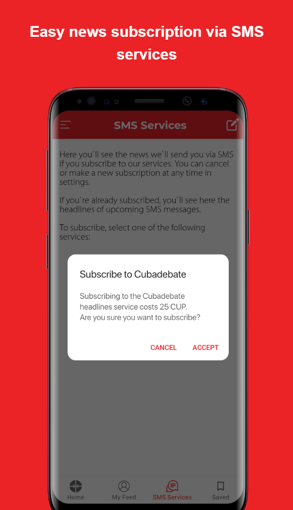
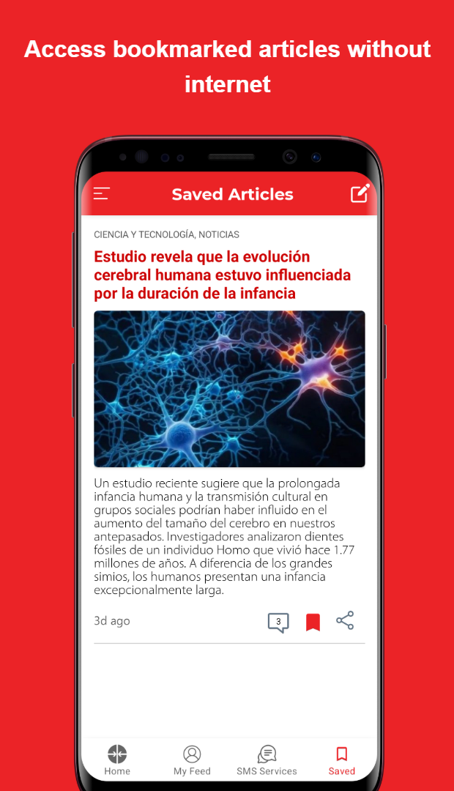
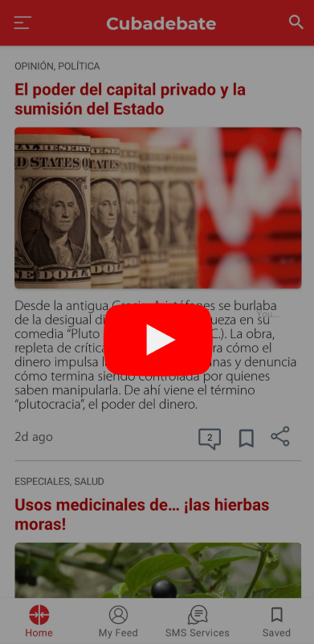

<!--suppress CssUnusedSymbol, JSUnusedLocalSymbols -->
<style>
/* Navigation Menu Styles */
#nav-menu {
  padding: 15px 0; /* Navbar height */
}

.image-row {
  display: flex;
  overflow-x: auto;
  border: 2px solid #ccc;
  padding: 6px;
  border-radius: 8px;
  gap: 5px;
  align-items: flex-start;
}

.image-item {
  width: 240px !important;
  height: auto !important;
  display: block !important;
  flex-shrink: 0 !important;
}

.linked-image {
  display: block !important;
  flex-shrink: 0 !important;
}

.markdown-body {
    font-family: 'Noto Sans KR', -apple-system, BlinkMacSystemFont, 'Segoe UI', sans-serif !important;
    font-weight: 400 !important;
    word-break: keep-all !important;
    letter-spacing: -0.3px !important;
    line-height: 1.8 !important;
    font-size: 17px !important;
}

#nav-menu a {
  margin: 0 15px;
  font-size: 14px;
}

</style>

<div id="nav-menu">
  <!-- Home button first -->
  <div style="margin-left: 20px; display: flex; align-items: center;">
    <a href="/" id="home-button">
      <svg viewBox="0 0 24 24" xmlns="http://www.w3.org/2000/svg">
        <path d="M12 3l9 7.5v10.5h-6v-6h-6v6H3V10.5L12 3z"/>
      </svg>
    </a>
    <a href="/projects/cubadebate">EN</a>
    <a href="/kr/projects/cubadebate">KR</a>
  </div>

<span id="nav-menu-toggle">☰</span>
  <div id="nav-links">
    <!-- Navigation Links will be dynamically populated -->
  </div>
</div>

<div style="position: relative; margin-bottom: 40px;">


</div>

# Cubadebate 뉴스 앱

## 📝 개요
**📌 앱 소개:** 맞춤형 콘텐츠 제공 및 오프라인 저장 기능을 갖춘 뉴스 앱  
**🕒 기간:** 2021.03.15 ~ 2021.06.30 (3.5개월)<br>
**📱 플랫폼:** 안드로이드 네이티브 앱<br>
**🏢 회사명:** Desoft (쿠바 국영 소프트웨어 개발사)<br>
**👥 개발 인원:** 1명  
**💼 역할:** UI/UX 설계 및 전체 안드로이드 앱 개발 담당<br>
**🛠️ 사용 기술:** `Android` `Kotlin` `Coroutines` `MVVM` `Room` `Retrofit` `Moshi` `Navigation` `Material Design` `Glide` `Lottie` `ViewBinding`<br>
**🔗 GitHub:** [daehan-lim/cubadebate-app](https://github.com/daehan-lim/cubadebate-app)

<div class="image-row">
  <!--
  <a href="https://www.youtube.com/watch?v=4SEpMDPFkHw" target="_blank" class="linked-image">
    
  </a>
  -->
  
  
  
  
  
  
  
  
</div>
<span style="display: block; height: 11px;"></span>

## 📖 프로젝트 배경

- 쿠바의 열악한 네트워크 환경(높은 데이터 비용, 불안정한 연결)과 웹사이트 기반 뉴스 플랫폼의 한계를 극복하기 위해 모바일에 최적화된 뉴스 앱 개발의 필요성을 확인
- 기존 웹사이트는 사용자가 관심 있는 뉴스를 찾는 데 평균 2분 이상 소요되었고, 맞춤형 뉴스 소비가 사실상 어려운 상황
- 이에 따라 데이터 사용량 절약, 오프라인 접근성 확보, 개인화 기능 등을 제공할 수 있는 안드로이드 네이티브 앱으로 전환하는 프로젝트를 기획
- 오프라인 저장, 음성 지원 등 직관적이고 접근성 높은 모바일 UX를 통해 쿠바 사용자들에게 실질적 가치를 제공하고, 정보 접근성 향상을 목표로 함

## 🛠️ Tech Stack


## 📋 프로젝트 구조

```
├── database/                        # 로컬 데이터베이스 관련 클래스
│   ├── CubadebateDatabase.kt        # Room 데이터베이스 메인 클래스
│   ├── converters/                  # 데이터 타입 변환기
│   ├── dao/                         # 데이터 액세스 객체
│   │   ├── PostDao.kt               # 게시글 관련 데이터 액세스
│   │   ├── RecentCategoryDao.kt     # 최근 카테고리 데이터 액세스
│   │   └── TagDao.kt                # 태그 관련 데이터 액세스
│   └── model/                       # 데이터베이스 엔티티 모델
│       ├── post/                    # 게시글 관련 엔티티
│       │   ├── DatabasePost.kt      # 게시글 메인 엔티티
│       │   ├── DatabaseCategory.kt  # 카테고리 엔티티
│       │   └── ...(기타 게시글 관련 엔티티)
│       ├── savedpost/               # 저장된 게시글 관련 엔티티
│       │   ├── SavedPost.kt         # 저장된 게시글 메인 엔티티
│       │   ├── SavedCategory.kt     # 저장된 게시글 카테고리
│       │   └── ...(기타 저장된 게시글 관련 엔티티)
│       ├── ...(기타 엔티티들)
│
├── model/                           # 데이터 모델 클래스
│   ├── api/                         # API 응답 모델
│   │   ├── comment/                 # 댓글 API 모델
│   │   │   ├── Content.kt           # 댓글 내용
│   │   │   └── ResponseComment.kt   # 댓글 응답 모델
│   │   ├── post/                    # 게시글 API 모델
│   │   │   ├── NetworkPost.kt       # 네트워크 게시글 모델
│   │   │   └── ...(기타 API 모델들)
│   ├── categories/                  # 카테고리 관련 모델
│   │   └── MyCategoriesGridViewItem.kt
│   ├── comment/                     # 댓글 도메인 모델
│   │   └── Comment.kt               # 댓글 정보
│   └── post/                        # 게시글 도메인 모델
│       ├── Post.kt                  # 게시글 메인 모델
│       ├── Category.kt              # 카테고리 모델
│       └── ...(기타 게시글 관련 모델)
│
├── network/                         # 네트워크 통신 관련 클래스
│   └── CubadebateApiService.kt      # Retrofit API 서비스 인터페이스
│
├── repository/                      # 데이터 저장소 (Repository 패턴)
│   ├── PostRepository.kt            # 게시글 데이터 관리
│   ├── RecentCategoryRepository.kt  # 최근 카테고리 데이터 관리
│   └── TagRepository.kt             # 태그 데이터 관리
│
├── ui/                              # 사용자 인터페이스 관련 클래스
│   ├── CoroutineBaseViewModel.kt    # 코루틴 기반 베이스 뷰모델
│   ├── PostsViewModel.kt            # 게시글 공통 뷰모델
│   ├── HeadingsAdapter.kt           # 게시글 목록 어댑터
│   ├── EndlessRecyclerViewScrollListener.kt  # 무한 스크롤 리스너

│   ├── main/                        # 메인 화면 관련 클래스
│   │   ├── MainActivity.kt          # 메인 액티비티
│   │   ├── MainActivityViewModel.kt # 메인 액티비티 뷰모델
│   ├── categories/                  # 카테고리별 화면
│   │   ├── BaseCategoryFragment.kt  # 카테고리 베이스 프래그먼트
│   │   ├── HomeFragment.kt          # 홈 프래그먼트
│   ├── details/                     # 게시글 상세 화면
│   ├── comments/                    # 댓글 관련 화면
│   │   ├── CommentsActivity.kt      # 댓글 액티비티
│   │   ├── CommentsFragment.kt      # 댓글 프래그먼트
│   │   ├── RepliesFragment.kt       # 댓글 답글 프래그먼트
│   │   └── ...(ViewModels 및 기타 클래스)
│   ├── search/                      # 검색 관련 화면
│   ├── saved/                       # 저장된 게시글 화면
│   ├── forme/                       # 개인화 추천 화면
│   │   ├── ForMeFragment.kt         # 추천 메인 프래그먼트
│   │   ├── MyCategoriesFragment.kt  # 내 카테고리 프래그먼트
│   │   ├── MyTopicsFragment.kt      # 내 토픽 프래그먼트
│   │   └── ...(ViewModels 및 기타 클래스)
│   │
│   ├── headingspertag/              # 태그별 게시글 화면
│   ├── subscription/                # 구독 관련 화면
│   └── settings/                    # 설정 관련 화면
│       ├── categories/              # 카테고리 관리
│       └── topics/                  # 토픽 관리
│
└── util/                            # 유틸리티 클래스 및 헬퍼 함수
    ├── ActivityUtils.kt             # 액티비티 관련 유틸리티
    ├── BindingUtils.kt              # 데이터 바인딩 관련 유틸리티
    ├── MappingUtils.kt              # 데이터 매핑 유틸리티
    ├── PostUtils.kt                 # 게시글 관련 유틸리티
    ├── PreferenceManager.kt         # 설정 관리 유틸리티
    └── Util.kt                      # 일반 유틸리티 함수
```

## 🌟 수행 내용 및 성과
- 기존 웹사이트 사용 패턴과 사용자 피드백을 분석하여 동적 카테고리/주제 선택 및 실시간 관리 기반의 맞춤형 뉴스 피드 시스템 구축
  - 주제 관리 인터페이스에 동적 검색과 게시물 수 표시, 자동 목록 재정렬 기능 구현
  - 평균 콘텐츠 **검색 시간 75% 단축** (2분 → 30초)
- Room DB를 활용한 기사 및 이미지 오프라인 저장 시스템 구현으로 데이터 사용량 최대 **30% 절감**
- 기사 내 텍스트 검색, 음성합성(TTS) 및 음성 인식 기능 통합
- 실시간 기사 검색/필터링, 다중 레벨 댓글, 무한 스크롤 인터페이스 구현으로 사용자 참여도 개선
- 네비게이션 드로어에 최근 카테고리 히스토리 기능 구현
- 부드러운 애니메이션이 적용된 머티리얼 디자인 기반 UI 설계
- 웹사이트 대비 **접근성 40% 향상**

## 🧭 기술적 의사결정

**1. 오프라인 저장 아키텍처 선택**

- **요구 사항**  
  불안정한 네트워크 환경에서도 뉴스 기사를 오프라인으로도 안정적으로 저장하고 접근할 수 있어야 함

- **의사 결정**  
  `Room Database`를 활용한 포괄적인 캐싱 시스템 구축을 결정
  - SQLite 기반의 안정성과 Android Jetpack의 통합으로 타입 안전성과 컴파일 타임 검증 보장
  - 기사 텍스트와 내용, 이미지를 로컬에 저장하는 구조
  - 북마크 기능을 통해 사용자가 선택한 콘텐츠의 완전한 오프라인 접근 보장

```kotlin
@Entity(tableName = "posts")
data class DatabasePost(
    @PrimaryKey val id: Long,
    val title: String,
    val content: String,
    val imageUrl: String?,
    val publishedDate: String,
    val isSaved: Boolean = false
)
```
<span style="display: block; height: 1px;"></span>

**2. MVVM 아키텍처 도입**

- **요구 사항**  
  복잡한 뉴스 데이터 흐름과 UI 상태를 체계적으로 관리하고, 네트워크와 로컬 데이터 소스를 효율적으로 통합해야 함

- **의사 결정**  
  `MVVM`와 `Repository` 패턴을 결합한 계층형 아키텍처 구축을 결정
  - **관심사 분리**: View-ViewModel-Repository 구조로 각 계층의 책임을 명확히 분리하여 코드 유지보수성 향상
  - **LiveData 활용**: UI 생명주기를 인식하는 관찰 가능한 데이터로 메모리 누수 방지와 자동 UI 업데이트 보장
  - **Repository 패턴**: 단일 진실 공급원(Single Source of Truth) 원칙에 따라 네트워크와 로컬 데이터베이스를 추상화하여 데이터 접근 로직 통합 관리

```kotlin
class PostRepository(private val database: CubadebateDatabase) {
    suspend fun getPosts(categoryId: Long?): MutableList<Post> {
        return withContext(Dispatchers.IO) {
            try {
                // 네트워크에서 최신 데이터 가져오기 시도
                val networkPosts = when(categoryId) {
                    null -> CubadebateApi.retrofitService.getPostsAsync()
                    else -> CubadebateApi.retrofitService.getPostsByCategoryAsync(categoryId)
                }.await()
                
                // 로컬 DB에 저장 후 반환
                networkPosts.map { it.mapToPost() }
            } catch (e: Exception) {
                // 네트워크 실패 시 로컬 데이터 반환
                getPostsFromDb(categoryId)
            }
        }
    }
}
```

## 🌱 문제 해결

**1. 사용자 중심의 콘텐츠 탐색 개선**

- **문제 상황**  
  기존 웹사이트에서 사용자들이 관심 있는 주제의 뉴스를 자유롭게 찾아보거나 구독하는 것이 어려웠고 맞춤형 뉴스 소비가 사실상 불가능한 상황

- **해결 과정**
  - 웹사이트 사용 패턴과 사용자 피드백을 분석하여 특정 주제의 콘텐츠를 찾는 데 평균 2분 이상 소요된다는 문제점 파악
  - 전체 주제를 한눈에 탐색하고 실시간으로 검색할 수 있는 인터페이스를 설계
  - 주제별 게시물 수를 표시하고 선택된 주제가 즉시 상단으로 이동하는 직관적인 UI 구현
  - `RecyclerView`와 `Room Database`를 활용하여 사용자가 선택한 주제들의 뉴스만 모아볼 수 있는 맞춤형 피드 시스템 개발

- **최종 결과**  
  웹사이트 대비 콘텐츠 평균 검색 시간이 30초로 약 **75% 단축**되었고, 개인화된 뉴스 소비 경험을 통해 플랫폼의 사용성이 크게 향상

## 🎞️ 시연 영상
<div align="center"> 
<a href="https://www.youtube.com/watch?v=4SEpMDPFkHw">
  
</a>
</div>
<br>
