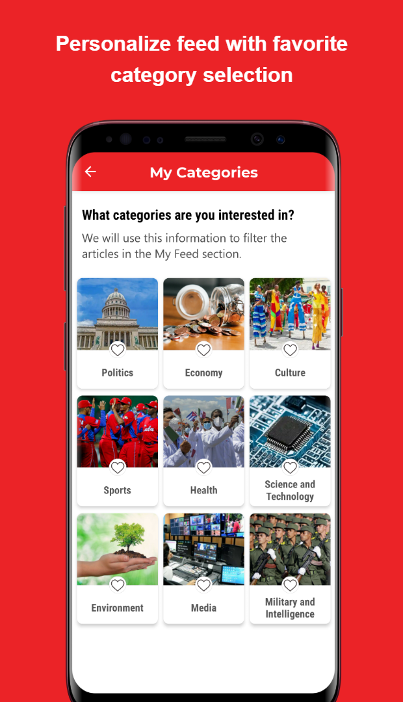

<!--suppress CssUnusedSymbol, JSUnusedLocalSymbols -->

  

     
  

☰
  

    <!-- Navigation Links will be dynamically populated -->
  

# ShareLingo - 언어교류 SNS 앱

## 📝 개요
**📌 앱 소개:** 언어 학습자들이 서로 연결되어 게시물을 공유하고 상호작용하는 SNS 앱 
**🕒 기간:** 2025.05.16 ~ 2025.05.27 (2주)  
**📱 플랫폼:** Flutter 크로스 플랫폼 앱 (Android, iOS)  
**👥 개발 인원:** 4명  
**💼 역할:** 팀 리더, CI/CD 파이프라인 구축, 인증 시스템, 프로필 관리, 피드 필터링, Google Maps 연동, 온보딩 플로우 개발  
**🛠️ 주요 사용 기술:** `Flutter` `Firebase` `Riverpod` `클린아키텍처` `Google OAuth` `Firestore` `Cloud Functions` `GitHub Actions` `Google Maps API` `VWorld API`  
**🔗 GitHub:** [zero-to-one-flutter/flutter-share-lingo](https://github.com/zero-to-one-flutter/flutter-share-lingo)

  <!--
  
  -->
  
  
  
  
  
  
  
  

## 📖 프로젝트 배경

- 전 세계 약 [15억](https://www.thoughtco.com/how-many-people-learn-english-globally-1210367) 명의 언어 학습자 중 [68%](https://www.lingomelo.com/blog-page/language-learning-statistics)가 문법에, [53%](https://www.lingomelo.com/blog-page/language-learning-statistics)가 어휘 습득에 어려움을 겪고 있으며, 특히 원어민과의 실제 대화 기회 부족으로 인한 실전 경험 부족 문제가 심각한 상황
- 소셜 미디어 형태의 언어 학습 플랫폼이 학습자들에게 자연스러운 언어 연습 환경과 문화적 교류 기회를 제공하여 전통적인 학습 방법을 보완하는 역할 수행
- 언어 학습자들이 자신의 모국어와 학습 언어 조합에 맞는 적절한 교환 파트너를 효율적으로 찾아 서로 도움을 주고받을 수 있는 매칭 시스템 필요
- 언어 조합 기반 스마트 필터링과 지역별 매칭을 통해 효과적인 언어 교환 파트너를 연결하고, 소셜 피드 형태의 자연스러운 언어 연습 환경을 제공함으로써 언어 학습자들의 실전 소통 능력 향상을 목표로 프로젝트 기획

## 🛠️ Tech Stack

## 🌟 수행 내용 및 성과

### 팀 리딩 및 CI/CD 파이프라인 구축
- **GitHub Actions 기반 CI/CD 파이프라인 구축으로 개발 효율성 70% 향상**
  - Pull Request 시점에서 자동화된 테스트 실행 및 `flutter analyze` 코드 품질 검증 시스템 도입으로 수동 검수 시간 50% 단축 및 배포 안정성 향상
  - test-apk 브랜치로의 푸시 시 자동 APK 빌드 및 GitHub Artifacts 업로드로 QA 테스트 프로세스 간소화
  - Firebase 설정 파일의 Base64 인코딩 후 `GitHub Secrets` 저장을 통한 보안 관리로 민감한 정보 보호와 CI 환경 안정성 확보
  - PR에 대한 코드 리뷰 필수 승인 프로세스 주도로 팀 전체 코드 품질 일관성 유지 및 버그 발생률 50% 감소

- **팀 협업 프로세스 최적화 및 리더십**
  - 매주 정기 회의와 스프린트 기반 작업 분배로 프로젝트 일정 관리 및 팀원 간 명확한 역할 분담
  - 기술적 의사결정과 전체 앱 아키텍처 설계를 주도하여 확장 가능하고 유지보수하기 쉬운 코드베이스 구축

### Google OAuth 인증 및 사용자 관리 시스템
- **원클릭 소셜 로그인 시스템 구현**
  - `Google Sign-In`과 `Firebase Authentication` 연동을 통한 원클릭 로그인 시스템 구축 
  - 신규 사용자와 기존 사용자를 자동으로 구분하여 적절한 온보딩 또는 메인 화면으로 라우팅하는 진입점 시스템 구현

- **종합적인 사용자 프로필 시스템**
  - 이름, 생년월일, 언어 정보, 자기소개, 취미, 위치 등 다차원적 사용자 정보 관리
  - 실시간 프로필 수정 기능

- **Google Maps Static API 활용 프로필 배경**
  - Google Maps Static API를 활용하여 사용자 위치 중심의 개인화된 지도를 프로필 배경으로 적용
  - 지도 로딩 실패 시 기본 이미지로 자동 대체되는 Fallback 구현

### 다단계 온보딩 플로우 및 위치 기반 서비스
- **직관적인 사용자 등록 과정 설계**
  - 5단계로 구성된 온보딩 프로세스를 통해 사용자가 부담 없이 필수 정보를 입력할 수 있도록 UX 최적화 
  - 각 단계별 실시간 유효성 검증(성인 인증, 모국어와 학습 언어 중복 방지 등)을 통해 데이터 품질 확보

- **정확한 위치 기반 매칭 시스템 구현**
  - GPS 좌표를 읍면동 단위로 변환하는 VWorld API 연동으로 정확한 지역 정보 제공
  - 위치 권한 거부 시나리오를 포함한 다양한 상황에 대응하는 안정적인 위치 서비스 구현
  - 위치 정보 기반 근처 사용자 필터링 기능으로 지역 커뮤니티 형성 지원

### 피드 콘텐츠 필터링
  - 피드 화면에 `전체`, `추천`(언어 매칭), `동급생`(언어 조합 일치), `근처`(동일 읍면동) 4개 탭 필터 구현

### Firebase Cloud Functions 백엔드 로직
- **자동화된 데이터 일관성 관리**
  - 사용자 프로필 변경 시 관련된 모든 게시물과 댓글의 정보를 자동으로 동기화하는 시스템 구현
  - 사용자나 게시물 삭제 시 연관된 모든 데이터를 자동으로 정리하여 데이터 무결성 보장
  - 댓글 생성/삭제 시 게시물의 통계 정보를 실시간으로 업데이트하여 정확한 피드백 제공

- **보안 중심의 데이터 접근 제어**
  - 사용자별 데이터 소유권 기반의 엄격한 권한 관리 시스템 구현
  - 좋아요와 댓글 시스템에 대한 세밀한 보안 규칙 적용으로 데이터 무결성과 사용자 프라이버시 보호

### 이용약관 및 개인정보보호
  - 앱 최초 실행 시 이용약관 및 개인정보처리방침 동의 절차 구현
  - SharedPreferences를 활용한 동의 상태 영구 저장으로 재동의 요구 방지
  - URL launcher를 통한 외부 브라우저 문서 연결로 투명한 약관 제공

### UI/UX 최적화 및 성능 개선
- **일관된 디자인 시스템 구축**
  - CachedNetworkImage를 활용한 이미지 캐싱 시스템으로 반복 로딩 시간 단축 및 데이터 사용량 절약

- **Firebase Crashlytics 연동**
  - Firebase Crashlytics를 활용한 실시간 오류 추적 시스템 구축
  - 전역 에러 핸들링을 통해 예상치 못한 앱 크래시를 방지하고 사용자 경험 개선

### 트러블슈팅 및 문제 해결
- **GitHub Actions Firebase 설정 문제 해결**
  - CI 환경에서 `firebase_options.dart` 파일 부재로 인한 빌드 실패 문제 분석
  - 3개 Firebase 설정 파일의 개별 Base64 인코딩을 통한 GitHub Secrets 안전한 전달 방식 고안 
  - 워크플로우 내 파일 디코딩 및 복원 자동화로 CI/CD 파이프라인 안정성 확보

## 🎞️ 시연 영상

 

 
