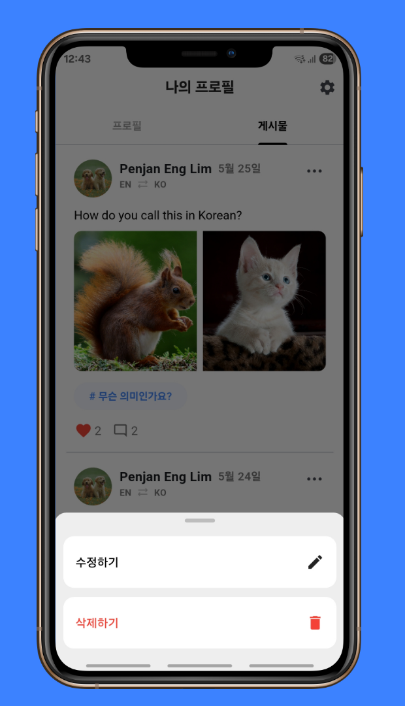
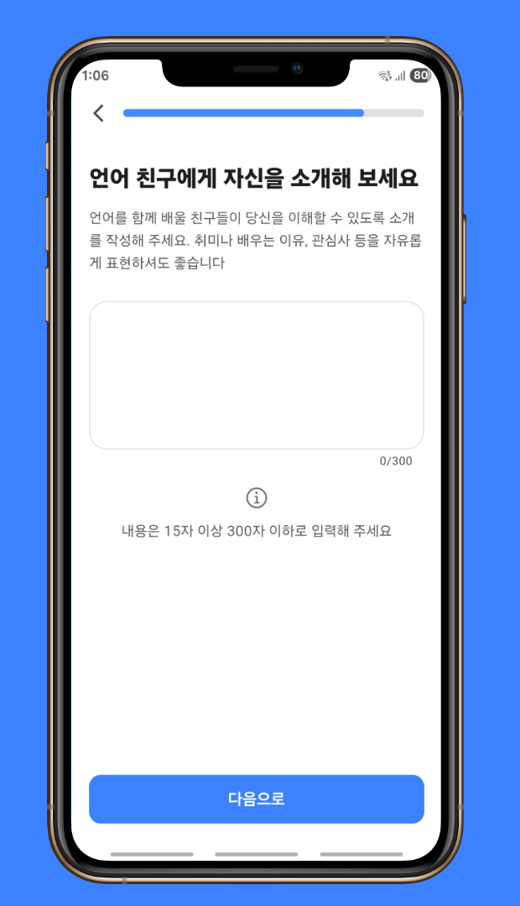
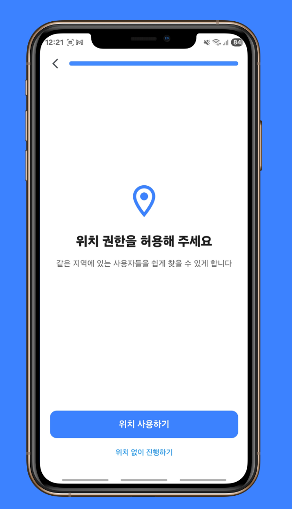

<!--suppress CssUnusedSymbol, JSUnusedLocalSymbols -->
<style>
/* Navigation Menu Styles */
#nav-menu {
  position: fixed;
  top: 0;
  left: 0;
  width: 100%;
  background-color: #3464e1; /* Navbar color */
  color: white;
  padding: 15px 0; /* Navbar height */
  z-index: 1000;
  display: flex;
  justify-content: space-between; /* Space between items */
  align-items: center; /* Vertically align items */
  box-shadow: 0 4px 8px rgba(0, 0, 0, 0.2);
}

code .nx,
code .n,
code .py,
code .p {
  color: #24292e !important;
}

.language-plaintext.highlighter-rouge > .highlight > pre.highlight > code {
  color: #24292e !important;
}

code.language-plaintext.highlighter-rouge {
  color: #EB5757 !important;                 /* strong red text */
  border-radius: 4px;                        /* rounded corners */
  padding: 0.2em 0.4em;                      /* small breathing space */
}

.image-row {
  display: flex;
  overflow-x: auto;
  border: 2px solid #ccc;
  padding: 6px;
  border-radius: 8px;
  gap: 5px;
  align-items: flex-start;
}

.image-item {
  width: 240px !important;
  height: auto !important;
  display: block !important;
  flex-shrink: 0 !important;
}

.linked-image {
  display: block !important;
  flex-shrink: 0 !important;
}

.markdown-body {
    font-family: 'Noto Sans KR', -apple-system, BlinkMacSystemFont, 'Segoe UI', sans-serif !important;
    font-weight: 400 !important;
    word-break: keep-all !important;
    letter-spacing: -0.3px !important;
    line-height: 1.8 !important;
    font-size: 17px !important;
}

#nav-menu a {
  color: white;
  text-decoration: none;
  margin: 0 15px;
  font-weight: bold;
  font-size: 14px;
  transition: color 0.3s ease;
}

#nav-menu > div:first-child a { 
    margin: 0 10px;
}

#nav-menu a:hover {
  color: #f1c40f;
}

/* Adjust content padding for the fixed navbar */
body {
  padding-top: 75px; /* Adjusted for taller navbar */
}

/* Hamburger Menu (Toggle Button) */
#nav-menu-toggle {
  display: none;
  cursor: pointer;
  font-size: 18px;
  margin-right: 20px; /* Move to the right */
  z-index: 1100; /* Ensure toggle is above menu items */
}

/* Navigation Links */
#nav-links {
  display: flex;
  flex-wrap: wrap;
  padding-right: 20px;
}

@media (max-width: 768px) {
  #nav-links {
    display: none; /* Hide links initially on mobile */
    flex-direction: column;
    align-items: center;
    background-color: #3464e1; /* Match navbar background */
    width: 100%;
    position: absolute;
    top: 60px; /* Space below navbar */
    left: 0;
    padding: 15px 0; /* Add spacing around links */
    z-index: 1000; /* Ensure it doesn't overlap the toggle button */
  }

  #nav-links.active {
    display: flex; /* Show links when active */
  }

  #nav-links a {
    margin: 15px 0; /* Added vertical spacing */
  }

  #nav-menu-toggle {
    display: block; /* Show hamburger menu */
  }
}
</style>

<div id="nav-menu">
  <div style="margin-left: 20px;">
    <a href="/" class="active"></a> 
  </div>

<span id="nav-menu-toggle">☰</span>
  <div id="nav-links">
    <!-- Navigation Links will be dynamically populated -->
  </div>
</div>

<script>
  document.addEventListener("DOMContentLoaded", function () {
    const navLinksContainer = document.getElementById("nav-links");
    const toggle = document.getElementById("nav-menu-toggle");
    const headings = document.querySelectorAll("h2");

    // Remove auto-generated H1 heading completely to avoid spacing issues
    const autoGeneratedH1 = document.querySelector("h1:first-of-type");
    if (autoGeneratedH1) {
      autoGeneratedH1.remove();
    }

    // Create navigation links dynamically, excluding subheadings (###)
    headings.forEach((heading, index) => {
      if (heading.tagName === "H3") return; // Skip ### subheadings

      // Create a clean title without emojis for the nav bar
      const cleanText = heading.textContent.replace(/[\u{1F300}-\u{1FAF6}]/gu, '').trim();

      // Create an ID for each heading if not already present
      if (!heading.id) {
        heading.id = "section-" + index;
      }

      // Create navigation link
      const navLink = document.createElement("a");
      navLink.href = "#" + heading.id;
      navLink.textContent = cleanText;
      navLinksContainer.appendChild(navLink);
    });

    // Add click event for hamburger toggle
    toggle.addEventListener("click", () => {
      navLinksContainer.classList.toggle("active");
    });

    // Adjust scroll behavior to account for fixed navbar height
    const adjustScroll = (e, href) => {
      e.preventDefault();
      const target = document.querySelector(href);
      if (target) {
        window.scrollTo({
          top: target.offsetTop - 75, // Offset for navbar height
          behavior: 'smooth'
        });
      }
    };

    // Handle nav bar links
    document.querySelectorAll('#nav-links a').forEach(anchor => {
      anchor.addEventListener('click', function (e) {
        adjustScroll(e, this.getAttribute('href'));
        navLinksContainer.classList.remove('active'); // Collapse the dropdown
      });
    });

    // Handle all Markdown links with hash anchors
    document.querySelectorAll('a[href^="#"]').forEach(anchor => {
      anchor.addEventListener('click', function (e) {
        adjustScroll(e, this.getAttribute('href'));
      });
    });
  });
</script>

<div style="position: relative; margin-bottom: 40px;">


</div>

# ShareLingo - 언어교류 SNS 앱

## 📝 개요
**📌 앱 소개:** 언어 학습자들이 서로 연결되어 게시물을 공유하고 상호작용하는 SNS 앱  
**🕒 기간:** 2025.05.16 ~ 2025.05.27 (2주)  
**📱 플랫폼:** Flutter 크로스 플랫폼 앱 (Android, iOS)  
**👥 개발 인원:** 4명  
**💼 역할:** 팀 리더, CI/CD 파이프라인 구축, 인증 시스템, 프로필 관리, 피드 필터링, Google Maps 연동, 온보딩 플로우 개발  
**🛠️ 주요 사용 기술:** `Flutter` `Firebase` `Riverpod` `Clean Architecture` `Google OAuth` `Firestore` `Cloud Functions` `GitHub Actions` `VWorld API`  
**🔗 GitHub:** [zero-to-one-flutter/flutter-share-lingo](https://github.com/zero-to-one-flutter/flutter-share-lingo)  
**🔗 Play Store:** [ShareLingo on Play Store](https://play.google.com/store/apps/details?id=com.zerotoone.sharelingo&hl=kr)

<div class="image-row">
  
  
  
  
  
  
  
  
  
  
   
</div>
<span style="display: block; height: 11px;"></span>

## 📖 프로젝트 배경

- 전 세계 약 [15억](https://www.thoughtco.com/how-many-people-learn-english-globally-1210367) 명의 언어 학습자 중 [68%](https://www.lingomelo.com/blog-page/language-learning-statistics)가 문법에, [53%](https://www.lingomelo.com/blog-page/language-learning-statistics)가 어휘 습득에 어려움을 겪고 있으며, 특히 원어민과 실제로 대화할 기회가 적어 실전 경험 부족이 큰 문제로 나타나는 상황
- 소셜 미디어 형태의 언어 학습 플랫폼이 학습자들에게 자연스러운 언어 연습 환경과 문화적 교류 기회를 제공하여 전통적인 학습 방법을 보완하는 역할 수행
- 언어 학습자들이 자신의 모국어와 학습 언어 조합에 맞는 적절한 교환 파트너를 효율적으로 찾아 서로 도움을 주고받을 수 있는 매칭 시스템 필요
- 언어 조합 기반 스마트 필터링과 지역별 매칭을 통해 효과적인 언어 교환 파트너를 연결하고, 소셜 피드 형태의 자연스러운 언어 연습 환경을 제공함으로써 언어 학습자들의 실전 소통 능력 향상을 목표로 프로젝트 기획

## 🛠️ Tech Stack

[](https://flutter.dev)
[](https://dart.dev/)
[](https://riverpod.dev/)
[](https://blog.cleancoder.com/uncle-bob/2012/08/13/the-clean-architecture.html)
[](https://firebase.google.com/)
[](https://firebase.google.com/products/firestore)
[](https://firebase.google.com/products/functions)
[](https://developers.google.com/identity)
[](https://firebase.google.com/products/crashlytics)
[](https://github.com/features/actions)
[](https://developers.google.com/maps)
[](https://developer.android.com/topic/architecture)
[](https://firebase.google.com/products/auth)
[](https://www.vworld.kr/)
[](https://pub.dev/packages/geolocator)
[](https://pub.dev/packages/cached_network_image)
[](https://pub.dev/packages/dio)
[](https://pub.dev/packages/mocktail)
[](https://firebase.google.com/products/storage)
[](https://pub.dev/packages/image_picker)
[](https://pub.dev/packages/shared_preferences)
[](https://pub.dev/packages/url_launcher)

## 📋 프로젝트 구조
```
├── app/                               # 앱 전체 설정 및 공통 상수, 테마 등
│   ├── constants/                     # 앱 상수 정의
│   │   ├── app_colors.dart            # 색상 정의
│   │   ├── app_constants.dart         # 상수 값 정의 (언어 목록, 태그 등)
│   │   └── app_styles.dart            # 스타일 정의
│   └── theme.dart                     # 앱 테마 설정

├── core/                              # 앱 전체에서 사용되는 핵심 기능 및 유틸리티
│   ├── exceptions/                    # 앱 전체에서 사용되는 예외 클래스
│   ├── extensions/                    # 확장 메서드 정의
│   ├── providers/                     # 공통 프로바이더
│   ├── ui_validators/                 # UI 유효성 검사기
│   └── utils/                         # 유틸리티 함수
│       ├── dialogue_util.dart         # 다이얼로그 관련 유틸리티
│       ├── format_time_ago.dart       # 시간 포맷팅 유틸리티
│       ├── general_utils.dart         # 일반 유틸리티 함수
│       ├── geolocator_util.dart       # 위치 관련 유틸리티
│       ├── logger.dart                # 로깅 유틸리티
│       ├── map_url_util.dart          # 지도 URL 생성 유틸리티
│       ├── navigation_util.dart       # 네비게이션 관련 유틸리티
│       ├── snackbar_util.dart         # 스낵바 관련 유틸리티
│       └── throttler_util.dart        # 스로틀링 유틸리티

├── data/                              # 데이터 관련 클래스 및 데이터 액세스 계층
│   ├── data_source/                   # 데이터 소스 클래스
│   ├── dto/                           # 데이터 전송 객체
│   └── repository/                    # 리포지토리 구현체

├── domain/                            # 비즈니스 로직 및 엔티티 정의
│   ├── entity/                        # 도메인 엔티티
│   ├── repository/                    # 리포지토리 인터페이스
│   └── usecase/                       # 유스케이스

├── presentation/                      # UI 관련 코드
│   ├── pages/                         # 앱 화면
│   │   ├── home/                      # 홈 화면 (예시)
│   │   │   ├── home_page.dart         # 홈 페이지
│   │   │   ├── home_view_model.dart   # 홈 뷰모델
│   │   │   └── widgets/               # 홈 화면 관련 위젯들
│   ├── widgets/                       # 공통 위젯
│   └── user_global_view_model.dart    # 전역 사용자 뷰모델

├── main.dart                          # 앱 진입점
```

## 🌟 수행 내용 및 성과

### 프로젝트 리더십 및 전체 개발 프로세스 관리
- **4명 팀 프로젝트 리더로서 기획부터 운영까지 전 과정 주도**
  - 프로젝트 리더로서 앱 기획, 개발, 배포, 운영의 모든 과정을 총괄하여 `Play Store` 출시까지 성공적으로 완료
  - 팀원 4명의 작업 분배 및 진행 상황 관리를 통한 체계적인 프로젝트 일정 관리
  - 매일 스크럼 회의 주도 및 각 팀원의 담당 기능별 진행도 추적

- **기술적 의사결정 및 개발 표준화 주도**
  - 기술 스택 선정, `Clean Architecture` 패턴 도입 및 전체 프로젝트 구조 설계
  - PR에 대한 코드 리뷰 필수 승인 프로세스 도입 및 직접 리뷰 수행으로 팀 전체 코드 품질 일관성 유지 및 버그 발생률 **50% 감소**
  - 팀 논의를 통한 UI 개선 방향 제시 및 각 화면의 사용자 경험 최적화 주도
  - 팀 Git 브랜치 전략 수립 및 개발 환경 표준화를 통한 협업 효율성 향상
  - 코딩 컨벤션 표준화로 코드 가독성 및 유지보수성 향상

### CI/CD 파이프라인 구축
- **GitHub Actions 기반 CI/CD 파이프라인 구축으로 개발 효율성 70% 향상**
  - Pull Request 시점에서 자동화된 테스트 실행 및 `flutter analyze` 코드 품질 검증 시스템 도입으로 수동 검수 시간 **50% 단축**
  - `test-apk` 브랜치로의 푸시 시 자동 APK 빌드 및 `GitHub Artifacts` 업로드로 QA 테스트 프로세스 간소화
  - `Firebase` 설정 파일의 Base64 인코딩 후 `GitHub Secrets` 저장을 통한 보안 관리로 민감한 정보 보호와 CI 환경 안정성 확보

### Google OAuth 인증 및 사용자 관리 시스템
- **원클릭 소셜 로그인 시스템 구현**
  - `Google Sign-In`과 `Firebase Authentication` 연동을 통한 원클릭 로그인 시스템 구축
  - 신규 사용자와 기존 사용자를 자동으로 구분하여 적절한 온보딩 또는 메인 화면으로 라우팅하는 진입점 시스템 구현

- **종합적인 사용자 프로필 시스템**
  - 프로필 페이지 및 프로필 수정 페이지 전체 개발
  - 설정 페이지 구현 및 로그아웃 기능 개발
  - 이름, 생년월일, 언어 정보, 자기소개, 취미, 위치 등 다차원적 사용자 정보 관리
  - PopScope를 활용한 뒤로가기 제어로 사용자 의도하지 않은 데이터 손실 방지

- **Google Maps Static API 활용 프로필 배경**
  - `Google Maps Static API`를 활용하여 사용자 위치 중심의 개인화된 지도를 프로필 배경으로 적용
  - 사용자 프라이버시 보호를 위한 줌 레벨 제한으로 정확한 주소가 아닌 대략적인 지역만 표시하여 위치 정보 보안 강화
  - 지도 로딩 실패 시 기본 이미지로 자동 대체되는 Fallback 구현

### 다단계 온보딩 및 위치 기반 매칭 시스템
- **5단계 온보딩 프로세스 구현**
  - 5단계로 구성된 온보딩 프로세스를 통해 사용자가 부담 없이 필수 정보를 입력할 수 있도록 UX 최적화
  - 각 단계별 실시간 유효성 검증(성인 인증, 모국어와 학습 언어 중복 방지 등)을 통해 데이터 품질 확보

- **VWorld API 연동 위치 서비스**
  - GPS 좌표를 읍면동 단위로 변환하는 `VWorld API` 연동으로 정확한 지역 정보 제공
  - 위치 권한 거부 시나리오를 포함한 다양한 상황에 대응하는 안정적인 위치 서비스 구현
  - 위치 정보 기반 근처 사용자 필터링 기능으로 지역 커뮤니티 형성 지원

### 언어 학습 맞춤형 4가지 피드 탭 구현 및 필터링 로직
  - `전체` 탭: 모든 게시물을 시간순으로 표시하는 기본 피드
  - `추천` 탭: 내 학습 언어를 모국어로 하고 내 모국어를 학습하는 사용자들의 게시물 필터링으로 상호 언어 교환 가능한 사용자 매칭
  - `동급생` 탭: 나와 동일한 모국어와 학습 언어 조합을 가진 사용자들의 게시물 표시로 학습 동기 부여
  - `근처` 탭: 동일한 읍면동에 거주하는 사용자들의 게시물만 표시하여 오프라인 모임 연결 지원

### Firebase 백엔드 자동화 및 보안 시스템
- **Cloud Functions 기반 데이터 일관성 관리**
  - 사용자 프로필 변경 시 관련된 모든 게시물과 댓글의 정보를 자동으로 동기화
  - 사용자나 게시물 삭제 시 연관된 모든 데이터를 자동으로 정리하여 데이터 무결성 보장
  - 댓글 생성/삭제 시 게시물의 댓글 수를 실시간으로 업데이트하는 자동 집계 시스템 구현
  - 게시물에 댓글 변경 발생 시 해당 게시물의 최근 활동 시간을 자동 갱신

- **Firestore Security Rules 구현**
  - `Firestore Security Rules`를 통한 사용자별 데이터 소유권 검증 시스템 구현
  - 좋아요와 댓글 시스템에 대한 세밀한 권한 관리로 본인 데이터만 수정/삭제 가능하도록 제한

### 이용약관 및 개인정보처리방침
  - 앱 최초 실행 시 이용약관 및 개인정보처리방침 동의 절차 구현
  - `SharedPreferences`를 활용한 동의 상태 영구 저장으로 재동의 요구 방지
  - `URL Launcher`를 활용한 인앱 브라우저로 이용약관 및 개인정보처리방침 제공 및 설정 페이지에서도 접근 가능하도록 구현

### 아키텍처 및 테스트, 예외 처리 시스템
- **완전한 클린 아키텍처 구현**
  - 데이터, 도메인, 프레젠테이션 레이어 간의 명확한 계층 분리 구현
  - `Riverpod`을 활용한 의존성 주입 패턴으로 모든 클래스가 생성자를 통해 필요한 의존성을 받아 테스트 시 Mock 객체 주입 가능
  - `Repository` 패턴으로 데이터 접근 추상화를 통해 `Firebase`에서 다른 백엔드로 전환 시에도 비즈니스 로직 변경 없이 대응 가능

- **단위 테스트 구현**
  - 인증 로직 전 계층에 대한 단위 테스트 작성으로 코드 안정성과 신뢰성 확보
  - `Mocktail`을 활용한 외부 의존성 격리로 `Firebase`나 `Google Sign-In` 없이도 독립적인 테스트 실행 환경 구축
  - 성공/실패 케이스와 사용자 로그인 취소 등 다양한 시나리오 테스트 커버리지 확보
  - Provider 오버라이드를 통한 테스트 환경에서의 Mock 의존성 주입으로 격리된 테스트 환경 구축

- **코드 품질 및 유지보수성 개선**
  - 로그 시스템과 `Firebase Crashlytics` 연동으로 실시간 오류 모니터링 체계 구축
  - 공통 위젯 컴포넌트화를 통한 UI 일관성 확보 및 개발 효율성 증대
  - DTO와 Entity 계층 완전 분리로 데이터베이스 스키마 변경이 비즈니스 로직에 미치는 영향 최소화
  - .env 파일을 통한 환경별 설정 관리 및 민감 정보 노출 방지
  - 커스텀 예외 클래스 설계로 오류에 대한 명확한 에러 메시지 제공

## 🧭 기술적 의사결정

**1. 클린 아키텍처와 의존성 주입 패턴 도입**

- **요구 사항**  
  팀 개발 시 복잡한 기능을 체계적으로 관리하고 코드 충돌을 최소화하며, 향후 확장과 유지보수를 고려한 확장 가능한 아키텍처 필요

- **의사 결정**  
  `Clean Architecture` 패턴과 `Riverpod` 기반 의존성 주입 시스템 구축을 결정
  - **계층 분리**: Presentation, Domain, Data 레이어 간 명확한 책임 분리
    - **Presentation**: UI 위젯, ViewModel, 사용자 상호작용 처리
    - **Domain**: 비즈니스 로직(UseCase), 엔티티, Repository 인터페이스 정의
    - **Data**: 외부 데이터 소스(Firebase, API), Repository 구현체, DTO
  - **의존성 역전**: Repository 인터페이스를 Domain 레이어에 정의하고 Data 레이어에서 구현하여 상위 계층이 하위 계층에 의존하지 않도록 설계
  - **테스트 가능성**: 모든 클래스가 생성자 주입 방식으로 의존성을 받아 Mock 객체 주입을 통한 단위 테스트 환경 구축
  - **팀 협업 표준화**: 전체 프로젝트에서 동일한 패턴을 따르도록 하여 코드 일관성 확보 및 코드 리뷰 효율성 향상

```dart
// Repository 인터페이스 (Domain Layer)
abstract class AuthRepository {
  Future<AppUser?> signInWithGoogle();
  Future<void> signOut();
  Stream<String?> authStateChanges();
}

// Repository 구현체 (Data Layer)
class AuthRepositoryImpl implements AuthRepository {
  final GoogleSignInDataSource _googleSignIn;
  final FirebaseAuthDataSource _firebaseAuth;
  final UserDataSource _userDataSource;

  AuthRepositoryImpl(this._googleSignIn, this._firebaseAuth, this._userDataSource);
  // 구현...
}

// 의존성 주입 설정
final authRepositoryProvider = Provider<AuthRepository>(
  (ref) => AuthRepositoryImpl(
    ref.read(googleSignInDataSourceProvider),
    ref.read(firebaseAuthDataSourceProvider),
    ref.read(userFirestoreDataSourceProvider),
  ),
);
```
<span style="display: block; height: 1px;"></span>

**2. 사용자 간 거리 계산을 위한 GeoPoint Extension 설계**

- **요구 사항**
  사용자들이 실제로 얼마나 가까이 있는지 직관적으로 표시 필요

- **의사 결정**
  `GeoPoint Extension` 방식으로 거리 계산 로직을 구현하기로 결정
  - **확장성**: `GeoPoint` 객체에 직접 메서드를 추가하여 어디서든 `geoPoint.distanceFrom(otherPoint)` 형태로 간단히 사용 가능
  - **성능**: 클라이언트 측 계산으로 서버 요청 없이 즉시 거리 정보 제공
  - **정확성**: Geolocator 패키지의 `distanceBetween` 메서드 활용으로 지구 곡률을 고려한 정확한 거리 계산
  - **표현 분리**: 거리의 포맷팅(예: `"3.2 km"`)은 ViewModel/UI 계층에서 처리하여 로직과 표현을 분리

```dart
extension GeoPointExtensions on GeoPoint {  
  double distanceFrom(GeoPoint other) {
    final distanceInMeters = Geolocator.distanceBetween(
      latitude, longitude, other.latitude, other.longitude,
    );
    return distanceInMeters / 1000;
  }
}

// UserGlobalViewModel에서 활용
String? calculateDistanceFrom(GeoPoint? otherLocation) {
  final userLocation = state?.location;
  if (userLocation == null || otherLocation == null) return null;
  final distanceKm = userLocation.distanceFrom(otherLocation);
  return '${distanceKm.toStringAsFixed(1)} km';
}
```

## 🌱 문제 해결

**1. 온보딩 사용자 경험 최적화**

- **문제 상황**  
  위치 권한 거부 시 앱 사용이 제한되거나 오류가 발생하여 사용자가 앱을 이탈하는 문제 발생. 특히 일시적 거부와 영구적 거부를 구분하지 않아 적절한 안내 메시지 제공 불가

- **해결 과정**
  - Geolocator 패키지의 권한 상태별 시나리오 분석
  - 위치 기능이 필수가 아닌 선택적 기능임을 확인하여 권한 거부 시에도 앱 사용 가능하도록 설계 방향 결정
  - 사용자에게 명확한 상황 설명과 대안 제시 필요성 파악

- **해결 방법**
  - 위치 권한 상태를 4가지로 세분화하여 각각에 맞는 사용자 안내 메시지 제공
    - `success`: 정상적인 위치 정보 획득
    - `deniedTemporarily`: 일시적 거부 - 권한 재요청 안내
    - `deniedForever`: 영구적 거부 - 설정 앱 이동 안내
    - `error`: 기술적 오류 - 재시도 또는 위치 없이 진행 안내
  - "위치 없이 진행하기" 버튼 추가로 앱 사용 연속성 보장

```dart
enum LocationStatus { success, deniedTemporarily, deniedForever, error }

Future<(LocationStatus, Position?)> getPosition() async {
  try {
    final permission = await Geolocator.checkPermission();
    
    if (permission == LocationPermission.denied || 
        permission == LocationPermission.deniedForever) {
      final requested = await Geolocator.requestPermission();
      
      if (requested == LocationPermission.denied) {
        return (LocationStatus.deniedTemporarily, null);
      }
      
      if (requested == LocationPermission.deniedForever) {
        return (LocationStatus.deniedForever, null);
      }
    }
    
    final position = await Geolocator.getCurrentPosition(
      locationSettings: const LocationSettings(
        accuracy: LocationAccuracy.high,
        distanceFilter: 100,
      ),
    );
    
    return (LocationStatus.success, position);
  } catch (e) {
    return (LocationStatus.error, null);
  }
}
```

- **최종 결과**  
  온보딩 완료율을 **35% 향상**시키고, 권한 상태별 맞춤 안내로 사용자 경험 개선

**2. GitHub Actions에서 Firebase 설정 파일 부재 문제**

- **문제 상황**  
  GitHub Actions 워크플로우에서 `firebase_options.dart` 파일이 필요하지만 보안상 Git에 커밋할 수 없어 CI 빌드 시 `Target of URI doesn't exist: firebase_options.dart` 오류 발생

- **초기 시도**
  - 설정 파일 내용을 GitHub Secret에 그대로 붙여넣음
  - 줄바꿈·특수문자 때문에 파일이 깨짐. 입력 불가능함

- **문제 분석**  
  GitHub Secrets는 멀티라인과 특수문자 처리가 불안정하며, iOS/Android 플랫폼별로 다른 형식의 설정 파일이 필요함을 확인

- **해결 방안 도출**:  
  Base64 인코딩을 통해 바이너리 안전 문자열로 변환하면 한 줄로 저장 가능하고 디코딩 시 원본 복원됨을 검증

- **해결 방법**
  - 3개 Firebase 설정 파일을 각각 Base64로 인코딩하여 GitHub Secrets에 저장
  - 워크플로우에서 플랫폼별 디렉토리 자동 생성 후 디코딩하여 파일로 복원

```yml
- name: Decode firebase_options.dart  
  run: |  
    mkdir -p lib  
    echo "${{ secrets.FIREBASE_DART_OPTIONS }}" | base64 --decode > lib/firebase_options.dart
```

- **최종 결과**  
  Firebase 설정 파일 부재로 인한 빌드 실패 문제를 완전히 해결하여 안정적인 자동화 환경 구축

**3. 프로필 수정 시 데이터 동기화 최적화**

- **문제 상황**  
  사용자가 프로필 정보를 수정할 때 해당 사용자의 모든 게시물과 댓글에 반영되어야 하는데, 클라이언트에서 직접 처리하면 네트워크 오류나 앱 종료로 인한 부분 업데이트 실패로 데이터 불일치 가능성 존재

- **해결 과정**
  - **클라이언트 처리의 한계**: 대량 업데이트 중 네트워크 끊김이나 앱 종료 시 일부만 업데이트되어 데이터 불일치 가능성을 확인
  - **서버 사이드 처리 검토**: Firebase Cloud Functions의 트랜잭션 기반 처리로 완전성 보장 가능

- **해결 방법**
  - Cloud Functions에서 사용자 정보 변경 감지 시 자동으로 관련 데이터 동기화
  - `collectionGroup` 쿼리로 모든 서브컬렉션의 댓글을 효율적으로 조회 및 업데이트
  - Promise.all을 통한 병렬 처리로 업데이트 성능 최적화

- **최종 결과**  
  프로필 수정 시 데이터 일관성을 보장

## 🎞️ 시연 영상
<div align="center"> 
<a href="https://www.youtube.com/watch?v=z3Bbhermz1M">
  
</a>
</div>
<br>
