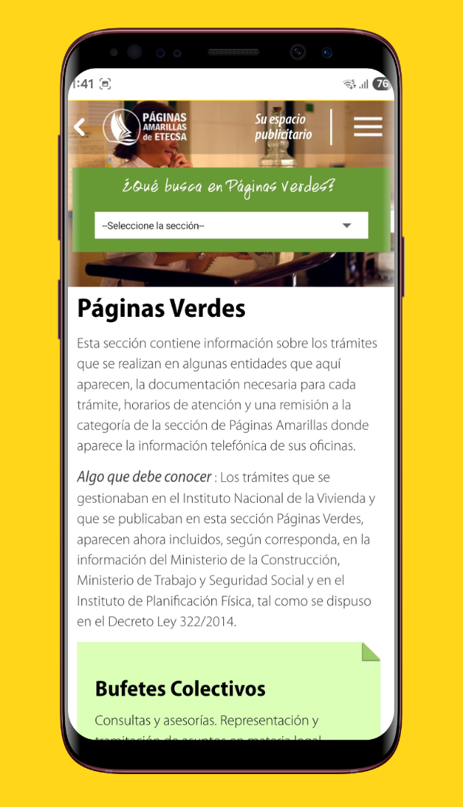
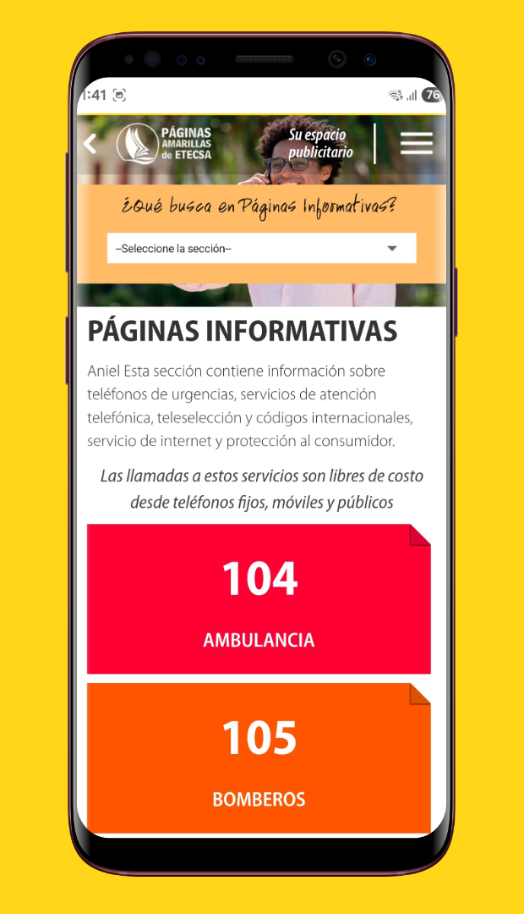
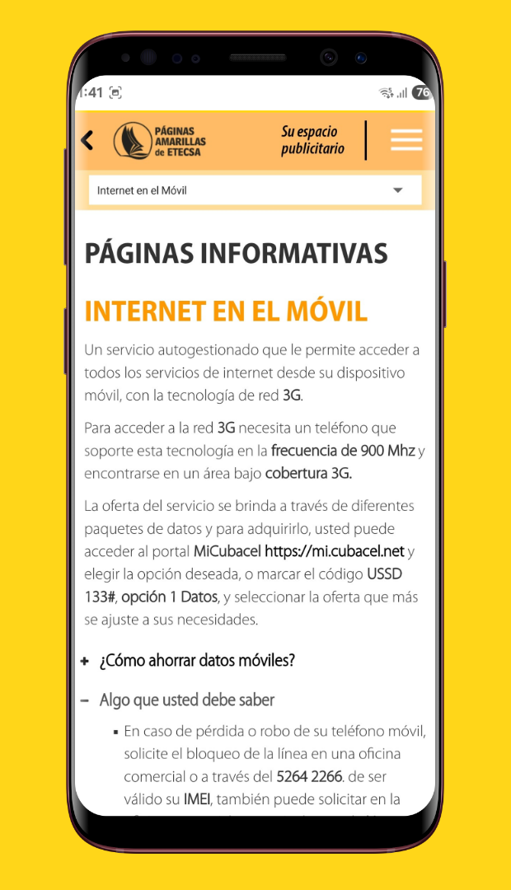
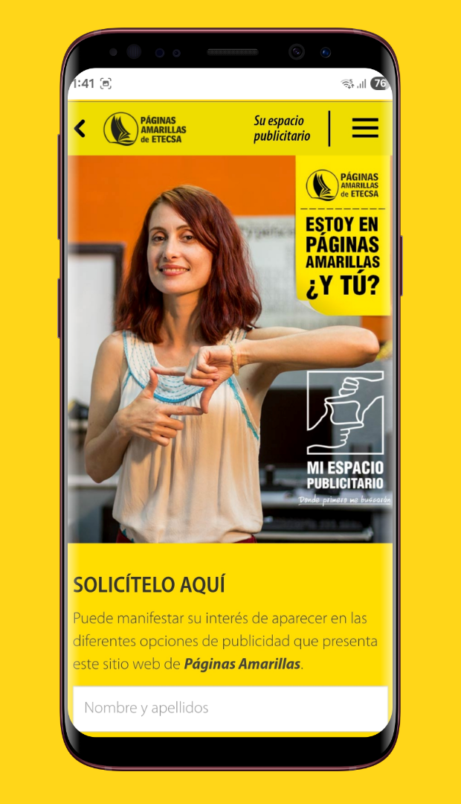

<!--suppress CssUnusedSymbol, JSUnusedLocalSymbols -->

  

     
  

☰
  

    <!-- Navigation Links will be dynamically populated -->
  

# Yellow Pages 안드로이드 앱

## 📝 개요
**📌 앱 소개:** 전화번호부 검색과 통신 서비스를 제공하는 쿠바 국영 통신사의 최초의 모바일 디렉터리 앱  
**🕒 기간:** 2019.04 ~ 2020.05  
**📱 플랫폼:** Android 네이티브 앱  
**🏢 회사명:** ETECSA (쿠바 국영 통신사)  
**👥 개발 인원:** 2명 (메인 앱 개발 1명, AR 모듈 1명)  
**💼 역할:** 안드로이드 앱 주개발자 (AR 모듈 제외)  
**🛠️ 사용 기술:** `Android` `Java` `SQLite` `VTM Maps` `WebView` `JavaScript` `SharedPreferences` `JUnit` `Apache HTTP Client`  
**🔗 GitHub:** [daehan-lim/cuban-yellow-pages](https://github.com/daehan-lim/cuban-yellow-pages)

  
  
  
  
  
  

## 📖 프로젝트 배경

쿠바에서는 인터넷 데이터 요금이 매우 비싸고 네트워크 연결이 불안정한 환경으로 인해 기존 웹사이트의 모바일 접근성이 크게 제한되었습니다. 웹사이트는 항상 온라인 연결이 필요하여 오프라인 정보 조회가 불가능했고, 사업체 위치 시각화나 직접 통화 연결 등 모바일 디바이스의 고유 기능들을 활용하지 못하는 한계가 있었습니다. 특히 정부 업무 안내와 통신 서비스 정보에 대한 오프라인 접근이 어려워 국민들이 불편을 겪고 있었습니다. 이에 ETECSA에서는 공식 데이터를 기반으로 하면서도 오프라인 기능과 모바일 최적화를 통해 데이터 사용량을 최소화하는 모바일 전화번호부 솔루션의 필요성을 인식하게 되었습니다.

## 🛠️ Tech Stack

## 🌟 주요업무
- 엔터프라이즈급 API를 활용한 실시간 전화번호부 검색 시스템 구현
- 내장 지도 파일 기반 벡터 매핑 시스템으로 오프라인 위치 정보 제공
- 정부 업무 안내와 전화 서비스 정보의 오프라인 접근 및 자동 백그라운드 동기화 구현
- 동적 필터와 효율적인 페이징 처리가 적용된 반응형 검색 인터페이스 구축
- Unit, UI, 호환성 테스트를 통해 안정성과 사용자 경험 최적화

## 🚀 주요성과
- 통신사 최초의 모바일 전화번호부 앱 개발로 전국 컴퓨터공학 경진대회 수상
- 오프라인 벡터 매핑 시스템으로 데이터 사용량 85% 절감
- 불안정한 네트워크 환경으로 인한 낮은 동기화 성공률(65%)을 청크 기반 전송 시스템 구축으로 98%까지 향상

## 🌱 문제 해결

**네트워크 불안정 환경에서의 데이터 동기화**

- **문제 상황**
    - 베타 테스트 중 서버와의 데이터 동기화 성공률이 65%에 그침
    - 동기화 중단 시 처음부터 다시 시작해야 하는 상황이 반복되어 테스터들의 불만 급증
    - 높은 데이터 비용으로 인해 사용자들이 동기화 자체를 꺼리게 되는 상황 발생
- **원인 분석**
    - **네트워크 로그 분석**: 대용량 데이터를 한 번에 전송하려는 시도가 불안정한 네트워크 환경에서 실패의 주요 원인임을 발견
    - **사용자 피드백 수집**: 데이터 전송 실패 시 진행 상황이 초기화되는 것이 가장 큰 불만 사항으로 확인
- **해결 과정**
    - **청크 기반 데이터 전송**: 대용량 데이터를 500KB 단위로 분할하여 전송
    - **진행 상황 보존**: SQLite를 활용해 각 청크의 전송 상태를 저장하여 실패 시에도 진행 상황 유지
    - **자동 재시도 메커니즘**: `WorkManager`를 활용한 네트워크 상태 기반 자동 재시도
    - **실패 처리**: 네트워크 실패 시 즉시 로컬 캐시로 대체하여 사용자 경험 보장
- **최종 결과**  
  동기화 성공률을 98%로 향상시키고, 데이터 소비량 절감과 오프라인 사용 지원을 통해 사용자 만족도를 크게 개선

   