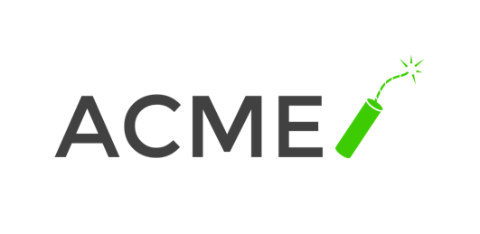
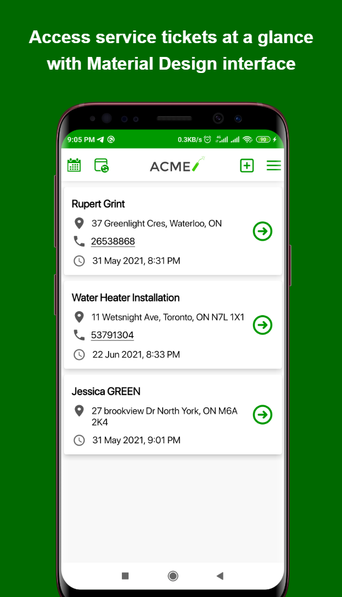
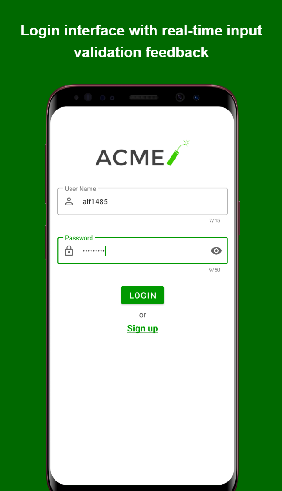

<!--suppress CssUnusedSymbol, JSUnusedLocalSymbols -->
<style>
/* Navigation Menu Styles */
#nav-menu {
  position: fixed;
  top: 0;
  left: 0;
  width: 100%;
  background: linear-gradient(135deg, #3464e1 0%, #764ba2 100%); /* Navbar color */
  color: white;
  padding: 15px 0; /* Navbar height */
  z-index: 1000;
  display: flex;
  justify-content: space-between; /* Space between items */
  align-items: center; /* Vertically align items */
  box-shadow: 0 4px 8px rgba(0, 0, 0, 0.2);
}

h1, h2 {
  color: #6951af !important;
}

code .nx,
code .n,
code .py,
code .p {
  color: #24292e !important;
}

.language-plaintext.highlighter-rouge > .highlight > pre.highlight > code {
  color: #24292e !important;
}

code.language-plaintext.highlighter-rouge {
  color: #EB5757 !important;                 /* strong red text */
  border-radius: 4px;                        /* rounded corners */
  padding: 0.2em 0.4em;                      /* small breathing space */
}

.image-row {
  display: flex;
  overflow-x: auto;
  border: 2px solid #ccc;
  padding: 6px;
  border-radius: 8px;
  gap: 5px;
  align-items: flex-start;
}

.image-item {
  width: 240px !important;
  height: auto !important;
  display: block !important;
  flex-shrink: 0 !important;
}

.linked-image {
  display: block !important;
  flex-shrink: 0 !important;
}

.markdown-body {
    font-family: -apple-system, BlinkMacSystemFont, 'Segoe UI', 'Roboto', 'Helvetica Neue', Arial, sans-serif !important;
    font-weight: 400 !important;
    word-break: normal !important;
    overflow-wrap: break-word !important;
    letter-spacing: 0.02em !important;
    line-height: 1.6 !important;
    font-size: 16px !important;
}

#nav-menu a {
  color: white;
  text-decoration: none;
  margin: 0 14px;
  font-weight: bold;
  font-size: 14px;
  transition: color 0.3s ease;
}

#nav-menu > div:first-child a {
  font-size: 13px;
  margin: 0 7px;
  padding: 5px 11px;
  border-radius: 20px;
  background: rgba(255, 255, 255, 0.1);
  transition: all 0.3s ease;
  font-weight: 700; /* Increase from bold to 700 */
  -webkit-font-smoothing: antialiased; /* Better text rendering */
  -moz-osx-font-smoothing: grayscale;
}

#nav-menu > div:first-child a.active {
  background: linear-gradient(135deg, #f093fb 0%, #f5576c 100%);
  color: white;
}

#nav-menu > div:first-child a:hover {
  background: rgba(255, 255, 255, 0.25); /* Brighter white overlay */
  color: white;
  transform: translateY(-1px);
}

/* Home button styles */
#home-button {
  color: white;
  text-decoration: none;
  font-weight: 700;
  font-size: 13px;
  padding: 5px 11px;
  border-radius: 50%; /* Changed from 20px to make it circular */
  background: rgba(255, 255, 255, 0.1);
  transition: all 0.3s ease;
  -webkit-font-smoothing: antialiased;
  -moz-osx-font-smoothing: grayscale;
  margin-right: 10px;
  display: inline-flex;
  align-items: center;
  justify-content: center;
}

#home-button svg {
  width: 16px;
  height: 22px;
  fill: currentColor;
}

/* Adjust content padding for the fixed navbar */
body {
  padding-top: 50px; /* Adjusted for taller navbar */
}

/* Hamburger Menu (Toggle Button) */
#nav-menu-toggle {
  display: none;
  cursor: pointer;
  font-size: 18px;
  margin-right: 20px; /* Move to the right */
  z-index: 1100; /* Ensure toggle is above menu items */
}

/* Navigation Links */
#nav-links {
  display: flex;
  flex-wrap: wrap;
  padding-right: 20px;
}

@media (max-width: 768px) {
  #nav-links {
    display: none; /* Hide links initially on mobile */
    flex-direction: column;
    align-items: center;
    background: linear-gradient(135deg, #3464e1 0%, #764ba2 100%); /* Match navbar background */
    width: 100%;
    position: absolute;
    top: 60px; /* Space below navbar */
    left: 0;
    padding: 15px 0; /* Add spacing around links */
    z-index: 1000; /* Ensure it doesn't overlap the toggle button */
  }

  #nav-links.active {
    display: flex; /* Show links when active */
  }

  #nav-links a {
    margin: 15px 0; /* Added vertical spacing */
  }

  #nav-menu-toggle {
    display: block; /* Show hamburger menu */
  }
}
</style>

<div id="nav-menu">
  <!-- Home button first -->
  <div style="margin-left: 20px; display: flex; align-items: center;">
    <a href="/" id="home-button">
      <svg viewBox="0 0 24 24" xmlns="http://www.w3.org/2000/svg">
        <path d="M12 3l9 7.5v10.5h-6v-6h-6v6H3V10.5L12 3z"/>
      </svg>
    </a>
    <a href="/projects/acme">EN</a>
    <a href="/kr/projects/acme">KR</a>
  </div>

<span id="nav-menu-toggle">☰</span>
  <div id="nav-links">
    <!-- Navigation Links will be dynamically populated -->
  </div>
</div>

<script>
  document.addEventListener("DOMContentLoaded", function () {
    const navLinksContainer = document.getElementById("nav-links");
    const toggle = document.getElementById("nav-menu-toggle");
    const headings = document.querySelectorAll("h2");

    // Remove auto-generated H1 heading completely to avoid spacing issues
    const autoGeneratedH1 = document.querySelector("h1:first-of-type");
    if (autoGeneratedH1) {
      autoGeneratedH1.remove();
    }

    // Create navigation links dynamically, excluding subheadings (###)
    headings.forEach((heading, index) => {
      if (heading.tagName === "H3") return; // Skip ### subheadings

      // Create a clean title without emojis for the nav bar
      const cleanText = heading.textContent.replace(/[\u{1F300}-\u{1FAF6}]/gu, '').trim();

      // Create an ID for each heading if not already present
      if (!heading.id) {
        heading.id = "section-" + index;
      }

      // Create navigation link
      const navLink = document.createElement("a");
      navLink.href = "#" + heading.id;
      navLink.textContent = cleanText;
      navLinksContainer.appendChild(navLink);
    });

    // Add click event for hamburger toggle
    toggle.addEventListener("click", () => {
      navLinksContainer.classList.toggle("active");
    });

    // Adjust scroll behavior to account for fixed navbar height
    const adjustScroll = (e, href) => {
      e.preventDefault();
      const target = document.querySelector(href);
      if (target) {
        window.scrollTo({
          top: target.offsetTop - 75, // Offset for navbar height
          behavior: 'smooth'
        });
      }
    };

    // Handle nav bar links
    document.querySelectorAll('#nav-links a').forEach(anchor => {
      anchor.addEventListener('click', function (e) {
        adjustScroll(e, this.getAttribute('href'));
        navLinksContainer.classList.remove('active'); // Collapse the dropdown
      });
    });

    // Handle all markdown links with hash anchors
    document.querySelectorAll('a[href^="#"]').forEach(anchor => {
      anchor.addEventListener('click', function (e) {
        adjustScroll(e, this.getAttribute('href'));
      });
    });

    // Fix EN/KR active states based on current page
    function updateLanguageButtons() {
      const currentPath = window.location.pathname;
      const enButton = document.querySelector('a[href="/projects/acme"]');
      const krButton = document.querySelector('a[href="/kr/projects/acme"]');
      
      // Remove active class from both buttons first
      if (enButton) enButton.classList.remove('active');
      if (krButton) krButton.classList.remove('active');
      
      // Check for KR pages first (more specific)
      if (currentPath.includes('/kr')) {
        if (krButton) krButton.classList.add('active');
      } 
      // Then check for EN pages (root, index, etc.)
      else {
        if (enButton) enButton.classList.add('active');
      }
    }

    function updateHomeButton() {
      const currentPath = window.location.pathname;
      const homeButton = document.getElementById('home-button');
      
      if (homeButton) {
        if (currentPath.includes('/kr')) {
          homeButton.href = '/kr';
        } else {
          homeButton.href = '/';
        }
      }
    }

    // Update buttons on page load
    updateLanguageButtons();
    updateHomeButton();
    
    // Update buttons when navigation occurs (for SPAs)
    window.addEventListener('popstate', function() {
      updateLanguageButtons();
      updateHomeButton();
    });
  });
</script>

<div style="position: relative; margin-bottom: 40px;">


<div style="position:absolute;left:40px;bottom:-10px;width:80px;height:80px;background:white;border-radius:20px;display:flex;align-items:center;justify-content:center;box-shadow:0 2px 6px rgba(0,0,0,0.15);">

</div>

</div>

# ACME - Field service management app

## 📝 Overview
**📌 App Introduction:** Android field management app integrating custom calendar functionality, offline capabilities, and navigation features  
**🕒 Duration:** May 2021 ~ June 2021 (2 months)  
**📱 Platform:** Native Android app  
**👥 Team Size:** 1 developer  
**💼 Role:** Full Android app development  
**🛠️ Key Technologies:** `Android` `Kotlin` `MVVM` `Jetpack` `Room` `Calendar Provider API` `Data Binding` `WebView`  
**🔗 GitHub:** [daehan-lim/acme](https://github.com/daehan-lim/acme)

<div style="display: flex; overflow-x: auto; border: 2px solid #ccc; padding: 6px; border-radius: 8px;">
  
  
  
   
  
  
  
  
</div>
<span style="display: block; height: 11px;"></span>

## 🛠️ Tech Stack

[](https://kotlinlang.org)
[](https://developer.android.com/topic/architecture)
[](https://developer.android.com/training/data-storage/room)
[](https://developer.android.com/jetpack)
[](https://kotlinlang.org/docs/coroutines-overview.html)
[](https://developer.android.com/guide/navigation)
[](https://github.com/afollestad/material-dialogs)
[](https://github.com/kizitonwose/CalendarView)
[](https://developer.android.com/topic/libraries/view-binding)
[](https://developer.android.com/topic/libraries/data-binding)
[](https://maps.google.com)
[](https://airbnb.io/lottie/#/)
[](https://developer.android.com/jetpack/androidx/releases/cardview)
[](https://developer.android.com/topic/libraries/architecture/livedata)
[](https://material.io/design)

## 📋 Project Structure

```
├── database/                         # Room database layer
│   ├── AcmeDatabase.kt               # Main database configuration
│   ├── dao/                          # Data access objects
│   │   ├── TicketDao.kt              # Ticket CRUD operations
│   │   └── UserDao.kt                # User authentication operations
│   └── model/                        # Database entities
│       ├── Ticket.kt                 # Service ticket data model
│       └── User.kt                   # User account data model
├── repository/                       # Repository pattern implementation
│   ├── TicketRepository.kt           # Ticket data abstraction layer
│   └── UserRepository.kt             # User data abstraction layer
├── ui/                               # MVVM architecture-based UI layer
│   ├── DbAccessViewModel.kt          # Common ViewModel base class
│   ├── login/                        # Authentication features
│   │   ├── LoginActivity.kt          # Login screen
│   │   ├── SignUpActivity.kt         # Registration screen
│   │   ├── LoginSignupViewModel.kt   # Authentication business logic
│   │   └── LoginSignUpFormState.kt   # Form validation state management
│   ├── dashboard/                    # Main dashboard
│   │   ├── MainActivity.kt           # Ticket list and main features
│   │   ├── MainViewModel.kt          # Dashboard data management
│   │   └── TicketsAdapter.kt         # RecyclerView adapter
│   ├── newticket/                    # Ticket creation feature
│   │   ├── NewTicketActivity.kt      # New ticket registration screen
│   │   ├── NewTicketViewModel.kt     # Ticket creation logic
│   │   └── ManageTicketFormState.kt  # Form validation and state management
│   ├── editticket/                   # Ticket modification feature
│   │   ├── EditTicketActivity.kt     # Ticket editing screen
│   │   └── EditTicketViewModel.kt    # Ticket modification logic
│   ├── workticket/                   # Ticket detail management
│   │   ├── WorkTicketActivity.kt     # Ticket details and work screen
│   │   └── OverviewFragment.kt       # Ticket overview fragment
│   ├── calendar/                     # Schedule management feature
│   │   ├── CalendarActivity.kt       # Calendar view screen
│   │   ├── CalendarViewModel.kt      # Schedule data management
│   │   ├── EventsAdapter.kt          # Event list adapter
│   │   └── Extensions.kt             # Calendar extension functions
│   └── directions/                   # Maps and navigation
│       └── GetDirectionsActivity.kt  # WebView-based Google Maps integration
├── model/                            # Business models
│   └── DueTicket.kt                  # Due ticket model
└── util/                             # Utilities and common features
    ├── BindingUtils.kt               # Data binding adapters
    ├── CalendarUtil.kt               # Device calendar integration
    └── Util.kt                       # Common utility functions
```

## 🌟 Implementation Details
- Implemented offline service ticket management app with responsive design
- Developed interactive calendar with custom event visualization and Android Calendar Provider API integration for syncing events to device calendar
- Built ticket location address search and navigation functionality through embedded Google Maps integration via WebViews
- Created user registration and authentication flows with input validation and error feedback

## 🚀 Results and Impact
- 20% reduction in ticket location search and navigation time
- Improved task scheduling efficiency through calendar integration

<br><br><br>