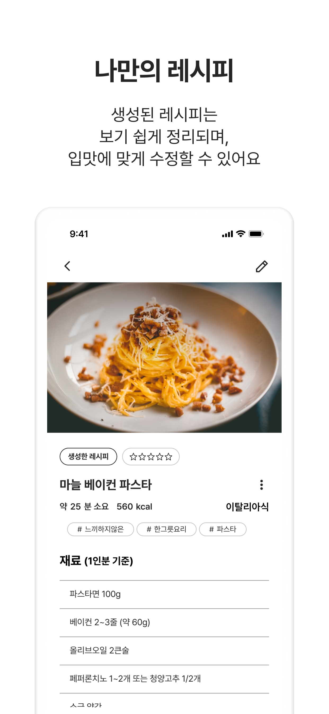
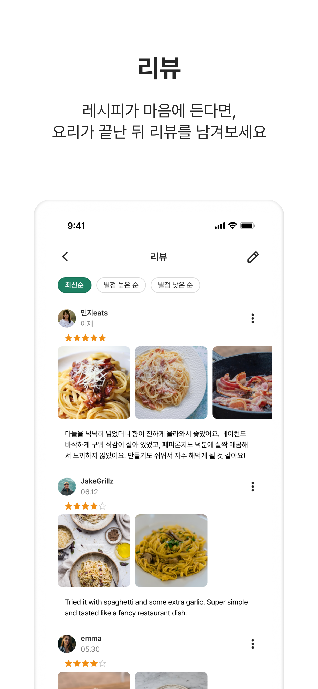

<!--suppress CssUnusedSymbol, JSUnusedLocalSymbols -->
<style>
/* Navigation Menu Styles */
#nav-menu {
  position: fixed;
  top: 0;
  left: 0;
  width: 100%;
  background: linear-gradient(135deg, #3464e1 0%, #764ba2 100%); /* Navbar color */
  color: white;
  padding: 15px 0; /* Navbar height */
  z-index: 1000;
  display: flex;
  justify-content: space-between; /* Space between items */
  align-items: center; /* Vertically align items */
  box-shadow: 0 4px 8px rgba(0, 0, 0, 0.2);
}

h1, h2 {
  color: #6951af !important;
}

code .nx,
code .n,
code .py,
code .p {
  color: #24292e !important;
}

.language-plaintext.highlighter-rouge > .highlight > pre.highlight > code {
  color: #24292e !important;
}

code.language-plaintext.highlighter-rouge {
  color: #EB5757 !important;                 /* strong red text */
  border-radius: 4px;                        /* rounded corners */
  padding: 0.2em 0.4em;                      /* small breathing space */
}

.image-row {
  display: flex;
  overflow-x: auto;
  padding: 10px !important;
  gap: 20px !important;
  align-items: flex-start !important;
  border: none !important;
  border-radius: 0 !important;
}

.image-item {
  width: 240px !important;
  height: auto !important;
  display: block !important;
  flex-shrink: 0 !important;
  border-radius: 20px !important; /* force rounded corners */
  border: 1px solid #e0e0e0 !important; /* force light border */
  box-shadow: 0 2px 6px rgba(0,0,0,0.05) !important; /* force shadow */
}

.linked-image {
  display: block !important;
  flex-shrink: 0 !important;
}

.markdown-body {
    font-family: -apple-system, BlinkMacSystemFont, 'Segoe UI', 'Roboto', 'Helvetica Neue', Arial, sans-serif !important;
    font-weight: 400 !important;
    word-break: normal !important;
    overflow-wrap: break-word !important;
    letter-spacing: 0.02em !important;
    line-height: 1.6 !important;
    font-size: 16px !important;
}

#nav-menu a {
  color: white;
  text-decoration: none;
  margin: 0 14px;
  font-weight: bold;
  font-size: 14px;
  transition: color 0.3s ease;
}

#nav-menu > div:first-child a {
  font-size: 13px;
  margin: 0 7px;
  padding: 5px 11px;
  border-radius: 20px;
  background: rgba(255, 255, 255, 0.1);
  transition: all 0.3s ease;
  font-weight: 700; 
  -webkit-font-smoothing: antialiased; /* Better text rendering */
  -moz-osx-font-smoothing: grayscale;
}

#nav-menu > div:first-child a.active {
  background: linear-gradient(135deg, #f093fb 0%, #f5576c 100%);
  color: white;
}

#nav-menu > div:first-child a:hover {
  background: rgba(255, 255, 255, 0.25); /* Brighter white overlay */
  color: white;
  transform: translateY(-1px);
}

/* Home button styles */
#home-button {
  color: white;
  text-decoration: none;
  font-weight: 700;
  font-size: 13px;
  padding: 5px 11px;
  border-radius: 50%; /* Changed from 20px to make it circular */
  background: rgba(255, 255, 255, 0.1);
  transition: all 0.3s ease;
  -webkit-font-smoothing: antialiased;
  -moz-osx-font-smoothing: grayscale;
  margin-right: 10px;
  display: inline-flex;
  align-items: center;
  justify-content: center;
}

#home-button svg {
  width: 16px;
  height: 22px;
  fill: currentColor;
}

/* Adjust content padding for the fixed navbar */
body {
  padding-top: 50px; 
}

/* Hamburger Menu (Toggle Button) */
#nav-menu-toggle {
  display: none;
  cursor: pointer;
  font-size: 18px;
  margin-right: 20px; /* Move to the right */
  z-index: 1100; /* Ensure toggle is above menu items */
}

/* Navigation Links */
#nav-links {
  display: flex;
  flex-wrap: wrap;
  padding-right: 20px;
}

@media (max-width: 768px) {
  #nav-links {
    display: none; /* Hide links initially on mobile */
    flex-direction: column;
    align-items: center;
    background: linear-gradient(135deg, #3464e1 0%, #764ba2 100%); /* Match navbar background */
    width: 100%;
    position: absolute;
    top: 60px; /* Space below navbar */
    left: 0;
    padding: 15px 0; /* Add spacing around links */
    z-index: 1000; /* Ensure it doesn't overlap the toggle button */
  }

  #nav-links.active {
    display: flex; /* Show links when active */
  }

  #nav-links a {
    margin: 15px 0; /* Vertical spacing */
  }

  #nav-menu-toggle {
    display: block; /* Show hamburger menu */
  }
}
</style>

<div id="nav-menu">
  <!-- Home button first -->
  <div style="margin-left: 20px; display: flex; align-items: center;">
    <a href="/" id="home-button">
      <svg viewBox="0 0 24 24" xmlns="http://www.w3.org/2000/svg">
        <path d="M12 3l9 7.5v10.5h-6v-6h-6v6H3V10.5L12 3z"/>
      </svg>
    </a>
    <a href="/projects/cooki">EN</a>
    <a href="/kr/projects/cooki">KR</a>
  </div>

<span id="nav-menu-toggle">☰</span>
  <div id="nav-links">
    <!-- Navigation Links will be dynamically populated -->
  </div>
</div>

<script>
  document.addEventListener("DOMContentLoaded", function () {
    const navLinksContainer = document.getElementById("nav-links");
    const toggle = document.getElementById("nav-menu-toggle");
    const headings = document.querySelectorAll("h2");

    // Remove auto-generated H1 heading completely to avoid spacing issues
    const autoGeneratedH1 = document.querySelector("h1:first-of-type");
    if (autoGeneratedH1) {
      autoGeneratedH1.remove();
    }

    // Create navigation links dynamically, excluding subheadings (###)
    headings.forEach((heading, index) => {
      if (heading.tagName === "H3") return; // Skip ### subheadings

      // Create a clean title without emojis for the nav bar
      const cleanText = heading.textContent.replace(/[\u{1F300}-\u{1FAF6}]/gu, '').trim();

      // Create an ID for each heading if not already present
      if (!heading.id) {
        heading.id = "section-" + index;
      }

      // Create navigation link
      const navLink = document.createElement("a");
      navLink.href = "#" + heading.id;
      navLink.textContent = cleanText;
      navLinksContainer.appendChild(navLink);
    });

    // Add click event for hamburger toggle
    toggle.addEventListener("click", () => {
      navLinksContainer.classList.toggle("active");
    });

    // Adjust scroll behavior to account for fixed navbar height
    const adjustScroll = (e, href) => {
      e.preventDefault();
      const target = document.querySelector(href);
      if (target) {
        window.scrollTo({
          top: target.offsetTop - 75, // Offset for navbar height
          behavior: 'smooth'
        });
      }
    };

    // Handle nav bar links
    document.querySelectorAll('#nav-links a').forEach(anchor => {
      anchor.addEventListener('click', function (e) {
        adjustScroll(e, this.getAttribute('href'));
        navLinksContainer.classList.remove('active'); // Collapse the dropdown
      });
    });

    // Handle all markdown links with hash anchors
    document.querySelectorAll('a[href^="#"]').forEach(anchor => {
      anchor.addEventListener('click', function (e) {
        adjustScroll(e, this.getAttribute('href'));
      });
    });

    // Fix EN/KR active states based on current page
    function updateLanguageButtons() {
      const currentPath = window.location.pathname;
      const enButton = document.querySelector('a[href="/projects/cooki"]');
      const krButton = document.querySelector('a[href="/kr/projects/cooki"]');
      
      // Remove active class from both buttons first
      if (enButton) enButton.classList.remove('active');
      if (krButton) krButton.classList.remove('active');
      
      // Check for KR pages first (more specific)
      if (currentPath.includes('/kr')) {
        if (krButton) krButton.classList.add('active');
      } 
      // Then check for EN pages (root, index, etc.)
      else {
        if (enButton) enButton.classList.add('active');
      }
    }

    function updateHomeButton() {
      const currentPath = window.location.pathname;
      const homeButton = document.getElementById('home-button');
      
      if (homeButton) {
        if (currentPath.includes('/kr')) {
          homeButton.href = '/kr';
        } else {
          homeButton.href = '/';
        }
      }
    }

    // Update buttons on page load
    updateLanguageButtons();
    updateHomeButton();
    
    // Update buttons when navigation occurs (for SPAs)
    window.addEventListener('popstate', function() {
      updateLanguageButtons();
      updateHomeButton();
    });
  });
</script>

<div style="position: relative; margin-bottom: 40px;">


</div>

# Cooki - AI Recipe Community App

## 📝 Overview
**📌 App Introduction:** Personalized recipe generation and sharing platform powered by generative AI  
**🕒 Duration:** June 1, 2025 ~ July 4, 2025 (1 month)  
**📱 Platform:** Flutter cross-platform app (iOS, Android)  
**👥 Team Size:** 3 developers  
**💼 Role:** AI recipe generation, recipe editing, review features, reporting system, internationalization, etc.  
**🛠️ Key Technologies:** `Flutter` `Dart` `Firebase` `Riverpod` `MVVM` `Gemini API` `Firestore` `Dio` `Cloud Functions` `Google Cloud Translation API`  
**🔗 GitHub:** [flutter-fantastic-four/cooki-app](https://github.com/flutter-fantastic-four/cooki-app)  
**🔗 App Store:** [apps.apple.com/kr/app/cooki/id6747327839](https://apps.apple.com/kr/app/cooki/id6747327839)

<div class="image-row">
  
  
  
  
  
  
  
</div>
<span style="display: block; height: 11px;"></span>

## 📖 Project Background

- Research shows that [27%](https://shop.linzheritageangus.com/clueless-cooks-report) of cooking beginners fear cooking from scratch, and [38%](https://yougov.co.uk/society/articles/43386-how-confident-are-britons-kitchen) lack confidence cooking without recipes, demonstrating the need for accessible, personalized cooking guidance.
- Users struggle to find suitable recipes for quick meals using leftover refrigerator ingredients. Existing recipe apps only provide simple search-based functionality and cannot accommodate individual situations and constraints.
- This led to identifying the need for an integrated platform that leverages generative AI to create real-time personalized recipes based on users' available ingredients or food photos, while enabling community-based experience sharing.
- The project aims to lower cooking barriers and provide cooking solutions optimized for individual circumstances, creating an environment where anyone can easily start and enjoy cooking.

## 🛠️ Tech Stack

[](https://flutter.dev)
[](https://dart.dev/)
[](https://riverpod.dev/)
[](https://developer.android.com/topic/architecture)
[](https://firebase.google.com/)
[](https://firebase.google.com/products/firestore)
[](https://pub.dev/packages/dio)
[](https://firebase.google.com/products/functions)
[](https://ai.google.dev/)
[](https://firebase.google.com/products/crashlytics)
[](https://firebase.google.com/products/storage)
[](https://cloud.google.com/translate)
[](https://pub.dev/packages/cached_network_image)
[](https://pub.dev/packages/image_picker)
[](https://pub.dev/packages/flutter_image_compress)
[](https://pub.dev/packages/share_plus)
[](https://pub.dev/packages/shared_preferences)
[](https://flutter.dev/docs/development/accessibility-and-localization/internationalization)
[](https://pub.dev/packages/speech_to_text)
[](https://pub.dev/packages/easy_image_viewer)

## 🌟 Key Contributions

### AI Recipe Generation and Management System
- **Built `Gemini AI`-based multimodal recipe generation system**
  - Integrated `Gemini 2.0-flash` model for multimodal recipe generation from text input and image recognition
  - Implemented custom prompt engineering using `Few-shot` techniques with user preferences (spiciness level, child-friendly options, etc.)
  - Developed multilingual prompt configuration and fallback JSON system for non-food images to ensure system stability
  - Maintained consistent recipe quality through strict enforcement of category, ingredient, and cooking time specifications
  - Created token counting and cost monitoring utility to track input/output token usage and real-time API costs

- **AI input validation and quality improvements**
  - Built separate input validation system using `Gemini 1.5-flash` model
  - Created preprocessing logic to filter out non-recipe inputs, command manipulation attempts, and prompt injection attacks
  - Implemented a 2-stage validation system separating input validation from recipe generation, reducing inappropriate recipe generation rate **from 85% to 12%**

- **Recipe storage and management system**
  - Implemented recipe and image storage functionality through `Firestore` and `Firebase Storage` integration
  - Optimized recipe generation by running AI generation and image upload concurrently, reducing total processing time **by 40%**
  - Implemented recipe editing, deletion and community sharing toggle
  - Used `Flutter Image Compress` for image compression and resizing to reduce upload time and optimize storage costs, achieving a **35% reduction** in API token usage and improved generation speed

### Review System and Translation Features
- **Review management and interaction features**
  - Developed review system including star ratings, text, and images (up to 5 photos)
  - Implemented review creation, editing, deletion, and content reporting system for inappropriate content
  - Enhanced usability with chronological and rating-based sorting options
  - Improved review query performance using `Firestore` subcollection structure
  - Reduced processing time **by 40%** through individual compression and parallel upload for multiple images
  - Provided consistent user experience during editing through a hybrid system that integrates existing server images with newly added local images

- **Multilingual review translation system**
  - Implemented automated review translation functionality with `Google Cloud Translation API` and `Firebase Cloud Functions`
  - Introduced automatic language detection during review creation to support seamless communication between multilingual users
  - Optimized review submission by processing language detection asynchronously in the background, reducing submission time by **approximately 3 seconds**

### Internationalization and Speech Recognition
- **Language settings and internationalization system**
  - Implemented Korean/English multilingual UI using `Flutter l10n`
  - Stored language preferences using `SharedPreferences` and enabled real-time language switching via settings
  - Enhanced new user experience through automatic device language detection, defaulting to English for unsupported languages

- **Speech recognition-based search system**
  - Added voice input capability to recipe search using `Flutter Speech-to-Text` plugin
  - Improved accessibility with multilingual (Korean/English) speech recognition support
  - Developed real-time text conversion during voice input with error handling logic

### Recipe External Sharing Feature

- Implemented combined text and image sharing functionality using `Share Plus` package
- Created readable shared content through structured formatting of recipe information
- Enabled easy recipe sharing to various platforms including WhatsApp, email, and memo apps through Android/iOS native sharing sheets

### UI/UX Optimization and Performance Improvements

- Built client-side form validation system with real-time validation for essential fields including recipe title, ingredients, and cooking steps
- Enhanced review image viewing experience with image viewer featuring zoom, pan, and swipe navigation
- Reduced repeated loading time and data usage through image caching using `CachedNetworkImage`
- Improved perceived performance during data loading and enhanced user waiting experience with `Shimmer` loading animations
- Used PopScope to prevent accidental data loss when users navigate away from editing screens

### Architecture and Exception Handling System
- **Exception handling and error management**
  - Prevented app crashes by catching all exceptions from internal layers in `ViewModel` try-catch blocks
  - Built 2-stage error processing system: exceptions are converted to domain-specific `Enum` error codes, then mapped to internationalized messages in the UI
  - Completely separated internationalization dependencies from business logic, enabling `ViewModel` unit testing environment and proper separation of concerns
  - Provided appropriate user guidance for various exception scenarios including network errors and file processing failures

- **Code quality and maintainability improvements**
  - Applied `MVVM` architecture with `Repository` and `DataSource` patterns for clear separation of concerns
  - Implemented global state management with `Riverpod` and feature-specific `ViewModels` for predictable state updates
  - Built a real-time error monitoring system by integrating local logging with `Firebase Crashlytics`
  - Completely separated DTO and Entity layers to minimize impact of database schema changes on business logic

## 🧭 Technical Decision-Making

**1. `Gemini AI` Model Selection and 2-Stage Validation System**

- **Requirements**  
  Need to generate high-quality recipes reliably from user text or image input while effectively blocking non-food-related inputs and malicious prompt manipulation attempts

- **Decision**  
  Implemented 2-stage validation system separating `Gemini 1.5-flash` and `Gemini 2.0-flash` models by function
  - **Stage 1 Validation**: `Gemini 1.5-flash` dedicated to input validation, filtering non-recipe inputs, command manipulation, and prompt injection attempts
  - **Stage 2 Generation**: `Gemini 2.0-flash` handles actual recipe generation, leveraging latest model performance and stability
  - **JSON Schema Enforcement**: Structured response format prevents parsing errors and ensures consistent data quality
  - **Token Optimization**: Simple boolean response in validation stage saves API costs. Complex recipe data requested only in generation stage

```dart
// Validation Model Configuration
_validationModel = googleAI.generativeModel(
  model: 'gemini-1.5-flash',
  generationConfig: GenerationConfig(
    responseMimeType: 'application/json',
    responseSchema: Schema.object(
      properties: {'isValid': Schema.boolean()},
    ),
  ),
);

// Generation Model Configuration
_recipeGenerationModel = googleAI.generativeModel(
  model: 'gemini-2.0-flash',
  generationConfig: GenerationConfig(
    responseMimeType: 'application/json',
    responseSchema: Schema.object(/* Recipe structure definition */),
  ),
);
```
<span style="display: block; height: 1px;"></span>

**2. Firebase Cloud Functions-based Translation System**

- **Requirements**  
  Real-time translation functionality needed, but directly calling `Google Translation API` from client poses security risk of API key exposure

- **Decision**  
  Built serverless translation system using `Firebase Cloud Functions` as intermediate layer
  - **Security**: Safely manage `Google Cloud Translation API` credentials on server side
  - **Scalability**: Automatic scaling based on usage and cost optimization through serverless architecture
  - **Language Detection**: Separate functions for translation and language detection enable selective calling as needed
  - **Error Handling**: Unified error handling at `Cloud Functions` level with structured responses to client

```javascript
exports.translateText = onCall({ region: "asia-northeast3" }, async (request) => {
  try {
    const { text, targetLanguage, sourceLanguage } = request.data;
    
    const translationRequest = {
      parent: `projects/${projectId}/locations/global`,
      contents: [text],
      mimeType: 'text/plain',
      targetLanguageCode: targetLanguage,
      ...(sourceLanguage && { sourceLanguageCode: sourceLanguage }),
    };
    
    const [response] = await translationClient.translateText(translationRequest);
    
    return {
      success: true,
      translatedText: response.translations[0].translatedText,
      detectedSourceLanguage: response.translations[0].detectedLanguageCode || sourceLanguage
    };
  } catch (error) {
    throw new Error('Translation failed: ' + error.message);
  }
});
```
<span style="display: block; height: 1px;"></span>

**3. Unified Logging and Crash Monitoring Utility**

- **Requirements**  
  Collaborative environment requires consistent error handling, and development team needs rapid identification and response to user environment exceptions after production deployment.

- **Decision**  
  Developed logging utility with `Firebase Crashlytics` integration
  - **Single Entry Point**: Unified logging approach through single `logError()` function for all exception handling
  - **Dual Output**: Immediate visibility during development through Dart's `log()` function, automatic collection in production via `Crashlytics`
  - **Context Information**: Structured error information, stack traces, and optional descriptions improve debugging efficiency
  - **Reusability**: Same interface for exception handling and logging throughout the entire project
  - **Framework-level Exception Capture**: Used `runZonedGuarded` to detect and log Flutter framework-level exceptions, preventing app crashes

```dart
void logError(
  dynamic error,
  StackTrace stack, {
  String? reason,
  bool fatal = false,
}) {
  final message = reason != null 
      ? '[EXCEPTION] $reason\n$error' 
      : '[EXCEPTION] $error';
  log(message, stackTrace: stack);

  FirebaseCrashlytics.instance.recordError(
    error,
    stack,
    reason: reason,
    fatal: fatal,
  );
}

// Usage Example
try {
  final bytes = await imageDownloadRepository.downloadImage(
    recipe.imageUrl!,
  );
  ...
} catch (e, stack) {
  logError(e, stack, reason: 'Image download failed');
}
```

**4. Multimodal Prompt Engineering**

- **Requirements**  
  Recipe generation must handle various scenarios including text input, image input, or combinations of both, while providing consistent quality results for both Korean and English users

- **Decision**  
  Implemented template-based dynamic prompt system with multilingual markdown file structure
  - **Modular Prompts**: Separated base templates, text context, and preference sections into independent markdown files for improved maintainability
  - **Multilingual Support**: `assets/prompts/ko/`, `assets/prompts/en/` structure for language-specific prompt management
  - **Placeholder System**: Custom `__COOKI_*__` placeholders for dynamic runtime configuration
  - **Few-shot Learning**: Example recipes included in prompts ensure consistent output format and quality

```dart
Future<String> _buildRecipePrompt({
  String? textInput,
  Set<String>? preferences,
  required bool hasImage,
  required String textOnlyRecipePromptPath,
  required String imageRecipePromptPath,
}) async {
  if (hasImage) {
    String imagePrompt = await rootBundle.loadString(
      'assets/prompts/$imageRecipePromptPath',
    );
    
    // Dynamic section configuration
    String textContextSection = textInput?.isNotEmpty == true 
        ? await _buildTextContextSection(textInput!)
        : '';
    String preferencesSection = await _buildPreferencesSection(preferences);
    
    return imagePrompt
        .replaceAll(AppConstants.textContextSectionPlaceholder, textContextSection)
        .replaceAll(AppConstants.preferencesSectionPlaceholder, preferencesSection);
  }
  // Text-only prompt handling...
}
```

## 🌱 Problem Solving

**1. Recipe Generation and Image Upload Parallel Processing Optimization**

- **Problem**  
  Initial sequential processing approach required waiting for AI recipe generation completion before starting image upload, resulting in extended user wait times

- **Solution Process**
  - Confirmed that recipe generation and image upload are independent tasks with no dependencies
  - Using `Future.wait()` enables simultaneous execution of both tasks to reduce total processing time

- **Solution**
  - Extracted image upload logic from existing `_saveRecipe()` method into separate `_uploadImageIfNeeded()` method
  - Implemented parallel execution of AI generation and image upload using `Future.wait()`
  - Processed each task result individually to handle partial failures
  - Isolated error handling logic by task for easier debugging and issue tracking

```dart
// Original Sequential Processing
final generatedRecipe = await _generateRecipe(
  imageBytes: compressedImageBytes, // Send Uint8List binary data to AI
  textInput: state.textInput,
  // ...
);
if (generatedRecipe != null) {
  final imageUrl = await _uploadImageToStorage(compressedImageBytes, user.id);
  final saved = await _saveRecipe(generatedRecipe, user, imageUrl);
}

// Improved Parallel Processing
final generationTask = _generateRecipe(...);
final imageUploadTask = _uploadImageIfNeeded(...);
final results = await Future.wait([generationTask, imageUploadTask]);

final generated = results[0] as GeneratedRecipe?;
final imageUrl = results[1] as String?;
```

- **Results**  
  Reduced total recipe generation time by **40%**, significantly improving user satisfaction when generating recipes from images

**2. Review Language Detection Optimization**

- **Problem**  
  Language detection API calls during review creation were processed synchronously, requiring users to wait over 3 seconds for review save completion, creating usability issues

- **Analysis**
  - Analysis of review creation flow revealed that language detection is not a prerequisite for saving reviews
  - Considered user experience priorities to evaluate separating review saving from language detection tasks
  - Identified that language detection results are not immediately necessary and only required when using translation features

- **Solution**
  - Modified the system to execute language detection asynchronously in the background after saving the review
  - Removed `await` keyword so language detection processes on a separate thread without UI blocking
  - Maintained consistent processing flow by obtaining the `reviewId` for background language detection
  - Isolated language detection failures to prevent impact on core review functionality

```dart
// Original Synchronous Processing
await saveReview(review);
await detectAndUpdateLanguage(reviewId); // UI blocking

// Improved Asynchronous Processing
final reviewId = await saveReview(review);
detectAndUpdateLanguage(reviewId); // Background execution without await
```

- **Results**
  Reduced review creation time by approximately **3 seconds**, while maintaining translation accuracy and providing instant review saving

**3. Image Optimization to Reduce API Costs and Improve Performance**

- **Problem**  
  High-resolution smartphone images sent directly to `Gemini AI` increased tile count, raising API token usage and costs. Large file sizes caused slower uploads and delayed recipe generation

- **Analysis**
  - **Confirmed tile-based billing**: Higher resolution → More tiles → Increased token usage and costs
  - **Analyzed file size impact**: Larger files slow down uploads
  - **Evaluated quality vs performance tradeoffs**: Tested quality and speed across different resizing and compression levels

- **Solution**
  - Resized images to `maxWidth: 768, maxHeight: 768` during picking to reduce tile count
  - Applied `Flutter Image Compress` with 85% JPEG quality, reducing file size while maintaining acceptable image quality

- **Results**  
  Achieved **35% reduction** in API token usage, faster upload times, and improved recipe generation speed

**4. Filename Collision in Parallel Image Uploads**
- **Problem**: HTTP 400 errors in `Firebase Storage` when uploading multiple images simultaneously, especially with 3+ images
- **Investigation**: Checked `Firebase Storage` rules, quotas, and network connectivity → All normal
- **Root Cause Analysis**: Filename generation using `DateTime.now().millisecondsSinceEpoch` created identical values during parallel processing, with collision potential in both compression and upload processes
- **Solution**: Changed filename generation logic from `millisecondsSinceEpoch` → `microsecondsSinceEpoch` for 1000x higher precision
- **Results**: Completely eliminated collision errors and enabled stable parallel image uploads

## 🎞️ Video
<div align="center"> 
<a href="https://www.youtube.com/watch?v=0cTYv7v8H4A">
  
</a>
</div>
<br>