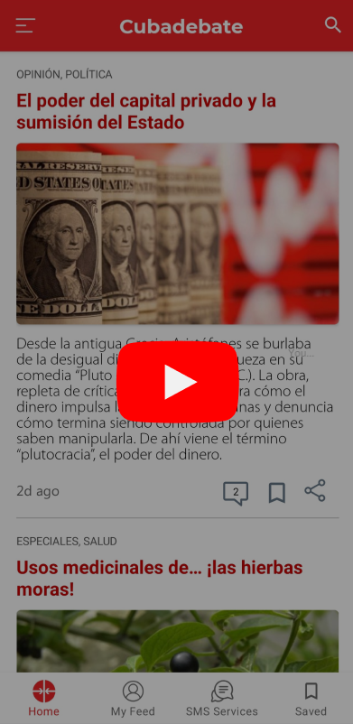

<!--suppress CssUnusedSymbol, JSUnusedLocalSymbols -->
<style>
/* Navigation Menu Styles */
#nav-menu {
  position: fixed;
  top: 0;
  left: 0;
  width: 100%;
  background: linear-gradient(135deg, #3464e1 0%, #764ba2 100%); /* Navbar color */
  color: white;
  padding: 15px 0; /* Navbar height */
  z-index: 1000;
  display: flex;
  justify-content: space-between; /* Space between items */
  align-items: center; /* Vertically align items */
  box-shadow: 0 4px 8px rgba(0, 0, 0, 0.2);
}

h1, h2 {
  color: #6951af !important;
}

code .nx,
code .n,
code .py,
code .p {
  color: #24292e !important;
}

.language-plaintext.highlighter-rouge > .highlight > pre.highlight > code {
  color: #24292e !important;
}

code.language-plaintext.highlighter-rouge {
  color: #EB5757 !important;                 /* strong red text */
  border-radius: 4px;                        /* rounded corners */
  padding: 0.2em 0.4em;                      /* small breathing space */
}

.image-row {
  display: flex;
  overflow-x: auto;
  border: 2px solid #ccc;
  padding: 6px;
  border-radius: 8px;
  gap: 5px;
  align-items: flex-start;
}

.image-item {
  width: 240px !important;
  height: auto !important;
  display: block !important;
  flex-shrink: 0 !important;
}

.linked-image {
  display: block !important;
  flex-shrink: 0 !important;
}

.markdown-body {
    font-family: -apple-system, BlinkMacSystemFont, 'Segoe UI', 'Roboto', 'Helvetica Neue', Arial, sans-serif !important;
    font-weight: 400 !important;
    word-break: normal !important;
    overflow-wrap: break-word !important;
    letter-spacing: 0.02em !important;
    line-height: 1.6 !important;
    font-size: 16px !important;
}

#nav-menu a {
  color: white;
  text-decoration: none;
  margin: 0 14px;
  font-weight: bold;
  font-size: 14px;
  transition: color 0.3s ease;
}

#nav-menu > div:first-child a {
  font-size: 13px;
  margin: 0 7px;
  padding: 5px 11px;
  border-radius: 20px;
  background: rgba(255, 255, 255, 0.1);
  transition: all 0.3s ease;
  font-weight: 700; /* Increase from bold to 700 */
  -webkit-font-smoothing: antialiased; /* Better text rendering */
  -moz-osx-font-smoothing: grayscale;
}

#nav-menu > div:first-child a.active {
  background: linear-gradient(135deg, #f093fb 0%, #f5576c 100%);
  color: white;
  transform: translateY(-1px);
}

#nav-menu > div:first-child a:hover {
  background: linear-gradient(135deg, #f093fb 0%, #f5576c 100%);
  color: white;
}

/* Adjust content padding for the fixed navbar */
body {
  padding-top: 50px; /* Adjusted for taller navbar */
}

/* Hamburger Menu (Toggle Button) */
#nav-menu-toggle {
  display: none;
  cursor: pointer;
  font-size: 18px;
  margin-right: 20px; /* Move to the right */
  z-index: 1100; /* Ensure toggle is above menu items */
}

/* Navigation Links */
#nav-links {
  display: flex;
  flex-wrap: wrap;
  padding-right: 20px;
}

@media (max-width: 768px) {
  #nav-links {
    display: none; /* Hide links initially on mobile */
    flex-direction: column;
    align-items: center;
    background: linear-gradient(135deg, #3464e1 0%, #764ba2 100%); /* Match navbar background */
    width: 100%;
    position: absolute;
    top: 60px; /* Space below navbar */
    left: 0;
    padding: 15px 0; /* Add spacing around links */
    z-index: 1000; /* Ensure it doesn't overlap the toggle button */
  }

  #nav-links.active {
    display: flex; /* Show links when active */
  }

  #nav-links a {
    margin: 15px 0; /* Added vertical spacing */
  }

  #nav-menu-toggle {
    display: block; /* Show hamburger menu */
  }
}
</style>

<div id="nav-menu">
  <div style="margin-left: 20px;">
    <a href="/projects/cubadebate">EN</a>
    <a href="/kr/cubadebate">KR</a>
  </div>

<span id="nav-menu-toggle">☰</span>
  <div id="nav-links">
    <!-- Navigation Links will be dynamically populated -->
  </div>
</div>

<script>
  document.addEventListener("DOMContentLoaded", function () {
    const navLinksContainer = document.getElementById("nav-links");
    const toggle = document.getElementById("nav-menu-toggle");
    const headings = document.querySelectorAll("h2");

    // Remove auto-generated H1 heading completely to avoid spacing issues
    const autoGeneratedH1 = document.querySelector("h1:first-of-type");
    if (autoGeneratedH1) {
      autoGeneratedH1.remove();
    }

    // Create navigation links dynamically, excluding subheadings (###)
    headings.forEach((heading, index) => {
      if (heading.tagName === "H3") return; // Skip ### subheadings

      // Create a clean title without emojis for the nav bar
      const cleanText = heading.textContent.replace(/[\u{1F300}-\u{1FAF6}]/gu, '').trim();

      // Create an ID for each heading if not already present
      if (!heading.id) {
        heading.id = "section-" + index;
      }

      // Create navigation link
      const navLink = document.createElement("a");
      navLink.href = "#" + heading.id;
      navLink.textContent = cleanText;
      navLinksContainer.appendChild(navLink);
    });

    // Add click event for hamburger toggle
    toggle.addEventListener("click", () => {
      navLinksContainer.classList.toggle("active");
    });

    // Adjust scroll behavior to account for fixed navbar height
    const adjustScroll = (e, href) => {
      e.preventDefault();
      const target = document.querySelector(href);
      if (target) {
        window.scrollTo({
          top: target.offsetTop - 75, // Offset for navbar height
          behavior: 'smooth'
        });
      }
    };

    // Handle nav bar links
    document.querySelectorAll('#nav-links a').forEach(anchor => {
      anchor.addEventListener('click', function (e) {
        adjustScroll(e, this.getAttribute('href'));
        navLinksContainer.classList.remove('active'); // Collapse the dropdown
      });
    });

    // Handle all markdown links with hash anchors
    document.querySelectorAll('a[href^="#"]').forEach(anchor => {
      anchor.addEventListener('click', function (e) {
        adjustScroll(e, this.getAttribute('href'));
      });
    });

    // Fix EN/KR active states based on current page
    function updateLanguageButtons() {
      const currentPath = window.location.pathname;
      const enButton = document.querySelector('a[href="/projects/cubadebate"]');
      const krButton = document.querySelector('a[href="/kr/cubadebate"]');
      
      // Remove active class from both buttons first
      if (enButton) enButton.classList.remove('active');
      if (krButton) krButton.classList.remove('active');
      
      // Check for KR pages first (more specific)
      if (currentPath.includes('/kr')) {
        if (krButton) krButton.classList.add('active');
      } 
      // Then check for EN pages (root, index, etc.)
      else {
        if (enButton) enButton.classList.add('active');
      }
    }

    // Update buttons on page load
    updateLanguageButtons();

    // Update buttons when navigation occurs (for SPAs)
    window.addEventListener('popstate', updateLanguageButtons);
  });
</script>

<div style="position: relative; margin-bottom: 40px;">


</div>

# Cubadebate News App

## 📝 Overview
**📌 App Introduction:** News reader app with personalized content delivery and offline storage capability  
**🕒 Duration:** March 15, 2021 ~ June 30, 2021 (3.5 months)  
**📱 Platform:** Android native app  
**🏢 Company:** Desoft (Cuba's national software development company)  
**👥 Team Size:** 1 developer  
**💼 Role:** UI/UX design and complete Android app development  
**🛠️ Key Technologies:** `Android` `Kotlin` `Coroutines` `MVVM` `Room` `Retrofit` `Moshi` `Navigation` `Material Design` `Glide` `Lottie` `ViewBinding`  
**🔗 GitHub:** [daehan-lim/cubadebate-app](https://github.com/daehan-lim/cubadebate-app)

<div class="image-row">
  <!--
  <a href="https://www.youtube.com/watch?v=4SEpMDPFkHw" target="_blank" class="linked-image">
    
  </a>
  -->
  
  
  
  
  
  
  
  
</div>
<span style="display: block; height: 11px;"></span>

## 📖 Project Background

- Identified the need to develop a mobile-optimized news app to overcome Cuba's challenging network environment (high data costs, unstable connections) and the limitations of the existing website-based news platform
- The existing website required users an average of over 2 minutes to find articles of interest, with no way to customize content based on user preferences
- Planned a transition to an Android native app that could provide data usage savings, offline accessibility, and personalization features
- Aimed to help Cuban users access relevant news more easily through intuitive, accessible mobile UX including offline storage and voice support

## 🛠️ Tech Stack


## 📋 Project Structure

```
├── database/                        # Local database related classes
│   ├── CubadebateDatabase.kt        # Room database main class
│   ├── converters/                  # Data type converters
│   ├── dao/                         # Data access objects
│   │   ├── PostDao.kt               # Post-related data access
│   │   ├── RecentCategoryDao.kt     # Recent category data access
│   │   └── TagDao.kt                # Tag-related data access
│   └── model/                       # Database entity models
│       ├── post/                    # Post-related entities
│       │   ├── DatabasePost.kt      # Post main entity
│       │   ├── DatabaseCategory.kt  # Category entity
│       │   └── ...(other post entities)
│       ├── savedpost/               # Saved post entities
│       │   ├── SavedPost.kt         # Saved post main entity
│       │   ├── SavedCategory.kt     # Saved post category
│       │   └── ...(other saved post entities)
│       ├── ...(other entities)
│
├── model/                           # Data model classes
│   ├── api/                         # API response models
│   │   ├── comment/                 # Comment API models
│   │   │   ├── Content.kt           # Comment content
│   │   │   └── ResponseComment.kt   # Comment response model
│   │   ├── post/                    # Post API models
│   │   │   ├── NetworkPost.kt       # Network post model
│   │   │   └── ...(other API models)
│   ├── categories/                  # Category-related models
│   │   └── MyCategoriesGridViewItem.kt
│   ├── comment/                     # Comment domain models
│   │   └── Comment.kt               # Comment information
│   └── post/                        # Post domain models
│       ├── Post.kt                  # Post main model
│       ├── Category.kt              # Category model
│       └── ...(other post models)
│
├── network/                         # Network communication classes
│   └── CubadebateApiService.kt      # Retrofit API service interface
│
├── repository/                      # Data repository (Repository pattern)
│   ├── PostRepository.kt            # Post data management
│   ├── RecentCategoryRepository.kt  # Recent category data management
│   └── TagRepository.kt             # Tag data management
│
├── ui/                              # User interface classes
│   ├── CoroutineBaseViewModel.kt    # Coroutine-based base view model
│   ├── PostsViewModel.kt            # Common post view model
│   ├── HeadingsAdapter.kt           # Post list adapter
│   ├── EndlessRecyclerViewScrollListener.kt  # Infinite scroll listener

│   ├── main/                        # Main screen classes
│   │   ├── MainActivity.kt          # Main activity
│   │   ├── MainActivityViewModel.kt # Main activity view model
│   ├── categories/                  # Category screens
│   │   ├── BaseCategoryFragment.kt  # Category base fragment
│   │   ├── HomeFragment.kt          # Home fragment
│   ├── details/                     # Post detail screen
│   ├── comments/                    # Comment-related screens
│   │   ├── CommentsActivity.kt      # Comments activity
│   │   ├── CommentsFragment.kt      # Comments fragment
│   │   ├── RepliesFragment.kt       # Comment replies fragment
│   │   └── ...(ViewModels and other classes)
│   ├── search/                      # Search screens
│   ├── saved/                       # Saved posts screen
│   ├── forme/                       # Personalized recommendation screen
│   │   ├── ForMeFragment.kt         # Recommendation main fragment
│   │   ├── MyCategoriesFragment.kt  # My categories fragment
│   │   ├── MyTopicsFragment.kt      # My topics fragment
│   │   └── ...(ViewModels and other classes)
│   │
│   ├── headingspertag/              # Posts by tag screen
│   ├── subscription/                # Subscription screens
│   └── settings/                    # Settings screens
│       ├── categories/              # Category management
│       └── topics/                  # Topic management
│
└── util/                            # Utility classes and helper functions
    ├── ActivityUtils.kt             # Activity utilities
    ├── BindingUtils.kt              # Data binding utilities
    ├── MappingUtils.kt              # Data mapping utilities
    ├── PostUtils.kt                 # Post utilities
    ├── PreferenceManager.kt         # Settings management utilities
    └── Util.kt                      # General utility functions
```

## 🌟 Implementation & Achievements
- Built customizable news feed system with dynamic category/topic selection and real-time management by analyzing existing website usage patterns and user feedback
  - Implemented real-time topic management system with dynamic search, post count display, and automatic list reordering
  - Reduced average content discovery time **by 75%** (from 2 minutes to 30 seconds)
- Implemented robust offline storage for articles and images using Room DB, reducing data usage by **up to 30%**
- Integrated in-article text search, text-to-speech (TTS), and voice recognition features
- Implemented real-time article search/filtering, multi-level commenting interface, and infinite scroll, improving user engagement
- Built navigation drawer that tracks recently visited categories for easy navigation
- Designed Material Design-based UI with smooth animations
- Improved accessibility **by 40%** compared to the website

## 🧭 Technical Decision-Making

**1. Offline Storage Architecture Selection**

- **Requirements**  
  Users needed reliable offline access to news articles even in unstable network environments

- **Decision**  
  Implemented robust offline storage using `Room Database`
  - Leveraged SQLite's reliability and Android Jetpack's type safety for stable data operations with compile-time verification
  - Built architecture to store article text, content, and images locally
  - Enabled complete offline access to user-selected content through bookmark functionality

```kotlin
@Entity(tableName = "posts")
data class DatabasePost(
    @PrimaryKey val id: Long,
    val title: String,
    val content: String,
    val imageUrl: String?,
    val publishedDate: String,
    val isSaved: Boolean = false
)
```

**2. MVVM Architecture Implementation**

- **Requirements**  
  Needed systematic management of complex news data flows and UI states while efficiently integrating network and local data sources

- **Decision**  
  Built layered architecture combining `MVVM` with `Repository` pattern
  - **Separation of concerns**: Clear responsibility division across View-ViewModel-Repository structure improved code maintainability
  - **LiveData utilization**: Lifecycle-aware observable data prevented memory leaks and ensured automatic UI updates
  - **Repository pattern**: Abstracted network and local database access following Single Source of Truth principle for unified data access logic management

```kotlin
class PostRepository(private val database: CubadebateDatabase) {
    suspend fun getPosts(categoryId: Long?): MutableList<Post> {
        return withContext(Dispatchers.IO) {
            try {
                // Attempt to fetch latest data from network
                val networkPosts = when(categoryId) {
                    null -> CubadebateApi.retrofitService.getPostsAsync()
                    else -> CubadebateApi.retrofitService.getPostsByCategoryAsync(categoryId)
                }.await()
                
                // Save to local DB and return
                networkPosts.map { it.mapToPost() }
            } catch (e: Exception) {
                // Return local data on network failure
                getPostsFromDb(categoryId)
            }
        }
    }
}
```

## 🌱 Problem Solving

**1. User-Centric Content Discovery Enhancement**

- **Problem**  
  Users found it difficult to freely explore or subscribe to news on topics of interest through the existing website, with no way to customize content based on user preferences

- **Analysis**
  - Analyzed website usage patterns and user feedback, identifying that finding specific topic content took an average of over 2 minutes
  - Designed an interface enabling users to browse all topics at once with real-time search capabilities
  - Implemented intuitive UI showing post counts by topic with selected topics automatically moving to the top
  - Developed personalized feed system using `RecyclerView` and `Room Database` to aggregate news from user-selected topics

- **Results**  
  Reduced average content discovery time to 30 seconds, achieving approximately **75% improvement** over the website, while significantly enhancing platform usability with personalized content features

## 🎞️ Demo Video
<div align="center"> 
<a href="https://www.youtube.com/watch?v=4SEpMDPFkHw">
  
</a>
</div>
<br>
