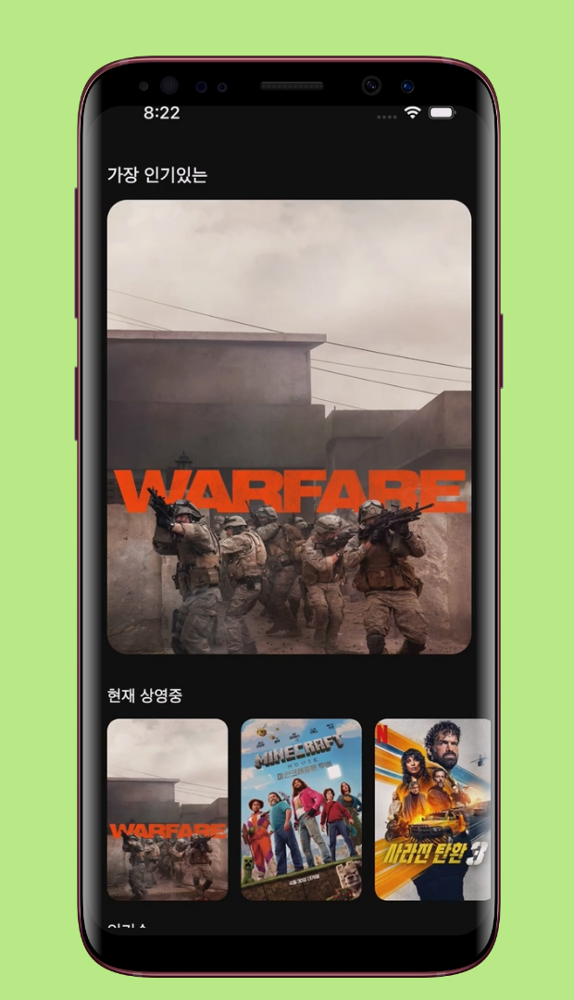
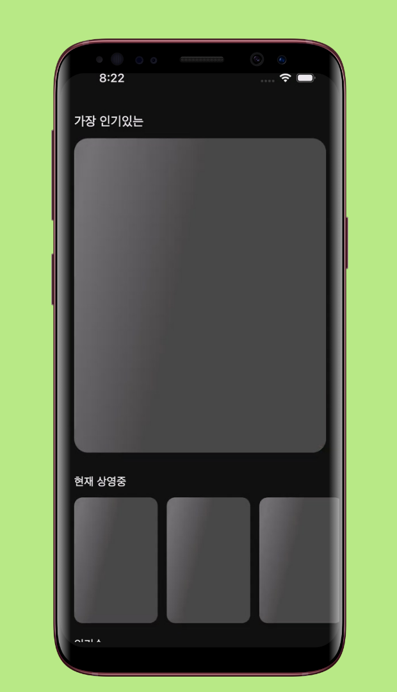

<!--suppress CssUnusedSymbol, JSUnusedLocalSymbols -->
<style>
/* Navigation Menu Styles */
#nav-menu {
  position: fixed;
  top: 0;
  left: 0;
  width: 100%;
  background: linear-gradient(135deg, #3464e1 0%, #764ba2 100%); /* Navbar color */
  color: white;
  padding: 15px 0; /* Navbar height */
  z-index: 1000;
  display: flex;
  justify-content: space-between; /* Space between items */
  align-items: center; /* Vertically align items */
  box-shadow: 0 4px 8px rgba(0, 0, 0, 0.2);
}

h1, h2 {
  color: #6951af !important;
}

code .nx,
code .n,
code .py,
code .p {
  color: #24292e !important;
}

.language-plaintext.highlighter-rouge > .highlight > pre.highlight > code {
  color: #24292e !important;
}

code.language-plaintext.highlighter-rouge {
  color: #EB5757 !important;                 /* strong red text */
  border-radius: 4px;                        /* rounded corners */
  padding: 0.2em 0.4em;                      /* small breathing space */
}

.image-row {
  display: flex;
  overflow-x: auto;
  border: 2px solid #ccc;
  padding: 6px;
  border-radius: 8px;
  gap: 5px;
  align-items: flex-start;
}

.image-item {
  width: 240px !important;
  height: auto !important;
  display: block !important;
  flex-shrink: 0 !important;
}

.linked-image {
  display: block !important;
  flex-shrink: 0 !important;
}

.markdown-body {
    font-family: -apple-system, BlinkMacSystemFont, 'Segoe UI', 'Roboto', 'Helvetica Neue', Arial, sans-serif !important;
    font-weight: 400 !important;
    word-break: normal !important;
    overflow-wrap: break-word !important;
    letter-spacing: 0.02em !important;
    line-height: 1.6 !important;
    font-size: 16px !important;
}

#nav-menu a {
  color: white;
  text-decoration: none;
  margin: 0 14px;
  font-weight: bold;
  font-size: 14px;
  transition: color 0.3s ease;
}

#nav-menu > div:first-child a {
  font-size: 13px;
  margin: 0 7px;
  padding: 5px 11px;
  border-radius: 20px;
  background: rgba(255, 255, 255, 0.1);
  transition: all 0.3s ease;
  font-weight: 700; /* Increase from bold to 700 */
  -webkit-font-smoothing: antialiased; /* Better text rendering */
  -moz-osx-font-smoothing: grayscale;
}

#nav-menu > div:first-child a.active {
  background: linear-gradient(135deg, #f093fb 0%, #f5576c 100%);
  color: white;
  transform: translateY(-1px);
}

#nav-menu > div:first-child a:hover {
  background: linear-gradient(135deg, #f093fb 0%, #f5576c 100%);
  color: white;
}

/* Adjust content padding for the fixed navbar */
body {
  padding-top: 50px; /* Adjusted for taller navbar */
}

/* Hamburger Menu (Toggle Button) */
#nav-menu-toggle {
  display: none;
  cursor: pointer;
  font-size: 18px;
  margin-right: 20px; /* Move to the right */
  z-index: 1100; /* Ensure toggle is above menu items */
}

/* Navigation Links */
#nav-links {
  display: flex;
  flex-wrap: wrap;
  padding-right: 20px;
}

@media (max-width: 768px) {
  #nav-links {
    display: none; /* Hide links initially on mobile */
    flex-direction: column;
    align-items: center;
    background: linear-gradient(135deg, #3464e1 0%, #764ba2 100%); /* Match navbar background */
    width: 100%;
    position: absolute;
    top: 60px; /* Space below navbar */
    left: 0;
    padding: 15px 0; /* Add spacing around links */
    z-index: 1000; /* Ensure it doesn't overlap the toggle button */
  }

  #nav-links.active {
    display: flex; /* Show links when active */
  }

  #nav-links a {
    margin: 15px 0; /* Added vertical spacing */
  }

  #nav-menu-toggle {
    display: block; /* Show hamburger menu */
  }
}
</style>

<div id="nav-menu">
  <div style="margin-left: 20px;">
    <a href="/projects/filmmind">EN</a>
    <a href="/kr/filmmind">KR</a>
  </div>

<span id="nav-menu-toggle">☰</span>
  <div id="nav-links">
    <!-- Navigation Links will be dynamically populated -->
  </div>
</div>

<script>
  document.addEventListener("DOMContentLoaded", function () {
    const navLinksContainer = document.getElementById("nav-links");
    const toggle = document.getElementById("nav-menu-toggle");
    const headings = document.querySelectorAll("h2");

    // Remove auto-generated H1 heading completely to avoid spacing issues
    const autoGeneratedH1 = document.querySelector("h1:first-of-type");
    if (autoGeneratedH1) {
      autoGeneratedH1.remove();
    }

    // Create navigation links dynamically, excluding subheadings (###)
    headings.forEach((heading, index) => {
      if (heading.tagName === "H3") return; // Skip ### subheadings

      // Create a clean title without emojis for the nav bar
      const cleanText = heading.textContent.replace(/[\u{1F300}-\u{1FAF6}]/gu, '').trim();

      // Create an ID for each heading if not already present
      if (!heading.id) {
        heading.id = "section-" + index;
      }

      // Create navigation link
      const navLink = document.createElement("a");
      navLink.href = "#" + heading.id;
      navLink.textContent = cleanText;
      navLinksContainer.appendChild(navLink);
    });

    // Add click event for hamburger toggle
    toggle.addEventListener("click", () => {
      navLinksContainer.classList.toggle("active");
    });

    // Adjust scroll behavior to account for fixed navbar height
    const adjustScroll = (e, href) => {
      e.preventDefault();
      const target = document.querySelector(href);
      if (target) {
        window.scrollTo({
          top: target.offsetTop - 75, // Offset for navbar height
          behavior: 'smooth'
        });
      }
    };

    // Handle nav bar links
    document.querySelectorAll('#nav-links a').forEach(anchor => {
      anchor.addEventListener('click', function (e) {
        adjustScroll(e, this.getAttribute('href'));
        navLinksContainer.classList.remove('active'); // Collapse the dropdown
      });
    });

    // Handle all markdown links with hash anchors
    document.querySelectorAll('a[href^="#"]').forEach(anchor => {
      anchor.addEventListener('click', function (e) {
        adjustScroll(e, this.getAttribute('href'));
      });
    });

    // Fix EN/KR active states based on current page
    function updateLanguageButtons() {
      const currentPath = window.location.pathname;
      const enButton = document.querySelector('a[href="/projects/filmmind"]');
      const krButton = document.querySelector('a[href="/kr/filmmind"]');
      
      // Remove active class from both buttons first
      if (enButton) enButton.classList.remove('active');
      if (krButton) krButton.classList.remove('active');
      
      // Check for KR pages first (more specific)
      if (currentPath.includes('/kr')) {
        if (krButton) krButton.classList.add('active');
      } 
      // Then check for EN pages (root, index, etc.)
      else {
        if (enButton) enButton.classList.add('active');
      }
    }

    // Update buttons on page load
    updateLanguageButtons();

    // Update buttons when navigation occurs (for SPAs)
    window.addEventListener('popstate', updateLanguageButtons);
  });
</script>

<div style="position: relative; margin-bottom: 40px;">


</div>

# FilmMind - Movie Information App

## 📝 Overview
**📌 App Introduction:** Movie information and recommendation app powered by TMDB API  
**🕒 Duration:** May 13, 2025 ~ May 15, 2025 (3 days)  
**📱 Platform:** Flutter cross-platform app (iOS, Android)  
**👥 Team Size:** 1 developer (solo project)  
**💼 Role:** Entire app design and development, API integration, performance optimization  
**🛠️ Key Technologies:** `Flutter` `Dart` `TMDB API` `Riverpod` `Clean Architecture` `Dio` `GitHub Actions` `Hero Animation` `Shimmer`    
**🔗 GitHub:** [daehan-lim/flutter-film-mind-app](https://github.com/daehan-lim/flutter-film-mind-app)

<div class="image-row">
  
  
  
  
  
  
  
  
  

</div>
<span style="display: block; height: 11px;"></span>

## 📖 Project Description

FilmMind is a Flutter-based mobile application that provides comprehensive movie information across multiple categories including now playing, popular movies, top-rated films, and upcoming releases using the TMDB API. Built with Clean Architecture patterns and MVVM structure for scalability and maintainability, the app features smooth Hero Animations for seamless screen transitions and integrated Google/Naver search functionality, creating an intuitive environment for users to explore movie information and access additional details effortlessly.

## 🛠️ Tech Stack

[](https://flutter.dev)
[](https://dart.dev/)
[](https://riverpod.dev/)
[](https://blog.cleancoder.com/uncle-bob/2012/08/13/the-clean-architecture.html)
[](https://developer.android.com/topic/architecture)
[](https://pub.dev/packages/dio)
[](https://www.themoviedb.org/documentation/api)
[](https://github.com/features/actions)
[](https://pub.dev/packages/cached_network_image)
[](https://pub.dev/packages/shimmer)
[](https://pub.dev/packages/url_launcher)
[](https://pub.dev/packages/flutter_dotenv)
[](https://pub.dev/packages/flutter_svg)

## 📋 Project Structure
``` 
├── app/                               # App-wide settings, constants, and themes  
│   ├── constants/                     # App constant definitions  
│   │   ├── app_colors.dart            # Color scheme definitions  
│   │   ├── app_constants.dart         # Constant values  
│   │   └── app_styles.dart            # Style definitions  
│   └── theme.dart                     # App theme configuration  

├── core/                              # Core functionality and utilities  
│   ├── exceptions/                    # App-wide exception classes  
│   │   └── data_exceptions.dart       # Data-related exception classes  
│   ├── extensions/                    # Extension method definitions  
│   │   ├── date_extensions.dart       # Date-related extension methods  
│   │   └── number_extensions.dart     # Number-related extension methods  
│   ├── providers/                     # Common providers  
│   │   └── repository_providers.dart  # Repository providers  
│   └── utils/                         # Utility functions  
│       ├── navigation_util.dart       # Navigation utilities  
│       ├── snackbar_util.dart         # Snackbar utilities  
│       └── dialogue_util.dart         # Dialog utilities  

├── data/                              # Data layer and data access  
│   ├── data_source/                   # Data source classes 
│   ├── dto/                           # Data Transfer Objects 
│   └── repository/                    # Repository implementations 

├── domain/                            # Business logic and entities  
│   ├── entity/                        # Domain entities 
│   ├── repository/                    # Repository interfaces
│   └── usecase/                       # Use cases 

├── presentation/                      # UI layer  
│   ├── pages/                         # App screens  
│   │   ├── home/                      # Home screen  
│   │   │   ├── home_page.dart         # Home page widget  
│   │   │   ├── home_view_model.dart   # Home screen view model  
│   │   │   └── widgets/               # Home screen widgets 
│   │   └── detail/                    # Detail screen 
│   └── widgets/                       # Common widgets 

└── main.dart                          # App entry point  
```

## 🌟 Main Contributions and Achievements

### Clean Architecture-Based App Structure Design
- **Layered architecture implementation**
  - Implemented separation of concerns across `Domain`, `Data`, and `Presentation` layers following dependency inversion principles
  - Built global state management with `Riverpod` and implemented `Provider`-based dependency injection
  - Applied `MVVM` pattern to separate UI from business logic, establishing unidirectional data flow
  - Encapsulated business logic through `Repository` pattern and `UseCase` layers, creating testable and maintainable code structure

### TMDB API Integration and Movie Data Processing
- Built real-time data retrieval for 4 categories: now playing, popular movies, top-rated films, and upcoming releases
- Implemented stable API communication using `Dio` HTTP client with `Bearer Token` authentication
- Integrated individual movie detail API for comprehensive information including genres, production companies, budget, revenue, and runtime
- Enhanced budget/revenue information readability using currency formatting and number formatting `Extensions`

### UI/UX and Animation Implementation
- **Hero Animation-based screen transitions**
  - Implemented `Hero Animation` with category-specific unique tags for smooth screen transitions when movie posters are clicked
  - Established visual continuity from main screen to detail screen, achieving native app-level user experience
  - Prevented animation conflicts when the same movie is selected from multiple categories through proper `Hero` tag matching

- **UI/UX enhancements**
  - Integrated Google and Naver search through popup menu on movie detail pages for additional movie information lookup
  - Provided seamless in-app search experience through URL encoding and in-app browser implementation
  - Reduced repeated loading times and saved data usage through `CachedNetworkImage` image caching
  - Implemented `Shimmer` loading animations to improve perceived performance during data loading and enhance user waiting experience
  - Created visually impactful popular movie ranking number overlay design using `Transform.translate`
  - Achieved efficient space utilization through horizontal scroll `ListView` with differentiated layouts for each category
  - Applied default dark mode to enhance visual immersion with movie posters and reduce eye strain

### Comprehensive Unit Testing Implementation
- Wrote unit tests for all layers from `DataSource` to `ViewModel`, ensuring business logic stability
- Implemented test cases for JSON parsing, API communication, and data transformation processes to guarantee data processing reliability
- Built isolated test environment using `Mocktail` for dependency mocking and `Provider` overrides, eliminating external API dependencies

### GitHub Actions CI Pipeline
- Established automated test execution and code quality verification based on `Pull Request` and `Push` events, reducing manual review time
- Implemented secure API key management through environment variables and protected sensitive information using `GitHub Secrets`
- Built fully automated workflow from Flutter dependency installation to APK artifact upload

### Development Efficiency and Code Quality
- Reduced code duplication and improved maintenance efficiency through reusable widget componentization
- Enhanced code readability using `Extension` methods
- Established design consistency through common style and theme systems
- Minimized external API dependencies and protected domain models through separation of `Entity` and `DTO`

## 🌱 Problem Solving

**1. Hero Animation Tag Duplication Conflict**

- **Problem**  
  While developing a movie information app with Flutter, I implemented `Hero Animation` for smooth transitions from home screen to detail screen when movie posters are clicked. However, the error `There are multiple heroes that share the same tag within a subtree` occurred, preventing animations from working properly.

- **Root Cause Analysis**
  - Initially created `Hero` tags based only on movie ID using format `'movie-image-${movie.id}'`
  - Same movies appeared across multiple categories ('Now Playing', 'Popular', 'Top Rated', 'Upcoming'), causing multiple identical `Hero` tags to exist on one screen
  - This violated Flutter's constraint that all `Hero` tags within a screen must be unique

- **Solution**
  - Implemented unique tag generation system combining movie ID and category name: `'movie-image-${movie.id}-$categoryName'`
  - Modified detail page navigation to pass category information, ensuring matching tag format for `Hero Animation`
  - Gave each category independent `Hero` tags, completely resolving duplication issues

```dart
// Updated Hero tag generation
Hero(
  tag: 'movie-image-${movie.id}-$categoryName',
  child: AppCachedImage(imageUrl: movie.getPosterUrl()),
)
```

- **Results**  
  Achieved smooth animation transitions without conflicts, even when the same movie appears in multiple categories, each with unique `Hero` tags

**2. TMDB API Key Security Management in GitHub Actions**

- **Problem**  
  The CI pipeline required `TMDB Bearer Token` but couldn't hardcode it in the source code, causing build failures due to missing environment variables.

- **Solution Process**
  - Identified that Flutter's `flutter_dotenv` package requires `.env` file at runtime
  - Confirmed that environment variable files cannot be committed to Git for security reasons
  - Explored secure environment variable management using `GitHub Secrets`

- **Solution**
  - Registered `TMDB_BEARER_TOKEN` as a Secret in GitHub Repository Settings
  - Injected Secret as environment variable in `GitHub Actions` workflow to dynamically create `.env` file

```yml
- name: Create .env file
  run: |
    echo "TMDB_BEARER_TOKEN=${{ secrets.TMDB_BEARER_TOKEN }}" > .env

- name: Install dependencies
  run: flutter pub get

- name: Run tests
  run: flutter test
```

- **Results**  
  Established stable build and test execution environment in automated CI pipeline without API key exposure risks

## 🎞️ Video
<div align="center"> 
<a href="https://www.youtube.com/watch?v=OKqoMnWGQ5o">
  
</a>
</div>
<br>
