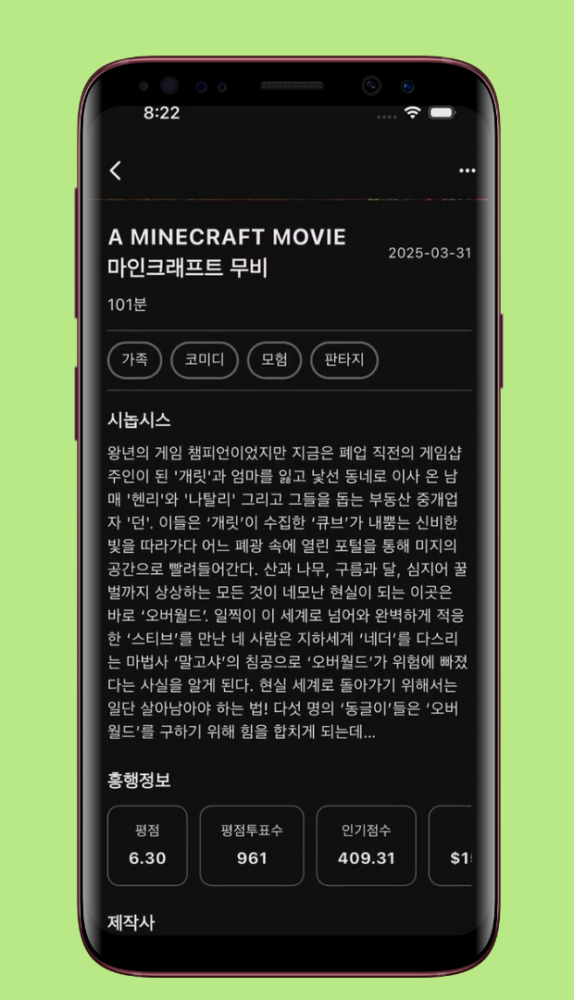

<!--suppress CssUnusedSymbol, JSUnusedLocalSymbols -->
<style>
/* Navigation Menu Styles */
#nav-menu {
  padding: 15px 0; /* Navbar height */
}

.image-row {
  display: flex;
  overflow-x: auto;
  border: 2px solid #ccc;
  padding: 6px;
  border-radius: 8px;
  gap: 5px;
  align-items: flex-start;
}

.image-item {
  width: 240px !important;
  height: auto !important;
  display: block !important;
  flex-shrink: 0 !important;
}

.linked-image {
  display: block !important;
  flex-shrink: 0 !important;
}

.markdown-body {
    font-family: -apple-system, BlinkMacSystemFont, 'Segoe UI', 'Roboto', 'Helvetica Neue', Arial, sans-serif !important;
    font-weight: 400 !important;
    word-break: normal !important;
    overflow-wrap: break-word !important;
    letter-spacing: 0.02em !important;
    line-height: 1.6 !important;
    font-size: 16px !important;
}

#nav-menu a {
  margin: 0 14px;
  font-size: 14px;
}

</style>

<div id="nav-menu">
  <!-- Home button first -->
  <div style="margin-left: 20px; display: flex; align-items: center;">
    <a href="/" id="home-button">
      <svg viewBox="0 0 24 24" xmlns="http://www.w3.org/2000/svg">
        <path d="M12 3l9 7.5v10.5h-6v-6h-6v6H3V10.5L12 3z"/>
      </svg>
    </a>
    <a href="/projects/filmmind">EN</a>
    <a href="/kr/projects/filmmind">KR</a>
  </div>

<span id="nav-menu-toggle">☰</span>
  <div id="nav-links">
    <!-- Navigation Links will be dynamically populated -->
  </div>
</div>

<div style="position: relative; margin-bottom: 40px;">


</div>

# FilmMind - Movie Information App

## 📝 Overview
**📌 App Introduction:** Movie information and recommendation app using TMDB API  
**🕒 Duration:** May 13, 2025 ~ May 15, 2025 (3 days)  
**📱 Platform:** Flutter cross-platform app (iOS, Android)  
**👥 Team Size:** 1 developer (solo project)  
**💼 Role:** Entire app design and development, API integration, performance optimization  
**🛠️ Key Technologies:** `Flutter` `Dart` `TMDB API` `Riverpod` `Clean Architecture` `Dio` `GitHub Actions` `Hero Animation` `Shimmer`    
**🔗 GitHub:** [daehan-lim/flutter-film-mind-app](https://github.com/daehan-lim/flutter-film-mind-app)

<div class="image-row">
  
  
  
  
  
  
  
  
  

</div>
<span style="display: block; height: 11px;"></span>

## 📖 Project Description

FilmMind is a Flutter mobile app that displays movie information across multiple categories including now playing, popular movies, top-rated films, and upcoming releases using the TMDB API. The app uses Clean Architecture with MVVM pattern, features smooth Hero Animations between screens, and includes Google/Naver search integration for additional movie details.

## 🛠️ Tech Stack

[](https://flutter.dev)
[](https://dart.dev/)
[](https://riverpod.dev/)
[](https://blog.cleancoder.com/uncle-bob/2012/08/13/the-clean-architecture.html)
[](https://developer.android.com/topic/architecture)
[](https://pub.dev/packages/dio)
[](https://www.themoviedb.org/documentation/api)
[](https://github.com/features/actions)
[](https://pub.dev/packages/cached_network_image)
[](https://pub.dev/packages/shimmer)
[](https://pub.dev/packages/url_launcher)
[](https://pub.dev/packages/flutter_dotenv)
[](https://pub.dev/packages/flutter_svg)

## 📋 Project Structure
``` 
├── app/                               # App-wide settings, constants, and themes  
│   ├── constants/                     # App constant definitions  
│   │   ├── app_colors.dart            # Color constants  
│   │   ├── app_constants.dart         # General app constants  
│   │   └── app_styles.dart            # Style definitions  
│   └── theme.dart                     # App theme configuration  

├── core/                              # Core functionality and utilities  
│   ├── exceptions/                    # App-wide exception classes  
│   │   └── data_exceptions.dart       # Data-related exception classes  
│   ├── extensions/                    # Extension method definitions  
│   │   ├── date_extensions.dart       # Date-related extension methods  
│   │   └── number_extensions.dart     # Number-related extension methods  
│   ├── providers/                     # Common providers  
│   │   └── repository_providers.dart  # Repository providers  
│   └── utils/                         # Utility functions  
│       ├── navigation_util.dart       # Navigation utilities  
│       ├── snackbar_util.dart         # Snackbar utilities  
│       └── dialogue_util.dart         # Dialog utilities  

├── data/                              # Data layer and data access  
│   ├── data_source/                   # Data source classes 
│   ├── dto/                           # Data Transfer Objects 
│   └── repository/                    # Repository implementations 

├── domain/                            # Business logic and entities  
│   ├── entity/                        # Domain entities 
│   ├── repository/                    # Repository interfaces
│   └── usecase/                       # Use cases 

├── presentation/                      # UI layer  
│   ├── pages/                         # App screens  
│   │   ├── home/                      # Home screen  
│   │   │   ├── home_page.dart         # Home page widget  
│   │   │   ├── home_view_model.dart   # Home screen view model  
│   │   │   └── widgets/               # Home screen widgets 
│   │   └── detail/                    # Detail screen 
│   └── widgets/                       # Common widgets 

└── main.dart                          # App entry point  
```

## 🌟 Implementation & Achievements

### Clean Architecture-Based App Structure
- **Layered architecture implementation**
  - Separated `Domain`, `Data`, and `Presentation` layers with clear boundaries
  - Built global state management using `Riverpod` and implemented `Provider`-based dependency injection
  - Adopted `MVVM` pattern for clear separation of UI and business logic
  - Built a testable code structure using `Repository` pattern and `UseCase` layer to encapsulate business logic

### TMDB API Integration and Movie Data Processing
- Fetched real-time data for four categories: *Now Playing*, *Popular*, *Top Rated*, and *Upcoming*
- Used `Dio` HTTP client with `Bearer Token` authentication for secure API calls
- Built individual movie detail pages with comprehensive information including genres, production companies, budget, revenue, and runtime
- Enhanced budget/revenue information display using custom currency and number formatting `Extensions`

### UI/UX and Animation Features
- **Hero Animation for screen transitions**
  - Implemented `Hero Animation` with unique tags per category for smooth poster-to-detail transitions
  - Maintained visual continuity when navigating between screens
  - Prevented animation conflicts when the same movie appears across multiple categories through proper `Hero` tag matching

- **User interface enhancements**
  - Integrated Google and Naver search through popup menu on movie detail pages for additional movie information
  - Provided seamless in-app browsing experience with embedded browser support
  - Reduced repeated loading time and data usage through image caching using `CachedNetworkImage`
  - Improved perceived performance during data loading and enhanced user waiting experience with `Shimmer` loading animations
  - Created visually appealing popular movie ranking number overlay using `Transform.translate`
  - Utilized horizontal `ListView` and category-specific layouts for efficient space usage
  - Applied default dark mode to enhance visual focus on movie posters and reduce eye strain

### Comprehensive Unit Testing
- Wrote unit tests for all layers from `DataSource` to `ViewModel`, ensuring business logic stability
- Covered JSON parsing, API communication, data transformation processes, etc.
- Built isolated test environment with `Mocktail` for dependency mocking and `Provider` overrides, eliminating external API dependencies

### GitHub Actions CI Pipeline
- Automated testing and code quality checks on `Pull Request` and `Push` events, reducing manual review time
- Configured secure API key management using GitHub Secrets and environment variables
- Built fully automated workflow from Flutter dependency installation to APK artifact upload

### Development Best Practices
- Reduced code duplication through reusable widget componentization
- Enhanced code readability using custom `Extension` methods
- Established design consistency through common style and theme systems
- Minimized external API dependencies by separating `Entity` and `DTO` layers

## 🌱 Problem Solving

**1. Hero Animation Tag Duplication Conflict**

- **Problem**  
  Multiple movies appeared in different categories, causing `Hero` animation conflicts with the error: `There are multiple heroes that share the same tag within a subtree`.

- **Root Cause Analysis**
  - Initially created `Hero` tags based only on movie ID using format `'movie-image-${movie.id}'`
  - Same movies appeared across multiple categories ('Now Playing', 'Popular', 'Top Rated', 'Upcoming'), causing duplicate `Hero` tags on the same screen
  - This violated Flutter's constraint that all `Hero` tags within a screen must be unique

- **Solution**
  - Ensured unique tag generation by combining movie ID and category name: `'movie-image-${movie.id}-$categoryName'`
  - Modified detail page navigation to pass category information for proper tag matching
  - Each movie poster now has a unique `Hero` tag regardless of category overlap

```dart
// Updated Hero tag generation
Hero(
  tag: 'movie-image-${movie.id}-$categoryName',
  child: AppCachedImage(imageUrl: movie.getPosterUrl()),
)
```

- **Results**  
  Eliminated animation conflicts while maintaining smooth transitions between screens.

**2. TMDB API Key Security Management in GitHub Actions**

- **Problem**  
  The CI pipeline required `TMDB Bearer Token` for successful builds, but the token couldn't be hardcoded in the repository for security reasons, causing build failures due to missing environment variables.

- **Analysis**
  - Identified that Flutter's `flutter_dotenv` package requires a `.env` file at runtime
  - Recognized that environment variable files cannot be committed to Git for security reasons
  - Explored secure environment variable management using `GitHub Secrets`

- **Solution**
  - Registered `TMDB_BEARER_TOKEN` as a Secret in GitHub repository settings
  - Modified `GitHub Actions` workflow to inject the secret as an environment variable and dynamically create the `.env` file during builds

```yml
- name: Create .env file
  run: |
    echo "TMDB_BEARER_TOKEN=${{ secrets.TMDB_BEARER_TOKEN }}" > .env

- name: Install dependencies
  run: flutter pub get

- name: Run tests
  run: flutter test
```

- **Results**  
  Successfully established a secure automated CI pipeline without exposing API credentials, enabling reliable build and test execution.

## 🎞️ Video
<div align="center"> 
<a href="https://www.youtube.com/watch?v=OKqoMnWGQ5o">
  
</a>
</div>
<br>
