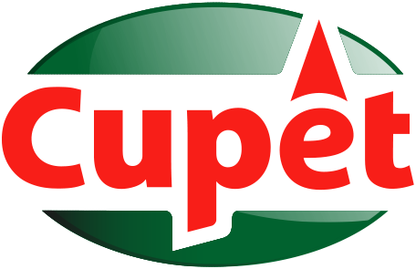

<!--suppress CssUnusedSymbol, JSUnusedLocalSymbols -->
<style>
/* Navigation Menu Styles */
#nav-menu {
  position: fixed;
  top: 0;
  left: 0;
  width: 100%;
  background: linear-gradient(135deg, #3464e1 0%, #764ba2 100%); /* Navbar color */
  color: white;
  padding: 15px 0; /* Navbar height */
  z-index: 1000;
  display: flex;
  justify-content: space-between; /* Space between items */
  align-items: center; /* Vertically align items */
  box-shadow: 0 4px 8px rgba(0, 0, 0, 0.2);
}

h1, h2 {
  color: #6951af !important;
}

code .nx,
code .n,
code .py,
code .p {
  color: #24292e !important;
}

.language-plaintext.highlighter-rouge > .highlight > pre.highlight > code {
  color: #24292e !important;
}

code.language-plaintext.highlighter-rouge {
  color: #EB5757 !important;                 /* strong red text */
  border-radius: 4px;                        /* rounded corners */
  padding: 0.2em 0.4em;                      /* small breathing space */
}

.image-row {
  display: flex;
  overflow-x: auto;
  border: 2px solid #ccc;
  padding: 6px;
  border-radius: 8px;
  gap: 5px;
  align-items: flex-start;
}

.image-item {
  width: 240px !important;
  height: auto !important;
  display: block !important;
  flex-shrink: 0 !important;
}

.linked-image {
  display: block !important;
  flex-shrink: 0 !important;
}

.markdown-body {
    font-family: -apple-system, BlinkMacSystemFont, 'Segoe UI', 'Roboto', 'Helvetica Neue', Arial, sans-serif !important;
    font-weight: 400 !important;
    word-break: normal !important;
    overflow-wrap: break-word !important;
    letter-spacing: 0.02em !important;
    line-height: 1.6 !important;
    font-size: 16px !important;
}

#nav-menu a {
  color: white;
  text-decoration: none;
  margin: 0 14px;
  font-weight: bold;
  font-size: 14px;
  transition: color 0.3s ease;
}

#nav-menu > div:first-child a {
  font-size: 13px;
  margin: 0 7px;
  padding: 5px 11px;
  border-radius: 20px;
  background: rgba(255, 255, 255, 0.1);
  transition: all 0.3s ease;
  font-weight: 700; /* Increase from bold to 700 */
  -webkit-font-smoothing: antialiased; /* Better text rendering */
  -moz-osx-font-smoothing: grayscale;
}

#nav-menu > div:first-child a.active {
  background: linear-gradient(135deg, #f093fb 0%, #f5576c 100%);
  color: white;
  transform: translateY(-1px);
}

#nav-menu > div:first-child a:hover {
  background: linear-gradient(135deg, #f093fb 0%, #f5576c 100%);
  color: white;
}

/* Adjust content padding for the fixed navbar */
body {
  padding-top: 50px; /* Adjusted for taller navbar */
}

/* Hamburger Menu (Toggle Button) */
#nav-menu-toggle {
  display: none;
  cursor: pointer;
  font-size: 18px;
  margin-right: 20px; /* Move to the right */
  z-index: 1100; /* Ensure toggle is above menu items */
}

/* Navigation Links */
#nav-links {
  display: flex;
  flex-wrap: wrap;
  padding-right: 20px;
}

@media (max-width: 768px) {
  #nav-links {
    display: none; /* Hide links initially on mobile */
    flex-direction: column;
    align-items: center;
    background: linear-gradient(135deg, #3464e1 0%, #764ba2 100%); /* Match navbar background */
    width: 100%;
    position: absolute;
    top: 60px; /* Space below navbar */
    left: 0;
    padding: 15px 0; /* Add spacing around links */
    z-index: 1000; /* Ensure it doesn't overlap the toggle button */
  }

  #nav-links.active {
    display: flex; /* Show links when active */
  }

  #nav-links a {
    margin: 15px 0; /* Added vertical spacing */
  }

  #nav-menu-toggle {
    display: block; /* Show hamburger menu */
  }
}
</style>

<div id="nav-menu">
  <div style="margin-left: 20px;">
    <a href="/projects/gas">EN</a>
    <a href="/kr/gas">KR</a>
  </div>

<span id="nav-menu-toggle">☰</span>
  <div id="nav-links">
    <!-- Navigation Links will be dynamically populated -->
  </div>
</div>

<script>
  document.addEventListener("DOMContentLoaded", function () {
    const navLinksContainer = document.getElementById("nav-links");
    const toggle = document.getElementById("nav-menu-toggle");
    const headings = document.querySelectorAll("h2");

    // Remove auto-generated H1 heading completely to avoid spacing issues
    const autoGeneratedH1 = document.querySelector("h1:first-of-type");
    if (autoGeneratedH1) {
      autoGeneratedH1.remove();
    }

    // Create navigation links dynamically, excluding subheadings (###)
    headings.forEach((heading, index) => {
      if (heading.tagName === "H3") return; // Skip ### subheadings

      // Create a clean title without emojis for the nav bar
      const cleanText = heading.textContent.replace(/[\u{1F300}-\u{1FAF6}]/gu, '').trim();

      // Create an ID for each heading if not already present
      if (!heading.id) {
        heading.id = "section-" + index;
      }

      // Create navigation link
      const navLink = document.createElement("a");
      navLink.href = "#" + heading.id;
      navLink.textContent = cleanText;
      navLinksContainer.appendChild(navLink);
    });

    // Add click event for hamburger toggle
    toggle.addEventListener("click", () => {
      navLinksContainer.classList.toggle("active");
    });

    // Adjust scroll behavior to account for fixed navbar height
    const adjustScroll = (e, href) => {
      e.preventDefault();
      const target = document.querySelector(href);
      if (target) {
        window.scrollTo({
          top: target.offsetTop - 75, // Offset for navbar height
          behavior: 'smooth'
        });
      }
    };

    // Handle nav bar links
    document.querySelectorAll('#nav-links a').forEach(anchor => {
      anchor.addEventListener('click', function (e) {
        adjustScroll(e, this.getAttribute('href'));
        navLinksContainer.classList.remove('active'); // Collapse the dropdown
      });
    });

    // Handle all markdown links with hash anchors
    document.querySelectorAll('a[href^="#"]').forEach(anchor => {
      anchor.addEventListener('click', function (e) {
        adjustScroll(e, this.getAttribute('href'));
      });
    });

    // Fix EN/KR active states based on current page
    function updateLanguageButtons() {
      const currentPath = window.location.pathname;
      const enButton = document.querySelector('a[href="/projects/gas"]');
      const krButton = document.querySelector('a[href="/kr/gas"]');
      
      // Remove active class from both buttons first
      if (enButton) enButton.classList.remove('active');
      if (krButton) krButton.classList.remove('active');
      
      // Check for KR pages first (more specific)
      if (currentPath.includes('/kr')) {
        if (krButton) krButton.classList.add('active');
      } 
      // Then check for EN pages (root, index, etc.)
      else {
        if (enButton) enButton.classList.add('active');
      }
    }

    // Update buttons on page load
    updateLanguageButtons();

    // Update buttons when navigation occurs (for SPAs)
    window.addEventListener('popstate', updateLanguageButtons);
  });
</script>

<div style="position: relative; margin-bottom: 40px;">


<div style="position:absolute;left:40px;bottom:-10px;width:80px;height:80px;background:#fafafa;border-radius:20px;display:flex;align-items:center;justify-content:center;box-shadow:0 2px 6px rgba(0,0,0,0.15);">

</div>

</div>

# Gas Consumption Manager

## 📝 Overview
**📌 App Introduction:** Android application automating manual gas usage management for Cuba's national Manufactured Gas Company
**🕒 Duration:** February 20, 2021 ~ March 18, 2021 (1 month)  
**📱 Platform:** Android native app  
**🏢 Company:** Desoft (Cuba's national software development company)  
**👥 Team Size:** 1 developer  
**💼 Role:** Full Android app development  
**🛠️ Key Technologies:** `Android` `Kotlin` `Coroutines` `MVVM` `Room` `VideoView` `Jetpack` `Material Design` `Data Binding` `Navigation` `MPAndroidChart`  
**🔗 GitHub:** [daehan-lim/gas-consumption-manager](https://github.com/daehan-lim/gas-consumption-manager)

<div style="display: flex; overflow-x: auto; border: 2px solid #ccc; padding: 6px; border-radius: 8px;">
  
  
  
  
  
  
</div>
<span style="display: block; height: 11px;"></span>

## 📖 Project Background

Cuba's national gas utility company faced operational inefficiencies and customer service challenges due to their manual gas consumption recording and calculation processes. The existing system required all procedures from gas meter readings to billing calculations to be performed manually, resulting in time-consuming operations and high potential for calculation errors. Additionally, the lack of systematic educational materials for gas meter reading methods and customer support infrastructure created significant difficulties for users. This comprehensive gas consumption management app project was initiated to address these issues through automated usage calculations, data visualization, and offline-first design.

## 📋 Project Structure

```
├── features/                           # Feature-based modular structure
│   ├── consumption/                    # Gas consumption calculation feature
│   │   ├── ConsumptionFragment.kt      # Consumption input and calculation UI
│   │   ├── ConsumptionViewModel.kt     # Consumption calculation business logic
│   │   └── ConsumptionViewModelFactory.kt
│   ├── history/                        # Usage history and chart analytics
│   │   ├── HistoryActivity.kt          # Chart-based analysis screen
│   │   ├── HistoryViewModel.kt         # Chart data processing logic
│   │   └── HistoryViewModelFactory.kt
│   ├── offices/                        # Branch office contact directory
│   │   ├── ComercialOfficesFragment.kt # Branch office list UI
│   │   ├── ComercialOfficesAdapter.kt  # RecyclerView adapter
│   │   └── ComercialOfficesViewModel.kt
│   ├── readcounter/                    # Meter reading guide
│   │   ├── ReadCounterFragment.kt      # Video guide screen
│   │   └── ReadCounterViewModel.kt
│   ├── about/                          # App information and contacts
│   │   └── AboutActivity.kt
│   └── splash/                         # Splash screen
│       └── SplashActivity.kt
├── database/                           # Room database layer
│   ├── Consumption.kt                  # Consumption data entity
│   ├── ConsumptionDao.kt               # Data access object
│   └── ConsumptionDatabase.kt          # Database configuration
├── model/                              # Data models
│   └── ComercialOffice.kt              # Branch office information model
├── util/                               # Utility classes
│   ├── BindingUtils.kt                 # Data binding adapters
│   └── Util.kt                         # Common utility functions
└── MainActivity.kt                     # Main activity and navigation
```

## 🌟 Main Contributions

### Room Database-based Offline Data Management and Usage Data Storage
- **MVVM Architecture and Repository Pattern Implementation**
  - Abstracted data access layer through `ConsumptionDao` and separated business logic concerns
  - Implemented asynchronous database operations using `Coroutines` and `suspend` functions to prevent UI thread blocking
  - Built reactive UI with `LiveData` and `ViewModel` for lifecycle-aware data binding
  - Applied Singleton pattern and `fallbackToDestructiveMigration()` for stable database management

- **Efficient Data CRUD Operations Implementation**
  - Optimized complex queries including monthly consumption retrieval, yearly data filtering, and automatic integration of latest meter readings
  - Built continuous data input environment through automatic integration of previous month's meter readings

### Automated Gas Usage Calculation and Validation System Development
- **Real-time Input Validation and Error Prevention**
  - Implemented immediate error alerts and input blocking when current meter reading is less than previous reading
  - Built real-time field validation UI using `TextInputLayout`'s `errorEnabled` property
  - Minimized user input errors through immediate feedback for missing required fields

- **Automated Usage Calculation and Fee Determination**
  - Implemented consistent fee calculation logic using `PAYMENT_COEFFICIENT` constant (2.5)
  - Enabled immediate result verification through real-time conversion calculations between gas usage (㎥) and fees (pesos)
  - Presented calculation results through HTML formatting and `AlertDialog`

### Interactive Data Visualization Implementation Using MPAndroidChart
- **Annual/Monthly Consumption Pattern Analysis Charts**
  - Visualized monthly gas consumption using `BarChart` with animation effects to enhance user experience
  - Supported multi-perspective data analysis through peso/㎥ unit conversion filtering

- **Responsive Chart UI and User Interaction**
  - Implemented automatic chart layout adjustment and label density optimization based on portrait/landscape orientation
  - Built intuitive year selection interface using `MonthPickerDialog`

### VideoView-based Gas Meter Reading Method Learning through Video Guide
- **Full-screen Support Video Player Development**
  - Customized `MediaController` to add full-screen button and implement screen rotation control
  - Provided immersive viewing environment through `SystemUI` hiding during automatic portrait/landscape mode transitions
  - Implemented seamless user experience through video playback position saving and restoration

- **Lifecycle-aware Media Management**
  - Prevented memory leaks through proper video resource management in `onStart()`, `onStop()`, and `onPause()`
  - Implemented automatic portrait mode restoration and placeholder screen display upon video completion
  - Eliminated network dependencies through offline video playback using `raw` resources

### RecyclerView-based Branch Office Contact Directory Implementation
- Simplified customer inquiry handling process by integrating branch office contact directory for customer support
- Implemented native app integration using `Intent.ACTION_CALL` and `Intent.ACTION_SENDTO`
- Provided alternative dial action when permission is denied with dynamic `CALL_PHONE` permission requests
- Built reusable view binding logic using `@BindingAdapter`

### User Experience Optimization and Accessibility Enhancement
- **Bottom Navigation and Fragment-based Screen Transitions**
  - Implemented automatic navigation state management through `setupWithNavController()`
  - Built app exit confirmation dialog through `onBackPressed()` override
- **Consistent Action Bar Design with Toolbar**
  - Implemented options menu for immediate access to History and About features
- Built differentiated typography through custom font application (`segoe_ui`, `seguisb`)
- Implemented splash screen using gas utility company logo and brand colors
- Integrated 6 social media platforms including Facebook, Instagram, Twitter, Telegram, LinkedIn
- Provided additional information access channels through external browser integration via `Intent.ACTION_VIEW`

### Development Efficiency and Code Quality Enhancement
- **Data Binding and ViewBinding Implementation**
  - Ensured type safety between XML layouts and Kotlin code while eliminating `findViewById()`
  - Implemented declarative UI updates through `@{viewModel.property}` syntax
  - Prevented UI flickering through immediate binding processing using `executePendingBindings()`

## 🚀 Results and Improvement Effects
- **70% Reduction in Processing Time**: Significantly reduced gas billing calculation time through transition from manual to automated calculations
- **Offline-first Design**: Enabled all core functionality usage without network connectivity through Room local database
- **Enhanced User Satisfaction**: Supported meter reading method learning through intuitive UI/UX and video guides
- **Improved Customer Support**: Simplified customer inquiry handling process and enhanced accessibility through integrated branch office contacts

<br><br><br>