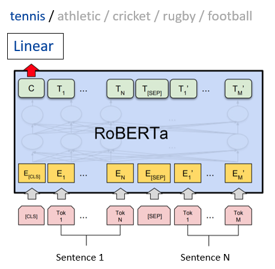

<!--suppress CssUnusedSymbol, JSUnusedLocalSymbols -->

  <!-- Home button first -->
  

    <a href="/" id="home-button">
      <svg viewBox="0 0 24 24" xmlns="http://www.w3.org/2000/svg">
        <path d="M12 3l9 7.5v10.5h-6v-6h-6v6H3V10.5L12 3z"/>
      </svg>
    </a>
    <a href="/projects/ml_projects">EN</a>
    <a href="/kr/projects/ml_projects">KR</a>
  

☰
  

    <!-- Navigation Links will be dynamically populated -->
  

# Machine Learning Projects

## 📂 Projects Overview

- [Privacy-Preserving Federated Random Forest](#privacy-preserving-federated-random-forest) - Privacy-preserving distributed learning system (2023)<a href="https://arxiv.org/abs/2407.19193" style="color: #21427D; font-size: 20px; text-decoration: none;">&thinsp;&thinsp;⎆</a>
- [RoBERTa News Classification](#roberta-news-classification) - Enhanced topic classification with synthetic data (2024)<a href="https://github.com/daehan-lim/roberta-sport-news-classifier" style="color: #21427D; font-size: 20px; text-decoration: none;">&thinsp;&thinsp;⎆</a>
- [Medical Data Classifier](#medical-data-classifier) - Patient mortality prediction system (2023)<a href="https://github.com/daehan-lim/associative-classifier-mortality-prediction" style="color: #21427D; font-size: 20px; text-decoration: none;">&thinsp;&thinsp;⎆</a>
- [Information Retrieval System](#information-retrieval-system) - Document indexing and search system (2024)<a href="../assets/information_retrieval_report.pdf" style="color: #21427D; font-size: 20px; text-decoration: none;">&thinsp;&thinsp;⎆</a>

## [Privacy-Preserving Federated Random Forest](https://arxiv.org/abs/2407.19193)
*Privacy-preserving distributed learning system for collaborative model training (2023)*

**Overview:**

- Designed and implemented a federated learning system for random forests enabling privacy-preserving distributed model training across multiple clients
- Implemented parallel processing pipeline using Python's ProcessPoolExecutor for efficient multi-client simulation and simultaneous model training, reducing training time by 60%
- Introduced incremental learning mechanism that enables efficient integration of new clients without full model retraining, improving system scalability
- Demonstrated system effectiveness through extensive testing across 7 benchmark datasets with sizes ranging up to 88,000 samples and 54 features, achieving a 10% performance improvement compared to the baseline approach
- Published research in [Expert Systems with Applications](https://www.sciencedirect.com/science/article/pii/S0957417424016099) (SCIE Journal) and resulted in patent filing (Appl. No. 10-2024-0001659)
- **Tech Stack**: Python, NumPy, Pandas, scikit-learn, Matplotlib, multiprocessing, Graphviz

[🔗 View Details](https://arxiv.org/abs/2407.19193)

---

## [RoBERTa News Classification](https://github.com/daehan-lim/roberta-sport-news-classifier)
*Enhanced topic classification model with synthetic data augmentation (2024)*

**Overview:**
- Developed machine learning model for classifying sports news articles into 5 distinct categories using [RoBERTa](https://huggingface.co/docs/transformers/en/model_doc/roberta) and [BBC Sport dataset](http://mlg.ucd.ie/datasets/bbc.html)
- Augmented limited training data using GPT-4 generated articles and prompt engineering techniques, improving classification accuracy to 99.5%
- Employed zero-shot learning strategy to enhance diversity and versatility of the LLM generated articles
- Executed comprehensive experiments evaluating model performance under various data configurations and training conditions
- Developed and deployed web application using Streamlit, enabling real-time article classification with detailed performance visualizations
- **Tech Stack**: Python, PyTorch, Hugging Face Transformers, GPT-4, Streamlit

[🔗 View on GitHub](https://github.com/daehan-lim/roberta-sport-news-classifier)

---

## [Medical Data Classifier](https://github.com/daehan-lim/associative-classifier-mortality-prediction)
*Novel classification system for patient mortality prediction using electronic health records (2023)*

**Overview:**
- Developed custom associative classifier tailored for unbalanced healthcare datasets
- Generated interpretable rules for medical decision-making, enabling healthcare experts to validate model predictions
- Implemented efficient rule-pruning strategy, reducing rule set by 80% for enhanced model interpretability
- Achieved superior performance metrics compared to traditional classifiers on real-world hospital data
- **Tech Stack**: Python, NumPy, Pandas, scikit-learn, Jupyter

[🔗 View on GitHub](https://github.com/daehan-lim/associative-classifier-mortality-prediction)

---

## [Information Retrieval System](../../assets/information_retrieval_report.pdf)
*Efficient implementation of Boolean and ranked document retrieval (2024)*

**Overview:**
- Reduced document processing time by 65% compared to sequential search by implementing SPIMI-based inverted indexing
- Enhanced search precision through Boolean operator (AND, OR, NOT) based filtering
- Implemented ranked retrieval using TF-IDF weighting and cosine similarity, improving search result relevance
- Achieved 0.3 second average search response time for 466 English documents
- Implemented system with optimized memory usage of 2.5MB
- **Tech Stack**: Python, NLTK, SpaCy, NumPy, contractions

[🔗 View Details](../../assets/information_retrieval_report.pdf)

  
