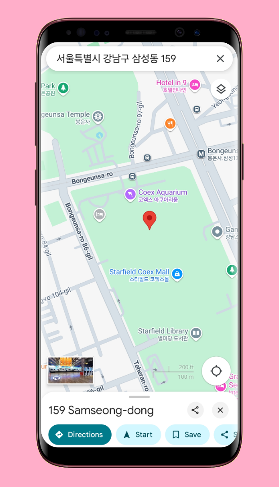
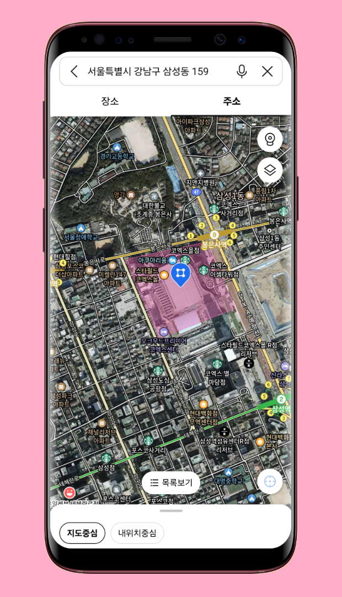

<!--suppress CssUnusedSymbol, JSUnusedLocalSymbols -->
<style>
/* Navigation Menu Styles */
#nav-menu {
  position: fixed;
  top: 0;
  left: 0;
  width: 100%;
  background: linear-gradient(135deg, #3464e1 0%, #764ba2 100%); /* Navbar color */
  color: white;
  padding: 15px 0; /* Navbar height */
  z-index: 1000;
  display: flex;
  justify-content: space-between; /* Space between items */
  align-items: center; /* Vertically align items */
  box-shadow: 0 4px 8px rgba(0, 0, 0, 0.2);
}

h1, h2 {
  color: #6951af !important;
}

code .nx,
code .n,
code .py,
code .p {
  color: #24292e !important;
}

.language-plaintext.highlighter-rouge > .highlight > pre.highlight > code {
  color: #24292e !important;
}

code.language-plaintext.highlighter-rouge {
  color: #EB5757 !important;                 /* strong red text */
  border-radius: 4px;                        /* rounded corners */
  padding: 0.2em 0.4em;                      /* small breathing space */
}

.image-row {
  display: flex;
  overflow-x: auto;
  border: 2px solid #ccc;
  padding: 6px;
  border-radius: 8px;
  gap: 5px;
  align-items: flex-start;
}

.image-item {
  width: 240px !important;
  height: auto !important;
  display: block !important;
  flex-shrink: 0 !important;
}

.linked-image {
  display: block !important;
  flex-shrink: 0 !important;
}

.markdown-body {
    font-family: -apple-system, BlinkMacSystemFont, 'Segoe UI', 'Roboto', 'Helvetica Neue', Arial, sans-serif !important;
    font-weight: 400 !important;
    word-break: normal !important;
    overflow-wrap: break-word !important;
    letter-spacing: 0.02em !important;
    line-height: 1.6 !important;
    font-size: 16px !important;
}

#nav-menu a {
  color: white;
  text-decoration: none;
  margin: 0 14px;
  font-weight: bold;
  font-size: 14px;
  transition: color 0.3s ease;
}

#nav-menu > div:first-child a {
  font-size: 13px;
  margin: 0 7px;
  padding: 5px 11px;
  border-radius: 20px;
  background: rgba(255, 255, 255, 0.1);
  transition: all 0.3s ease;
  font-weight: 700; /* Increase from bold to 700 */
  -webkit-font-smoothing: antialiased; /* Better text rendering */
  -moz-osx-font-smoothing: grayscale;
}

#nav-menu > div:first-child a.active {
  background: linear-gradient(135deg, #f093fb 0%, #f5576c 100%);
  color: white;
  transform: translateY(-1px);
}

#nav-menu > div:first-child a:hover {
  background: linear-gradient(135deg, #f093fb 0%, #f5576c 100%);
  color: white;
}

/* Adjust content padding for the fixed navbar */
body {
  padding-top: 50px; /* Adjusted for taller navbar */
}

/* Hamburger Menu (Toggle Button) */
#nav-menu-toggle {
  display: none;
  cursor: pointer;
  font-size: 18px;
  margin-right: 20px; /* Move to the right */
  z-index: 1100; /* Ensure toggle is above menu items */
}

/* Navigation Links */
#nav-links {
  display: flex;
  flex-wrap: wrap;
  padding-right: 20px;
}

@media (max-width: 768px) {
  #nav-links {
    display: none; /* Hide links initially on mobile */
    flex-direction: column;
    align-items: center;
    background: linear-gradient(135deg, #3464e1 0%, #764ba2 100%); /* Match navbar background */
    width: 100%;
    position: absolute;
    top: 60px; /* Space below navbar */
    left: 0;
    padding: 15px 0; /* Add spacing around links */
    z-index: 1000; /* Ensure it doesn't overlap the toggle button */
  }

  #nav-links.active {
    display: flex; /* Show links when active */
  }

  #nav-links a {
    margin: 15px 0; /* Added vertical spacing */
  }

  #nav-menu-toggle {
    display: block; /* Show hamburger menu */
  }
}
</style>

<div id="nav-menu">
  <div style="margin-left: 20px;">
    <a href="/projects/placefinder">EN</a>
    <a href="/kr/projects/placefinder">KR</a>
  </div>

<span id="nav-menu-toggle">☰</span>
  <div id="nav-links">
    <!-- Navigation Links will be dynamically populated -->
  </div>
</div>

<script>
  document.addEventListener("DOMContentLoaded", function () {
    const navLinksContainer = document.getElementById("nav-links");
    const toggle = document.getElementById("nav-menu-toggle");
    const headings = document.querySelectorAll("h2");

    // Remove auto-generated H1 heading completely to avoid spacing issues
    const autoGeneratedH1 = document.querySelector("h1:first-of-type");
    if (autoGeneratedH1) {
      autoGeneratedH1.remove();
    }

    // Create navigation links dynamically, excluding subheadings (###)
    headings.forEach((heading, index) => {
      if (heading.tagName === "H3") return; // Skip ### subheadings

      // Create a clean title without emojis for the nav bar
      const cleanText = heading.textContent.replace(/[\u{1F300}-\u{1FAF6}]/gu, '').trim();

      // Create an ID for each heading if not already present
      if (!heading.id) {
        heading.id = "section-" + index;
      }

      // Create navigation link
      const navLink = document.createElement("a");
      navLink.href = "#" + heading.id;
      navLink.textContent = cleanText;
      navLinksContainer.appendChild(navLink);
    });

    // Add click event for hamburger toggle
    toggle.addEventListener("click", () => {
      navLinksContainer.classList.toggle("active");
    });

    // Adjust scroll behavior to account for fixed navbar height
    const adjustScroll = (e, href) => {
      e.preventDefault();
      const target = document.querySelector(href);
      if (target) {
        window.scrollTo({
          top: target.offsetTop - 75, // Offset for navbar height
          behavior: 'smooth'
        });
      }
    };

    // Handle nav bar links
    document.querySelectorAll('#nav-links a').forEach(anchor => {
      anchor.addEventListener('click', function (e) {
        adjustScroll(e, this.getAttribute('href'));
        navLinksContainer.classList.remove('active'); // Collapse the dropdown
      });
    });

    // Handle all markdown links with hash anchors
    document.querySelectorAll('a[href^="#"]').forEach(anchor => {
      anchor.addEventListener('click', function (e) {
        adjustScroll(e, this.getAttribute('href'));
      });
    });

    // Fix EN/KR active states based on current page
    function updateLanguageButtons() {
      const currentPath = window.location.pathname;
      const enButton = document.querySelector('a[href="/projects/placefinder"]');
      const krButton = document.querySelector('a[href="/kr/projects/placefinder"]');
      
      // Remove active class from both buttons first
      if (enButton) enButton.classList.remove('active');
      if (krButton) krButton.classList.remove('active');
      
      // Check for KR pages first (more specific)
      if (currentPath.includes('/kr')) {
        if (krButton) krButton.classList.add('active');
      } 
      // Then check for EN pages (root, index, etc.)
      else {
        if (enButton) enButton.classList.add('active');
      }
    }

    // Update buttons on page load
    updateLanguageButtons();

    // Update buttons when navigation occurs (for SPAs)
    window.addEventListener('popstate', updateLanguageButtons);
  });
</script>

<div style="position: relative; margin-bottom: 40px;">


</div>

# PlaceFinder - Location Search App

## 📝 Overview
**📌 App Introduction:** Mobile app for finding nearby places using Naver Local Search API and GPS location services  
**🕒 Duration:** April 20, 2025 ~ April 22, 2025 (3 days)  
**📱 Platform:** Flutter cross-platform app (iOS, Android)  
**👥 Team Size:** 1 developer (Personal project)  
**💼 Role:** Entire app UI/UX design & development, API integration  
**🛠️ Key Technologies:** `Flutter` `Dart` `Naver Local API` `VWorld API` `Riverpod` `Geolocator` `InAppWebView` `URL Launcher` `Dio`  
**🔗 GitHub:** [daehan-lim/flutter-place-finder](https://github.com/daehan-lim/flutter-place-finder)

<div class="image-row">
  
  
  
  
  
  
  
  
  
  
</div>
<span style="display: block; height: 11px;"></span>

## 📖 Project Description

PlaceFinder is a location-based search application that leverages Naver Local Search API and VWorld API to enable users to search for places by name or address. The app supports GPS-based current location search and integrates with various map applications, providing an intuitive mobile environment where users can explore nearby places and access detailed information seamlessly.

## 🛠️ Tech Stack

[](https://flutter.dev)
[](https://dart.dev/)
[](https://riverpod.dev/)
[](https://pub.dev/packages/dio)
[](https://developers.naver.com/)
[](https://www.vworld.kr/)
[](https://pub.dev/packages/geolocator)
[](https://pub.dev/packages/flutter_inappwebview)
[](https://pub.dev/packages/url_launcher)
[](https://pub.dev/packages/flutter_dotenv)

## 📋 Project Structure

```
├── app/                              # Application configuration and setup files
│   ├── constants/                    # App-wide constant definitions
│   │   ├── app_colors.dart           # App color theme and color constants
│   │   ├── app_constants.dart        # General app constants (strings, numbers, etc.)
│   │   └── app_styles.dart           # App text styles, spacing, and style constants
│   ├── app_providers.dart            # Riverpod provider setup and global state definitions
│   └── theme.dart                    # MaterialApp theme configuration
│
├── core/                             # Core functionality and common utility classes
│   ├── exceptions/                   # App-wide exception classes
│   │   └── data_exceptions.dart      # API and data-related exception definitions
│   ├── services/                     # Business logic and external service integrations
│   │   └── map_launcher_service.dart
│   └── utils/                        # Helper functions and utility classes
│       ├── geolocator_util.dart
│       ├── snackbar_util.dart
│       └── string_format_utils.dart
│
├── data/                             # Data-related classes and data access layer
│   ├── dto/                          # Data Transfer Objects (for direct API response mapping)
│   │   ├── naver_place_dto.dart
│   │   └── vworld_district_dto.dart
│   ├── model/                        # Data models used within the app
│   │   └── place.dart                # Model class representing place information
│   ├── network/                      # Network communication related classes
│   │   └── dio_clients.dart
│   └── repository/                   # Data access and business logic implementation
│       └── location_repository.dart
│
├── ui/                               # User interface related code
│   ├── pages/                        # Main app screens
│   │   ├── home/                     # Home screen related files
│   │   │   ├── home_page.dart
│   │   │   ├── home_view_model.dart
│   │   │   └── widgets/              # Home screen specific widgets
│   │   │       └── home_list_item.dart
│   │   └── web/                      # WebView screen related files
│   │       ├── place_web_page.dart
│   │       └── place_web_page_view_model.dart
│   └── widgets/                      # Reusable common widgets throughout the app
│       └── error_layout.dart
│
└── main.dart                         # App entry point
```

## 🎯 Key Features

- **Place Name/Address Search**: Enter keywords in the search bar to find places through Naver Local Search API
- **Current Location-Based Search**: Click the GPS icon to search for places around your current location
- **Place Details**: Click on searched places to view detailed information through Naver web pages
- **Map App Integration**: Select places to open them in map apps installed on your device
- **Naver Search Integration**: Use the "Search on Naver" button on each place card to view Naver search results within the app using Custom Tabs on Android and SFSafariViewController on iOS

## 🌟 Key Contributions and Achievements

### Real-time Location-Based Search System Implementation
- Integrated `Geolocator` for GPS coordinate acquisition with `VWorld API` to automatically recognize administrative districts of user's current location
- Implemented automatic nearby place loading on app startup to enhance user convenience
- Built stable location recognition environment with location permission handling and exception management
- Provided intuitive user experience by automatically setting search bar text to "[My Location] District Name" format

### Integrated Utilization of Naver Local Search API and VWorld API
- Implemented stable API communication through `Bearer Token`-based authentication and `Dio` HTTP client
- Built comprehensive place data processing including place names, categories, addresses, and link information
- Implemented clean data display through HTML tag removal and string formatting utilities
- Supported precise location-based search through `VWorld API`'s coordinate-based administrative district information lookup
- Managed consistent HTTP configuration through `BaseOptions`
- Ensured responsiveness with 10-second connection/reception timeout settings for `Dio` client
- Enhanced development efficiency using `LogInterceptor` in debug mode

### Native App Integration and Enhanced User Experience
- **Platform-Specific Map App Integration**
  - **Android**: Implemented system allowing users to select from installed map apps (Google Maps, Naver Map, KakaoMap, etc.) through `Geo URI`
  - **iOS**: Built automatic branching system based on Naver Map installation status, prioritizing Naver Map execution with `Apple Maps` as fallback
  - Provided seamless user workflow through `URL Launcher`-based external app integration
  - Enabled additional information access within the app through "Search on Naver" button on place cards

- **InAppWebView-Based Detailed Information Lookup**
  - Implemented mobile-optimized web page loading with `Custom User Agent` configuration
  - Improved user waiting time perception through loading indicators and error handling
  - Provided integrated in-app experience using `InAppBrowserView` mode for Naver search integration

### Robust Exception Handling and User Feedback
- **Layered Exception Handling System**
  - Implemented situation-specific custom exception classes including `ApiException`, `NetworkException`, `EnvFileException`
  - Provided intuitive error messages for network connection errors, no search results, missing environment variables, etc.
  - Optimized user notification experience with duplicate snackbar prevention logic
  - Prevented unnecessary API requests by immediately blocking empty search queries
  - Enhanced user feedback through URL validation to block invalid link access
  - Strengthened user feedback with snackbar notifications for invalid or empty links

- **User-Friendly UI/UX Implementation**
  - Built intuitive search interface with search bar clear button and search icon prefix
  - Enhanced readability by providing `Tooltip` for long addresses
  - Secured system stability with duplicate request prevention logic during active searches
  - Implemented card-style list items using `InkWell` effects and shadows
  - Enhanced user convenience with automatic keyboard hiding on screen touch through `GestureDetector`

### Development Efficiency and Code Quality
- **Riverpod-Based State Management**
  - Implemented testable architecture through `Provider` pattern and dependency injection
  - Achieved consistent management of loading, error, and data states using `AsyncValue`
  - Ensured data integrity and minimized external API dependencies through separation of `DTO` and `Model`

- **Environment Variable Security Management**
  - Implemented secure API key handling and environment-specific configuration separation using `flutter_dotenv`
  - Provided development environment setup guide through `.env.example` file

- **Reusable Component Design**
  - Implemented independent widget components including `HomeListItem`, `MessageLayout`
  - Eliminated code duplication through common utility classes like `StringFormatUtils`, `SnackbarUtil`
  - Ensured design consistency through unified app theme and color system

## 🌱 Problem Solving

**iOS Map App Integration Silent Failure Issue**

- **Problem Situation**
  - On iOS, when Naver Map is not installed and `launchUrl()` is called with a custom scheme (`nmap://`), it fails silently without any response
  - The `Apple Maps` fallback configured with `try/catch` also doesn't execute, resulting in silent failure
  - No exception logs appear in console, leaving users without any feedback

- **Background for Initial Approach Selection**
  - Previous Android development experience with `canLaunchUrl()` reliability issues was the main factor. I had encountered cases where it returned `false` even for executable `geo:` URIs

  ```dart
  if (await canLaunchUrl(Uri.parse('geo:0,0?q=$encoded'))) {
    // Despite being an executable URI, it returned false
  }
  ```

  - Based on this Android experience, I judged that `canLaunchUrl()` would be unreliable on iOS as well, so I chose the `try/catch` approach for failure handling on both platforms

- **Initial Implementation and Failure Analysis**
  ```dart
  static Future<void> openInMap(String queryAddress) async {
    ...
    if (Platform.isIOS) { 
      final naverUri = Uri.parse('nmap://search?query=$encoded&appname=$appName');
      try {
        await launchUrl(naverUri, mode: LaunchMode.externalApplication);
      } catch (e) {
        log('Failed to open Naver Maps. Falling back to Apple Maps: $e');
        final appleUri = Uri.parse('http://maps.apple.com/?q=$encoded');
        try {
          await launchUrl(appleUri, mode: LaunchMode.externalApplication);
        } catch (e2) {
          log('Failed to open Apple Maps: $e2');
        }
      }
    }
  }
  ```

  - Contrary to expectations, this approach didn't work at all on iOS:
  - `launchUrl()` doesn't throw exceptions even when Naver Map is not installed
  - Therefore, the `catch` block never executes
  - The fallback `Apple Maps` execution is also ignored

- **Platform-Specific Behavior Difference Analysis**  
  After reviewing official documentation and GitHub issues, I identified key differences:
  - **iOS**: Even when no app can handle the request, it doesn't throw exceptions and fails silently, with calls ending without any response in some cases
  - **Android**: Exception-based handling works relatively stable for `geo:` schemes and similar
  - On iOS, you must check executability with `canLaunchUrl()` before calling `launchUrl()` for fallback to work properly

- **Final Solution**  
  Resolved through platform-specific branching that matches each platform's characteristics:

  ```dart
  static Future<void> openInMap(String queryAddress) async {
    ...
    if (Platform.isIOS) { 
      final naverUri = Uri.parse('nmap://search?query=$encoded&appname=$appName');
      if (await canLaunchUrl(naverUri)) {
        await launchUrl(naverUri, mode: LaunchMode.externalApplication);
        log('opened in Naver Map');
      } else {
        log('Naver Map not available. Falling back to Apple Maps');
        final appleUri = Uri.parse('http://maps.apple.com/?q=$encoded');
        if (await canLaunchUrl(appleUri)) {
          await launchUrl(appleUri, mode: LaunchMode.externalApplication);
        } else {
          log('Failed to open Apple Maps');
        }
      }
    } else {
      // Android: Maintain existing try/catch approach (works stably with geo scheme)
      final geoUri = Uri.parse('geo:0,0?q=$encoded');
      try {
        await launchUrl(geoUri, mode: LaunchMode.externalApplication);
      } catch (e) {
        log('Could not launch map: $e');
      }
    }
  }
  ```

- **Lessons Learned**
  - **Platform-Specific URL Scheme Handling Differences**: Android and iOS behave completely differently when external app integration fails
  - **Importance of canLaunchUrl() on iOS**: Unlike reliability issues on Android, it must be used as an essential pre-check tool on iOS
  - **Cross-Platform Development Considerations**: Experiences from one platform should not be directly applied to another; understanding and responding to each platform's unique characteristics is essential
  - **Silent Failure Debugging**: Problem-solving approaches for situations where exceptions don't occur

- **Final Results**  
  On iOS, when Naver Map is not installed, it properly falls back to Apple Maps, establishing a stable map launch environment with platform-optimized map app integration

<br><br><br>