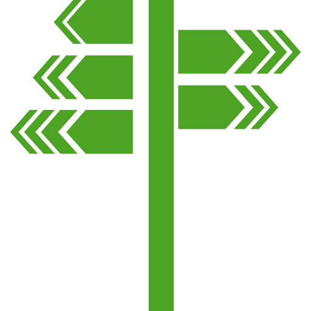

<!--suppress CssUnusedSymbol, JSUnusedLocalSymbols -->
<style>
/* Navigation Menu Styles */
#nav-menu {
  position: fixed;
  top: 0;
  left: 0;
  width: 100%;
  background: linear-gradient(135deg, #3464e1 0%, #764ba2 100%); /* Navbar color */
  color: white;
  padding: 15px 0; /* Navbar height */
  z-index: 1000;
  display: flex;
  justify-content: space-between; /* Space between items */
  align-items: center; /* Vertically align items */
  box-shadow: 0 4px 8px rgba(0, 0, 0, 0.2);
}

h1, h2 {
  color: #6951af !important;
}

code .nx,
code .n,
code .py,
code .p {
  color: #24292e !important;
}

.language-plaintext.highlighter-rouge > .highlight > pre.highlight > code {
  color: #24292e !important;
}

code.language-plaintext.highlighter-rouge {
  color: #EB5757 !important;                 /* strong red text */
  border-radius: 4px;                        /* rounded corners */
  padding: 0.2em 0.4em;                      /* small breathing space */
}

.image-row {
  display: flex;
  overflow-x: auto;
  border: 2px solid #ccc;
  padding: 6px;
  border-radius: 8px;
  gap: 5px;
  align-items: flex-start;
}

.image-item {
  width: 240px !important;
  height: auto !important;
  display: block !important;
  flex-shrink: 0 !important;
}

.linked-image {
  display: block !important;
  flex-shrink: 0 !important;
}

.markdown-body {
    font-family: -apple-system, BlinkMacSystemFont, 'Segoe UI', 'Roboto', 'Helvetica Neue', Arial, sans-serif !important;
    font-weight: 400 !important;
    word-break: normal !important;
    overflow-wrap: break-word !important;
    letter-spacing: 0.02em !important;
    line-height: 1.6 !important;
    font-size: 16px !important;
}

#nav-menu a {
  color: white;
  text-decoration: none;
  margin: 0 14px;
  font-weight: bold;
  font-size: 14px;
  transition: color 0.3s ease;
}

#nav-menu > div:first-child a {
  font-size: 13px;
  margin: 0 7px;
  padding: 5px 11px;
  border-radius: 20px;
  background: rgba(255, 255, 255, 0.1);
  transition: all 0.3s ease;
  font-weight: 700; /* Increase from bold to 700 */
  -webkit-font-smoothing: antialiased; /* Better text rendering */
  -moz-osx-font-smoothing: grayscale;
}

#nav-menu > div:first-child a.active {
  background: linear-gradient(135deg, #f093fb 0%, #f5576c 100%);
  color: white;
}

#nav-menu > div:first-child a:hover {
  background: rgba(255, 255, 255, 0.25); /* Brighter white overlay */
  color: white;
  transform: translateY(-1px);
}

/* Home button styles */
#home-button {
  color: white;
  text-decoration: none;
  font-weight: 700;
  font-size: 13px;
  padding: 5px 11px;
  border-radius: 50%; /* Changed from 20px to make it circular */
  background: rgba(255, 255, 255, 0.1);
  transition: all 0.3s ease;
  -webkit-font-smoothing: antialiased;
  -moz-osx-font-smoothing: grayscale;
  margin-right: 10px;
  display: inline-flex;
  align-items: center;
  justify-content: center;
}

#home-button svg {
  width: 16px;
  height: 22px;
  fill: currentColor;
}

/* Adjust content padding for the fixed navbar */
body {
  padding-top: 50px; /* Adjusted for taller navbar */
}

/* Hamburger Menu (Toggle Button) */
#nav-menu-toggle {
  display: none;
  cursor: pointer;
  font-size: 18px;
  margin-right: 20px; /* Move to the right */
  z-index: 1100; /* Ensure toggle is above menu items */
}

/* Navigation Links */
#nav-links {
  display: flex;
  flex-wrap: wrap;
  padding-right: 20px;
}

@media (max-width: 768px) {
  #nav-links {
    display: none; /* Hide links initially on mobile */
    flex-direction: column;
    align-items: center;
    background: linear-gradient(135deg, #3464e1 0%, #764ba2 100%); /* Match navbar background */
    width: 100%;
    position: absolute;
    top: 60px; /* Space below navbar */
    left: 0;
    padding: 15px 0; /* Add spacing around links */
    z-index: 1000; /* Ensure it doesn't overlap the toggle button */
  }

  #nav-links.active {
    display: flex; /* Show links when active */
  }

  #nav-links a {
    margin: 15px 0; /* Added vertical spacing */
  }

  #nav-menu-toggle {
    display: block; /* Show hamburger menu */
  }
}
</style>

<div id="nav-menu">
  <!-- Home button first -->
  <div style="margin-left: 20px; display: flex; align-items: center;">
    <a href="/" id="home-button">
      <svg viewBox="0 0 24 24" xmlns="http://www.w3.org/2000/svg">
        <path d="M12 3l9 7.5v10.5h-6v-6h-6v6H3V10.5L12 3z"/>
      </svg>
    </a>
    <a href="/projects/portal">EN</a>
    <a href="/kr/projects/portal">KR</a>
  </div>

<span id="nav-menu-toggle">☰</span>
  <div id="nav-links">
    <!-- Navigation Links will be dynamically populated -->
  </div>
</div>

<script>
  document.addEventListener("DOMContentLoaded", function () {
    const navLinksContainer = document.getElementById("nav-links");
    const toggle = document.getElementById("nav-menu-toggle");
    const headings = document.querySelectorAll("h2");

    // Remove auto-generated H1 heading completely to avoid spacing issues
    const autoGeneratedH1 = document.querySelector("h1:first-of-type");
    if (autoGeneratedH1) {
      autoGeneratedH1.remove();
    }

    // Create navigation links dynamically, excluding subheadings (###)
    headings.forEach((heading, index) => {
      if (heading.tagName === "H3") return; // Skip ### subheadings

      // Create a clean title without emojis for the nav bar
      const cleanText = heading.textContent.replace(/[\u{1F300}-\u{1FAF6}]/gu, '').trim();

      // Create an ID for each heading if not already present
      if (!heading.id) {
        heading.id = "section-" + index;
      }

      // Create navigation link
      const navLink = document.createElement("a");
      navLink.href = "#" + heading.id;
      navLink.textContent = cleanText;
      navLinksContainer.appendChild(navLink);
    });

    // Add click event for hamburger toggle
    toggle.addEventListener("click", () => {
      navLinksContainer.classList.toggle("active");
    });

    // Adjust scroll behavior to account for fixed navbar height
    const adjustScroll = (e, href) => {
      e.preventDefault();
      const target = document.querySelector(href);
      if (target) {
        window.scrollTo({
          top: target.offsetTop - 75, // Offset for navbar height
          behavior: 'smooth'
        });
      }
    };

    // Handle nav bar links
    document.querySelectorAll('#nav-links a').forEach(anchor => {
      anchor.addEventListener('click', function (e) {
        adjustScroll(e, this.getAttribute('href'));
        navLinksContainer.classList.remove('active'); // Collapse the dropdown
      });
    });

    // Handle all markdown links with hash anchors
    document.querySelectorAll('a[href^="#"]').forEach(anchor => {
      anchor.addEventListener('click', function (e) {
        adjustScroll(e, this.getAttribute('href'));
      });
    });

    // Fix EN/KR active states based on current page
    function updateLanguageButtons() {
      const currentPath = window.location.pathname;
      const enButton = document.querySelector('a[href="/projects/portal"]');
      const krButton = document.querySelector('a[href="/kr/projects/portal"]');
      
      // Remove active class from both buttons first
      if (enButton) enButton.classList.remove('active');
      if (krButton) krButton.classList.remove('active');
      
      // Check for KR pages first (more specific)
      if (currentPath.includes('/kr')) {
        if (krButton) krButton.classList.add('active');
      } 
      // Then check for EN pages (root, index, etc.)
      else {
        if (enButton) enButton.classList.add('active');
      }
    }

    function updateHomeButton() {
      const currentPath = window.location.pathname;
      const homeButton = document.getElementById('home-button');
      
      if (homeButton) {
        if (currentPath.includes('/kr')) {
          homeButton.href = '/kr';
        } else {
          homeButton.href = '/';
        }
      }
    }

    // Update buttons on page load
    updateLanguageButtons();
    updateHomeButton();
    
    // Update buttons when navigation occurs (for SPAs)
    window.addEventListener('popstate', function() {
      updateLanguageButtons();
      updateHomeButton();
    });
  });
</script>

<div style="position: relative; margin-bottom: 40px;">


<div style="position:absolute;left:40px;bottom:-10px;width:80px;height:80px;background:white;border-radius:20px;display:flex;align-items:center;justify-content:center;box-shadow:0 2px 6px rgba(0,0,0,0.15);">

</div>

</div>

# Government Portal App

## 📝 Overview
**📌 App Introduction:** Android app for the official [government portal](https://www.redpinar.gob.cu/) of the city of Pinar del Rio, Cuba  
**🕒 Duration:** February 2021 ~ April 2021  
**📱 Platform:** Native Android app  
**🏢 Company:** Desoft (Cuba's national software development company)  
**👥 Team Size:** 2 developers  
**💼 Role:** Responsible for legacy code modernization and development of citizen service module  
**🛠️ Key Technologies:** `Kotlin` `MVVM` `Retrofit` `Room` `Jetpack` `ViewPager2` `WebView` `JavaScript` `Coroutines` `Moshi`  
**🔗 GitHub:** [daehan-lim/government-portal-app](https://github.com/daehan-lim/government-portal-app)

<div style="display: flex; overflow-x: auto; border: 2px solid #ccc; padding: 6px; border-radius: 8px;">
  
  
  
  
   
</div>
<span style="display: block; height: 11px;"></span>

## 📖 Project Background
There was a growing need to develop a mobile app that would allow citizens of Pinar del Río, Cuba, to seamlessly access the government portal, which had previously been limited to the existing website. The website was optimized for desktop use, causing inconvenience for mobile users when submitting government requests, accessing local information, or using administrative services. In particular, urgent improvements were needed in mobile accessibility to core services such as access to district representative information, tracking the status of civil requests, and browsing local classified listings. This led to developing a government portal app to provide intuitive mobile services for citizens. As part of this project, I was responsible for modernizing the existing legacy codebase.

## 🛠️ Tech Stack

[](https://kotlinlang.org)
[](https://developer.android.com/topic/architecture)
[](https://developer.android.com/training/data-storage/room)
[](https://square.github.io/retrofit)
[](https://developer.android.com/jetpack)
[](https://kotlinlang.org/docs/coroutines-overview.html)
[](https://developer.android.com/jetpack/androidx/releases/viewpager2)
[](https://developer.android.com/topic/libraries/architecture/livedata)
[](https://developer.android.com/topic/libraries/data-binding)
[](https://developer.android.com/topic/libraries/view-binding)
[](https://github.com/square/moshi)
[](https://developer.android.com/reference/android/webkit/WebView)
[](https://www.w3.org/html/)
[](https://developer.mozilla.org/en-US/docs/Web/JavaScript)
[](https://material.io/design)

## 📋 Project Structure
```
├── data/                                    # Data layer
│   ├── database/                            # Room local database
│   │   └── classifieddatabase/              # Local property database
│   │       ├── Classified.kt                # Property information entity
│   │       ├── ClassifiedDao.kt             # Data access object
│   │       └── ClassifiedDatabase.kt        # Database configuration
│   ├── model/                               # Data model classes
│   │   ├── DelegateData.kt                  # Local representative information
│   │   ├── ClassifiedApi.kt                 # Property API response model
│   │   ├── Municipality.kt                  # Administrative district model
│   │   └── gestiondelegado/                 # Representative management models
│   └── network/                             # Network communication layer
│       └── PortalGobiernoApiService.kt      # REST API service
├── ui/                                      # Presentation layer
│   ├── classified/                          # Local property features
│   │   ├── ClassifiedFragment.kt            # Property listings screen
│   │   ├── ClassifiedViewModel.kt           # Property business logic
│   │   ├── ClassifiedAdapter.kt             # RecyclerView adapter
│   │   └── classifieddetail/                # Property detail information
│   ├── gestiondelegado/                     # Local representative management
│   │   ├── GestionDelegadoFragment.kt       # Representative menu screen
│   │   └── gestiondelegadosection/          # Representative service tabs
│   │       ├── GestionSectionActivity.kt    # ViewPager2-based tab interface
│   │       ├── GestionSectionViewModel.kt   # Shared business logic
│   │       ├── DelegadoDataFragment.kt      # Representative information lookup
│   │       ├── DispatchFragment.kt          # Online civil petition submission
│   │       └── ProcedureFollowUpFragment.kt # Civil petition tracking
│   └── goverment/                           # Government services WebView
│       └── GovernmentFragment.kt            # JavaScript injection WebView
├── misc/                                    # Utilities and common features
│   ├── Util.kt                              # Date formatting and other utilities
│   └── Converters.kt                        # Room type converters
└── BindingUtils.kt                          # Data binding adapters
```

## 🌟 Key Contributions
- Modernized the legacy codebase by adopting MVVM architecture, coroutines, and Jetpack components
- Implemented the district representative management system with automated administrative workflows for civil request submission, meeting schedule management, and processing status tracking using Retrofit/Moshi integration
- Built the local classifieds feed system with REST API integration, offline data caching, real-time synchronization, image carousel, and network status monitoring
- Integrated the Provincial Assembly portal by optimizing the desktop-oriented UI for mobile through WebView and JavaScript-based customization

## 🚀 Results and Impact
- Improved app stability and maintainability through legacy code modernization
- Streamlined administrative processes by automating civil request workflows
- Enhanced mobile accessibility with an offline-first design

<br><br><br>