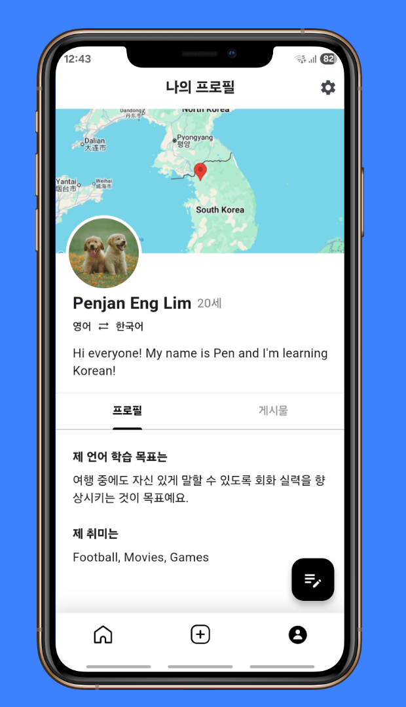
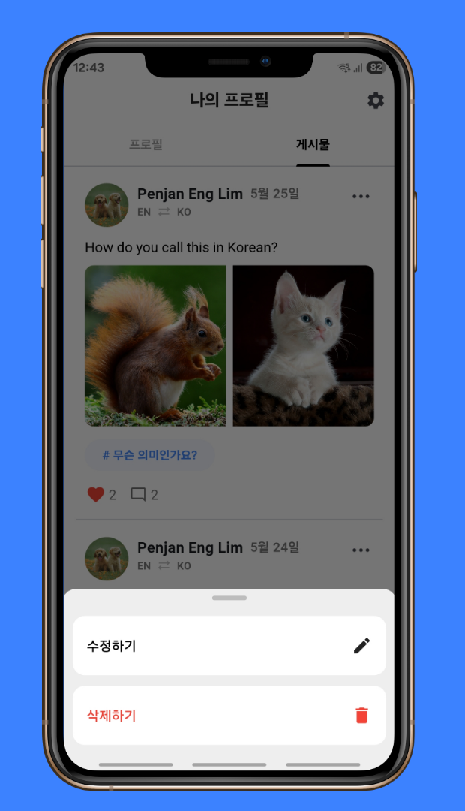
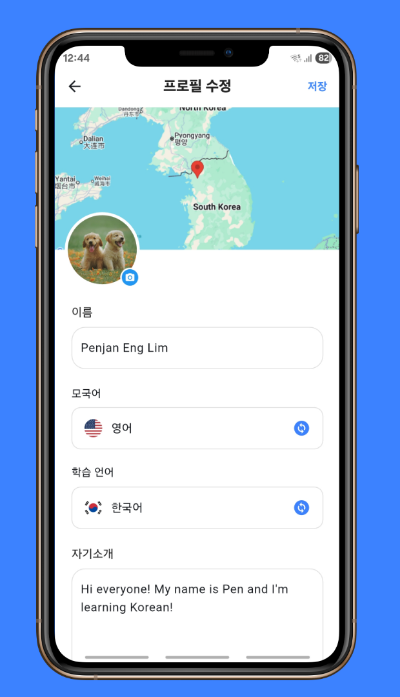
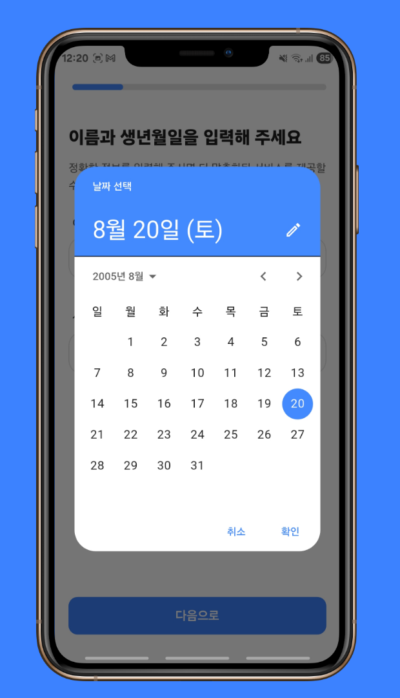
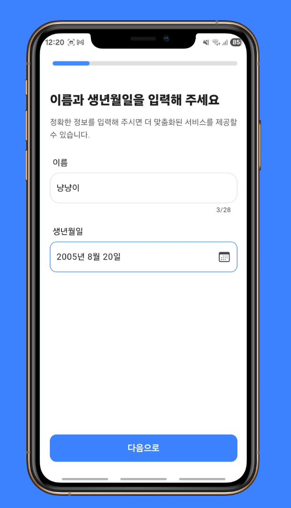
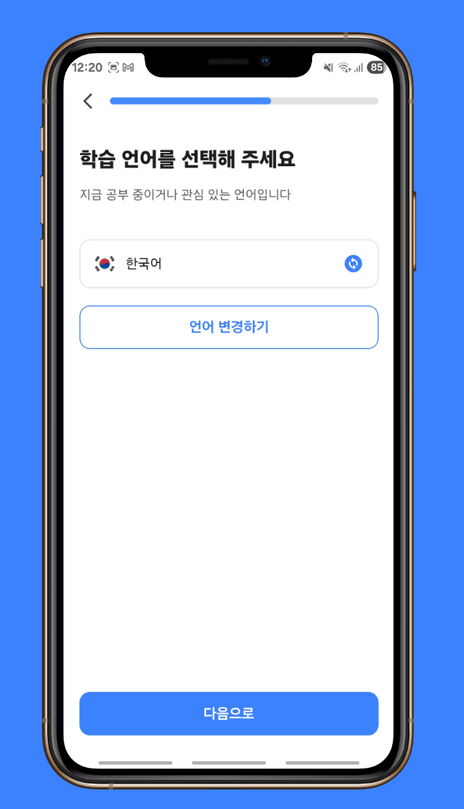
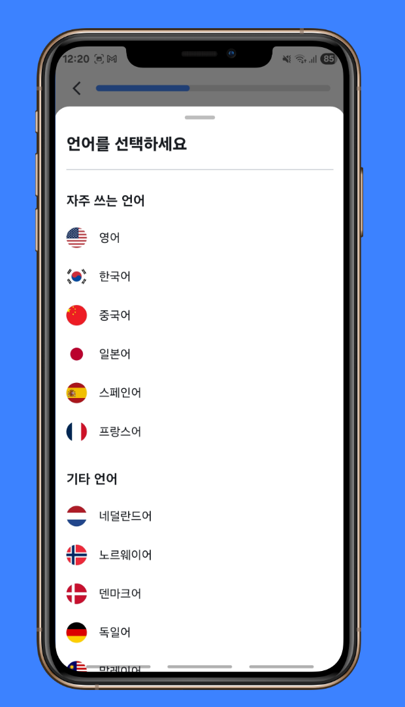
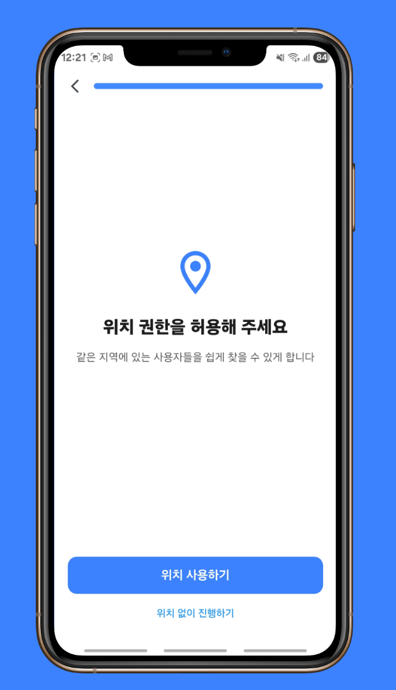
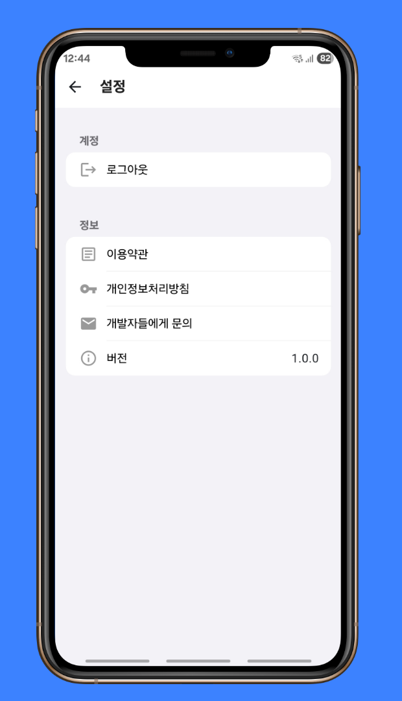
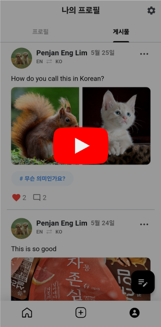

<!--suppress CssUnusedSymbol, JSUnusedLocalSymbols -->
<style>
/* Navigation Menu Styles */
#nav-menu {
  position: fixed;
  top: 0;
  left: 0;
  width: 100%;
  background: linear-gradient(135deg, #3464e1 0%, #764ba2 100%); /* Navbar color */
  color: white;
  padding: 15px 0; /* Navbar height */
  z-index: 1000;
  display: flex;
  justify-content: space-between; /* Space between items */
  align-items: center; /* Vertically align items */
  box-shadow: 0 4px 8px rgba(0, 0, 0, 0.2);
}

h1, h2 {
  color: #6951af !important;
}

code .nx,
code .n,
code .py,
code .p {
  color: #24292e !important;
}

.language-plaintext.highlighter-rouge > .highlight > pre.highlight > code {
  color: #24292e !important;
}

code.language-plaintext.highlighter-rouge {
  color: #EB5757 !important;                 /* strong red text */
  border-radius: 4px;                        /* rounded corners */
  padding: 0.2em 0.4em;                      /* small breathing space */
}

.image-row {
  display: flex;
  overflow-x: auto;
  border: 2px solid #ccc;
  padding: 6px;
  border-radius: 8px;
  gap: 5px;
  align-items: flex-start;
}

.image-item {
  width: 240px !important;
  height: auto !important;
  display: block !important;
  flex-shrink: 0 !important;
}

.linked-image {
  display: block !important;
  flex-shrink: 0 !important;
}

.markdown-body {
    font-family: 'Noto Sans KR', -apple-system, BlinkMacSystemFont, 'Segoe UI', sans-serif !important;
    font-weight: 400 !important;
    word-break: keep-all !important;
    letter-spacing: -0.3px !important;
    line-height: 1.8 !important;
    font-size: 17px !important;
}

#nav-menu a {
  color: white;
  text-decoration: none;
  margin: 0 15px;
  font-weight: bold;
  font-size: 14px;
  transition: color 0.3s ease;
}

#nav-menu > div:first-child a { 
    margin: 0 10px;
}

#nav-menu a:hover {
  color: #f1c40f;
}

/* Adjust content padding for the fixed navbar */
body {
  padding-top: 75px; /* Adjusted for taller navbar */
}

/* Hamburger Menu (Toggle Button) */
#nav-menu-toggle {
  display: none;
  cursor: pointer;
  font-size: 18px;
  margin-right: 20px; /* Move to the right */
  z-index: 1100; /* Ensure toggle is above menu items */
}

/* Navigation Links */
#nav-links {
  display: flex;
  flex-wrap: wrap;
  padding-right: 20px;
}

@media (max-width: 768px) {
  #nav-links {
    display: none; /* Hide links initially on mobile */
    flex-direction: column;
    align-items: center;
    background: linear-gradient(135deg, #3464e1 0%, #764ba2 100%); /* Match navbar background */
    width: 100%;
    position: absolute;
    top: 60px; /* Space below navbar */
    left: 0;
    padding: 15px 0; /* Add spacing around links */
    z-index: 1000; /* Ensure it doesn't overlap the toggle button */
  }

  #nav-links.active {
    display: flex; /* Show links when active */
  }

  #nav-links a {
    margin: 15px 0; /* Added vertical spacing */
  }

  #nav-menu-toggle {
    display: block; /* Show hamburger menu */
  }
}
</style>

<div id="nav-menu">
  <div style="margin-left: 20px;">
    <a href="/" class="active"></a> 
  </div>

<span id="nav-menu-toggle">☰</span>
  <div id="nav-links">
    <!-- Navigation Links will be dynamically populated -->
  </div>
</div>

<script>
  document.addEventListener("DOMContentLoaded", function () {
    const navLinksContainer = document.getElementById("nav-links");
    const toggle = document.getElementById("nav-menu-toggle");
    const headings = document.querySelectorAll("h2");

    // Remove auto-generated H1 heading completely to avoid spacing issues
    const autoGeneratedH1 = document.querySelector("h1:first-of-type");
    if (autoGeneratedH1) {
      autoGeneratedH1.remove();
    }

    // Create navigation links dynamically, excluding subheadings (###)
    headings.forEach((heading, index) => {
      if (heading.tagName === "H3") return; // Skip ### subheadings

      // Create a clean title without emojis for the nav bar
      const cleanText = heading.textContent.replace(/[\u{1F300}-\u{1FAF6}]/gu, '').trim();

      // Create an ID for each heading if not already present
      if (!heading.id) {
        heading.id = "section-" + index;
      }

      // Create navigation link
      const navLink = document.createElement("a");
      navLink.href = "#" + heading.id;
      navLink.textContent = cleanText;
      navLinksContainer.appendChild(navLink);
    });

    // Add click event for hamburger toggle
    toggle.addEventListener("click", () => {
      navLinksContainer.classList.toggle("active");
    });

    // Adjust scroll behavior to account for fixed navbar height
    const adjustScroll = (e, href) => {
      e.preventDefault();
      const target = document.querySelector(href);
      if (target) {
        window.scrollTo({
          top: target.offsetTop - 75, // Offset for navbar height
          behavior: 'smooth'
        });
      }
    };

    // Handle nav bar links
    document.querySelectorAll('#nav-links a').forEach(anchor => {
      anchor.addEventListener('click', function (e) {
        adjustScroll(e, this.getAttribute('href'));
        navLinksContainer.classList.remove('active'); // Collapse the dropdown
      });
    });

    // Handle all Markdown links with hash anchors
    document.querySelectorAll('a[href^="#"]').forEach(anchor => {
      anchor.addEventListener('click', function (e) {
        adjustScroll(e, this.getAttribute('href'));
      });
    });
  });
</script>

<div style="position: relative; margin-bottom: 40px;">


</div>

# ShareLingo - Language Exchange Social Media App

## 📝 Overview
**📌 App Introduction:** Social media platform connecting language learners to share posts and interact with each other  
**🕒 Duration:** May 16, 2025 ~ May 27, 2025 (2 weeks)  
**📱 Platform:** Flutter cross-platform app (Android, iOS)  
**👥 Team Size:** 4 developers  
**💼 Role:** Team Leader, CI/CD pipeline, authentication system, profile management, feed filtering, Google Maps integration, onboarding flow  
**🛠️ Key Technologies:** `Flutter` `Firebase` `Riverpod` `Clean Architecture` `Google OAuth` `Firestore` `Cloud Functions` `GitHub Actions` `VWorld API`  
**🔗 GitHub:** [zero-to-one-flutter/flutter-share-lingo](https://github.com/zero-to-one-flutter/flutter-share-lingo)  
**🔗 Play Store:** [ShareLingo on Play Store](https://play.google.com/store/apps/details?id=com.zerotoone.sharelingo&hl=kr)

<div class="image-row">
  
  
  
  
  
  
  
  
  
  
   
</div>
<span style="display: block; height: 11px;"></span>

## 📖 Project Background

- There are approximately [1.5 billion](https://www.thoughtco.com/how-many-people-learn-english-globally-1210367) language learners worldwide, with [68%](https://www.lingomelo.com/blog-page/language-learning-statistics) struggling with grammar and [53%](https://www.lingomelo.com/blog-page/language-learning-statistics) facing vocabulary challenges. Many learners lack opportunities to practice with native speakers, creating a significant gap in practical language experience.
- Social platforms designed for language learning provide students with natural environments to practice and exchange language and cultural knowledge, supplementing traditional classroom methods.
- Language learners need efficient ways to find practice partners who can help them—someone whose native language matches their target language, and vice versa.
- The project aims to connect language exchange partners through smart filtering based on their native and target languages and their geographic proximity, providing a natural language practice environment through social feed interactions.

## 🛠️ Tech Stack

[](https://flutter.dev)
[](https://dart.dev/)
[](https://riverpod.dev/)
[](https://blog.cleancoder.com/uncle-bob/2012/08/13/the-clean-architecture.html)
[](https://firebase.google.com/)
[](https://firebase.google.com/products/firestore)
[](https://firebase.google.com/products/functions)
[](https://developers.google.com/identity)
[](https://firebase.google.com/products/crashlytics)
[](https://github.com/features/actions)
[](https://developers.google.com/maps)
[](https://developer.android.com/topic/architecture)
[](https://firebase.google.com/products/auth)
[](https://www.vworld.kr/)
[](https://pub.dev/packages/geolocator)
[](https://pub.dev/packages/cached_network_image)
[](https://pub.dev/packages/dio)
[](https://pub.dev/packages/mocktail)
[](https://firebase.google.com/products/storage)
[](https://pub.dev/packages/image_picker)
[](https://pub.dev/packages/shared_preferences)
[](https://pub.dev/packages/url_launcher)

## 📋 Project Structure

```
├── app/                               # App-wide settings, constants, and themes
│   ├── constants/                     # App constant definitions
│   │   ├── app_colors.dart            # Color scheme definitions
│   │   ├── app_constants.dart         # Constant values (language lists, tags, etc.)
│   │   └── app_styles.dart            # Style definitions
│   └── theme.dart                     # App theme configuration

├── core/                              # Core functionality and utilities
│   ├── exceptions/                    # App-wide exception classes
│   ├── extensions/                    # Extension method definitions
│   ├── providers/                     # Common providers
│   ├── ui_validators/                 # UI validation utilities
│   └── utils/                         # Utility functions
│       ├── dialogue_util.dart         # Dialog utilities
│       ├── format_time_ago.dart       # Time formatting utilities
│       ├── general_utils.dart         # General utility functions
│       ├── geolocator_util.dart       # Location utilities
│       ├── logger.dart                # Logging utilities
│       ├── map_url_util.dart          # Map URL generation utilities
│       ├── navigation_util.dart       # Navigation utilities
│       ├── snackbar_util.dart         # Snackbar utilities
│       └── throttler_util.dart        # Throttling utilities

├── data/                              # Data layer and data access
│   ├── data_source/                   # Data source classes
│   ├── dto/                           # Data Transfer Objects
│   └── repository/                    # Repository implementations

├── domain/                            # Business logic and entities
│   ├── entity/                        # Domain entities
│   ├── repository/                    # Repository interfaces
│   └── usecase/                       # Use cases

├── presentation/                      # UI layer
│   ├── pages/                         # App screens
│   │   ├── home/                      # Home screen (example)
│   │   │   ├── home_page.dart         # Home page
│   │   │   ├── home_view_model.dart   # Home view model
│   │   │   └── widgets/               # Home screen widgets
│   ├── widgets/                       # Common widgets
│   └── user_global_view_model.dart    # Global user view model

├── main.dart                          # App entry point
```

## 🌟 Key Achievements & Implementation

### Project Leadership and Development Process Management

- **Led 4-person development team from concept through Play Store deployment**
  - Oversaw entire product lifecycle including planning, development, testing, and launch
  - Managed task allocation and tracked feature development progress across team members through daily scrum meetings

- **Established technical standards and development practices**
  - Drove technology stack selection, Clean Architecture pattern adoption, and overall system architecture decisions
  - Required code review approval for all pull requests and personally reviewed submissions, maintaining consistent quality standards and reducing bug occurrence by **50%**
  - Guided team discussions for UI improvements and optimized user experience across different screens
  - Established Git branching strategy to improve team collaboration efficiency
  - Implemented consistent coding standards to improve code readability and maintainability

### CI/CD Pipeline Implementation

- **Built GitHub Actions-based CI/CD pipeline, improving development efficiency by 70%**
  - Automated testing and `flutter analyze` code quality checks on every pull request, reducing manual review time by **50%**
  - Streamlined QA process with automatic APK builds uploaded to `GitHub Artifacts` when pushing to `test-apk` branch
  - Secured sensitive configuration data by Base64-encoding `Firebase` files and storing them in `GitHub Secrets`

### Google OAuth Authentication and User Management System

- **Implemented seamless social login**
  - Built one-click authentication system using `Google Sign-In` with `Firebase Authentication`
  - Created routing logic that automatically directs new users to onboarding and existing users to the feed

- **Built comprehensive user profile system**
  - Developed complete profile screen and profile editing functionality
  - Implemented settings page with logout functionality
  - Managed multidimensional user information including name, birthdate, language preferences, bio, hobbies, and location
  - Used PopScope to prevent accidental data loss when users navigate away from editing screens

- **Google Maps Static API integration**
  - Implemented personalized map backgrounds centered on user location using `Google Maps Static API`
  - Protected user privacy by limiting zoom levels to show approximate area rather than specific addresses
  - Implemented automatic fallback to default image when map loading fails

### Multi-step Onboarding and Location-based Matching

- **Created user-friendly 5-step onboarding**
  - Broke complex signup process into digestible steps to reduce user dropoff
  - Added real-time validation at each step (age verification, preventing users from selecting the same native and target languages)

- **Integrated VWorld API for location services**
  - Connected to `VWorld API` to convert GPS coordinates into district-level location data
  - Built robust permission handling for various location access scenarios
  - Enabled location-based filtering to help users find nearby language partners

### Customized Feed System with 4 Targeted Tabs

- `All` tab: Chronological feed of all user posts
- `Recommended` tab: Shows posts from users whose native language is your target language and whose target language is your native language—perfect for mutual language exchange
- `Peers` tab: Displays posts from users learning the same language combination as you, providing study motivation and shared experiences
- `Nearby` tab: Features posts from users in your district, enabling potential offline meetups

### Firebase Backend Automation and Security

- **Automated data consistency with Cloud Functions**
  - Built triggers that automatically update user information across all posts and comments when profiles change
  - Implemented cleanup functions that remove associated data when users or posts are deleted
  - Created real-time comment counting system that updates post metadata instantly
  - Added automatic timestamp updates when posts receive new activity

- **Implemented comprehensive Firestore Security Rules**
  - Created user-specific access controls ensuring users can only modify their own content
  - Applied detailed permissions for likes and comments, preventing unauthorized modifications

### Terms of Service and Privacy Policy

- Built consent flow for app first-launch requiring users to accept terms and privacy policy
- Used `SharedPreferences` to remember consent status and avoid repeated prompts
- Integrated `URL Launcher` for in-app access to legal documents, also available through settings

### Architecture, Testing, and Error Handling

- **Implemented full Clean Architecture**
  - Separated concerns across Data, Domain, and Presentation layers with clear boundaries
  - Used `Riverpod` dependency injection allowing all classes to receive dependencies through constructors, enabling easy Mock object substitution for testing
  - Applied `Repository` pattern for data abstraction, allowing potential migration from `Firebase` to other backends without business logic changes

- **Built comprehensive testing suite**
  - Created unit tests covering all authentication logic layers for code reliability
  - Used `Mocktail` to isolate external dependencies, enabling tests to run without `Firebase` or `Google Sign-In` connections
  - Covered multiple scenarios including success cases, failures, and user cancellations
  - Implemented Provider overrides to inject Mock dependencies in test environments

- **Enhanced code quality and monitoring**
  - Integrated custom logging with `Firebase Crashlytics` for real-time error tracking and analysis
  - Created reusable UI components to maintain design consistency and speed up development
  - Completely separated DTO and Entity layers to minimize impact of database schema changes on business logic
  - Used `.env` files for environment-specific configuration while protecting sensitive data
  - Designed custom exception classes that provide clear, actionable error messages

## 🧭 Technical Decision-Making

**1. Clean Architecture and Dependency Injection Pattern**

- **Requirements**
  Team needed a scalable structure to manage complex features, minimize merge conflicts, and support future expansion and maintenance

- **Decision**
  Adopted `Clean Architecture` with `Riverpod` dependency injection
  - **Clear layer separation**: Presentation handles UI, Domain contains business logic, Data manages external services
    - **Presentation**: UI components, ViewModels, user interactions
    - **Domain**: Business rules (UseCases), entities, Repository contracts
    - **Data**: External APIs (Firebase, REST), Repository implementations, DTOs
  - **Dependency inversion**: Repository interfaces live in Domain layer, implementations in Data layer, preventing high-level modules from depending on low-level details
  - **Testability**: Constructor injection throughout enables Mock object substitution for isolated unit testing
  - **Team consistency**: Uniform patterns across codebase improved code review efficiency and maintainability

```dart
// Repository Interface (Domain Layer)
abstract class AuthRepository {
  Future<AppUser?> signInWithGoogle();
  Future<void> signOut();
  Stream<String?> authStateChanges();
}

// Repository Implementation (Data Layer)
class AuthRepositoryImpl implements AuthRepository {
  final GoogleSignInDataSource _googleSignIn;
  final FirebaseAuthDataSource _firebaseAuth;
  final UserDataSource _userDataSource;

  AuthRepositoryImpl(this._googleSignIn, this._firebaseAuth, this._userDataSource);
  // Implementation...
}

// Dependency Injection Setup
final authRepositoryProvider = Provider<AuthRepository>(
  (ref) => AuthRepositoryImpl(
    ref.read(googleSignInDataSourceProvider),
    ref.read(firebaseAuthDataSourceProvider),
    ref.read(userFirestoreDataSourceProvider),
  ),
);
```

**2. GeoPoint Extension for Distance Calculations**

- **Requirements**
  Need intuitive way to show users how far apart they are from potential language partners

- **Decision**
  Created `GeoPoint Extension` with distance calculation methods
  - **Convenience**: Extension methods enable clean usage like `geoPoint.distanceFrom(otherPoint)` anywhere in the codebase
  - **Performance**: Client-side calculations provide immediate results without server roundtrips
  - **Accuracy**: Leveraged Geolocator package's `distanceBetween` method for precise calculations accounting for Earth's curvature
  - **Separation of concerns**: Distance formatting (e.g., `"3.2 km"`) handled in presentation layer, keeping logic focused

```dart
extension GeoPointExtensions on GeoPoint {
  double distanceFrom(GeoPoint other) {
    final distanceInMeters = Geolocator.distanceBetween(
      latitude, longitude, other.latitude, other.longitude,
    );
    return distanceInMeters / 1000;
  }
}

// Usage in UserGlobalViewModel
String? calculateDistanceFrom(GeoPoint? otherLocation) {
  final userLocation = state?.location;
  if (userLocation == null || otherLocation == null) return null;
  final distanceKm = userLocation.distanceFrom(otherLocation);
  return '${distanceKm.toStringAsFixed(1)} km';
}
```

## 🌱 Problem Solving

**1. Onboarding User Experience Optimization**

- **Problem**
  Users were abandoning the app when location permission requests were denied, either permanently or temporarily. The app couldn't distinguish between different types of denials, so users received generic error messages without clear next steps.

- **Analysis Process**
  - Studied Geolocator package permission states and user flow implications
  - Recognized that location features should be optional, not required for core app functionality
  - Identified need to provide clear guidance and alternatives for each permission scenario

- **Solution**
  - Created specific handling for 4 distinct location permission states:
    - `success`: Location acquired successfully
    - `deniedTemporarily`: User can be asked again—show retry guidance
    - `deniedForever`: User blocked permission—provide settings navigation instructions
    - `error`: Technical issue—offer retry or alternative path
  - Added "Continue without location" option to ensure users can always proceed

```dart
enum LocationStatus { success, deniedTemporarily, deniedForever, error }

Future<(LocationStatus, Position?)> getPosition() async {
  try {
    final permission = await Geolocator.checkPermission();
    
    if (permission == LocationPermission.denied ||
        permission == LocationPermission.deniedForever) {
      final requested = await Geolocator.requestPermission();
      
      if (requested == LocationPermission.denied) {
        return (LocationStatus.deniedTemporarily, null);
      }
      
      if (requested == LocationPermission.deniedForever) {
        return (LocationStatus.deniedForever, null);
      }
    }
    
    final position = await Geolocator.getCurrentPosition(
      locationSettings: const LocationSettings(
        accuracy: LocationAccuracy.high,
        distanceFilter: 100,
      ),
    );
    
    return (LocationStatus.success, position);
  } catch (e) {
    return (LocationStatus.error, null);
  }
}
```

- **Results**
  Improved onboarding completion rate by **35%** through clearer guidance and alternative pathways

**2. Firebase Configuration in GitHub Actions**

- **Problem**
  CI pipeline needed `firebase_options.dart` file to build the app, but this file contains sensitive data and can't be committed to version control. This caused build failures with missing file errors.

- **Initial approach**
  - Tried copying file contents directly into GitHub Secrets
  - Failed due to multiline content and special characters breaking the secret storage

- **Root cause analysis**
  GitHub Secrets handle multiline and special characters inconsistently, and we needed separate configuration files for different platforms (iOS/Android)

- **Solution**
  - Encoded all Firebase configuration files using Base64 to create single-line, safe text strings
  - Stored encoded versions in GitHub Secrets
  - Modified CI workflow to decode files at build time and place them in correct directories

```yml
- name: Decode firebase_options.dart
  run: |
    mkdir -p lib
    echo "${{ secrets.FIREBASE_DART_OPTIONS }}" | base64 --decode > lib/firebase_options.dart
```

- **Results**
  Eliminated configuration-related build failures and established reliable automated deployment pipeline

**3. Profile Update Data Synchronization**

- **Problem**
  When users updated their profiles, changes needed to propagate to all their existing posts and comments. Client-side batch updates risked partial failures due to network issues or app crashes, potentially leaving data in inconsistent states.

- **Analysis**
  - **Client-side limitations**: Large batch operations vulnerable to interruption, leading to partial updates
  - **Server-side advantages**: Firebase Cloud Functions provide transaction guarantees and reliable execution

- **Solution**
  - Implemented Cloud Functions triggers that detect profile changes and automatically update related content
  - Used `collectionGroup` queries to efficiently find and update comments across all posts
  - Leveraged Promise.all for parallel processing to optimize performance while maintaining data integrity

- **Results**
  Ensured complete data consistency across all user-generated content while maintaining optimal update performance

## 🎞️ Video Demo
<div align="center"> 
<a href="https://www.youtube.com/watch?v=z3Bbhermz1M">
  
</a>
</div>
<br>
