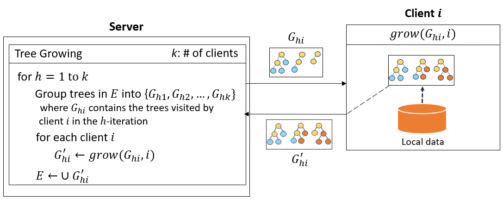

# Example Portfolio Page

# 🧩 Overview of All Projects

<!-- Shopping Project -->

  
  
<strong>🛒 Shopping</strong> 
  쿠폰 모음 코딩 
  <code>Kingfisher</code> <code>Lottie</code> <code>SnapKit</code> <code>Combine</code> <code>SwiftUI</code> 
  <small>24.01.29 - 24.02.10 (2주)</small>

<!-- Catcher Project -->

  
  
<strong>🎭 Catcher (캐처)</strong> 
  미러AI분석을 활용한 카메라 소개팅 앱 서비스 
  <code>Alamofire</code> <code>CoreML</code> <code>Combine</code> <code>Firebase</code> <code>SnapKit</code> 
  <small>23.10.10 - 23.11.17 (6주)</small>

<!-- TipCalculator Project -->

  
  
<strong>🧮 TipCalculator</strong> 
  Combine과 MVVM 패턴을 사용한 팁 계산기 
  <code>MVVM</code> <code>Combine</code> <code>CombineCocoa</code> <code>SnapKit</code> 
  <small>23.09.12 - 23.09.18 (1주)</small>

<!-- MobydickNews Project -->

  
  
<strong>📰 MobydickNews</strong> 
  News API를 사용하는 뉴스 앱 
  <code>RxAlamofire</code> <code>RxSwift</code> <code>REST API</code> <code>SnapKit</code> 
  <small>23.08.25 - 23.09.10 (2주)</small>

<!-- PlanBee Project -->

  
  
<strong>📅 플랜비 (PlanBee)</strong> 
  할일관리 Todo 앱 
  <code>CoreData</code> <code>Combine</code> <code>FSCalendar</code> <code>SwiftLint</code> <code>Firebase</code> 
  <small>23.07.10 - 23.08.02 (4주)</small>

---

# 🎯 Project 1 - Catcher (캐처)

**📌 Topic:** 머신러닝을 활용한 캐리커쳐 소개팅 앱 서비스  
**🕒 개발 기간:** 23.10.10 ~ 23.11.17 (6주)  
**👥 개발 인원:** iOS(5명)  
**🛠️ Skills:**  
<code>Alamofire</code> <code>CoreML</code> <code>Combine</code> <code>Firebase</code> <code>SnapKit</code> <code>MessageKit</code> <code>LicensePlist</code> <code>SDWebImage</code>
🔗 [AppStore에서 보기](https://apps.apple.com/kr/app/id3818930)  
🔗 [GitHub에서 보기](https://apps.apple.com/kr/app/id3818930)

---

## 📚 Index

🟩 **Topic Selection Background**  
🗺️ **Diagram**  
💻 **Tech Stack**  
🤔 **Technical Decision**  
🌱 **Troubleshooting**  
✨ **Features**  
👤 **Part**  
🖼️ **Screenshot**

  

## 🟩 Topic Selection Background

- 본인의 사진을 직접적으로 노출하기 부담스러워 하는 사용자들을 위해, 사용자들이 부담 없이 자신을 자유롭게 표현하고 더욱 흥미로운 소개팅을 즐길 수 있도록 새로운 만남의 기회를 제공하기 위해 주제 선정

---

## 🗺️ Diagram

  

## 💻 Tech Stack

<code>CoreML</code>, <code>CompositionalLayout</code>, <code>Combine</code>, <code>DiffableDataSource</code>, <code>ImageCache</code>, <code>Swift Concurrency</code>

## 🤔 Technical Decision

기기 자체에서 모델을 실행함으로 네트워크에 연결할 필요 없이 앱의 반응을 보장하면서 사용자 데이터를 비공개로 유지할 수 있기 때문에 **CoreML**을 사용하기로 결정.

  

    
<strong>1. CoreML을 사용한 이유</strong>

    
기기 자체에서 모델을 실행함으로 네트워크에 연결할 필요 없이 앱의 반응을 보장하면서 사용자 데이터를 비공개로 유지할 수 있기 때문에 <strong>CoreML</strong>을 사용하기로 결정.

    
  

  

    
    
  

**2. 회원가입 절차의 의사결정**

- **문제 확인**
    - 초기 회원가입을 위해 PASS 인증으로 본인 인증을 하려 했으나, 개인이 사용하기에는 제약조건이 많아서 사용할 수 없다고 판단 후 대체 방안을 모색함
    - 대부분의 소개팅 앱에서 회원가입 시 본인의 사진을 등록한 후 관리자의 승인을 받기 전까지 대기해야 하는 불편함을 확인

- **의사 결정**
    - `CoreML`을 사용해서 사진으로 성별을 판별하고 회원가입을 자동화 하기로 결정함 (PASS 인증 대체)
    - 성별 판별을 위해 찍은 원본 사진은 개인정보 보호를 위해 캐리커쳐로 변환 후 폐기 (Firebase에는 캐리커쳐 이미지만 저장)
    - 회원가입 시 작성한 정보와 함께 성별, 프로필 사진을 등록하여 회원가입 구현
    - 성별 판별의 정확도를 위해 `CreateML`로 직접 모델링 하기로 결정함

- **※ 제약 조건**
    - 타인의 사진으로 회원가입하는 것을 막기 위해 회원가입 시 카메라를 통해 사진을 찍은 후 해당 사진으로 성별을 판별
    - 성별 판별 → 캐리커쳐 생성은 앱 내에서 `CoreML` 모델 직접 실행
