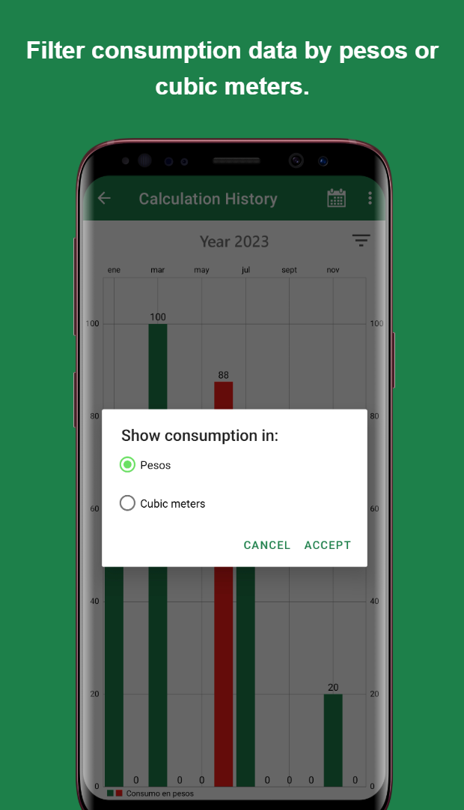

# Example Portfolio Page

# 🧩 Overview of All Projects

<div style="display: grid; grid-template-columns: repeat(auto-fit, minmax(250px, 1fr)); gap: 20px;">

<!-- Shopping Project -->
<div>
  
  <p><strong>🛒 Shopping</strong><br/>
  <span style="font-size: 0.9em;">쿠폰 모음 코딩</span><br/>
  <code>Kingfisher</code> <code>Lottie</code> <code>SnapKit</code> <code>Combine</code> <code>SwiftUI</code><br/>
  <small>24.01.29 - 24.02.10 (2주)</small></p>
</div>

<!-- Catcher Project -->
<div>
  
  <p><strong>🎭 Catcher (캐처)</strong><br/>
  <span style="font-size: 0.9em;">미러AI분석을 활용한 카메라 소개팅 앱 서비스</span><br/>
  <code>Alamofire</code> <code>CoreML</code> <code>Combine</code> <code>Firebase</code> <code>SnapKit</code><br/>
  <small>23.10.10 - 23.11.17 (6주)</small></p>
</div>

<!-- TipCalculator Project -->
<div>
  
  <p><strong>🧮 TipCalculator</strong><br/>
  <span style="font-size: 0.9em;">Combine과 MVVM 패턴을 사용한 팁 계산기</span><br/>
  <code>MVVM</code> <code>Combine</code> <code>CombineCocoa</code> <code>SnapKit</code><br/>
  <small>23.09.12 - 23.09.18 (1주)</small></p>
</div>

<!-- MobydickNews Project -->
<div>
  
  <p><strong>📰 MobydickNews</strong><br/>
  <span style="font-size: 0.9em;">News API를 사용하는 뉴스 앱</span><br/>
  <code>RxAlamofire</code> <code>RxSwift</code> <code>REST API</code> <code>SnapKit</code><br/>
  <small>23.08.25 - 23.09.10 (2주)</small></p>
</div>

<!-- PlanBee Project -->
<div>
  
  <p><strong>📅 플랜비 (PlanBee)</strong><br/>
  <span style="font-size: 0.9em;">할일관리 Todo 앱</span><br/>
  <code>CoreData</code> <code>Combine</code> <code>FSCalendar</code> <code>SwiftLint</code> <code>Firebase</code><br/>
  <small>23.07.10 - 23.08.02 (4주)</small></p>
</div>

</div>

---


# 🎯 Project 1 - Catcher (캐처)

**📌 Topic:** 머신러닝을 활용한 캐리커쳐 소개팅 앱 서비스  
**🕒 개발 기간:** 23.10.10 ~ 23.11.17 (6주)  
**👥 개발 인원:** iOS(5명)  
**🛠️ Skills:**  
<code>Alamofire</code> <code>CoreML</code> <code>Combine</code> <code>Firebase</code> <code>SnapKit</code> <code>MessageKit</code> <code>LicensePlist</code> <code>SDWebImage</code><span style="display: block; height: 5px;"></span>
🔗 [AppStore에서 보기](https://apps.apple.com/kr/app/id3818930)  
🔗 [GitHub에서 보기](https://apps.apple.com/kr/app/id3818930)

---

## 📚 Index

🟩 **Topic Selection Background**  
🗺️ **Diagram**  
💻 **Tech Stack**  
🤔 **Technical Decision**  
🌱 **Troubleshooting**  
✨ **Features**  
👤 **Part**  
🖼️ **Screenshot**

<div style="text-align: center;">
  
</div>


## 🟩 Topic Selection Background

- 본인의 사진을 직접적으로 노출하기 부담스러워 하는 사용자들을 위해, 사용자들이 부담 없이 자신을 자유롭게 표현하고 더욱 흥미로운 소개팅을 즐길 수 있도록 새로운 만남의 기회를 제공하기 위해 주제 선정

---

## 🗺️ Diagram

<div style="text-align: center;">
  
</div>

## 💻 Tech Stack

<code>CoreML</code>, <code>CompositionalLayout</code>, <code>Combine</code>, <code>DiffableDataSource</code>, <code>ImageCache</code>, <code>Swift Concurrency</code>


## 🤔 Technical Decision


기기 자체에서 모델을 실행함으로 네트워크에 연결할 필요 없이 앱의 반응을 보장하면서 사용자 데이터를 비공개로 유지할 수 있기 때문에 **CoreML**을 사용하기로 결정.


<div style="display: flex; gap: 20px; flex-wrap: wrap; align-items: start; margin-top: 10px;">
  <div style="flex: 1; min-width: 240px;">
    <p style="font-size: 1em;"><strong>1. CoreML을 사용한 이유</strong></p>
    <p style="font-size: 1em;">기기 자체에서 모델을 실행함으로 네트워크에 연결할 필요 없이 앱의 반응을 보장하면서 사용자 데이터를 비공개로 유지할 수 있기 때문에 <strong>CoreML</strong>을 사용하기로 결정.</p>
    <a href="https://velog-readme-stats.vercel.app/api?name=daehanlim" target="_blank">
      
    </a>
  </div>
  <div style="flex: 1; min-width: 240px;">
    <span style="display: block; height: 12px;"></span>
    
  </div>
</div>

**2. 회원가입 절차의 의사결정**

- **문제 확인**
    - 초기 회원가입을 위해 PASS 인증으로 본인 인증을 하려 했으나, 개인이 사용하기에는 제약조건이 많아서 사용할 수 없다고 판단 후 대체 방안을 모색함
    - 대부분의 소개팅 앱에서 회원가입 시 본인의 사진을 등록한 후 관리자의 승인을 받기 전까지 대기해야 하는 불편함을 확인

- **의사 결정**
    - `CoreML`을 사용해서 사진으로 성별을 판별하고 회원가입을 자동화 하기로 결정함 (PASS 인증 대체)
    - 성별 판별을 위해 찍은 원본 사진은 개인정보 보호를 위해 캐리커쳐로 변환 후 폐기 (Firebase에는 캐리커쳐 이미지만 저장)
    - 회원가입 시 작성한 정보와 함께 성별, 프로필 사진을 등록하여 회원가입 구현
    - 성별 판별의 정확도를 위해 `CreateML`로 직접 모델링 하기로 결정함

- **※ 제약 조건**
    - 타인의 사진으로 회원가입하는 것을 막기 위해 회원가입 시 카메라를 통해 사진을 찍은 후 해당 사진으로 성별을 판별
    - 성별 판별 → 캐리커쳐 생성은 앱 내에서 `CoreML` 모델 직접 실행
      - **절차**
        1. YOLO 모델을 사용하여 객체 인식을 통해 사람인지 확인
        2. 성별 판별을 위해 직접 모델링 한 모델로 성별 판별
        3. `animegan2face` 모델로 사진 → 캐리커쳐로 변환

<div style="text-align: center; margin-top: 10px; margin-bottom: 20px;">
  
</div>


**3. ModernCollectionView 구현**

- **요구 사항**
  1. 데이터의 변경 사항을 적용할 때 UI를 부드럽게 업데이트해야 함
  2. 복잡한 레이아웃을 구현하고 유연하게 관리해야 함

- **의사 결정**
  1. 데이터 변경 시 부드러운 업데이트를 위해 `DiffableDataSource`를 사용
  2. 복잡한 레이아웃을 구현하기 위해 `CompositionalLayout`을 사용
  - **결론**  
    `DiffableDataSource`와 `CompositionalLayout`를 같이 사용하는 `ModernCollectionView`를 구현하기로 결정


**4. Swift Concurrency 사용**

- **요구 사항**  
  비동기 작업 시 효율적으로 데이터를 받아와야 함

- **의사 결정**  
  여러 개의 비동기 작업을 병렬로 실행하여 성능을 향상시키기 위해, `Swift Concurrency`를 사용하여 동시성 프로그래밍을 구현하기로 결정

```swift
extension MainPageViewModel {
    /// 모든 데이터 최신화
    func fetchMainPageData() {
        Task {
            async let random = storeManager.fetchRandomUser()
            async let rank = storeManager.fetchRanking()
            async let new = storeManager.fetchNewestUser()
            async let near = storeManager.fetchNearUser()
            async let pick = storeManager.fetchPickUsers()
            async let shutout = storeManager.fetchShutOutUser()

            let randomResult = await random
            let rankResult = await rank
            let newResult = await new
            let nearResult = await near
            let pickResult = await pick
            let shutoutResult = await shutout
        }
    }
}
```
## 🌱 Troubleshooting

**1. GitHub Actions**
**문제 상황**  
- GitHub Actions 워크플로우에서 `firebase_options.dart`가 필요했음  
- 하지만 보안상 커밋하지 않아, CI에서 파일이 없음  
- 그 결과 워크플로우 실행 중 빌드 에러 발생
```
Target of URI doesn't exist: 'firebase_options.dart'
```
### 실패한 시도  
- 설정 파일 내용을 GitHub Secret에 그대로 붙여넣음  
- 줄바꿈·특수문자 때문에 파일이 깨짐. 입력 불가능함
### 접근 방식  
- GitHub Secret은 멀티라인과 특수문자 처리가 불안정함  
- 설정 파일을 Base64로 인코딩하면 한 줄 문자열로 안전하게 전달 가능  
### 최종 해결  
- 설정 파일들을 Base64로 인코딩  
- 인코딩된 문자열을 GitHub Secret에 저장  
- 워크플로우에서 디코딩하여 파일로 복원
```
- name: Decode firebase_options.dart  
  run: |  
  mkdir -p lib  
  echo "${{ secrets.FIREBASE_DART_OPTIONS }}" | base64 --decode > lib/firebase_options.dart
```
<br>

**2. 이미지를 통한 성별 판별 정확도 향상시키기**

- **문제 상황**  
  성별 판별 모델의 정확도가 신뢰하기에는 힘든 낮은 수치로 나타나는 문제 발생

<div style="text-align: center; margin-top: 10px; margin-bottom: 10px;">
  
</div>

- **해결**  
  성별 판별 모델 정확도를 개선하여 정확도를 **74.3% → 88.9%** 개선


- **정확도 개선 방법**
  1. 학습 반복 횟수 증가 후 추가 학습
  2. `Augmentations`를 설정 후 학습
  3. 다양한 데이터를 추가 후 추가 학습

## ⭐ Features

**1. 주요 기능**
- 머신 러닝을 활용한 얼굴 인증으로 성별 판별 후 승인 없이 가입 자동화
- 머신 러닝을 활용한 캐리커쳐 이미지 생성 기능
- 실시간 채팅 기능

**2. 메인 페이지**
- 랜덤, 인기, 신규, 근처, 찜 5개의 카테고리별로 유저 정보 제공

**3. 유저 상세 페이지**
- 유저의 상세 정보 제공
- 찜, 대화하기, 차단, 사용자 신고 기능

**4. 채팅 페이지**
- 채팅 목록 제공
- 실시간 채팅 기능

**5. 마이 페이지**
- 내 정보 제공
- 기본 프로필 설정, 캐리커쳐 이미지 생성, 1:1 문의, 회원 탈퇴 메뉴

**6. 로그인/회원가입**
- 이메일 로그인
- 닉네임 설정 후 중복 확인을 통과하면 회원가입

## 🖐️ Part

- 프로젝트 리더로서 해당 서비스를 App Store에 출시하기 위해 기획, 개발, 배포, 운영의 모든 과정을 수행
- 카테고리별로 다양하게 유저를 보여주는 `MainPage` 개발
- 유저의 상세한 정보를 볼 수 있는 `UserInfo View` 개발
  - 찜, 채팅, 차단, 신고 기능 구현
- `Firebase DB`에 사용자 정보 CRUD 구현
- `Firebase`를 활용한 이메일 로그인 로직 구현
- `CoreML`을 활용한 회원가입 로직 구현
  - 오브젝트 탐지, 성별 판별, 캐리커쳐 변환

## 🖼️ Screenshots

<div style="display: flex; overflow-x: auto; border: 2px solid #ccc; padding: 6px; border-radius: 8px;">
  
  
  
  
  
  
</div>
<span style="display: block; height: 11px;"></span>