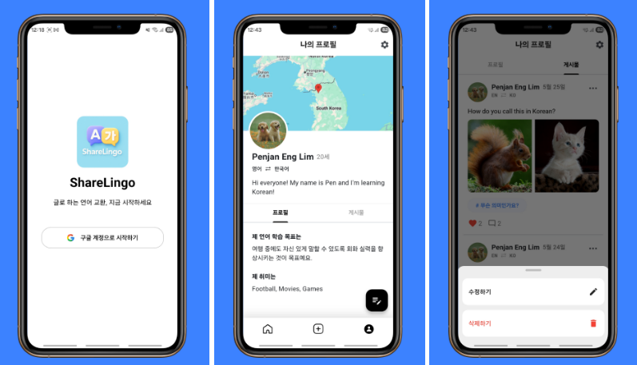
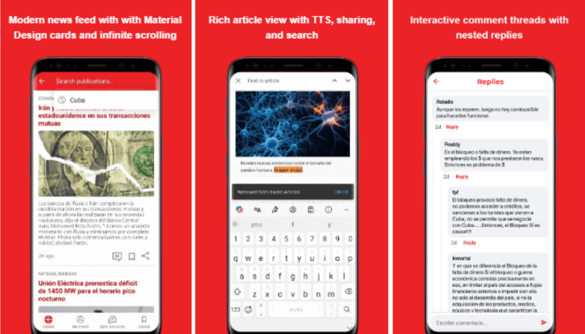

  

    <a href="/">EN</a>
    <a href="/kr" class="active">KR</a>
  

☰
  

    <!-- Navigation Links will be dynamically populated -->
  

# 임대한

 
  

    
    
    
  

## 👋 소개
Flutter 크로스플랫폼 앱 개발자로서 4명으로 구성된 팀을 리드하며 CI/CD 파이프라인 구축과 팀 코드 리뷰 프로세스 도입을 통해 수동 검수 시간 50% 단축을 이끌었습니다. 네이티브 Android 개발 배경을 바탕으로 플랫폼별 최적화에 강점을 보유하고 있습니다.

AI 석사 학위와 Gemini API 연동 경험을 통해 모바일 앱에 생성형 AI 기능을 효과적으로 통합할 수 있고, 레시피 생성 시스템에서 프롬프트 엔지니어링과 검증 모델 도입을 통해 적합하지 않은 레시피 생성률을 85%에서 12%로 낮춘 경험이 있습니다.

Firebase 백엔드 연동, 위치 기반 서비스, 다국어 지원 등 다양한 모바일 기능을 구현하여 Play Store와 App Store에 성공적으로 앱을 배포했으며, 성능 최적화를 통해 AI 처리 시간 40% 단축과 API 비용 35% 절감을 달성했습니다.

## 📱 모바일 애플리케이션

<!--ShareLingo-->
<a href="sharelingo/" style="text-decoration: none; color: inherit;">

  
  
<strong>ShareLingo&thinsp;&thinsp;🔗</strong> 
    언어교류 SNS 앱  
    <code>Flutter</code> <code>Clean Architecture</code> <code>Google OAuth</code> <code>CI/CD</code> <code>Firebase</code> <code>Riverpod</code> 
    <small>2025.05.16 ~ 2025.05.27 (2주)</small>
  

</a>

<!--Cooki-->
<a href="cooki/" style="text-decoration: none; color: inherit;">

  
  
<strong>Cooki&thinsp;&thinsp;🔗</strong> 
    AI 레시피 커뮤니티 앱  
    <code>Flutter</code> <code>Gemini API</code> <code>Dio</code> <code>Cloud Functions</code> <code>Riverpod</code> <code>MVVM</code> <code>Firestore</code> 
    <small>2025.06.01 ~ 2025.07.04 (1개월)</small>
  

</a>

<!--Cubadebate-->
<a href="cubadebate/" style="text-decoration: none; color: inherit;">

  
  
<strong>Cubadebate&thinsp;&thinsp;🔗</strong> 
    맞춤형 뉴스 플랫폼 
    <code>Android</code> <code>Kotlin</code> <code>Coroutines</code> <code>MVVM</code> <code>Room</code> <code>Retrofit</code> <code>Glide</code> <code>Lottie</code> <code>ViewBinding</code> 
    <small>2021.03.15 ~ 2021.06.30 (3.5개월)</small>
  

</a>

## 🔬 머신러닝 프로젝트

  

    <h3 style="margin: 0; font-size: 1.3em; font-weight: 700;">🎓 AI/ML 프로젝트</h3>
    
충남대학교 석사과정 중 수행한 머신러닝 프로젝트

  

  

    연합학습
    NLP 분류 모델
    의료 데이터 분석기
    정보 검색 시스템
  

  

    <a href="/ml_projects/kr" style="display: inline-block; background: white; color: #667eea; padding: 12px 30px; border-radius: 25px; text-decoration: none; font-weight: 700; font-size: 1.1em; transition: all 0.3s ease; box-shadow: 0 4px 15px rgba(0, 0, 0, 0.1);">
      머신러닝 프로젝트 보기 →
    </a>
  

## 📫 연락처

채용 및 협업 문의는 언제든 환영합니다. 아래 링크를 통해 링크드인이나 이메일로 연락해 주실 수 있습니다.

 
  

    
    
    
  

 

