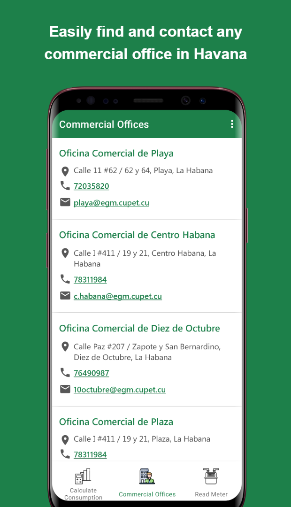
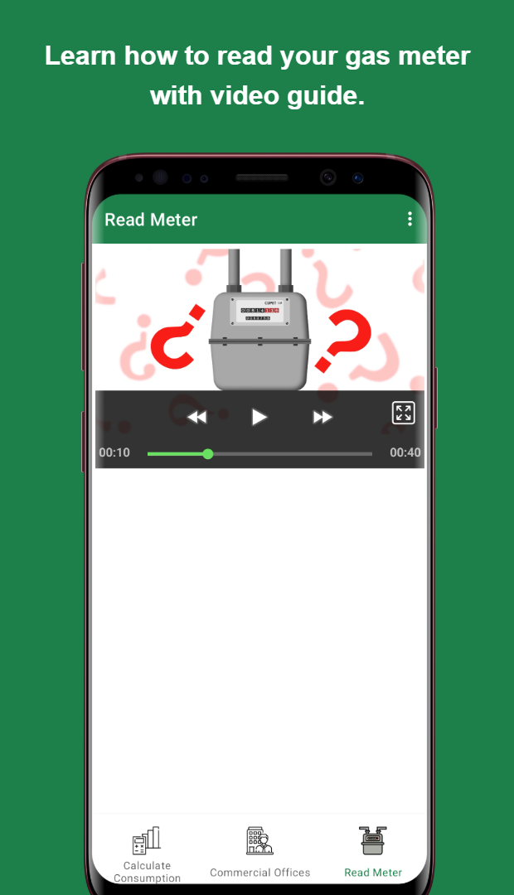

# Example Portfolio Page

# 🧩 Overview of All Projects

<div style="display: grid; grid-template-columns: repeat(auto-fit, minmax(250px, 1fr)); gap: 20px;">

<!-- Shopping Project -->
<div>
  
  <p><strong>🛒 Shopping</strong><br/>
  <span style="font-size: 0.9em;">Coupon Collection Coding</span><br/>
  <code>Kingfisher</code> <code>Lottie</code> <code>SnapKit</code> <code>Combine</code> <code>SwiftUI</code><br/>
  <small>24.01.29 - 24.02.10 (2 weeks)</small></p>
</div>

<!-- Catcher Project -->
<div>
  
  <p><strong>🎭 Catcher</strong><br/>
  <span style="font-size: 0.9em;">Camera dating app service using mirror AI analysis</span><br/>
  <code>Alamofire</code> <code>CoreML</code> <code>Combine</code> <code>Firebase</code> <code>SnapKit</code><br/>
  <small>23.10.10 - 23.11.17 (6 weeks)</small></p>
</div>

<!-- TipCalculator Project -->
<div>
  
  <p><strong>🧮 TipCalculator</strong><br/>
  <span style="font-size: 0.9em;">Tip calculator using Combine and MVVM pattern</span><br/>
  <code>MVVM</code> <code>Combine</code> <code>CombineCocoa</code> <code>SnapKit</code><br/>
  <small>23.09.12 - 23.09.18 (1 week)</small></p>
</div>

<!-- MobydickNews Project -->
<div>
  
  <p><strong>📰 MobydickNews</strong><br/>
  <span style="font-size: 0.9em;">News app using News API</span><br/>
  <code>RxAlamofire</code> <code>RxSwift</code> <code>REST API</code> <code>SnapKit</code><br/>
  <small>23.08.25 - 23.09.10 (2 weeks)</small></p>
</div>

<!-- PlanBee Project -->
<div>
  
  <p><strong>📅 PlanBee</strong><br/>
  <span style="font-size: 0.9em;">Task management Todo app</span><br/>
  <code>CoreData</code> <code>Combine</code> <code>FSCalendar</code> <code>SwiftLint</code> <code>Firebase</code><br/>
  <small>23.07.10 - 23.08.02 (4 weeks)</small></p>
</div>

</div>

---


# 🎯 Project 1 - Catcher

**📌 Topic:** Dating app service using machine learning-based caricature generation  
**🕒 Development Period:** 23.10.10 ~ 23.11.17 (6 weeks)  
**👥 Team Size:** iOS (5 members)  
**🛠️ Skills:**  
<code>Alamofire</code> <code>CoreML</code> <code>Combine</code> <code>Firebase</code> <code>SnapKit</code> <code>MessageKit</code> <code>LicensePlist</code> <code>SDWebImage</code><span style="display: block; height: 5px;"></span>
🔗 [View on AppStore](https://apps.apple.com/kr/app/id3818930)  
🔗 [View on GitHub](https://apps.apple.com/kr/app/id3818930)

---

## 📚 Index

🟩 **Topic Selection Background**  
🗺️ **Diagram**  
💻 **Tech Stack**  
🤔 **Technical Decision**  
🌱 **Troubleshooting**  
✨ **Features**  
👤 **Part**  
🖼️ **Screenshot**

<div style="text-align: center;">
  
</div>


## 🟩 Topic Selection Background

- Selected this topic to provide users who feel burdened by directly exposing their own photos with a new opportunity for meeting, allowing them to express themselves freely without burden and enjoy more interesting dating experiences.

---

## 🗺️ Diagram

<div style="text-align: center;">
  
</div>

## 💻 Tech Stack

<code>CoreML</code>, <code>CompositionalLayout</code>, <code>Combine</code>, <code>DiffableDataSource</code>, <code>ImageCache</code>, <code>Swift Concurrency</code>


## 🤔 Technical Decision


Decided to use **CoreML** because running the model on the device itself ensures app responsiveness without needing network connection while keeping user data private.


<div style="display: flex; gap: 20px; flex-wrap: wrap; align-items: start; margin-top: 10px;">
  <div style="flex: 1; min-width: 240px;">
    <p style="font-size: 1em;"><strong>1. Why CoreML was chosen</strong></p>
    <p style="font-size: 1em;">Decided to use <strong>CoreML</strong> because running the model on the device itself ensures app responsiveness without needing network connection while keeping user data private.</p>
    <a href="https://velog-readme-stats.vercel.app/api?name=daehanlim" target="_blank">
      
    </a>
  </div>
  <div style="flex: 1; min-width: 240px;">
    <span style="display: block; height: 12px;"></span>
    
  </div>
</div>

**2. Registration Process Decision**

- **Problem Identification**
    - Initially tried to use PASS authentication for identity verification during registration, but determined it couldn't be used due to many constraints for individual use, so sought alternative solutions
    - Identified the inconvenience where most dating apps require users to register their photos during signup and wait for admin approval

- **Decision Made**
    - Decided to use `CoreML` for gender classification through photos and automate registration (replacing PASS authentication)
    - Original photos taken for gender classification are discarded after conversion to caricatures for privacy protection (only caricature images are stored in Firebase)
    - Implemented registration by registering gender and profile photo along with user-entered information
    - Decided to model directly using `CreateML` for gender classification accuracy

- **※ Constraints**
    - To prevent registration using others' photos, photos must be taken through camera during registration for gender classification
    - Gender classification → Caricature generation runs `CoreML` models directly within the app
        - **Process**
            1. Use YOLO model for object detection to verify it's a person
            2. Classify gender using our custom-trained model
            3. Convert photo → caricature using `animegan2face` model

<div style="text-align: center; margin-top: 10px; margin-bottom: 20px;">
  
</div>


**3. ModernCollectionView Implementation**

- **Requirements**
    1. UI must update smoothly when applying data changes
    2. Must implement and flexibly manage complex layouts

- **Decision Made**
    1. Use `DiffableDataSource` for smooth updates when data changes
    2. Use `CompositionalLayout` to implement complex layouts
    - **Conclusion**  
      Decided to implement `ModernCollectionView` using both `DiffableDataSource` and `CompositionalLayout` together


**4. Using Swift Concurrency**

- **Requirements**  
  Must efficiently receive data during asynchronous operations

- **Decision Made**  
  Decided to implement concurrency programming using `Swift Concurrency` to improve performance by running multiple asynchronous tasks in parallel

```swift
extension MainPageViewModel {
    /// Update all data to latest
    func fetchMainPageData() {
        Task {
            async let random = storeManager.fetchRandomUser()
            async let rank = storeManager.fetchRanking()
            async let new = storeManager.fetchNewestUser()
            async let near = storeManager.fetchNearUser()
            async let pick = storeManager.fetchPickUsers()
            async let shutout = storeManager.fetchShutOutUser()

            let randomResult = await random
            let rankResult = await rank
            let newResult = await new
            let nearResult = await near
            let pickResult = await pick
            let shutoutResult = await shutout
        }
    }
}
```
## 🌱 Troubleshooting

**1. GitHub Actions**
**Problem Situation**
- `firebase_options.dart` was needed in GitHub Actions workflow
- However, not committed for security reasons, so file was missing in CI
- As a result, build errors occurred during workflow execution
```
Target of URI doesn't exist: 'firebase_options.dart'
```
### Failed Attempts
- Pasted configuration file content directly into GitHub Secret
- File became corrupted due to line breaks and special characters. Input impossible
### Approach
- GitHub Secret has unstable handling of multiline and special characters
- Encoding configuration files with Base64 allows safe transmission as single-line strings
### Final Solution
- Encoded configuration files with Base64
- Stored encoded strings in GitHub Secrets
- Decoded and restored as files in workflow
```
- name: Decode firebase_options.dart  
  run: |  
  mkdir -p lib  
  echo "${{ secrets.FIREBASE_DART_OPTIONS }}" | base64 --decode > lib/firebase_options.dart
```
<br>

**2. Improving Gender Classification Accuracy Through Images**

- **Problem Situation**  
  Gender classification model accuracy was too low to be reliable

<div style="text-align: center; margin-top: 10px; margin-bottom: 10px;">
  
</div>

- **Solution**  
  Improved gender classification model accuracy from **74.3% → 88.9%**


- **Accuracy Improvement Methods**
    1. Additional training after increasing training iterations
    2. Training after setting `Augmentations`
    3. Additional training after adding diverse data

## ⭐ Features

**1. Key Features**
- Automated registration without approval through facial authentication using machine learning for gender classification
- Caricature image generation using machine learning
- Real-time chat functionality

**2. Main Page**
- Provides user information across 5 categories: Random, Popular, New, Nearby, and Favorites

**3. User Detail Page**
- Provides detailed user information
- Favorite, chat, block, and report user functions

**4. Chat Page**
- Provides chat list
- Real-time chat functionality

**5. My Page**
- Provides personal information
- Basic profile settings, caricature image generation, 1:1 inquiry, and account deletion menus

**6. Login/Registration**
- Email login
- Registration after nickname setup and duplicate verification

## 🖐️ Part

- As project leader, performed all processes of planning, development, deployment, and operation to launch this service on the App Store
- Developed `MainPage` that shows users in various categories
- Developed `UserInfo View` where detailed user information can be viewed
    - Implemented favorite, chat, block, and report functions
- Implemented user information CRUD in `Firebase DB`
- Implemented email login logic using `Firebase`
- Implemented registration logic using `CoreML`
    - Object detection, gender classification, caricature conversion

## 🖼️ Screenshots

<div style="display: flex; overflow-x: auto; border: 2px solid #ccc; padding: 6px; border-radius: 8px;">
  
  
  
  
  
  
</div>
<span style="display: block; height: 11px;"></span>