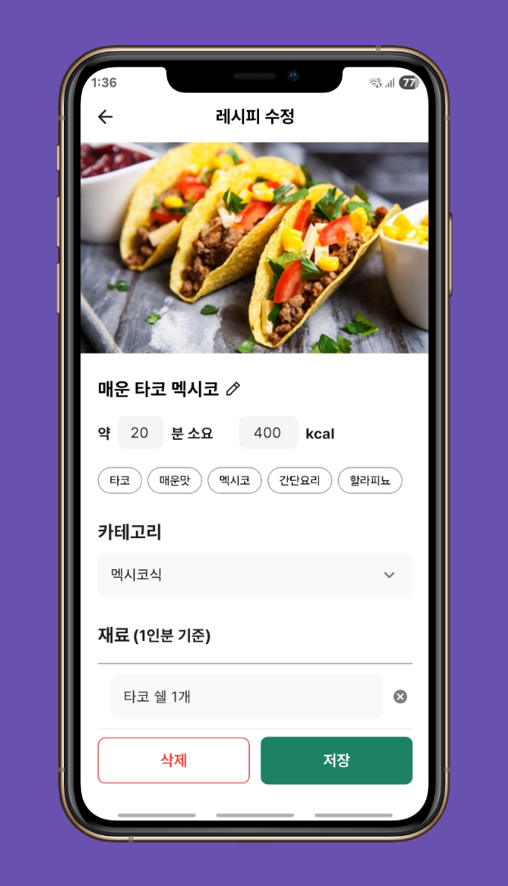
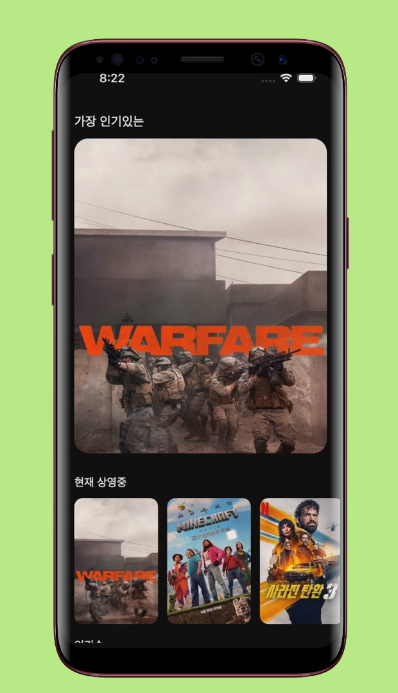
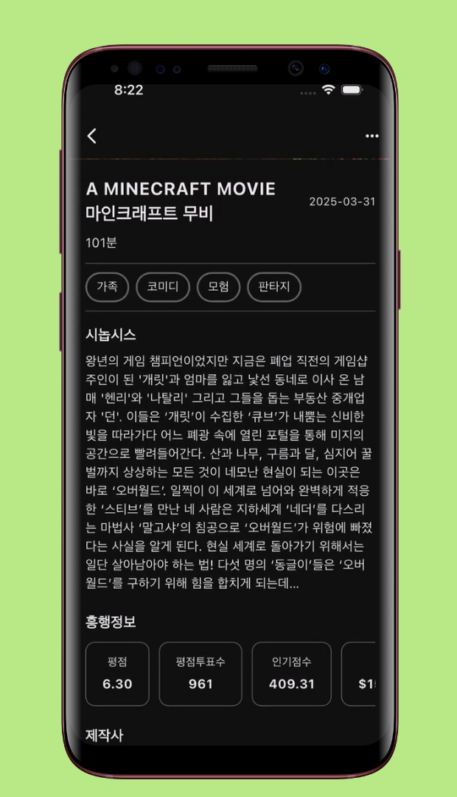
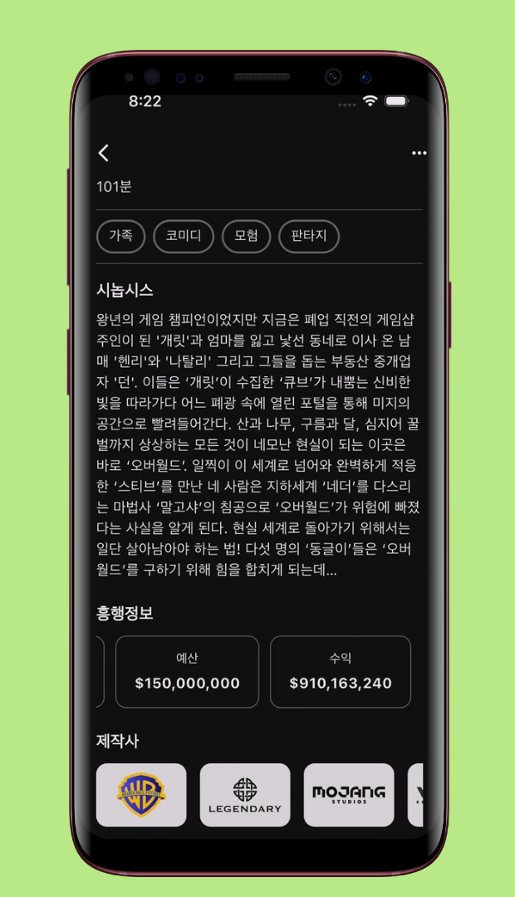
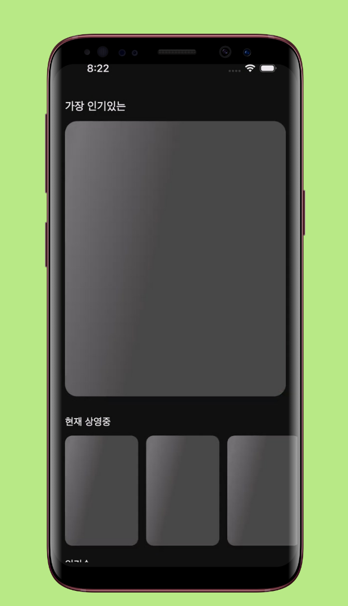

<!--suppress CssUnusedSymbol, JSUnusedLocalSymbols -->
<style>
/* Navigation Menu Styles */
#nav-menu {
  position: fixed;
  top: 0;
  left: 0;
  width: 100%;
  background: linear-gradient(135deg, #3464e1 0%, #764ba2 100%); /* Navbar color */
  color: white;
  padding: 15px 0; /* Navbar height */
  z-index: 1000;
  display: flex;
  justify-content: space-between; /* Space between items */
  align-items: center; /* Vertically align items */
  box-shadow: 0 4px 8px rgba(0, 0, 0, 0.2);
}

h1, h2 {
  color: #6951af !important;
}

code .nx,
code .n,
code .py,
code .p {
  color: #24292e !important;
}

.language-plaintext.highlighter-rouge > .highlight > pre.highlight > code {
  color: #24292e !important;
}

code.language-plaintext.highlighter-rouge {
  color: #EB5757 !important;                 /* strong red text */
  border-radius: 4px;                        /* rounded corners */
  padding: 0.2em 0.4em;                      /* small breathing space */
}

.image-row {
  display: flex;
  overflow-x: auto;
  border: 2px solid #ccc;
  padding: 6px;
  border-radius: 8px;
  gap: 5px;
  align-items: flex-start;
}

.image-item {
  width: 240px !important;
  height: auto !important;
  display: block !important;
  flex-shrink: 0 !important;
}

.linked-image {
  display: block !important;
  flex-shrink: 0 !important;
}

.markdown-body {
    font-family: 'Noto Sans KR', -apple-system, BlinkMacSystemFont, 'Segoe UI', sans-serif !important;
    font-weight: 400 !important;
    word-break: keep-all !important;
    letter-spacing: -0.3px !important;
    line-height: 1.8 !important;
    font-size: 17px !important;
}

#nav-menu a {
  color: white;
  text-decoration: none;
  margin: 0 15px;
  font-weight: bold;
  font-size: 14px;
  transition: color 0.3s ease;
}

#nav-menu > div:first-child a { 
    margin: 0 10px;
}

#nav-menu a:hover {
  color: #f1c40f;
}

/* Adjust content padding for the fixed navbar */
body {
  padding-top: 50px; 
}

/* Hamburger Menu (Toggle Button) */
#nav-menu-toggle {
  display: none;
  cursor: pointer;
  font-size: 18px;
  margin-right: 20px; /* Move to the right */
  z-index: 1100; /* Ensure toggle is above menu items */
}

/* Navigation Links */
#nav-links {
  display: flex;
  flex-wrap: wrap;
  padding-right: 20px;
}

@media (max-width: 768px) {
  #nav-links {
    display: none; /* Hide links initially on mobile */
    flex-direction: column;
    align-items: center;
    background: linear-gradient(135deg, #3464e1 0%, #764ba2 100%); /* Match navbar background */
    width: 100%;
    position: absolute;
    top: 60px; /* Space below navbar */
    left: 0;
    padding: 15px 0; /* Add spacing around links */
    z-index: 1000; /* Ensure it doesn't overlap the toggle button */
  }

  #nav-links.active {
    display: flex; /* Show links when active */
  }

  #nav-links a {
    margin: 15px 0; /* Vertical spacing */
  }

  #nav-menu-toggle {
    display: block; /* Show hamburger menu */
  }
}
</style>

<div id="nav-menu">
  <div style="margin-left: 20px;">
    <a href="/" class="active"></a> 
  </div>

<span id="nav-menu-toggle">☰</span>
  <div id="nav-links">
    <!-- Navigation Links will be dynamically populated -->
  </div>
</div>

<script>
  document.addEventListener("DOMContentLoaded", function () {
    const navLinksContainer = document.getElementById("nav-links");
    const toggle = document.getElementById("nav-menu-toggle");
    const headings = document.querySelectorAll("h2");

    // Remove auto-generated H1 heading completely to avoid spacing issues
    const autoGeneratedH1 = document.querySelector("h1:first-of-type");
    if (autoGeneratedH1) {
      autoGeneratedH1.remove();
    }

    // Create navigation links dynamically, excluding subheadings (###)
    headings.forEach((heading, index) => {
      if (heading.tagName === "H3") return; // Skip ### subheadings

      // Create a clean title without emojis for the nav bar
      const cleanText = heading.textContent.replace(/[\u{1F300}-\u{1FAF6}]/gu, '').trim();

      // Create an ID for each heading if not already present
      if (!heading.id) {
        heading.id = "section-" + index;
      }

      // Create navigation link
      const navLink = document.createElement("a");
      navLink.href = "#" + heading.id;
      navLink.textContent = cleanText;
      navLinksContainer.appendChild(navLink);
    });

    // Add click event for hamburger toggle
    toggle.addEventListener("click", () => {
      navLinksContainer.classList.toggle("active");
    });

    // Adjust scroll behavior to account for fixed navbar height
    const adjustScroll = (e, href) => {
      e.preventDefault();
      const target = document.querySelector(href);
      if (target) {
        window.scrollTo({
          top: target.offsetTop - 75, // Offset for navbar height
          behavior: 'smooth'
        });
      }
    };

    // Handle nav bar links
    document.querySelectorAll('#nav-links a').forEach(anchor => {
      anchor.addEventListener('click', function (e) {
        adjustScroll(e, this.getAttribute('href'));
        navLinksContainer.classList.remove('active'); // Collapse the dropdown
      });
    });

    // Handle all Markdown links with hash anchors
    document.querySelectorAll('a[href^="#"]').forEach(anchor => {
      anchor.addEventListener('click', function (e) {
        adjustScroll(e, this.getAttribute('href'));
      });
    });
  });
</script>

<div style="position: relative; margin-bottom: 40px;">


</div>

# FilmMind - 영화 정보 앱

## 📝 개요
**📌 앱 소개:** TMDB API를 활용한 영화 정보 조회 및 추천 앱  
**🕒 기간:** 2025.05.13 ~ 2025.05.15 (3일)  
**📱 플랫폼:** Flutter 크로스 플랫폼 앱 (iOS, Android)  
**👥 개발 인원:** 1명 (개인 프로젝트)  
**💼 역할:** 앱 전체 설계 및 개발, API 연동, 성능 최적화  
**🛠️ 주요 사용 기술:** `Flutter` `Dart` `TMDB API` `Riverpod` `Clean Architecture` `Dio` `GitHub Actions` `Hero Animation` `Shimmer`    
**🔗 GitHub:** [daehan-lim/flutter-film-mind-app](https://github.com/daehan-lim/flutter-film-mind-app)

<div class="image-row">
  
  
  
  
  
  
  
  
  

</div>
<span style="display: block; height: 11px;"></span>

## 📖 프로젝트 설명

FilmMind는 TMDB API를 활용하여 현재 상영작, 인기 영화, 평점 높은 영화, 개봉 예정작 등 다양한 카테고리의 영화 정보를 제공하는 Flutter 기반 모바일 애플리케이션입니다. Clean Architecture 패턴과 MVVM 구조를 적용하여 확장 가능하고 유지보수가 용이하도록 설계되었으며, Hero Animation을 통한 자연스러운 화면 전환과 Google/Naver 검색 연동 기능을 통해 사용자가 영화 정보를 직관적으로 탐색하고 추가 정보에 접근할 수 있는 환경을 제공합니다.

## 🛠️ Tech Stack

[](https://flutter.dev)
[](https://dart.dev/)
[](https://riverpod.dev/)
[](https://blog.cleancoder.com/uncle-bob/2012/08/13/the-clean-architecture.html)
[](https://developer.android.com/topic/architecture)
[](https://pub.dev/packages/dio)
[](https://www.themoviedb.org/documentation/api)
[](https://github.com/features/actions)
[](https://pub.dev/packages/cached_network_image)
[](https://pub.dev/packages/shimmer)
[](https://pub.dev/packages/url_launcher)
[](https://pub.dev/packages/flutter_dotenv)
[](https://pub.dev/packages/flutter_svg)

## 📋 프로젝트 구조
``` 
├── app/                               # 앱 전체에서 설정 및 공통 상수, 테마 등  
│   ├── constants/                     # 앱 상수 정의  
│   │   ├── app_colors.dart            # 색상 정의  
│   │   ├── app_constants.dart         # 상수 값 정의  
│   │   └── app_styles.dart            # 스타일 정의  
│   └── theme.dart                     # 앱 테마 설정  

├── core/                              # 앱 전체에서 사용되는 핵심 기능 및 유틸리티  
│   ├── exceptions/                    # 앱 전체에서 사용되는 예외 클래스  
│   │   └── data_exceptions.dart       # 데이터 관련 예외 클래스  
│   ├── extensions/                    # 확장 메서드 정의  
│   │   ├── date_extensions.dart       # 날짜 관련 확장 메서드  
│   │   └── number_extensions.dart     # 숫자 관련 확장 메서드  
│   ├── providers/                     # 공통 프로바이더  
│   │   └── repository_providers.dart  # 리포지토리 프로바이더  
│   └── utils/                         # 유틸리티 함수  
│       ├── navigation_util.dart       # 네비게이션 관련 유틸리티  
│       ├── snackbar_util.dart         # 스낵바 관련 유틸리티  
│       └── dialogue_util.dart         # 다이얼로그 관련 유틸리티  

├── data/                              # 데이터 관련 클래스 및 데이터 액세스 계층  
│   ├── data_source/                   # 데이터 소스 클래스 
│   ├── dto/                           # 데이터 전송 객체 
│   └── repository/                    # 리포지토리 구현체 

├── domain/                            # 비즈니스 로직 및 엔티티 정의  
│   ├── entity/                        # 도메인 엔티티 
│   ├── repository/                    # 리포지토리 인터페이스
│   └── usecase/                       # 유스케이스 

├── presentation/                      # UI 관련 코드  
│   ├── pages/                         # 앱 화면  
│   │   ├── home/                      # 홈 화면  
│   │   │   ├── home_page.dart         # 홈 페이지 위젯  
│   │   │   ├── home_view_model.dart   # 홈 화면 뷰모델  
│   │   │   └── widgets/               # 홈 화면 관련 위젯 
│   │   └── detail/                    # 상세 화면 
│   └── widgets/                       # 공통 위젯 

└── main.dart                          # 앱 진입점  
```


## 🌟 수행 내용 및 성과

### Clean Architecture 기반 앱 구조 설계
- **계층형 아키텍처 구현**
    - `Domain`, `Data`, `Presentation` 계층 분리를 통한 관심사 분리 및 의존성 역전 원칙 적용
    - `Riverpod`을 활용한 전역 상태 관리와 `Provider` 기반 의존성 주입 구현
    - `MVVM` 패턴 적용으로 UI와 비즈니스 로직 분리 및 단방향 데이터 플로우 구축
    - `Repository` 패턴과 `UseCase` 계층으로 비즈니스 로직 캡슐화 및 테스트 가능한 코드 구조 구축

### TMDB API 연동 및 영화 데이터 처리
- 현재 상영작, 인기 영화, 평점 높은 영화, 개봉 예정작 등 4개 카테고리 데이터 실시간 조회
- `Dio` HTTP 클라이언트와 `Bearer Token` 인증을 통한 안정적인 API 통신 구현
- 개별 영화 상세 조회 API 연동으로 장르, 제작사, 예산, 수익, 상영시간 등 종합 정보 제공
- 통화 포맷팅과 숫자 포맷팅 `Extension`을 활용한 예산/수익 정보의 가독성 있는 표시

### UI/UX 및 애니메이션 구현
- **Hero Animation 기반 화면 전환**
    - 카테고리별 고유 태그를 활용한 `Hero Animation` 구현으로 영화 포스터 클릭 시 자연스러운 화면 전환 효과 제공
    - 메인 화면에서 상세 화면으로의 시각적 연속성 확보 및 네이티브 앱 수준의 사용자 경험 달성
    - 여러 카테고리에서 동일 영화 선택 시에도 올바른 `Hero` 태그 매칭으로 애니메이션 충돌 방지

- **UI/UX 개선**
    - 영화 상세 페이지에서 팝업 메뉴를 통한 구글 및 네이버 검색 연동으로 추가 영화 정보 조회 기능
    - URL 인코딩과 인앱 브라우저 구현으로 앱 내에서 끊김 없는 검색 경험 제공
    - `CachedNetworkImage`를 활용한 이미지 캐싱으로 반복 로딩 시간 단축 및 데이터 사용량 절약
    - `Shimmer` 로딩 애니메이션 구현으로 데이터 로딩 중 인지된 성능 향상 및 사용자 대기 경험 개선
    - `Transform.translate`를 활용한 인기 영화 랭킹 숫자 오버레이 디자인으로 시각적 임팩트 강화
    - 수평 스크롤 `ListView`와 카테고리별 차별화된 레이아웃으로 효율적인 공간 활용
    - 기본 다크 모드 적용으로 영화 포스터의 시각적 몰입감 강화 및 사용자 눈의 피로 감소

### 전계층 단위 테스트 구현
- `DataSource`부터 `ViewModel`까지 모든 계층에 대한 단위 테스트 작성으로 비즈니스 로직 안정성 확보
- JSON 파싱, API 통신, 데이터 변환 과정의 테스트 케이스 구현으로 데이터 처리 신뢰성 보장
- `Mocktail`을 활용한 의존성 모킹과 `Provider` 오버라이드로 외부 API 의존성 없는 격리된 테스트 환경 구축

### GitHub Actions를 통한 CI 파이프라인
- `Pull Request` 및 `Push` 이벤트 기반 자동화된 테스트 실행 및 코드 품질 검증으로 수동 검수 시간 단축
- 환경 변수 기반 API 키 보안 관리 및 `GitHub Secrets`를 통한 민감 정보 보호
- Flutter 의존성 설치부터 APK 아티팩트 업로드까지 완전 자동화된 워크플로우 구현

### 개발 효율성 및 코드 품질
- 재사용 가능한 위젯 컴포넌트화로 코드 중복 감소 및 유지보수 효율성 향상
- `Extension` 메서드를 활용한 코드 가독성 향상
- 공통 스타일과 테마 시스템 구축으로 디자인 일관성 확보
- `Entity`와 `DTO` 분리를 통한 외부 API 의존성 최소화 및 도메인 모델 보호

## 🌱 트러블슈팅

**1. Hero Animation 태그 중복 충돌 문제**

- **문제 상황**  
  Flutter로 영화 정보 앱을 개발하면서 `Hero Animation`을 사용하여 영화 포스터 클릭 시 홈 화면에서 상세 화면으로 자연스럽게 전환되도록 구현했으나, `There are multiple heroes that share the same tag within a subtree` 오류가 발생하며 애니메이션이 제대로 작동하지 않는 문제 발생

- **원인 분석**
    - 초기에는 영화 ID만을 기반으로 `'movie-image-${movie.id}'` 형태의 `Hero` 태그를 생성
    - 같은 영화가 '현재 상영중', '인기순', '평점 높은순', '개봉예정' 등 여러 카테고리에 중복 출현하면서 동일한 `Hero` 태그가 한 화면에 여러 개 존재
    - Flutter는 한 화면 내에서 모든 `Hero` 태그가 고유해야 한다는 제약 조건을 위반

- **해결 방법**
    - 영화 ID와 카테고리명을 조합한 `'movie-image-${movie.id}-$categoryName'` 형태의 고유 태그 생성 시스템 구현
    - 영화 상세 페이지 이동 시 카테고리 정보도 함께 전달하여 동일한 태그 형식으로 `Hero Animation` 매칭
    - 각 카테고리별로 독립적인 `Hero` 태그를 가지도록 하여 중복 문제 완전 해결

```dart
// 수정된 Hero 태그 생성
Hero(
  tag: 'movie-image-${movie.id}-$categoryName',
  child: AppCachedImage(imageUrl: movie.getPosterUrl()),
)
```

- **최종 결과**  
  같은 영화가 여러 카테고리에 출현해도 각각 고유한 `Hero` 태그를 가지게 되어 충돌 없이 자연스러운 애니메이션 전환 구현

**2. GitHub Actions에서 TMDB API 키 보안 관리**

- **문제 상황**  
  CI 파이프라인에서 `TMDB Bearer Token`이 필요하지만 코드에 하드코딩할 수 없어 빌드 시 환경 변수 부재로 실패하는 문제 발생

- **해결 과정**
    - Flutter의 `flutter_dotenv` 패키지가 런타임에 `.env` (환경 변수) 파일을 요구함을 파악
    - 환경 변수 파일은 보안상 Git에 커밋 불가능함을 확인
    - `GitHub Secrets`를 활용한 안전한 환경 변수 관리 방법 검토

- **해결 방법**
    - GitHub Repository Settings에서 `TMDB_BEARER_TOKEN`을 Secret으로 등록
    - `GitHub Actions` 워크플로우에서 Secret을 환경 변수로 주입하여 `.env` 파일 동적 생성

```yml
- name: Create .env file
  run: |
    echo "TMDB_BEARER_TOKEN=${{ secrets.TMDB_BEARER_TOKEN }}" > .env

- name: Install dependencies
  run: flutter pub get

- name: Run tests
  run: flutter test
```

- **최종 결과**  
  API 키 노출 위험 없이 자동화된 CI 파이프라인에서 안정적인 빌드 및 테스트 실행 환경 구축

## 🎞️ 시연 영상
<div align="center"> 
<a href="https://www.youtube.com/watch?v=OKqoMnWGQ5o">
  
</a>
</div>
<br>
